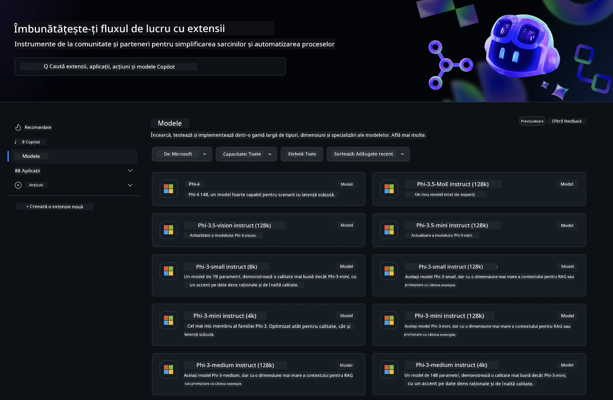
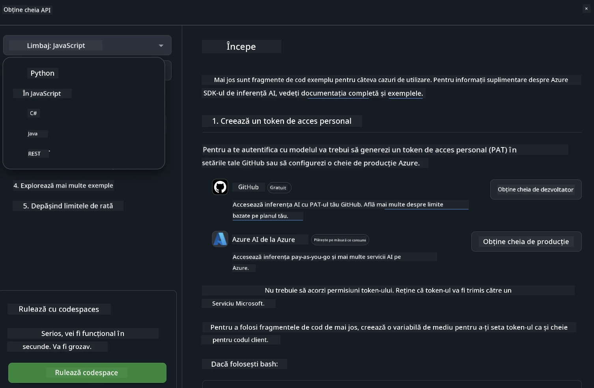
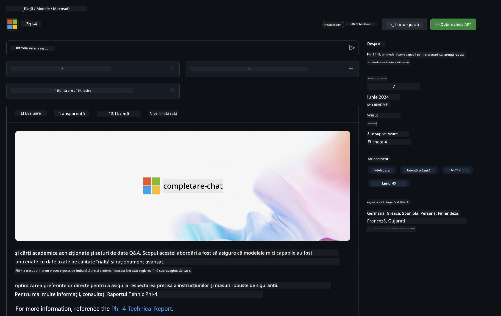

<!--
CO_OP_TRANSLATOR_METADATA:
{
  "original_hash": "5113634b77370af6790f9697d5d7de90",
  "translation_date": "2025-07-17T05:41:39+00:00",
  "source_file": "md/02.QuickStart/GitHubModel_QuickStart.md",
  "language_code": "ro"
}
-->
## Modele GitHub - Beta Publică Limitată

Bine ați venit la [GitHub Models](https://github.com/marketplace/models)! Totul este pregătit pentru ca tu să explorezi Modelele AI găzduite pe Azure AI.



Pentru mai multe informații despre modelele disponibile pe GitHub Models, consultă [GitHub Model Marketplace](https://github.com/marketplace/models)

## Modele Disponibile

Fiecare model are un spațiu dedicat de testare și cod exemplu


### Modele Phi-3 în Catalogul GitHub Model

[Phi-3-Medium-128k-Instruct](https://github.com/marketplace/models/azureml/Phi-3-medium-128k-instruct)

[Phi-3-medium-4k-instruct](https://github.com/marketplace/models/azureml/Phi-3-medium-4k-instruct)

[Phi-3-mini-128k-instruct](https://github.com/marketplace/models/azureml/Phi-3-mini-128k-instruct)

[Phi-3-mini-4k-instruct](https://github.com/marketplace/models/azureml/Phi-3-mini-4k-instruct)

[Phi-3-small-128k-instruct](https://github.com/marketplace/models/azureml/Phi-3-small-128k-instruct)

[Phi-3-small-8k-instruct](https://github.com/marketplace/models/azureml/Phi-3-small-8k-instruct)

## Începutul

Există câteva exemple de bază gata de rulat. Le poți găsi în directorul samples. Dacă vrei să sari direct la limbajul tău preferat, poți găsi exemplele în următoarele limbaje:

- Python
- JavaScript
- cURL

Există și un mediu dedicat Codespaces pentru rularea exemplelor și modelelor.



## Cod Exemplu

Mai jos sunt fragmente de cod pentru câteva cazuri de utilizare. Pentru informații suplimentare despre Azure AI Inference SDK, consultă documentația completă și exemplele.

## Configurare

1. Creează un token de acces personal  
Nu este nevoie să acorzi permisiuni token-ului. Reține că token-ul va fi trimis către un serviciu Microsoft.

Pentru a folosi fragmentele de cod de mai jos, creează o variabilă de mediu pentru a seta token-ul ca și cheie pentru codul client.

Dacă folosești bash:  
```
export GITHUB_TOKEN="<your-github-token-goes-here>"
```  
Dacă folosești powershell:  

```
$Env:GITHUB_TOKEN="<your-github-token-goes-here>"
```  

Dacă folosești promptul de comandă Windows:  

```
set GITHUB_TOKEN=<your-github-token-goes-here>
```  

## Exemplu Python

### Instalare dependențe  
Instalează Azure AI Inference SDK folosind pip (Necesită: Python >=3.8):

```
pip install azure-ai-inference
```  
### Rulează un exemplu simplu de cod

Acest exemplu arată un apel de bază către API-ul de completare chat. Folosește endpoint-ul de inferență al modelului AI GitHub și token-ul tău GitHub. Apelul este sincron.

```
import os
from azure.ai.inference import ChatCompletionsClient
from azure.ai.inference.models import SystemMessage, UserMessage
from azure.core.credentials import AzureKeyCredential

endpoint = "https://models.inference.ai.azure.com"
# Replace Model_Name 
model_name = "Phi-3-small-8k-instruct"
token = os.environ["GITHUB_TOKEN"]

client = ChatCompletionsClient(
    endpoint=endpoint,
    credential=AzureKeyCredential(token),
)

response = client.complete(
    messages=[
        SystemMessage(content="You are a helpful assistant."),
        UserMessage(content="What is the capital of France?"),
    ],
    model=model_name,
    temperature=1.,
    max_tokens=1000,
    top_p=1.
)

print(response.choices[0].message.content)
```

### Rulează o conversație multi-turn

Acest exemplu arată o conversație multi-turn cu API-ul de completare chat. Când folosești modelul pentru o aplicație de chat, trebuie să gestionezi istoricul conversației și să trimiți ultimele mesaje către model.

```
import os
from azure.ai.inference import ChatCompletionsClient
from azure.ai.inference.models import AssistantMessage, SystemMessage, UserMessage
from azure.core.credentials import AzureKeyCredential

token = os.environ["GITHUB_TOKEN"]
endpoint = "https://models.inference.ai.azure.com"
# Replace Model_Name
model_name = "Phi-3-small-8k-instruct"

client = ChatCompletionsClient(
    endpoint=endpoint,
    credential=AzureKeyCredential(token),
)

messages = [
    SystemMessage(content="You are a helpful assistant."),
    UserMessage(content="What is the capital of France?"),
    AssistantMessage(content="The capital of France is Paris."),
    UserMessage(content="What about Spain?"),
]

response = client.complete(messages=messages, model=model_name)

print(response.choices[0].message.content)
```

### Transmite rezultatul în flux

Pentru o experiență mai bună, vei dori să transmiți răspunsul modelului în flux, astfel încât primul token să apară rapid și să eviți așteptarea pentru răspunsuri lungi.

```
import os
from azure.ai.inference import ChatCompletionsClient
from azure.ai.inference.models import SystemMessage, UserMessage
from azure.core.credentials import AzureKeyCredential

token = os.environ["GITHUB_TOKEN"]
endpoint = "https://models.inference.ai.azure.com"
# Replace Model_Name
model_name = "Phi-3-small-8k-instruct"

client = ChatCompletionsClient(
    endpoint=endpoint,
    credential=AzureKeyCredential(token),
)

response = client.complete(
    stream=True,
    messages=[
        SystemMessage(content="You are a helpful assistant."),
        UserMessage(content="Give me 5 good reasons why I should exercise every day."),
    ],
    model=model_name,
)

for update in response:
    if update.choices:
        print(update.choices[0].delta.content or "", end="")

client.close()
```  
## JavaScript

### Instalare dependențe

Instalează Node.js.

Copiază următoarele linii de text și salvează-le ca fișier package.json în folderul tău.

```
{
  "type": "module",
  "dependencies": {
    "@azure-rest/ai-inference": "latest",
    "@azure/core-auth": "latest",
    "@azure/core-sse": "latest"
  }
}
```

Notă: @azure/core-sse este necesar doar când transmiți răspunsurile chat în flux.

Deschide un terminal în acest folder și rulează npm install.

Pentru fiecare fragment de cod de mai jos, copiază conținutul într-un fișier sample.js și rulează cu node sample.js.

### Rulează un exemplu simplu de cod

Acest exemplu arată un apel de bază către API-ul de completare chat. Folosește endpoint-ul de inferență al modelului AI GitHub și token-ul tău GitHub. Apelul este sincron.

```
import ModelClient from "@azure-rest/ai-inference";
import { AzureKeyCredential } from "@azure/core-auth";

const token = process.env["GITHUB_TOKEN"];
const endpoint = "https://models.inference.ai.azure.com";
// Update your modelname
const modelName = "Phi-3-small-8k-instruct";

export async function main() {

  const client = new ModelClient(endpoint, new AzureKeyCredential(token));

  const response = await client.path("/chat/completions").post({
    body: {
      messages: [
        { role:"system", content: "You are a helpful assistant." },
        { role:"user", content: "What is the capital of France?" }
      ],
      model: modelName,
      temperature: 1.,
      max_tokens: 1000,
      top_p: 1.
    }
  });

  if (response.status !== "200") {
    throw response.body.error;
  }
  console.log(response.body.choices[0].message.content);
}

main().catch((err) => {
  console.error("The sample encountered an error:", err);
});
```

### Rulează o conversație multi-turn

Acest exemplu arată o conversație multi-turn cu API-ul de completare chat. Când folosești modelul pentru o aplicație de chat, trebuie să gestionezi istoricul conversației și să trimiți ultimele mesaje către model.

```
import ModelClient from "@azure-rest/ai-inference";
import { AzureKeyCredential } from "@azure/core-auth";

const token = process.env["GITHUB_TOKEN"];
const endpoint = "https://models.inference.ai.azure.com";
// Update your modelname
const modelName = "Phi-3-small-8k-instruct";

export async function main() {

  const client = new ModelClient(endpoint, new AzureKeyCredential(token));

  const response = await client.path("/chat/completions").post({
    body: {
      messages: [
        { role: "system", content: "You are a helpful assistant." },
        { role: "user", content: "What is the capital of France?" },
        { role: "assistant", content: "The capital of France is Paris." },
        { role: "user", content: "What about Spain?" },
      ],
      model: modelName,
    }
  });

  if (response.status !== "200") {
    throw response.body.error;
  }

  for (const choice of response.body.choices) {
    console.log(choice.message.content);
  }
}

main().catch((err) => {
  console.error("The sample encountered an error:", err);
});
```

### Transmite rezultatul în flux  
Pentru o experiență mai bună, vei dori să transmiți răspunsul modelului în flux, astfel încât primul token să apară rapid și să eviți așteptarea pentru răspunsuri lungi.

```
import ModelClient from "@azure-rest/ai-inference";
import { AzureKeyCredential } from "@azure/core-auth";
import { createSseStream } from "@azure/core-sse";

const token = process.env["GITHUB_TOKEN"];
const endpoint = "https://models.inference.ai.azure.com";
// Update your modelname
const modelName = "Phi-3-small-8k-instruct";

export async function main() {

  const client = new ModelClient(endpoint, new AzureKeyCredential(token));

  const response = await client.path("/chat/completions").post({
    body: {
      messages: [
        { role: "system", content: "You are a helpful assistant." },
        { role: "user", content: "Give me 5 good reasons why I should exercise every day." },
      ],
      model: modelName,
      stream: true
    }
  }).asNodeStream();

  const stream = response.body;
  if (!stream) {
    throw new Error("The response stream is undefined");
  }

  if (response.status !== "200") {
    stream.destroy();
    throw new Error(`Failed to get chat completions, http operation failed with ${response.status} code`);
  }

  const sseStream = createSseStream(stream);

  for await (const event of sseStream) {
    if (event.data === "[DONE]") {
      return;
    }
    for (const choice of (JSON.parse(event.data)).choices) {
        process.stdout.write(choice.delta?.content ?? ``);
    }
  }
}

main().catch((err) => {
  console.error("The sample encountered an error:", err);
});
```

## REST

### Rulează un exemplu simplu de cod

Lipește următorul cod într-un shell:

```
curl -X POST "https://models.inference.ai.azure.com/chat/completions" \
    -H "Content-Type: application/json" \
    -H "Authorization: Bearer $GITHUB_TOKEN" \
    -d '{
        "messages": [
            {
                "role": "system",
                "content": "You are a helpful assistant."
            },
            {
                "role": "user",
                "content": "What is the capital of France?"
            }
        ],
        "model": "Phi-3-small-8k-instruct"
    }'
```  
### Rulează o conversație multi-turn

Apelează API-ul de completare chat și transmite istoricul conversației:

```
curl -X POST "https://models.inference.ai.azure.com/chat/completions" \
    -H "Content-Type: application/json" \
    -H "Authorization: Bearer $GITHUB_TOKEN" \
    -d '{
        "messages": [
            {
                "role": "system",
                "content": "You are a helpful assistant."
            },
            {
                "role": "user",
                "content": "What is the capital of France?"
            },
            {
                "role": "assistant",
                "content": "The capital of France is Paris."
            },
            {
                "role": "user",
                "content": "What about Spain?"
            }
        ],
        "model": "Phi-3-small-8k-instruct"
    }'
```  
### Transmite rezultatul în flux

Acesta este un exemplu de apelare a endpoint-ului și transmitere a răspunsului în flux.

```
curl -X POST "https://models.inference.ai.azure.com/chat/completions" \
    -H "Content-Type: application/json" \
    -H "Authorization: Bearer $GITHUB_TOKEN" \
    -d '{
        "messages": [
            {
                "role": "system",
                "content": "You are a helpful assistant."
            },
            {
                "role": "user",
                "content": "Give me 5 good reasons why I should exercise every day."
            }
        ],
        "stream": true,
        "model": "Phi-3-small-8k-instruct"
    }'
```

## Utilizare GRATUITĂ și limite de rată pentru GitHub Models



[Limitele de rată pentru playground și utilizarea gratuită a API-ului](https://docs.github.com/en/github-models/prototyping-with-ai-models#rate-limits) sunt menite să te ajute să experimentezi cu modelele și să prototipezi aplicația ta AI. Pentru utilizare dincolo de aceste limite și pentru a-ți scala aplicația, trebuie să aloci resurse dintr-un cont Azure și să te autentifici de acolo, în loc să folosești token-ul personal GitHub. Nu trebuie să modifici nimic altceva în codul tău. Folosește acest link pentru a descoperi cum să depășești limitele gratuite în Azure AI.

### Declarații

Amintește-ți că atunci când interacționezi cu un model, experimentezi cu AI, deci pot apărea erori în conținut.

Funcționalitatea este supusă unor limite variate (inclusiv cereri pe minut, cereri pe zi, tokeni per cerere și cereri concurente) și nu este destinată pentru cazuri de utilizare în producție.

GitHub Models folosește Azure AI Content Safety. Aceste filtre nu pot fi dezactivate în cadrul experienței GitHub Models. Dacă alegi să folosești modelele printr-un serviciu plătit, te rugăm să configurezi filtrele de conținut conform cerințelor tale.

Acest serviciu este oferit sub Termenii Pre-lansării GitHub.

**Declinare de responsabilitate**:  
Acest document a fost tradus folosind serviciul de traducere AI [Co-op Translator](https://github.com/Azure/co-op-translator). Deși ne străduim pentru acuratețe, vă rugăm să rețineți că traducerile automate pot conține erori sau inexactități. Documentul original în limba sa nativă trebuie considerat sursa autorizată. Pentru informații critice, se recomandă traducerea profesională realizată de un specialist uman. Nu ne asumăm răspunderea pentru eventualele neînțelegeri sau interpretări greșite rezultate din utilizarea acestei traduceri.