<!--
CO_OP_TRANSLATOR_METADATA:
{
  "original_hash": "c1559c5af6caccf6f623fd43a6b3a9a3",
  "translation_date": "2025-05-09T20:37:17+00:00",
  "source_file": "md/03.FineTuning/FineTuning_AIFoundry.md",
  "language_code": "ro"
}
-->
# Ajustarea fină a Phi-3 cu Azure AI Foundry

Să explorăm cum să ajustăm fin modelul de limbaj Phi-3 Mini de la Microsoft folosind Azure AI Foundry. Ajustarea fină îți permite să adaptezi Phi-3 Mini pentru sarcini specifice, făcându-l și mai puternic și conștient de context.

## Considerații

- **Capabilități:** Care modele pot fi ajustate fin? Ce poate face modelul de bază după ajustare?
- **Cost:** Care este modelul de preț pentru ajustarea fină?
- **Personalizare:** Cât de mult pot modifica modelul de bază – și în ce moduri?
- **Confort:** Cum se realizează de fapt ajustarea fină – trebuie să scriu cod personalizat? Trebuie să aduc propriile resurse de calcul?
- **Siguranță:** Modelele ajustate fin sunt cunoscute pentru riscuri de siguranță – există măsuri de protecție împotriva daunelor neintenționate?

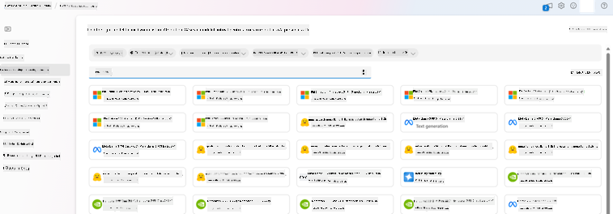

## Pregătirea pentru ajustarea fină

### Cerințe preliminare

> [!NOTE]
> Pentru modelele din familia Phi-3, oferta de ajustare fină în regim pay-as-you-go este disponibilă doar pentru hub-urile create în regiunile **East US 2**.

- Un abonament Azure. Dacă nu ai unul, creează un [cont Azure plătit](https://azure.microsoft.com/pricing/purchase-options/pay-as-you-go) pentru a începe.

- Un [proiect AI Foundry](https://ai.azure.com?WT.mc_id=aiml-138114-kinfeylo).
- Controlul accesului bazat pe roluri Azure (Azure RBAC) este folosit pentru a acorda acces la operațiunile din Azure AI Foundry. Pentru a efectua pașii din acest articol, contul tău de utilizator trebuie să aibă atribuit rolul __Azure AI Developer__ pe grupul de resurse.

### Înregistrarea furnizorului de abonament

Verifică dacă abonamentul este înregistrat la furnizorul de resurse `Microsoft.Network`.

1. Autentifică-te în [portalul Azure](https://portal.azure.com).
1. Selectează **Subscriptions** din meniul din stânga.
1. Alege abonamentul pe care dorești să-l folosești.
1. Selectează **AI project settings** > **Resource providers** din meniul din stânga.
1. Confirmă că **Microsoft.Network** este în lista furnizorilor de resurse. Dacă nu, adaugă-l.

### Pregătirea datelor

Pregătește datele de antrenament și validare pentru ajustarea fină a modelului. Seturile tale de date de antrenament și validare constau în exemple de input și output care reflectă modul în care dorești să performeze modelul.

Asigură-te că toate exemplele de antrenament respectă formatul așteptat pentru inferență. Pentru a ajusta fin modelele eficient, asigură un set de date echilibrat și divers.

Aceasta implică menținerea echilibrului datelor, includerea diverselor scenarii și rafinarea periodică a datelor de antrenament pentru a corespunde așteptărilor din lumea reală, ceea ce duce la răspunsuri mai precise și echilibrate ale modelului.

Tipurile diferite de modele necesită formate diferite pentru datele de antrenament.

### Chat Completion

Datele de antrenament și validare pe care le folosești **trebuie** să fie în format JSON Lines (JSONL). Pentru `Phi-3-mini-128k-instruct` setul de date pentru ajustare trebuie să fie în format conversațional folosit de API-ul Chat completions.

### Exemplu de format de fișier

```json
    {"messages": [{"role": "system", "content": "You are an Xbox customer support agent whose primary goal is to help users with issues they are experiencing with their Xbox devices. You are friendly and concise. You only provide factual answers to queries, and do not provide answers that are not related to Xbox."}, {"role": "user", "content": "Is Xbox better than PlayStation?"}, {"role": "assistant", "content": "I apologize, but I cannot provide personal opinions. My primary job is to assist you with any issues related to your Xbox device. Do you have any Xbox-related issues that need addressing?"}]}
    {"messages": [{"role": "system", "content": "You are an Xbox customer support agent whose primary goal is to help users with issues they are experiencing with their Xbox devices. You are friendly and concise. You only provide factual answers to queries, and do not provide answers that are not related to Xbox."}, {"role": "user", "content": "Can I play PC games on my Xbox?"}, {"role": "assistant", "content": "While Xbox consoles don't natively support PC games, they can play an array of Xbox games, many of which are also available on PC. Can I assist you with finding games compatible with your Xbox device?"}]}
    {"messages": [{"role": "system", "content": "You are an Xbox customer support agent whose primary goal is to help users with issues they are experiencing with their Xbox devices. You are friendly and concise. You only provide factual answers to queries, and do not provide answers that are not related to Xbox."}, {"role": "user", "content": "I'm having trouble connecting my Xbox to the Wi-Fi."}, {"role": "assistant", "content": "No worries, let's go through the network settings on your Xbox. Can you please tell me what happens when you try to connect it to the Wi-Fi?"}]}
```

Tipul de fișier suportat este JSON Lines. Fișierele sunt încărcate în depozitul implicit de date și puse la dispoziție în proiectul tău.

## Ajustarea fină a Phi-3 cu Azure AI Foundry

Azure AI Foundry îți permite să personalizezi modelele mari de limbaj pe baza propriilor seturi de date folosind un proces cunoscut sub numele de ajustare fină. Ajustarea fină oferă valoare semnificativă prin personalizare și optimizare pentru sarcini și aplicații specifice. Aceasta conduce la performanțe îmbunătățite, eficiență a costurilor, latență redusă și rezultate adaptate.

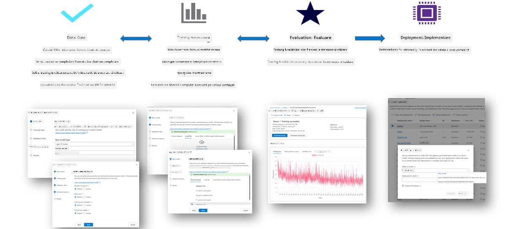

### Crearea unui proiect nou

1. Autentifică-te în [Azure AI Foundry](https://ai.azure.com).

1. Selectează **+New project** pentru a crea un proiect nou în Azure AI Foundry.

    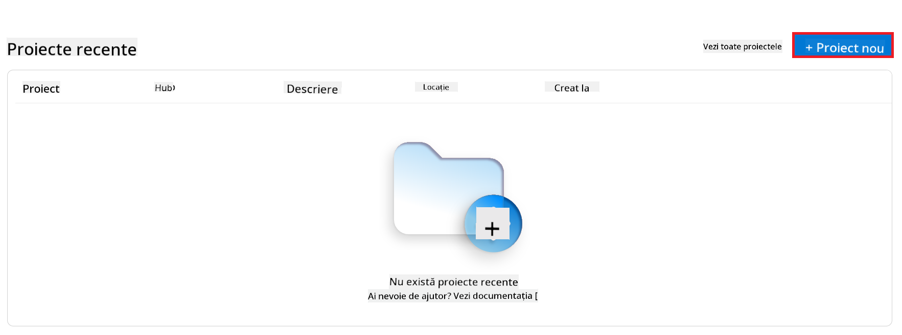

1. Efectuează următoarele sarcini:

    - Numele **Hub-ului** proiectului. Trebuie să fie o valoare unică.
    - Selectează **Hub-ul** pe care vrei să-l folosești (creează unul nou dacă este nevoie).

    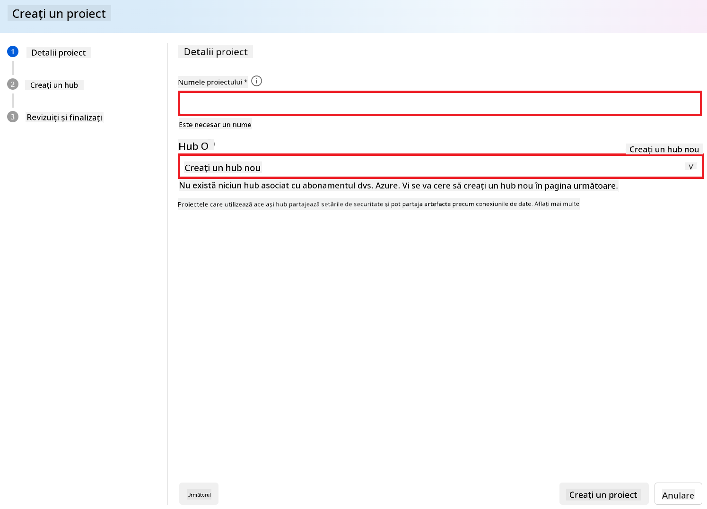

1. Efectuează următoarele pentru a crea un hub nou:

    - Introdu **Hub name**. Trebuie să fie o valoare unică.
    - Selectează abonamentul tău Azure **Subscription**.
    - Selectează grupul de resurse **Resource group** pe care vrei să-l folosești (creează unul nou dacă este nevoie).
    - Selectează locația **Location** pe care dorești să o folosești.
    - Selectează serviciile Azure AI de conectat **Connect Azure AI Services** (creează unul nou dacă este nevoie).
    - Selectează **Connect Azure AI Search** pe opțiunea **Skip connecting**.

    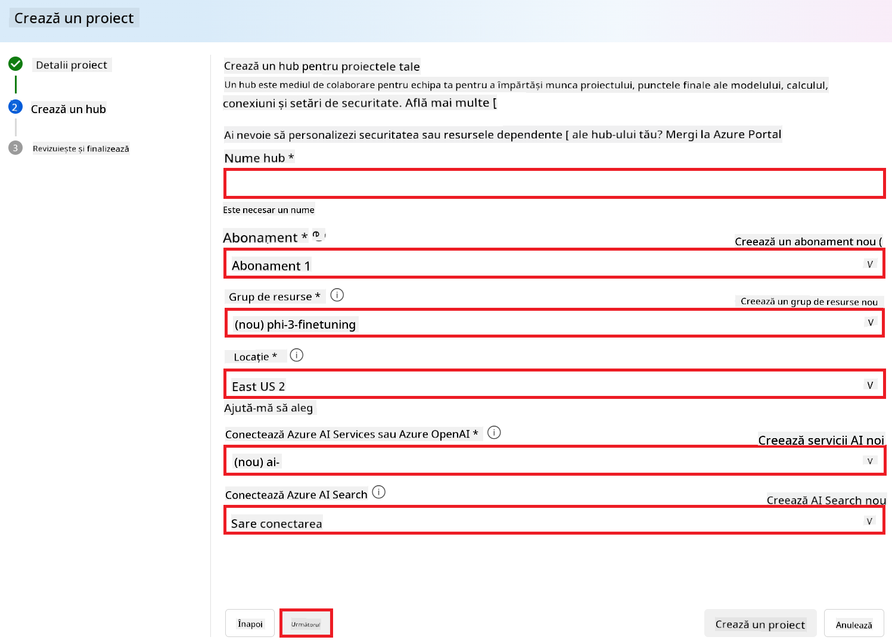

1. Selectează **Next**.
1. Selectează **Create a project**.

### Pregătirea datelor

Înainte de ajustarea fină, adună sau creează un set de date relevant pentru sarcina ta, cum ar fi instrucțiuni de chat, perechi întrebări-răspunsuri sau orice alte date text relevante. Curăță și preprocesează aceste date eliminând zgomotul, gestionând valorile lipsă și tokenizând textul.

### Ajustarea fină a modelelor Phi-3 în Azure AI Foundry

> [!NOTE]
> Ajustarea fină a modelelor Phi-3 este în prezent suportată doar în proiectele localizate în East US 2.

1. Selectează **Model catalog** din fila din partea stângă.

1. Tastează *phi-3* în bara de căutare și selectează modelul phi-3 pe care vrei să-l folosești.

    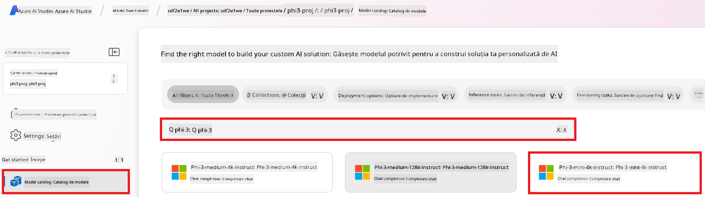

1. Selectează **Fine-tune**.

    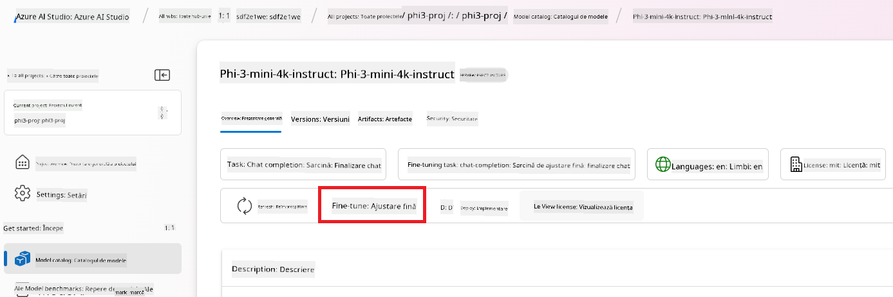

1. Introdu **Numele modelului ajustat fin**.

    

1. Selectează **Next**.

1. Efectuează următoarele:

    - Selectează tipul de sarcină **task type** pe **Chat completion**.
    - Selectează datele de antrenament **Training data** pe care vrei să le folosești. Le poți încărca prin Azure AI Foundry sau din mediul tău local.

    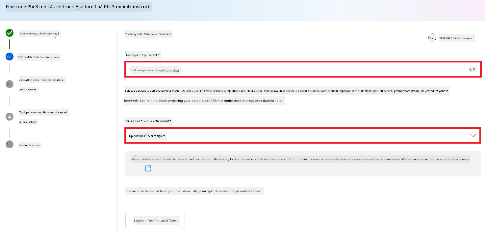

1. Selectează **Next**.

1. Încarcă datele de validare **Validation data** pe care dorești să le folosești sau poți selecta **Automatic split of training data**.

    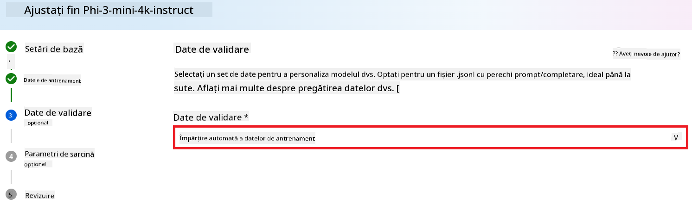

1. Selectează **Next**.

1. Efectuează următoarele:

    - Selectează multiplicatorul pentru dimensiunea lotului **Batch size multiplier**.
    - Selectează rata de învățare **Learning rate**.
    - Selectează numărul de epoci **Epochs**.

    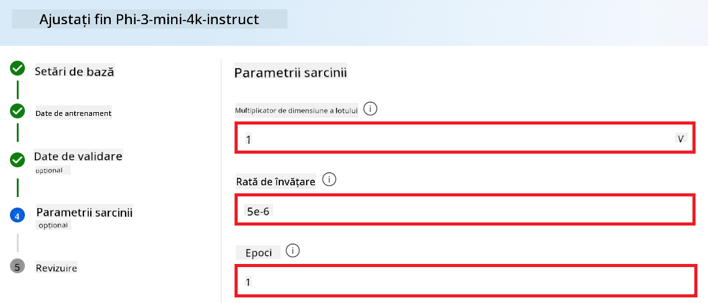

1. Selectează **Submit** pentru a începe procesul de ajustare fină.

    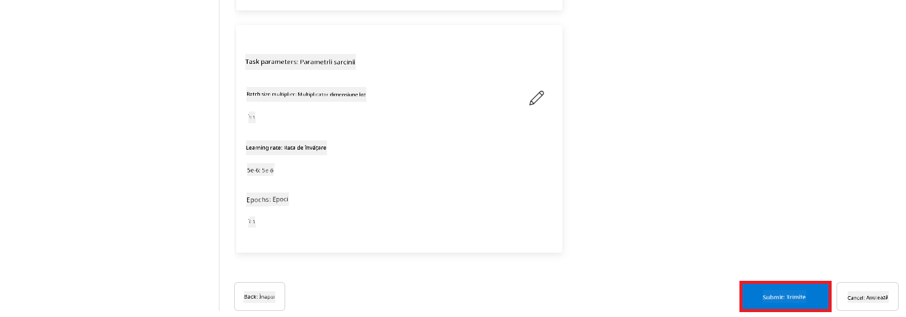

1. Odată ce modelul tău este ajustat fin, starea va apărea ca **Completed**, așa cum se vede în imaginea de mai jos. Acum poți implementa modelul și îl poți folosi în propria aplicație, în playground sau în prompt flow. Pentru mai multe informații, vezi [Cum să implementezi modelele Phi-3 cu Azure AI Foundry](https://learn.microsoft.com/azure/ai-studio/how-to/deploy-models-phi-3?tabs=phi-3-5&pivots=programming-language-python).

    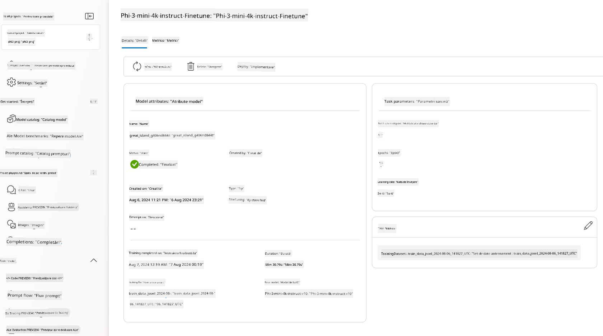

> [!NOTE]
> Pentru informații mai detaliate despre ajustarea fină a Phi-3, vizitează [Fine-tune Phi-3 models in Azure AI Foundry](https://learn.microsoft.com/azure/ai-studio/how-to/fine-tune-phi-3?tabs=phi-3-mini).

## Curățarea modelelor ajustate fin

Poți șterge un model ajustat fin din lista modelelor de ajustare fină în [Azure AI Foundry](https://ai.azure.com) sau din pagina de detalii a modelului. Selectează modelul ajustat fin pe care vrei să-l ștergi din pagina Fine-tuning, apoi apasă butonul Delete pentru a șterge modelul.

> [!NOTE]
> Nu poți șterge un model personalizat dacă are o implementare activă. Trebuie mai întâi să ștergi implementarea modelului înainte de a putea șterge modelul personalizat.

## Costuri și cote

### Considerații privind costurile și cotele pentru modelele Phi-3 ajustate fin ca serviciu

Modelele Phi ajustate fin ca serviciu sunt oferite de Microsoft și integrate cu Azure AI Foundry pentru utilizare. Poți găsi prețurile când [implementezi](https://learn.microsoft.com/azure/ai-studio/how-to/deploy-models-phi-3?tabs=phi-3-5&pivots=programming-language-python) sau ajustezi fin modelele în fila Pricing and terms din expertul de implementare.

## Filtrarea conținutului

Modelele implementate ca serviciu în regim pay-as-you-go sunt protejate de Azure AI Content Safety. Când sunt implementate pe endpoint-uri în timp real, poți opta să dezactivezi această funcționalitate. Cu Azure AI Content Safety activat, atât promptul, cât și completarea trec printr-un ansamblu de modele de clasificare care detectează și previn generarea de conținut dăunător. Sistemul de filtrare detectează și acționează asupra unor categorii specifice de conținut potențial dăunător atât în prompturi, cât și în completări. Află mai multe despre [Azure AI Content Safety](https://learn.microsoft.com/azure/ai-studio/concepts/content-filtering).

**Configurația ajustării fine**

Hyperparametrii: Definirea hyperparametrilor precum rata de învățare, dimensiunea lotului și numărul de epoci de antrenament.

**Funcția de pierdere**

Alege o funcție de pierdere potrivită pentru sarcina ta (de ex., cross-entropy).

**Optimizator**

Selectează un optimizator (de ex., Adam) pentru actualizările gradientului în timpul antrenamentului.

**Procesul de ajustare fină**

- Încarcă modelul pre-antrenat: Încarcă checkpoint-ul Phi-3 Mini.
- Adaugă straturi personalizate: Adaugă straturi specifice sarcinii (de ex., cap de clasificare pentru instrucțiuni de chat).

**Antrenează modelul**  
Ajustează fin modelul folosind setul tău de date pregătit. Monitorizează progresul antrenamentului și ajustează hyperparametrii după necesitate.

**Evaluare și validare**

Set de validare: Împarte datele în seturi de antrenament și validare.

**Evaluează performanța**

Folosește metrici precum acuratețea, scorul F1 sau perplexitatea pentru a evalua performanța modelului.

## Salvarea modelului ajustat fin

**Checkpoint**  
Salvează checkpoint-ul modelului ajustat fin pentru utilizări viitoare.

## Implementare

- Implementează ca serviciu web: Publică modelul ajustat fin ca serviciu web în Azure AI Foundry.
- Testează endpoint-ul: Trimite interogări de test către endpoint-ul implementat pentru a verifica funcționalitatea.

## Iterează și îmbunătățește

Iterează: Dacă performanța nu este satisfăcătoare, ajustează hyperparametrii, adaugă mai multe date sau continuă ajustarea fină pentru epoci suplimentare.

## Monitorizează și rafinează

Monitorizează continuu comportamentul modelului și rafinează-l după nevoie.

## Personalizează și extinde

Sarcini personalizate: Phi-3 Mini poate fi ajustat fin pentru diverse sarcini dincolo de instrucțiunile de chat. Explorează alte cazuri de utilizare!  
Experimentează: Încearcă arhitecturi diferite, combinații de straturi și tehnici pentru a îmbunătăți performanța.

> [!NOTE]
> Ajustarea fină este un proces iterativ. Experimentează, învață și adaptează modelul pentru a obține cele mai bune rezultate pentru sarcina ta specifică!

**Declinare a responsabilității**:  
Acest document a fost tradus folosind serviciul de traducere AI [Co-op Translator](https://github.com/Azure/co-op-translator). Deși ne străduim pentru acuratețe, vă rugăm să rețineți că traducerile automate pot conține erori sau inexactități. Documentul original în limba sa nativă trebuie considerat sursa autoritară. Pentru informații critice, se recomandă traducerea profesională realizată de un specialist uman. Nu ne asumăm responsabilitatea pentru eventualele neînțelegeri sau interpretări greșite care pot rezulta din utilizarea acestei traduceri.