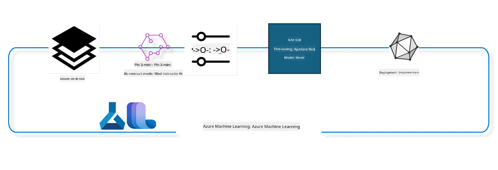

## Cum să folosești componentele chat-completion din registrul de sistem Azure ML pentru a ajusta fin modelul

În acest exemplu vom efectua ajustarea fină a modelului Phi-3-mini-4k-instruct pentru a completa o conversație între 2 persoane folosind setul de date ultrachat_200k.



Exemplul vă va arăta cum să efectuați ajustarea fină folosind Azure ML SDK și Python și apoi să implementați modelul ajustat fin la un endpoint online pentru inferență în timp real.

### Date de antrenament

Vom folosi setul de date ultrachat_200k. Acesta este o versiune puternic filtrată a setului de date UltraChat și a fost folosit pentru a antrena Zephyr-7B-β, un model de chat de ultimă generație de 7b.

### Model

Vom folosi modelul Phi-3-mini-4k-instruct pentru a arăta cum utilizatorul poate ajusta fin un model pentru sarcina de chat-completion. Dacă ați deschis acest notebook dintr-o pagină specifică modelului, nu uitați să înlocuiți numele modelului specific.

### Sarcini

- Alegeți un model pentru ajustare fină.
- Alegeți și explorați datele de antrenament.
- Configurați jobul de ajustare fină.
- Rulați jobul de ajustare fină.
- Analizați metricile de antrenament și evaluare.
- Înregistrați modelul ajustat fin.
- Implementați modelul ajustat fin pentru inferență în timp real.
- Curățați resursele.

## 1. Configurați prerechizitele

- Instalați dependențele
- Conectați-vă la Workspace AzureML. Aflați mai multe la configurarea autentificării SDK. Înlocuiți <WORKSPACE_NAME>, <RESOURCE_GROUP> și <SUBSCRIPTION_ID> mai jos.
- Conectați-vă la registrul de sistem azureml
- Stabiliți un nume opțional pentru experiment
- Verificați sau creați compute.

> [!NOTE]
> Cerințele pentru un singur nod GPU pot include mai multe plăci GPU. De exemplu, într-un nod Standard_NC24rs_v3 sunt 4 GPU-uri NVIDIA V100, în timp ce în Standard_NC12s_v3 sunt 2 GPU-uri NVIDIA V100. Consultați documentația pentru această informație. Numărul de plăci GPU pe nod este setat în parametrul gpus_per_node de mai jos. Setarea corectă a acestei valori va asigura utilizarea tuturor GPU-urilor din nod. SKU-urile recomandate pentru compute GPU pot fi găsite aici și aici.

### Biblioteci Python

Instalați dependențele rulând celula de mai jos. Acesta nu este un pas opțional dacă rulați într-un mediu nou.

```bash
pip install azure-ai-ml
pip install azure-identity
pip install datasets==2.9.0
pip install mlflow
pip install azureml-mlflow
```

### Interacțiunea cu Azure ML

1. Acest script Python este folosit pentru a interacționa cu serviciul Azure Machine Learning (Azure ML). Iată o prezentare a ceea ce face:

    - Importă modulele necesare din azure.ai.ml, azure.identity și azure.ai.ml.entities. De asemenea, importă modulul time.

    - Încearcă să se autentifice folosind DefaultAzureCredential(), care oferă o experiență simplificată de autentificare pentru a începe rapid dezvoltarea aplicațiilor rulând în cloud-ul Azure. Dacă aceasta eșuează, trece la InteractiveBrowserCredential(), care oferă un prompt interactiv de autentificare.

    - Apoi încearcă să creeze o instanță MLClient folosind metoda from_config, care citește configurația din fișierul implicit config.json. Dacă aceasta eșuează, creează o instanță MLClient furnizând manual subscription_id, resource_group_name și workspace_name.

    - Creează o altă instanță MLClient, de data aceasta pentru registrul Azure ML numit "azureml". Acest registru este locul unde sunt stocate modelele, pipeline-urile de fine-tuning și mediile.

    - Setează numele experimentului la "chat_completion_Phi-3-mini-4k-instruct".

    - Generează un timestamp unic convertind timpul curent (în secunde de la epocă, ca număr flotant) la un întreg și apoi la un șir. Acest timestamp poate fi folosit pentru a crea nume și versiuni unice.

    ```python
    # Importă modulele necesare din Azure ML și Azure Identity
    from azure.ai.ml import MLClient
    from azure.identity import (
        DefaultAzureCredential,
        InteractiveBrowserCredential,
    )
    from azure.ai.ml.entities import AmlCompute
    import time  # Importă modulul time
    
    # Încearcă să te autentifici folosind DefaultAzureCredential
    try:
        credential = DefaultAzureCredential()
        credential.get_token("https://management.azure.com/.default")
    except Exception as ex:  # Dacă DefaultAzureCredential eșuează, folosește InteractiveBrowserCredential
        credential = InteractiveBrowserCredential()
    
    # Încearcă să creezi o instanță MLClient folosind fișierul de configurare implicit
    try:
        workspace_ml_client = MLClient.from_config(credential=credential)
    except:  # Dacă asta eșuează, creează o instanță MLClient oferind manual detaliile
        workspace_ml_client = MLClient(
            credential,
            subscription_id="<SUBSCRIPTION_ID>",
            resource_group_name="<RESOURCE_GROUP>",
            workspace_name="<WORKSPACE_NAME>",
        )
    
    # Creează o altă instanță MLClient pentru registrul Azure ML numit "azureml"
    # Acest registru este locul unde sunt stocate modelele, pipeline-urile de fine-tuning și mediile
    registry_ml_client = MLClient(credential, registry_name="azureml")
    
    # Setează numele experimentului
    experiment_name = "chat_completion_Phi-3-mini-4k-instruct"
    
    # Generează un timestamp unic ce poate fi folosit pentru nume și versiuni care trebuie să fie unice
    timestamp = str(int(time.time()))
    ```

## 2. Alegeți un model de bază pentru ajustare fină

1. Phi-3-mini-4k-instruct este un model ușor, de 3.8 miliarde de parametri, de ultimă generație, construit pe seturi de date folosite pentru Phi-2. Modelul face parte din familia de modele Phi-3, iar versiunea Mini vine în două variante 4K și 128K, ceea ce reprezintă lungimea contextului (în tokeni) pe care o poate suporta. Trebuie să ajustăm fin modelul pentru scopul nostru specific înainte de utilizare. Puteți explora aceste modele în Catalogul de Modele din AzureML Studio, filtrând după sarcina chat-completion. În acest exemplu, folosim modelul Phi-3-mini-4k-instruct. Dacă ați deschis acest notebook pentru un model diferit, înlocuiți numele și versiunea modelului corespunzător.

> [!NOTE]
> proprietatea model id a modelului. Aceasta va fi transmisă ca input jobului de ajustare fină. Este de asemenea disponibilă ca câmp Asset ID în pagina de detalii a modelului din Catalogul de Modele AzureML Studio.

2. Acest script Python interacționează cu serviciul Azure Machine Learning (Azure ML). Iată o prezentare a ceea ce face:

    - Setează model_name la "Phi-3-mini-4k-instruct".

    - Folosește metoda get a proprietății models a obiectului registry_ml_client pentru a prelua ultima versiune a modelului cu numele specificat din registrul Azure ML. Metoda get este apelată cu două argumente: numele modelului și o etichetă care specifică să fie preluată cea mai recentă versiune.

    - Afișează un mesaj în consolă indicând numele, versiunea și id-ul modelului care va fi folosit pentru ajustare fină. Metoda format a stringului este folosită pentru a insera numele, versiunea și id-ul în mesaj. Proprietățile name, version și id ale obiectului foundation_model sunt accesate.

    ```python
    # Setează numele modelului
    model_name = "Phi-3-mini-4k-instruct"
    
    # Obține cea mai recentă versiune a modelului din registrul Azure ML
    foundation_model = registry_ml_client.models.get(model_name, label="latest")
    
    # Afișează numele modelului, versiunea și id-ul
    # Aceste informații sunt utile pentru urmărire și depanare
    print(
        "\n\nUsing model name: {0}, version: {1}, id: {2} for fine tuning".format(
            foundation_model.name, foundation_model.version, foundation_model.id
        )
    )
    ```

## 3. Creați un compute de folosit cu jobul

Jobul de ajustare fină funcționează DOAR cu compute GPU. Mărimea compute-ului depinde de cât de mare este modelul și în majoritatea cazurilor devine complicat să identifici compute-ul potrivit pentru job. În această celulă, ghidăm utilizatorul să selecteze compute-ul potrivit pentru job.

> [!NOTE]
> Compute-urile listate mai jos funcționează cu cea mai optimizată configurație. Orice modificare a configurației poate cauza erori de tip Cuda Out Of Memory. În astfel de cazuri, încercați să actualizați compute-ul la o dimensiune mai mare.

> [!NOTE]
> Atunci când selectați compute_cluster_size mai jos, asigurați-vă că compute-ul este disponibil în grupul vostru de resurse. Dacă un anumit compute nu este disponibil, puteți face o cerere pentru a obține acces la resursele compute.

### Verificarea suportului modelului pentru ajustare fină

1. Acest script Python interacționează cu un model Azure Machine Learning (Azure ML). Iată o prezentare a ceea ce face:

    - Importă modulul ast, care oferă funcții pentru procesarea arborilor sintaxei abstracte Python.

    - Verifică dacă obiectul foundation_model (care reprezintă un model în Azure ML) are un tag numit finetune_compute_allow_list. Tag-urile în Azure ML sunt perechi cheie-valoare pe care le puteți crea și folosi pentru filtrarea și sortarea modelelor.

    - Dacă tag-ul finetune_compute_allow_list este prezent, folosește funcția ast.literal_eval pentru a parsa în siguranță valoarea tag-ului (un șir) într-o listă Python. Această listă este apoi asignată variabilei computes_allow_list. Afișează un mesaj indicând că trebuie creat un compute din lista respectivă.

    - Dacă tag-ul finetune_compute_allow_list nu este prezent, setează computes_allow_list la None și afișează un mesaj indicând că tag-ul finetune_compute_allow_list nu face parte din tag-urile modelului.

    - În rezumat, acest script verifică un tag specific în metadatele modelului, convertește valoarea tag-ului într-o listă dacă există și oferă feedback utilizatorului corespunzător.

    ```python
    # Importă modulul ast, care oferă funcții pentru procesarea arborilor sintaxei abstracte Python
    import ast
    
    # Verifică dacă eticheta 'finetune_compute_allow_list' este prezentă în etichetele modelului
    if "finetune_compute_allow_list" in foundation_model.tags:
        # Dacă eticheta este prezentă, folosește ast.literal_eval pentru a analiza în siguranță valoarea etichetei (un șir) într-o listă Python
        computes_allow_list = ast.literal_eval(
            foundation_model.tags["finetune_compute_allow_list"]
        )  # convertește șirul într-o listă Python
        # Afișează un mesaj care indică faptul că un compute ar trebui creat din listă
        print(f"Please create a compute from the above list - {computes_allow_list}")
    else:
        # Dacă eticheta nu este prezentă, setează computes_allow_list la None
        computes_allow_list = None
        # Afișează un mesaj care indică faptul că eticheta 'finetune_compute_allow_list' nu face parte din etichetele modelului
        print("`finetune_compute_allow_list` is not part of model tags")
    ```

### Verificarea instanței compute

1. Acest script Python interacționează cu serviciul Azure Machine Learning (Azure ML) și efectuează mai multe verificări asupra unei instanțe compute. Iată o prezentare a ceea ce face:

    - Încearcă să recupereze instanța compute cu numele stocat în compute_cluster din workspace-ul Azure ML. Dacă starea de provisioning a compute-ului este "failed", ridică o eroare ValueError.

    - Verifică dacă computes_allow_list nu este None. Dacă nu este, convertește toate dimensiunile de compute din listă în litere mici și verifică dacă dimensiunea compute-ului curent este în listă. Dacă nu este, ridică o eroare ValueError.

    - Dacă computes_allow_list este None, verifică dacă dimensiunea compute-ului este într-o listă de dimensiuni GPU VM neacceptate. Dacă este, ridică o eroare ValueError.

    - Recuperează o listă cu toate dimensiunile de compute disponibile în workspace. Apoi iterează asupra acestei liste și pentru fiecare dimensiune de compute verifică dacă numele său corespunde cu dimensiunea compute-ului curent. Dacă da, preia numărul de GPU-uri pentru acea dimensiune de compute și setează gpu_count_found la True.

    - Dacă gpu_count_found este True, afișează numărul de GPU-uri din instanța compute. Dacă gpu_count_found este False, ridică o eroare ValueError.

    - În concluzie, acest script efectuează mai multe verificări asupra unei instanțe compute într-un workspace Azure ML, inclusiv verificarea stării de provisioning, verificarea dimensiunii față de o listă permisă sau o listă de excludere și numărul de GPU-uri pe care îl are.
    
    ```python
    # Afișează mesajul excepției
    print(e)
    # Ridică o eroare ValueError dacă dimensiunea de calcul nu este disponibilă în spațiul de lucru
    raise ValueError(
        f"WARNING! Compute size {compute_cluster_size} not available in workspace"
    )
    
    # Recuperează instanța de calcul din spațiul de lucru Azure ML
    compute = workspace_ml_client.compute.get(compute_cluster)
    # Verifică dacă starea de aprovizionare a instanței de calcul este "failed"
    if compute.provisioning_state.lower() == "failed":
        # Ridică o eroare ValueError dacă starea de aprovizionare este "failed"
        raise ValueError(
            f"Provisioning failed, Compute '{compute_cluster}' is in failed state. "
            f"please try creating a different compute"
        )
    
    # Verifică dacă computes_allow_list nu este None
    if computes_allow_list is not None:
        # Convertește toate dimensiunile de calcul din computes_allow_list în litere mici
        computes_allow_list_lower_case = [x.lower() for x in computes_allow_list]
        # Verifică dacă dimensiunea instanței de calcul este în computes_allow_list_lower_case
        if compute.size.lower() not in computes_allow_list_lower_case:
            # Ridică o eroare ValueError dacă dimensiunea instanței de calcul nu este în computes_allow_list_lower_case
            raise ValueError(
                f"VM size {compute.size} is not in the allow-listed computes for finetuning"
            )
    else:
        # Definește o listă de dimensiuni GPU VM neacceptate
        unsupported_gpu_vm_list = [
            "standard_nc6",
            "standard_nc12",
            "standard_nc24",
            "standard_nc24r",
        ]
        # Verifică dacă dimensiunea instanței de calcul este în unsupported_gpu_vm_list
        if compute.size.lower() in unsupported_gpu_vm_list:
            # Ridică o eroare ValueError dacă dimensiunea instanței de calcul este în unsupported_gpu_vm_list
            raise ValueError(
                f"VM size {compute.size} is currently not supported for finetuning"
            )
    
    # Inițializează un flag pentru a verifica dacă numărul de GPU-uri în instanța de calcul a fost găsit
    gpu_count_found = False
    # Recuperează o listă cu toate dimensiunile de calcul disponibile în spațiul de lucru
    workspace_compute_sku_list = workspace_ml_client.compute.list_sizes()
    available_sku_sizes = []
    # Parcurge lista dimensiunilor de calcul disponibile
    for compute_sku in workspace_compute_sku_list:
        available_sku_sizes.append(compute_sku.name)
        # Verifică dacă numele dimensiunii de calcul corespunde cu dimensiunea instanței de calcul
        if compute_sku.name.lower() == compute.size.lower():
            # Dacă este așa, recuperează numărul de GPU-uri pentru acea dimensiune de calcul și setează gpu_count_found la True
            gpus_per_node = compute_sku.gpus
            gpu_count_found = True
    # Dacă gpu_count_found este True, afișează numărul de GPU-uri în instanța de calcul
    if gpu_count_found:
        print(f"Number of GPU's in compute {compute.size}: {gpus_per_node}")
    else:
        # Dacă gpu_count_found este False, ridică o eroare ValueError
        raise ValueError(
            f"Number of GPU's in compute {compute.size} not found. Available skus are: {available_sku_sizes}."
            f"This should not happen. Please check the selected compute cluster: {compute_cluster} and try again."
        )
    ```

## 4. Alegeți setul de date pentru ajustarea fină a modelului

1. Folosim setul de date ultrachat_200k. Setul are patru diviziuni, potrivite pentru fine-tuning supravegheat (sft).
Generarea clasamentului (gen). Numărul de exemple per diviziune este afișat astfel:

    ```bash
    train_sft test_sft  train_gen  test_gen
    207865  23110  256032  28304
    ```

1. Următoarele câteva celule arată pregătirea de bază a datelor pentru ajustarea fină:

### Vizualizați câteva rânduri de date

Dorim ca acest eșantion să ruleze rapid, așa că salvăm fișierele train_sft, test_sft conținând 5% din rândurile deja filtrate. Aceasta înseamnă că modelul ajustat fin va avea o precizie mai scăzută, așadar nu ar trebui folosit în aplicații reale.
download-dataset.py este folosit pentru a descărca setul de date ultrachat_200k și pentru a transforma setul de date într-un format consumabil de componenta pipeline de fine-tuning. De asemenea, deoarece setul de date este mare, aici avem doar o parte din dataset.

1. Rularea scriptului de mai jos descarcă doar 5% din date. Această valoare poate fi mărită prin schimbarea parametrului dataset_split_pc la procentul dorit.

> [!NOTE]
> Unele modele lingvistice au coduri de limbă diferite și, prin urmare, numele coloanelor din setul de date ar trebui să reflecte acest lucru.

1. Iată un exemplu al modului în care ar trebui să arate datele
Setul de date chat-completion este stocat în format parquet, fiecare intrare folosind următorul schelet:

    - Este un document JSON (JavaScript Object Notation), un format popular de schimb de date. Nu este cod executabil, ci o modalitate de a stoca și transporta date. Structura este următoarea:

    - "prompt": Această cheie conține un șir care reprezintă o sarcină sau o întrebare adresată unui asistent AI.

    - "messages": Această cheie conține un tablou de obiecte. Fiecare obiect reprezintă un mesaj într-o conversație între un utilizator și un asistent AI. Fiecare obiect mesaj are două chei:

    - "content": Această cheie conține un șir cu conținutul mesajului.
    - "role": Această cheie conține un șir care reprezintă rolul entității care a trimis mesajul. Poate fi "user" sau "assistant".
    - "prompt_id": Această cheie conține un șir care reprezintă un identificator unic pentru prompt.

1. În acest document JSON specific, este reprezentată o conversație în care un utilizator îi cere unui asistent AI să creeze un protagonist pentru o poveste distopică. Asistentul răspunde, iar utilizatorul cere apoi mai multe detalii. Asistentul este de acord să ofere mai multe detalii. Întreaga conversație este asociată cu un anumit prompt id.

    ```python
    {
        // The task or question posed to an AI assistant
        "prompt": "Create a fully-developed protagonist who is challenged to survive within a dystopian society under the rule of a tyrant. ...",
        
        // An array of objects, each representing a message in a conversation between a user and an AI assistant
        "messages":[
            {
                // The content of the user's message
                "content": "Create a fully-developed protagonist who is challenged to survive within a dystopian society under the rule of a tyrant. ...",
                // The role of the entity that sent the message
                "role": "user"
            },
            {
                // The content of the assistant's message
                "content": "Name: Ava\n\n Ava was just 16 years old when the world as she knew it came crashing down. The government had collapsed, leaving behind a chaotic and lawless society. ...",
                // The role of the entity that sent the message
                "role": "assistant"
            },
            {
                // The content of the user's message
                "content": "Wow, Ava's story is so intense and inspiring! Can you provide me with more details.  ...",
                // The role of the entity that sent the message
                "role": "user"
            }, 
            {
                // The content of the assistant's message
                "content": "Certainly! ....",
                // The role of the entity that sent the message
                "role": "assistant"
            }
        ],
        
        // A unique identifier for the prompt
        "prompt_id": "d938b65dfe31f05f80eb8572964c6673eddbd68eff3db6bd234d7f1e3b86c2af"
    }
    ```

### Descărcarea Datelor

1. Acest script Python este folosit pentru a descărca un set de date folosind un script helper numit download-dataset.py. Iată o prezentare a ceea ce face:

    - Importă modulul os, care oferă o modalitate portabilă de a folosi funcționalități dependente de sistemul de operare.

    - Folosește os.system pentru a rula scriptul download-dataset.py în shell cu argumente specifice în linia de comandă. Argumentele specifică dataset-ul de descărcat (HuggingFaceH4/ultrachat_200k), directorul unde să fie descărcat (ultrachat_200k_dataset) și procentajul din dataset de separat (5). Funcția os.system returnează codul de ieșire al comenzii; acest cod este stocat în variabila exit_status.

    - Verifică dacă exit_status nu este 0. În sistemele Unix-like, un cod de ieșire 0 indică reușită, iar orice alt număr indică o eroare. Dacă exit_status nu este 0, ridică o excepție cu un mesaj că a apărut o eroare la descărcarea setului de date.

    - În concluzie, acest script rulează o comandă pentru a descărca un set de date folosind un script helper și ridică o excepție dacă comanda eșuează.
    
    ```python
    # Importă modulul os, care oferă o modalitate de a utiliza funcționalități dependente de sistemul de operare
    import os
    
    # Folosește funcția os.system pentru a rula scriptul download-dataset.py în shell cu argumente specifice din linia de comandă
    # Argumentele specifică setul de date de descărcat (HuggingFaceH4/ultrachat_200k), directorul în care să fie descărcat (ultrachat_200k_dataset) și procentajul setului de date pentru împărțire (5)
    # Funcția os.system returnează codul de ieșire al comenzii executate; acest cod este stocat în variabila exit_status
    exit_status = os.system(
        "python ./download-dataset.py --dataset HuggingFaceH4/ultrachat_200k --download_dir ultrachat_200k_dataset --dataset_split_pc 5"
    )
    
    # Verifică dacă exit_status nu este 0
    # În sistemele de operare de tip Unix, un cod de ieșire 0 indică de obicei că o comandă a reușit, în timp ce orice alt număr indică o eroare
    # Dacă exit_status nu este 0, ridică o Excepție cu un mesaj care indică faptul că a apărut o eroare la descărcarea setului de date
    if exit_status != 0:
        raise Exception("Error downloading dataset")
    ```

### Încărcarea datelor într-un DataFrame

1. Acest script Python încarcă un fișier JSON Lines într-un pandas DataFrame și afișează primele 5 rânduri. Iată o prezentare a ceea ce face:

    - Importă biblioteca pandas, o bibliotecă puternică pentru manipularea și analiza datelor.

    - Setează lățimea maximă a coloanelor în opțiunile de afișare pandas la 0. Aceasta înseamnă că textul complet al fiecărei coloane va fi afișat fără să fie tăiat atunci când DataFrame-ul este tipărit.
    - Folosește funcția pd.read_json pentru a încărca fișierul train_sft.jsonl din directorul ultrachat_200k_dataset într-un DataFrame. Argumentul lines=True indică faptul că fișierul este în format JSON Lines, unde fiecare linie este un obiect JSON separat.

    - Folosește metoda head pentru a afișa primele 5 rânduri ale DataFrame-ului. Dacă DataFrame-ul are mai puțin de 5 rânduri, va afișa toate rândurile.

    - În rezumat, acest script încarcă un fișier JSON Lines într-un DataFrame și afișează primele 5 rânduri cu text complet pe coloane.
    
    ```python
    # Importă biblioteca pandas, care este o bibliotecă puternică pentru manipularea și analiza datelor
    import pandas as pd
    
    # Setează lățimea maximă a coloanelor pentru opțiunile de afișare ale pandas la 0
    # Aceasta înseamnă că textul complet al fiecărei coloane va fi afișat fără trunchiere atunci când DataFrame-ul este tipărit
    pd.set_option("display.max_colwidth", 0)
    
    # Folosește funcția pd.read_json pentru a încărca fișierul train_sft.jsonl din directorul ultrachat_200k_dataset într-un DataFrame
    # Argumentul lines=True indică faptul că fișierul este în format JSON Lines, unde fiecare linie este un obiect JSON separat
    df = pd.read_json("./ultrachat_200k_dataset/train_sft.jsonl", lines=True)
    
    # Folosește metoda head pentru a afișa primele 5 rânduri ale DataFrame-ului
    # Dacă DataFrame-ul are mai puțin de 5 rânduri, vor fi afișate toate acestea
    df.head()
    ```

## 5. Trimite jobul de ajustare fină folosind modelul și datele ca intrări

Creează jobul care folosește componenta pipeline pentru chat-completion. Află mai multe despre toți parametrii suportați pentru ajustarea fină.

### Definirea parametrilor pentru ajustarea fină

1. Parametrii pentru ajustarea fină pot fi grupați în 2 categorii - parametri de antrenament, parametri de optimizare

1. Parametrii de antrenament definesc aspectele antrenamentului, precum -

    - Optimizatorul, scheduler-ul folosit
    - Metrica pentru optimizarea ajustării fine
    - Numărul de pași de antrenament, dimensiunea batch-ului și altele
    - Parametrii de optimizare ajută la optimizarea memoriei GPU și la utilizarea eficientă a resurselor de calcul.

1. Mai jos sunt câțiva parametri care aparțin acestei categorii. Parametrii de optimizare diferă pentru fiecare model și sunt împachetați împreună cu modelul pentru a gestiona aceste variații.

    - Activează deepspeed și LoRA
    - Activează antrenamentul cu precizie mixtă
    - Activează antrenamentul multi-node

> [!NOTE]
> Ajustarea fină supervizată poate duce la pierderea alinierii sau uitare catastrofală. Recomandăm verificarea acestei probleme și rularea unei etape de aliniere după ce faci ajustarea fină.

### Parametri pentru ajustare fină

1. Acest script Python configurează parametrii pentru ajustarea fină a unui model de machine learning. Iată o defalcare a ceea ce face:

    - Setează parametrii de antrenament implicit, precum numărul de epoci de antrenament, dimensiunile batch-urilor pentru antrenament și evaluare, rata de învățare și tipul scheduler-ului pentru rata de învățare.

    - Setează parametrii de optimizare implicit, precum dacă se aplică Layer-wise Relevance Propagation (LoRa) și DeepSpeed, și stadiul DeepSpeed.

    - Combină parametrii de antrenament și optimizare într-un singur dicționar numit finetune_parameters.

    - Verifică dacă foundation_model are parametri specifici modelului. Dacă are, afișează un mesaj de avertizare și actualizează dicționarul finetune_parameters cu acești parametri specifici modelului. Funcția ast.literal_eval este folosită pentru a converti parametrii specifici modelului dintr-un șir în dicționar Python.

    - Afișează setul final de parametri pentru ajustare fină care vor fi folosiți la rulare.

    - În rezumat, acest script setează și afișează parametrii pentru ajustarea fină a unui model de machine learning, cu posibilitatea de a suprascrie parametrii impliciți cu cei specifici modelului.

    ```python
    # Configurează parametrii impliciți de antrenament, cum ar fi numărul de epoci de antrenament, dimensiunile loturilor pentru antrenament și evaluare, rata de învățare și tipul programatorului de rată de învățare
    training_parameters = dict(
        num_train_epochs=3,
        per_device_train_batch_size=1,
        per_device_eval_batch_size=1,
        learning_rate=5e-6,
        lr_scheduler_type="cosine",
    )
    
    # Configurează parametrii impliciți de optimizare, cum ar fi dacă se aplică Layer-wise Relevance Propagation (LoRa) și DeepSpeed, și etapa DeepSpeed
    optimization_parameters = dict(
        apply_lora="true",
        apply_deepspeed="true",
        deepspeed_stage=2,
    )
    
    # Combină parametrii de antrenament și optimizare într-un singur dicționar numit finetune_parameters
    finetune_parameters = {**training_parameters, **optimization_parameters}
    
    # Verifică dacă foundation_model are parametri impliciți specifici modelului
    # Dacă da, afișează un mesaj de avertizare și actualizează dicționarul finetune_parameters cu aceste valori implicite specifice modelului
    # Funcția ast.literal_eval este folosită pentru a converti valorile implicite specifice modelului dintr-un șir de caractere într-un dicționar Python
    if "model_specific_defaults" in foundation_model.tags:
        print("Warning! Model specific defaults exist. The defaults could be overridden.")
        finetune_parameters.update(
            ast.literal_eval(  # convertește șirul într-un dicționar python
                foundation_model.tags["model_specific_defaults"]
            )
        )
    
    # Afișează setul final de parametri de fine-tuning care vor fi folosiți pentru rulare
    print(
        f"The following finetune parameters are going to be set for the run: {finetune_parameters}"
    )
    ```

### Pipeline de Antrenament

1. Acest script Python definește o funcție pentru a genera un nume de afișare pentru un pipeline de antrenament machine learning, apoi apelează această funcție pentru a genera și afișa numele de afișare. Iată o defalcare a ceea ce face:

1. Funcția get_pipeline_display_name este definită. Această funcție generează un nume de afișare bazat pe diverși parametri legați de pipeline-ul de antrenament.

1. În funcție, se calculează dimensiunea totală a batch-ului prin înmulțirea dimensiunii batch-ului pe dispozitiv, numărul de pași de acumulare a gradientului, numărul de GPU-uri per nod și numărul de noduri folosite pentru ajustarea fină.

1. Recuperează diverși alți parametri precum tipul scheduler-ului pentru rata de învățare, dacă se aplică DeepSpeed, stadiul DeepSpeed, dacă se aplică LoRa (Layer-wise Relevance Propagation), limita de checkpoint-uri de model de păstrat și lungimea maximă a secvenței.

1. Construiește un șir care include toți acești parametri, separați prin cratime. Dacă DeepSpeed sau LoRa sunt aplicate, șirul include „ds” urmat de stadiul DeepSpeed sau „lora”, respectiv. Dacă nu, include „nods” sau „nolora”, respectiv.

1. Funcția returnează acest șir, care servește drept nume de afișare pentru pipeline-ul de antrenament.

1. După definirea funcției, aceasta este apelată pentru a genera numele de afișare, care este apoi afișat.

1. În rezumat, acest script generează un nume de afișare pentru un pipeline de antrenament machine learning bazat pe diverși parametri și apoi afișează acest nume.

    ```python
    # Definește o funcție pentru a genera un nume de afișare pentru pipeline-ul de antrenament
    def get_pipeline_display_name():
        # Calculează dimensiunea totală a batch-ului prin multiplicarea dimensiunii batch-ului per dispozitiv, a numărului de pași de acumulare a gradientului, a numărului de GPU-uri pe nod și a numărului de noduri utilizate pentru fine-tuning
        batch_size = (
            int(finetune_parameters.get("per_device_train_batch_size", 1))
            * int(finetune_parameters.get("gradient_accumulation_steps", 1))
            * int(gpus_per_node)
            * int(finetune_parameters.get("num_nodes_finetune", 1))
        )
        # Recuperează tipul scheduler-ului de rată de învățare
        scheduler = finetune_parameters.get("lr_scheduler_type", "linear")
        # Recuperează dacă este aplicat DeepSpeed
        deepspeed = finetune_parameters.get("apply_deepspeed", "false")
        # Recuperează stadiul DeepSpeed
        ds_stage = finetune_parameters.get("deepspeed_stage", "2")
        # Dacă DeepSpeed este aplicat, include "ds" urmat de stadiul DeepSpeed în numele de afișare; dacă nu, include "nods"
        if deepspeed == "true":
            ds_string = f"ds{ds_stage}"
        else:
            ds_string = "nods"
        # Recuperează dacă este aplicată Layer-wise Relevance Propagation (LoRa)
        lora = finetune_parameters.get("apply_lora", "false")
        # Dacă LoRa este aplicată, include "lora" în numele de afișare; dacă nu, include "nolora"
        if lora == "true":
            lora_string = "lora"
        else:
            lora_string = "nolora"
        # Recuperează limita pentru numărul de checkpoint-uri ale modelului care trebuie păstrate
        save_limit = finetune_parameters.get("save_total_limit", -1)
        # Recuperează lungimea maximă a secvenței
        seq_len = finetune_parameters.get("max_seq_length", -1)
        # Construiește numele de afișare concatenând toți acești parametri, separați prin cratime
        return (
            model_name
            + "-"
            + "ultrachat"
            + "-"
            + f"bs{batch_size}"
            + "-"
            + f"{scheduler}"
            + "-"
            + ds_string
            + "-"
            + lora_string
            + f"-save_limit{save_limit}"
            + f"-seqlen{seq_len}"
        )
    
    # Apelează funcția pentru a genera numele de afișare
    pipeline_display_name = get_pipeline_display_name()
    # Afișează numele de afișare
    print(f"Display name used for the run: {pipeline_display_name}")
    ```

### Configurarea Pipeline-ului

Acest script Python definește și configurează un pipeline de machine learning folosind Azure Machine Learning SDK. Iată o defalcare a ceea ce face:

1. Importă modulele necesare din Azure AI ML SDK.

1. Obține o componentă de pipeline numită "chat_completion_pipeline" din registru.

1. Definește un job de pipeline folosind decoratorul `@pipeline` și funcția `create_pipeline`. Numele pipeline-ului este setat la `pipeline_display_name`.

1. În interiorul funcției `create_pipeline`, inițializează componenta pipeline obținută cu diverși parametri, inclusiv calea modelului, clusterele de calcul pentru diferite etape, divizările dataset-ului pentru antrenament și testare, numărul de GPU-uri pentru ajustarea fină și alți parametri de ajustare fină.

1. Leagă ieșirea jobului de ajustare fină cu ieșirea jobului pipeline. Acest lucru se face pentru ca modelul fin ajustat să poată fi înregistrat cu ușurință, ceea ce este necesar pentru a implementa modelul pe un endpoint online sau batch.

1. Creează o instanță a pipeline-ului apelând funcția `create_pipeline`.

1. Setează opțiunea `force_rerun` a pipeline-ului la `True`, ceea ce înseamnă că rezultatele cache din joburi anterioare nu vor fi folosite.

1. Setează opțiunea `continue_on_step_failure` a pipeline-ului la `False`, ceea ce înseamnă că pipeline-ul se va opri dacă vreun pas eșuează.

1. În rezumat, acest script definește și configurează un pipeline de machine learning pentru o sarcină de chat completion folosind Azure Machine Learning SDK.

    ```python
    # Importă modulele necesare din SDK-ul Azure AI ML
    from azure.ai.ml.dsl import pipeline
    from azure.ai.ml import Input
    
    # Preia componenta pipeline numită "chat_completion_pipeline" din registru
    pipeline_component_func = registry_ml_client.components.get(
        name="chat_completion_pipeline", label="latest"
    )
    
    # Definește jobul pipeline folosind decorarea @pipeline și funcția create_pipeline
    # Numele pipeline-ului este setat la pipeline_display_name
    @pipeline(name=pipeline_display_name)
    def create_pipeline():
        # Initializează componenta pipeline preluată cu diverși parametri
        # Aceștia includ calea modelului, clusterele de calcul pentru diferite etape, diviziunile dataset-ului pentru antrenare și testare, numărul de GPU-uri pentru fine-tuning și alți parametri pentru fine-tuning
        chat_completion_pipeline = pipeline_component_func(
            mlflow_model_path=foundation_model.id,
            compute_model_import=compute_cluster,
            compute_preprocess=compute_cluster,
            compute_finetune=compute_cluster,
            compute_model_evaluation=compute_cluster,
            # Mapează diviziunile dataset-ului la parametri
            train_file_path=Input(
                type="uri_file", path="./ultrachat_200k_dataset/train_sft.jsonl"
            ),
            test_file_path=Input(
                type="uri_file", path="./ultrachat_200k_dataset/test_sft.jsonl"
            ),
            # Setări pentru antrenare
            number_of_gpu_to_use_finetuning=gpus_per_node,  # Setat la numărul de GPU-uri disponibile în clusterul de calcul
            **finetune_parameters
        )
        return {
            # Mapează output-ul jobului de fine tuning la output-ul jobului pipeline
            # Acest lucru se face pentru a putea înregistra cu ușurință modelul fin ajustat
            # Înregistrarea modelului este necesară pentru a implementa modelul la un endpoint online sau batch
            "trained_model": chat_completion_pipeline.outputs.mlflow_model_folder
        }
    
    # Creează o instanță a pipeline-ului apelând funcția create_pipeline
    pipeline_object = create_pipeline()
    
    # Nu folosi rezultate din cache din joburi anterioare
    pipeline_object.settings.force_rerun = True
    
    # Setează continuarea la eșecul unei etape la False
    # Aceasta înseamnă că pipeline-ul se va opri dacă oricare etapă eșuează
    pipeline_object.settings.continue_on_step_failure = False
    ```

### Trimiterea Jobului

1. Acest script Python trimite un job de pipeline de machine learning către un workspace Azure Machine Learning și apoi așteaptă finalizarea jobului. Iată o defalcare a ceea ce face:

    - Apelează metoda create_or_update a obiectului jobs din workspace_ml_client pentru a trimite jobul pipeline. Pipeline-ul care trebuie rulat este specificat prin pipeline_object, iar experimentul sub care rulează jobul este specificat prin experiment_name.

    - Apoi apelează metoda stream a obiectului jobs din workspace_ml_client pentru a aștepta finalizarea jobului pipeline. Jobul pentru care se așteaptă este specificat prin atributul name al obiectului pipeline_job.

    - În rezumat, acest script trimite un job de pipeline de machine learning către un workspace Azure Machine Learning și apoi așteaptă finalizarea jobului.

    ```python
    # Trimite jobul pipeline către spațiul de lucru Azure Machine Learning
    # Pipeline-ul care trebuie executat este specificat de pipeline_object
    # Experimentul sub care se rulează jobul este specificat de experiment_name
    pipeline_job = workspace_ml_client.jobs.create_or_update(
        pipeline_object, experiment_name=experiment_name
    )
    
    # Așteaptă finalizarea jobului pipeline
    # Jobul pentru care se așteaptă este specificat de atributul name al obiectului pipeline_job
    workspace_ml_client.jobs.stream(pipeline_job.name)
    ```

## 6. Înregistrează modelul fin ajustat în workspace

Vom înregistra modelul din ieșirea jobului de ajustare fină. Acesta va urmări legătura dintre modelul fin ajustat și jobul de ajustare fină. Jobul de ajustare fină, la rândul său, urmărește legătura către modelul de bază, date și codul de antrenament.

### Înregistrarea Modelului ML

1. Acest script Python înregistrează un model de machine learning antrenat într-un pipeline Azure Machine Learning. Iată o defalcare a ceea ce face:

    - Importă module necesare din Azure AI ML SDK.

    - Verifică dacă ieșirea trained_model este disponibilă din jobul pipeline prin apelarea metodei get a obiectului jobs din workspace_ml_client și accesarea atributului outputs.

    - Construiește o cale către modelul antrenat formând un șir cu numele jobului pipeline și numele ieșirii ("trained_model").

    - Definește un nume pentru modelul fin ajustat adăugând "-ultrachat-200k" la numele original al modelului și înlocuind eventualele slash-uri cu cratime.

    - Pregătește înregistrarea modelului creând un obiect Model cu diverși parametri, inclusiv calea către model, tipul modelului (model MLflow), numele și versiunea modelului, și o descriere a modelului.

    - Înregistrează modelul prin apelarea metodei create_or_update a obiectului models din workspace_ml_client cu obiectul Model ca argument.

    - Afișează modelul înregistrat.

1. În rezumat, acest script înregistrează un model de machine learning antrenat într-un pipeline Azure Machine Learning.
    
    ```python
    # Importă modulele necesare din SDK-ul Azure AI ML
    from azure.ai.ml.entities import Model
    from azure.ai.ml.constants import AssetTypes
    
    # Verifică dacă output-ul `trained_model` este disponibil din jobul pipeline
    print("pipeline job outputs: ", workspace_ml_client.jobs.get(pipeline_job.name).outputs)
    
    # Construiește un path către modelul antrenat formatând un șir cu numele jobului pipeline și numele output-ului ("trained_model")
    model_path_from_job = "azureml://jobs/{0}/outputs/{1}".format(
        pipeline_job.name, "trained_model"
    )
    
    # Definește un nume pentru modelul ajustat fin adăugând "-ultrachat-200k" la numele original al modelului și înlocuind orice slash-uri cu cratime
    finetuned_model_name = model_name + "-ultrachat-200k"
    finetuned_model_name = finetuned_model_name.replace("/", "-")
    
    print("path to register model: ", model_path_from_job)
    
    # Pregătește înregistrarea modelului prin crearea unui obiect Model cu diverși parametri
    # Aceștia includ calea către model, tipul modelului (model MLflow), numele și versiunea modelului, și o descriere a modelului
    prepare_to_register_model = Model(
        path=model_path_from_job,
        type=AssetTypes.MLFLOW_MODEL,
        name=finetuned_model_name,
        version=timestamp,  # Folosește timestamp-ul ca versiune pentru a evita conflictele de versiune
        description=model_name + " fine tuned model for ultrachat 200k chat-completion",
    )
    
    print("prepare to register model: \n", prepare_to_register_model)
    
    # Înregistrează modelul apelând metoda create_or_update a obiectului models din workspace_ml_client cu obiectul Model ca argument
    registered_model = workspace_ml_client.models.create_or_update(
        prepare_to_register_model
    )
    
    # Afișează modelul înregistrat
    print("registered model: \n", registered_model)
    ```

## 7. Deployează modelul fin ajustat pe un endpoint online

Endpointurile online oferă o API REST durabilă care poate fi folosită pentru integrarea cu aplicații ce au nevoie să utilizeze modelul.

### Gestionarea Endpointului

1. Acest script Python creează un endpoint online gestionat în Azure Machine Learning pentru un model înregistrat. Iată o defalcare a ceea ce face:

    - Importă module necesare din Azure AI ML SDK.

    - Definește un nume unic pentru endpointul online adăugând un timestamp la șirul "ultrachat-completion-".

    - Pregătește crearea endpointului online creând un obiect ManagedOnlineEndpoint cu diverși parametri, inclusiv numele endpointului, o descriere a endpointului și modul de autentificare ("key").

    - Creează endpointul online apelând metoda begin_create_or_update a workspace_ml_client cu obiectul ManagedOnlineEndpoint ca argument. Apoi așteaptă finalizarea operației de creare apelând metoda wait.

1. În rezumat, acest script creează un endpoint online gestionat în Azure Machine Learning pentru un model înregistrat.

    ```python
    # Importați modulele necesare din SDK-ul Azure AI ML
    from azure.ai.ml.entities import (
        ManagedOnlineEndpoint,
        ManagedOnlineDeployment,
        ProbeSettings,
        OnlineRequestSettings,
    )
    
    # Definirea unui nume unic pentru endpoint-ul online prin adăugarea unui timestamp la șirul "ultrachat-completion-"
    online_endpoint_name = "ultrachat-completion-" + timestamp
    
    # Pregătirea pentru crearea endpoint-ului online prin crearea unui obiect ManagedOnlineEndpoint cu diverși parametri
    # Aceștia includ numele endpoint-ului, o descriere a endpoint-ului și modul de autentificare ("key")
    endpoint = ManagedOnlineEndpoint(
        name=online_endpoint_name,
        description="Online endpoint for "
        + registered_model.name
        + ", fine tuned model for ultrachat-200k-chat-completion",
        auth_mode="key",
    )
    
    # Crearea endpoint-ului online prin apelarea metodei begin_create_or_update a workspace_ml_client cu obiectul ManagedOnlineEndpoint ca argument
    # Apoi așteptați finalizarea operațiunii de creare prin apelarea metodei wait
    workspace_ml_client.begin_create_or_update(endpoint).wait()
    ```

> [!NOTE]
> Poți găsi aici lista SKU-urilor suportate pentru deployment - [Lista SKU pentru endpointuri online gestionate](https://learn.microsoft.com/azure/machine-learning/reference-managed-online-endpoints-vm-sku-list)

### Deployează Modelul ML

1. Acest script Python deployează un model de machine learning înregistrat pe un endpoint online gestionat în Azure Machine Learning. Iată o defalcare a ceea ce face:

    - Importă modulul ast, care oferă funcții pentru a procesa arbori ai gramaticii abstracte Python.

    - Setează tipul de instanță pentru deployment la "Standard_NC6s_v3".

    - Verifică dacă eticheta inference_compute_allow_list este prezentă în modelul foundation. Dacă da, convertește valoarea etichetei din șir în listă Python și o atribuie lui inference_computes_allow_list. Dacă nu, setează inference_computes_allow_list la None.

    - Verifică dacă tipul specificat al instanței se află în lista permisă. Dacă nu, afișează un mesaj cerând utilizatorului să selecteze un tip de instanță din lista permisă.

    - Pregătește crearea deploymentului creând un obiect ManagedOnlineDeployment cu diverși parametri, inclusiv numele deploymentului, numele endpointului, ID-ul modelului, tipul și numărul de instanțe, setările liveness probe și setările request.

    - Creează deploymentul apelând metoda begin_create_or_update a workspace_ml_client cu obiectul ManagedOnlineDeployment ca argument. Apoi așteaptă finalizarea operației de creare apelând metoda wait.

    - Setează traficul endpointului pentru a direcționa 100% din trafic către deploymentul "demo".

    - Actualizează endpointul apelând metoda begin_create_or_update a workspace_ml_client cu obiectul endpoint ca argument. Apoi așteaptă finalizarea operației de actualizare apelând metoda result.

1. În rezumat, acest script deployează un model de machine learning înregistrat pe un endpoint online gestionat în Azure Machine Learning.

    ```python
    # Importați modulul ast, care oferă funcții pentru a procesa arbori ai gramaticii abstracte de sintaxă Python
    import ast
    
    # Setați tipul instanței pentru implementare
    instance_type = "Standard_NC6s_v3"
    
    # Verificați dacă eticheta `inference_compute_allow_list` este prezentă în modelul de bază
    if "inference_compute_allow_list" in foundation_model.tags:
        # Dacă este, convertiți valoarea etichetei dintr-un șir de caractere într-o listă Python și atribuiți-o la `inference_computes_allow_list`
        inference_computes_allow_list = ast.literal_eval(
            foundation_model.tags["inference_compute_allow_list"]
        )
        print(f"Please create a compute from the above list - {computes_allow_list}")
    else:
        # Dacă nu este, setați `inference_computes_allow_list` la `None`
        inference_computes_allow_list = None
        print("`inference_compute_allow_list` is not part of model tags")
    
    # Verificați dacă tipul de instanță specificat este în lista de permisiuni
    if (
        inference_computes_allow_list is not None
        and instance_type not in inference_computes_allow_list
    ):
        print(
            f"`instance_type` is not in the allow listed compute. Please select a value from {inference_computes_allow_list}"
        )
    
    # Pregătiți crearea implementării creând un obiect `ManagedOnlineDeployment` cu diverși parametri
    demo_deployment = ManagedOnlineDeployment(
        name="demo",
        endpoint_name=online_endpoint_name,
        model=registered_model.id,
        instance_type=instance_type,
        instance_count=1,
        liveness_probe=ProbeSettings(initial_delay=600),
        request_settings=OnlineRequestSettings(request_timeout_ms=90000),
    )
    
    # Creați implementarea apelând metoda `begin_create_or_update` a `workspace_ml_client` cu obiectul `ManagedOnlineDeployment` ca argument
    # Apoi așteptați finalizarea operațiunii de creare apelând metoda `wait`
    workspace_ml_client.online_deployments.begin_create_or_update(demo_deployment).wait()
    
    # Setați traficul punctului final pentru a direcționa 100% din trafic către implementarea "demo"
    endpoint.traffic = {"demo": 100}
    
    # Actualizați punctul final apelând metoda `begin_create_or_update` a `workspace_ml_client` cu obiectul `endpoint` ca argument
    # Apoi așteptați finalizarea operațiunii de actualizare apelând metoda `result`
    workspace_ml_client.begin_create_or_update(endpoint).result()
    ```

## 8. Testează endpointul cu date de probă

Vom prelua câteva date de probă din datasetul de test și le vom trimite către endpointul online pentru inferență. Apoi vom afișa etichetele scorate alături de etichetele reale

### Citirea rezultatelor

1. Acest script Python citește un fișier JSON Lines într-un DataFrame pandas, ia un eșantion aleator și resetează indexul. Iată o defalcare a ceea ce face:

    - Citește fișierul ./ultrachat_200k_dataset/test_gen.jsonl într-un DataFrame pandas. Funcția read_json este folosită cu argumentul lines=True deoarece fișierul este în format JSON Lines, unde fiecare linie este un obiect JSON separat.

    - Ia un eșantion aleator de 1 rând din DataFrame. Funcția sample este folosită cu argumentul n=1 pentru a specifica numărul de rânduri aleatoare de selectat.

    - Resetează indexul DataFrame-ului. Funcția reset_index este folosită cu argumentul drop=True pentru a elimina indexul original și a-l înlocui cu un nou index de valori întregi implicite.

    - Afișează primele 2 rânduri din DataFrame folosind funcția head cu argumentul 2. Totuși, dat fiind că DataFrame-ul conține doar un rând după eșantionare, se va afișa doar acel rând.

1. În rezumat, acest script citește un fișier JSON Lines într-un DataFrame pandas, ia un eșantion aleatoriu de 1 rând, resetează indexul și afișează primul rând.
    
    ```python
    # Importă biblioteca pandas
    import pandas as pd
    
    # Citește fișierul JSON Lines './ultrachat_200k_dataset/test_gen.jsonl' într-un DataFrame pandas
    # Argumentul 'lines=True' indică faptul că fișierul este în format JSON Lines, unde fiecare linie este un obiect JSON separat
    test_df = pd.read_json("./ultrachat_200k_dataset/test_gen.jsonl", lines=True)
    
    # Ia un eșantion aleatoriu de 1 rând din DataFrame
    # Argumentul 'n=1' specifică numărul de rânduri aleatoare care trebuie selectate
    test_df = test_df.sample(n=1)
    
    # Resetează indexul DataFrame-ului
    # Argumentul 'drop=True' indică faptul că indexul original trebuie eliminat și înlocuit cu un nou index cu valori întregi implicite
    # Argumentul 'inplace=True' indică faptul că DataFrame-ul trebuie modificat pe loc (fără a crea un obiect nou)
    test_df.reset_index(drop=True, inplace=True)
    
    # Afișează primele 2 rânduri ale DataFrame-ului
    # Totuși, deoarece DataFrame-ul conține doar un rând după eșantionare, va afișa doar acel rând
    test_df.head(2)
    ```

### Crearea Obiectului JSON

1. Acest script Python creează un obiect JSON cu parametri specifici și îl salvează într-un fișier. Iată o defalcare a ceea ce face:

    - Importă modulul json, care oferă funcții pentru a lucra cu date JSON.
    - Crează un dicționar parameters cu chei și valori care reprezintă parametrii pentru un model de învățare automată. Cheile sunt "temperature", "top_p", "do_sample" și "max_new_tokens", iar valorile corespunzătoare sunt 0.6, 0.9, True și 200, respectiv.

    - Creează un alt dicționar test_json cu două chei: "input_data" și "params". Valoarea pentru "input_data" este un alt dicționar cu cheile "input_string" și "parameters". Valoarea pentru "input_string" este o listă ce conține primul mesaj din DataFrame-ul test_df. Valoarea pentru "parameters" este dicționarul parameters creat anterior. Valoarea pentru "params" este un dicționar gol.

    - Deschide un fișier numit sample_score.json
    
    ```python
    # Importă modulul json, care oferă funcții pentru a lucra cu date JSON
    import json
    
    # Creează un dicționar `parameters` cu chei și valori care reprezintă parametrii pentru un model de învățare automată
    # Cheile sunt "temperature", "top_p", "do_sample" și "max_new_tokens", iar valorile corespunzătoare sunt 0.6, 0.9, True și 200 respectiv
    parameters = {
        "temperature": 0.6,
        "top_p": 0.9,
        "do_sample": True,
        "max_new_tokens": 200,
    }
    
    # Creează un alt dicționar `test_json` cu două chei: "input_data" și "params"
    # Valoarea pentru "input_data" este un alt dicționar cu cheile "input_string" și "parameters"
    # Valoarea pentru "input_string" este o listă care conține primul mesaj din DataFrame-ul `test_df`
    # Valoarea pentru "parameters" este dicționarul `parameters` creat anterior
    # Valoarea pentru "params" este un dicționar gol
    test_json = {
        "input_data": {
            "input_string": [test_df["messages"][0]],
            "parameters": parameters,
        },
        "params": {},
    }
    
    # Deschide un fișier numit `sample_score.json` în directorul `./ultrachat_200k_dataset` în modul scriere
    with open("./ultrachat_200k_dataset/sample_score.json", "w") as f:
        # Scrie dicționarul `test_json` în fișier în format JSON folosind funcția `json.dump`
        json.dump(test_json, f)
    ```

### Invocarea Endpointului

1. Acest script Python invocă un endpoint online în Azure Machine Learning pentru a evalua un fișier JSON. Iată o defalcare a ceea ce face:

    - Apelează metoda invoke a proprietății online_endpoints a obiectului workspace_ml_client. Această metodă este folosită pentru a trimite o cerere către un endpoint online și a obține un răspuns.

    - Specifică numele endpointului și al implementării cu argumentele endpoint_name și deployment_name. În acest caz, numele endpointului este stocat în variabila online_endpoint_name, iar numele implementării este "demo".

    - Specifică calea către fișierul JSON ce urmează a fi evaluat prin argumentul request_file. În acest caz, fișierul este ./ultrachat_200k_dataset/sample_score.json.

    - Stochează răspunsul de la endpoint în variabila response.

    - Afișează răspunsul brut.

1. În rezumat, acest script invocă un endpoint online în Azure Machine Learning pentru a evalua un fișier JSON și afișează răspunsul.

    ```python
    # Invocă punctul final online în Azure Machine Learning pentru a evalua fișierul `sample_score.json`
    # Metoda `invoke` a proprietății `online_endpoints` a obiectului `workspace_ml_client` este folosită pentru a trimite o solicitare către un punct final online și a obține un răspuns
    # Argumentul `endpoint_name` specifică numele punctului final, care este stocat în variabila `online_endpoint_name`
    # Argumentul `deployment_name` specifică numele implementării, care este "demo"
    # Argumentul `request_file` specifică calea către fișierul JSON care trebuie evaluat, care este `./ultrachat_200k_dataset/sample_score.json`
    response = workspace_ml_client.online_endpoints.invoke(
        endpoint_name=online_endpoint_name,
        deployment_name="demo",
        request_file="./ultrachat_200k_dataset/sample_score.json",
    )
    
    # Afișează răspunsul brut de la punctul final
    print("raw response: \n", response, "\n")
    ```

## 9. Ștergerea endpointului online

1. Nu uitați să ștergeți endpointul online, altfel veți lăsa contorul de facturare să funcționeze pentru resursele de calcul utilizate de endpoint. Această linie de cod Python șterge un endpoint online în Azure Machine Learning. Iată o defalcare a ceea ce face:

    - Apelează metoda begin_delete a proprietății online_endpoints a obiectului workspace_ml_client. Această metodă este folosită pentru a începe ștergerea unui endpoint online.

    - Specifică numele endpointului care trebuie șters prin argumentul name. În acest caz, numele endpointului este stocat în variabila online_endpoint_name.

    - Apelează metoda wait pentru a aștepta finalizarea operațiunii de ștergere. Aceasta este o operațiune blocantă, ceea ce înseamnă că va împiedica continuarea scriptului până când ștergerea este finalizată.

    - În rezumat, această linie de cod pornește ștergerea unui endpoint online în Azure Machine Learning și așteaptă finalizarea operațiunii.

    ```python
    # Șterge punctul final online în Azure Machine Learning
    # Metoda `begin_delete` a proprietății `online_endpoints` a obiectului `workspace_ml_client` este folosită pentru a începe ștergerea unui punct final online
    # Argumentul `name` specifică numele punctului final care trebuie șters, care este stocat în variabila `online_endpoint_name`
    # Metoda `wait` este apelată pentru a aștepta finalizarea operațiunii de ștergere. Aceasta este o operațiune blocantă, ceea ce înseamnă că va împiedica continuarea scriptului până când ștergerea este terminată
    workspace_ml_client.online_endpoints.begin_delete(name=online_endpoint_name).wait()
    ```

---

<!-- CO-OP TRANSLATOR DISCLAIMER START -->
**Declinare de responsabilitate**:  
Acest document a fost tradus folosind serviciul de traducere AI [Co-op Translator](https://github.com/Azure/co-op-translator). Deși ne străduim pentru acuratețe, vă rugăm să rețineți că traducerile automate pot conține erori sau inexactități. Documentul original în limba sa nativă trebuie considerat sursa autorizată. Pentru informații critice, se recomandă traducerea profesională realizată de un specialist uman. Nu ne asumăm responsabilitatea pentru eventualele neînțelegeri sau interpretări greșite rezultate din utilizarea acestei traduceri.
<!-- CO-OP TRANSLATOR DISCLAIMER END -->