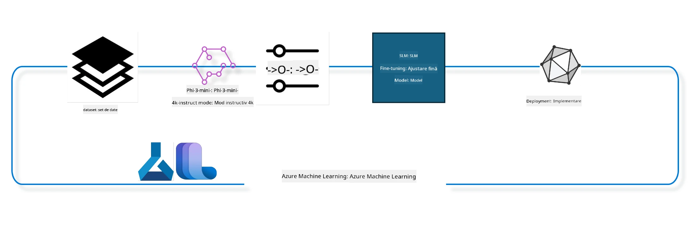

## Cum să utilizați componentele de completare chat din registrul de sistem Azure ML pentru a ajusta un model

În acest exemplu vom realiza ajustarea modelului Phi-3-mini-4k-instruct pentru a completa o conversație între 2 persoane folosind setul de date ultrachat_200k.



Exemplul vă va arăta cum să efectuați ajustarea fină folosind Azure ML SDK și Python și apoi să implementați modelul ajustat la un endpoint online pentru inferență în timp real.

### Date de antrenament

Vom folosi setul de date ultrachat_200k. Acesta este o versiune puternic filtrată a setului de date UltraChat și a fost folosit pentru a antrena Zephyr-7B-β, un model de chat de ultimă generație de 7b.

### Model

Vom folosi modelul Phi-3-mini-4k-instruct pentru a arăta cum utilizatorul poate ajusta un model pentru sarcina de completare chat. Dacă ați deschis acest notebook dintr-o anumită pagină a modelului, amintiți-vă să înlocuiți numele specific al modelului.

### Sarcini

- Alegerea unui model pentru ajustare fină.
- Alegerea și explorarea datelor de antrenament.
- Configurarea jobului de ajustare fină.
- Executarea jobului de ajustare fină.
- Revizuirea măsurătorilor de antrenament și evaluare.
- Înregistrarea modelului ajustat.
- Implementarea modelului ajustat pentru inferență în timp real.
- Curățarea resurselor.

## 1. Configurarea pre-rechizitelor

- Instalarea dependențelor
- Conectare la AzureML Workspace. Aflați mai multe la set up SDK authentication. Înlocuiți <WORKSPACE_NAME>, <RESOURCE_GROUP> și <SUBSCRIPTION_ID> mai jos.
- Conectare la registrul de sistem azureml
- Setarea opțională a unui nume de experiment
- Verificarea sau crearea compute-ului.

> [!NOTE]
> Requisiții: un singur nod GPU poate avea mai multe plăci GPU. De exemplu, într-un nod Standard_NC24rs_v3 sunt 4 GPU-uri NVIDIA V100, în timp ce în Standard_NC12s_v3 sunt 2 GPU-uri NVIDIA V100. Consultați documentația pentru aceste informații. Numărul de plăci GPU per nod este setat în parametrul gpus_per_node de mai jos. Setarea corectă a acestei valori va asigura utilizarea tuturor GPU-urilor din nod. SKU-urile recomandate pentru compute GPU pot fi găsite aici și aici.

### Biblioteci Python

Instalați dependențele rulând celula de mai jos. Acest pas NU este opțional dacă rulați într-un mediu nou.

```bash
pip install azure-ai-ml
pip install azure-identity
pip install datasets==2.9.0
pip install mlflow
pip install azureml-mlflow
```

### Interacțiunea cu Azure ML

1. Acest script Python este folosit pentru a interacționa cu serviciul Azure Machine Learning (Azure ML). Iată o detaliere a ceea ce face:

    - Importează modulele necesare din pachetele azure.ai.ml, azure.identity și azure.ai.ml.entities. De asemenea, importă modulul time.

    - Încearcă să se autentifice folosind DefaultAzureCredential(), care oferă o experiență simplificată de autentificare pentru a începe rapid dezvoltarea aplicațiilor care rulează în cloud Azure. Dacă aceasta eșuează, revine la InteractiveBrowserCredential(), care oferă un prompt interactiv de conectare.

    - Apoi încearcă să creeze o instanță MLClient folosind metoda from_config, care citește configurația din fișierul implicit de configurare (config.json). Dacă aceasta eșuează, creează o instanță MLClient prin furnizarea manuală a subscription_id, resource_group_name și workspace_name.

    - Creează o altă instanță MLClient, de data aceasta pentru registrul Azure ML numit "azureml". Acest registru este unde sunt stocate modelele, pipeline-urile de fine-tuning și mediile.

    - Setează experiment_name la "chat_completion_Phi-3-mini-4k-instruct".

    - Generează un timestamp unic prin conversia timpului curent (în secunde de la epocă, ca număr în virgulă mobilă) la întreg și apoi la șir de caractere. Acest timestamp poate fi folosit pentru crearea de nume și versiuni unice.

    ```python
    # Importă module necesare din Azure ML și Azure Identity
    from azure.ai.ml import MLClient
    from azure.identity import (
        DefaultAzureCredential,
        InteractiveBrowserCredential,
    )
    from azure.ai.ml.entities import AmlCompute
    import time  # Importă modulul time
    
    # Încearcă să te autentifici folosind DefaultAzureCredential
    try:
        credential = DefaultAzureCredential()
        credential.get_token("https://management.azure.com/.default")
    except Exception as ex:  # Dacă DefaultAzureCredential eșuează, folosește InteractiveBrowserCredential
        credential = InteractiveBrowserCredential()
    
    # Încearcă să creezi o instanță MLClient folosind fișierul de configurare implicit
    try:
        workspace_ml_client = MLClient.from_config(credential=credential)
    except:  # Dacă asta eșuează, creează o instanță MLClient oferind manual detaliile
        workspace_ml_client = MLClient(
            credential,
            subscription_id="<SUBSCRIPTION_ID>",
            resource_group_name="<RESOURCE_GROUP>",
            workspace_name="<WORKSPACE_NAME>",
        )
    
    # Creează o altă instanță MLClient pentru registrul Azure ML numit "azureml"
    # Acest registru este locul unde sunt stocate modelele, pipeline-urile de fine-tuning și mediile
    registry_ml_client = MLClient(credential, registry_name="azureml")
    
    # Setează numele experimentului
    experiment_name = "chat_completion_Phi-3-mini-4k-instruct"
    
    # Generează un timestamp unic care poate fi folosit pentru nume și versiuni ce trebuie să fie unice
    timestamp = str(int(time.time()))
    ```

## 2. Alegerea unui model fundament pentru ajustarea fină

1. Phi-3-mini-4k-instruct este un model deschis, ușor, de ultimă generație, cu 3,8 miliarde de parametri, construit pe seturi de date folosite pentru Phi-2. Modelul face parte din familia Phi-3, iar versiunea Mini vine în două variante: 4K și 128K, care reprezintă lungimea contextului (în tokeni) pe care o poate susține. Trebuie să ajustăm modelul pentru scopul nostru specific pentru a-l putea utiliza. Puteți naviga aceste modele în Catalogul de Modele din AzureML Studio, filtrând după sarcina de completare chat. În acest exemplu folosim modelul Phi-3-mini-4k-instruct. Dacă ați deschis acest notebook pentru un alt model, înlocuiți numele și versiunea modelului corespunzător.

> [!NOTE]
> proprietatea id a modelului. Aceasta va fi trecută ca intrare în jobul de ajustare fină. Este disponibilă și ca câmp Asset ID în pagina cu detalii despre model din Catalogul de Modele din AzureML Studio.

2. Acest script Python interacționează cu serviciul Azure Machine Learning (Azure ML). Iată ce face:

    - Setează model_name la "Phi-3-mini-4k-instruct".

    - Folosește metoda get a proprietății models a obiectului registry_ml_client pentru a prelua cea mai recentă versiune a modelului cu numele specificat din registrul Azure ML. Metoda get este apelată cu două argumente: numele modelului și o etichetă care specifică faptul că trebuie să fie preluată cea mai recentă versiune a modelului.

    - Afișează un mesaj în consolă care indică numele, versiunea și id-ul modelului care va fi folosit pentru ajustare fină. Metoda format a șirului de caractere este folosită pentru a introduce numele, versiunea și id-ul modelului în mesaj. Numele, versiunea și id-ul modelului sunt accesate ca proprietăți ale obiectului foundation_model.

    ```python
    # Setează numele modelului
    model_name = "Phi-3-mini-4k-instruct"
    
    # Obține cea mai recentă versiune a modelului din registrul Azure ML
    foundation_model = registry_ml_client.models.get(model_name, label="latest")
    
    # Afișează numele modelului, versiunea și id-ul
    # Aceste informații sunt utile pentru urmărire și depanare
    print(
        "\n\nUsing model name: {0}, version: {1}, id: {2} for fine tuning".format(
            foundation_model.name, foundation_model.version, foundation_model.id
        )
    )
    ```

## 3. Crearea unui compute care va fi folosit cu jobul

Jobul de ajustare fină funcționează DOAR cu compute GPU. Dimensiunea compute-ului depinde de cât de mare este modelul, iar în majoritatea cazurilor devine dificilă identificarea compute-ului potrivit pentru job. În această celulă, ghidăm utilizatorul să selecteze compute-ul adecvat pentru job.

> [!NOTE]
> Compute-urile listate mai jos funcționează cu configurația cea mai optimizată. Orice modificare a configurației poate duce la eroarea Cuda Out Of Memory. În astfel de cazuri, încercați să faceți upgrade la o dimensiune mai mare a compute-ului.

> [!NOTE]
> În timpul selectării compute_cluster_size mai jos, asigurați-vă că compute-ul este disponibil în grupul dumneavoastră de resurse. Dacă un anumit compute nu este disponibil, puteți face o cerere pentru a obține acces la resursele compute.

### Verificarea suportului modelului pentru ajustare fină

1. Acest script Python interacționează cu un model Azure Machine Learning (Azure ML). Iată ce face:

    - Importează modulul ast, care oferă funcții pentru procesarea arborilor sintaxei abstracte Python.

    - Verifică dacă obiectul foundation_model (care reprezintă un model în Azure ML) are o etichetă numită finetune_compute_allow_list. Etichetele în Azure ML sunt perechi cheie-valoare pe care le puteți crea și folosi pentru a filtra și ordona modelele.

    - Dacă eticheta finetune_compute_allow_list este prezentă, folosește funcția ast.literal_eval pentru a analiza în siguranță valoarea etichetei (un șir) într-o listă Python. Această listă este apoi atribuită variabilei computes_allow_list. Afișează un mesaj indicând că trebuie creat un compute din lista respectivă.

    - Dacă eticheta finetune_compute_allow_list nu este prezentă, setează computes_allow_list la None și afișează un mesaj indicând că eticheta nu face parte din etichetele modelului.

    - În rezumat, acest script verifică o etichetă specifică în metadata modelului, convertește valoarea etichetei într-o listă dacă există și oferă feedback utilizatorului în consecință.

    ```python
    # Importă modulul ast, care oferă funcții pentru procesarea arborilor gramaticali abstracti Python
    import ast
    
    # Verifică dacă eticheta 'finetune_compute_allow_list' este prezentă în etichetele modelului
    if "finetune_compute_allow_list" in foundation_model.tags:
        # Dacă eticheta este prezentă, folosește ast.literal_eval pentru a analiza în siguranță valoarea etichetei (un șir) într-o listă Python
        computes_allow_list = ast.literal_eval(
            foundation_model.tags["finetune_compute_allow_list"]
        )  # convertește șirul într-o listă python
        # Afișează un mesaj care indică faptul că un compute trebuie creat din listă
        print(f"Please create a compute from the above list - {computes_allow_list}")
    else:
        # Dacă eticheta nu este prezentă, setează computes_allow_list la None
        computes_allow_list = None
        # Afișează un mesaj care indică faptul că eticheta 'finetune_compute_allow_list' nu face parte din etichetele modelului
        print("`finetune_compute_allow_list` is not part of model tags")
    ```

### Verificarea Compute Instance

1. Acest script Python interacționează cu serviciul Azure Machine Learning (Azure ML) și efectuează mai multe verificări asupra unei instanțe compute. Iată ce face:

    - Încearcă să obțină instanța compute cu numele stocat în compute_cluster din Workspace-ul Azure ML. Dacă starea de provisioning a compute-ului este "failed", aruncă o eroare ValueError.

    - Verifică dacă computes_allow_list nu este None. Dacă nu este, convertește toate dimensiunile compute din listă în litere mici și verifică dacă dimensiunea instanței curente este în listă. Dacă nu este, aruncă o eroare ValueError.

    - Dacă computes_allow_list este None, verifică dacă dimensiunea instanței compute se află într-o listă de dimensiuni VM GPU neacceptate. Dacă da, aruncă o eroare ValueError.

    - Obține o listă cu toate dimensiunile compute disponibile în workspace. Parcurge această listă și pentru fiecare dimensiune verifică dacă numele său corespunde dimensiunii instanței curente de compute. Dacă da, obține numărul de GPU pentru acea dimensiune și setează gpu_count_found la True.

    - Dacă gpu_count_found este True, afișează numărul de GPU-uri din instanța compute. Dacă gpu_count_found este False, aruncă o eroare ValueError.

    - În rezumat, acest script efectuează mai multe verificări asupra unei instanțe compute într-un workspace Azure ML, inclusiv starea ei de provisioning, dimensiunea față de o listă de permisiuni sau restricții și numărul de GPU-uri pe care le are.
    
    ```python
    # Afișează mesajul excepției
    print(e)
    # Aruncă o eroare ValueError dacă dimensiunea de calcul nu este disponibilă în spațiul de lucru
    raise ValueError(
        f"WARNING! Compute size {compute_cluster_size} not available in workspace"
    )
    
    # Recuperează instanța de calcul din spațiul de lucru Azure ML
    compute = workspace_ml_client.compute.get(compute_cluster)
    # Verifică dacă starea de aprovizionare a instanței de calcul este "failed"
    if compute.provisioning_state.lower() == "failed":
        # Aruncă o eroare ValueError dacă starea de aprovizionare este "failed"
        raise ValueError(
            f"Provisioning failed, Compute '{compute_cluster}' is in failed state. "
            f"please try creating a different compute"
        )
    
    # Verifică dacă computes_allow_list nu este None
    if computes_allow_list is not None:
        # Convertește toate dimensiunile de calcul din computes_allow_list în litere mici
        computes_allow_list_lower_case = [x.lower() for x in computes_allow_list]
        # Verifică dacă dimensiunea instanței de calcul este în computes_allow_list_lower_case
        if compute.size.lower() not in computes_allow_list_lower_case:
            # Aruncă o eroare ValueError dacă dimensiunea instanței de calcul nu este în computes_allow_list_lower_case
            raise ValueError(
                f"VM size {compute.size} is not in the allow-listed computes for finetuning"
            )
    else:
        # Definește o listă de dimensiuni VM GPU neacceptate
        unsupported_gpu_vm_list = [
            "standard_nc6",
            "standard_nc12",
            "standard_nc24",
            "standard_nc24r",
        ]
        # Verifică dacă dimensiunea instanței de calcul este în unsupported_gpu_vm_list
        if compute.size.lower() in unsupported_gpu_vm_list:
            # Aruncă o eroare ValueError dacă dimensiunea instanței de calcul este în unsupported_gpu_vm_list
            raise ValueError(
                f"VM size {compute.size} is currently not supported for finetuning"
            )
    
    # Inițializează un flag pentru a verifica dacă numărul de GPU-uri din instanța de calcul a fost găsit
    gpu_count_found = False
    # Recuperează o listă cu toate dimensiunile de calcul disponibile în spațiul de lucru
    workspace_compute_sku_list = workspace_ml_client.compute.list_sizes()
    available_sku_sizes = []
    # Iterează peste lista de dimensiuni de calcul disponibile
    for compute_sku in workspace_compute_sku_list:
        available_sku_sizes.append(compute_sku.name)
        # Verifică dacă numele dimensiunii de calcul corespunde dimensiunii instanței de calcul
        if compute_sku.name.lower() == compute.size.lower():
            # Dacă da, recuperează numărul de GPU-uri pentru acea dimensiune de calcul și setează gpu_count_found pe True
            gpus_per_node = compute_sku.gpus
            gpu_count_found = True
    # Dacă gpu_count_found este True, afișează numărul de GPU-uri din instanța de calcul
    if gpu_count_found:
        print(f"Number of GPU's in compute {compute.size}: {gpus_per_node}")
    else:
        # Dacă gpu_count_found este False, aruncă o eroare ValueError
        raise ValueError(
            f"Number of GPU's in compute {compute.size} not found. Available skus are: {available_sku_sizes}."
            f"This should not happen. Please check the selected compute cluster: {compute_cluster} and try again."
        )
    ```

## 4. Alegerea setului de date pentru ajustarea fină a modelului

1. Folosim setul de date ultrachat_200k. Setul de date are patru diviziuni, potrivite pentru fine-tuning supravegheat (sft).
Generare și clasificare (gen). Numărul de exemple per diviziune este prezentat astfel:

    ```bash
    train_sft test_sft  train_gen  test_gen
    207865  23110  256032  28304
    ```

1. Următoarele câteva celule arată pregătirea de bază a datelor pentru ajustarea fină:

### Vizualizarea unor rânduri de date

Dorim ca acest exemplu să ruleze rapid, așa că salvăm fișierele train_sft, test_sft care conțin 5% din rândurile deja selectate. Aceasta înseamnă că modelul ajustat va avea o acuratețe mai mică, deci nu ar trebui folosit în aplicații reale.
Scriptul download-dataset.py este folosit pentru a descărca setul de date ultrachat_200k și a transforma datele într-un format consumabil de componenta pipeline-ului de fine-tuning. De asemenea, deoarece setul de date este mare, avem aici doar o parte din el.

1. Rularea scriptului de mai jos descarcă numai 5% din date. Aceasta poate fi mărită schimbând parametrul dataset_split_pc la procentajul dorit.

> [!NOTE]
> Unele modele de limbaj folosesc coduri diferite pentru limbă și prin urmare numele coloanelor din setul de date trebuie să reflecte acest lucru.

1. Iată un exemplu de cum ar trebui să arate datele
Setul de date pentru completare chat este stocat în format parquet, fiecare înregistrare folosind următorul schelet:

    - Acesta este un document JSON (JavaScript Object Notation), un format popular de interschimb de date. Nu este cod executabil, ci o modalitate de a stoca și transporta date. Iată o detaliere a structurii:

    - "prompt": Această cheie conține un șir care reprezintă o sarcină sau o întrebare adresată unui asistent AI.

    - "messages": Această cheie conține un array de obiecte. Fiecare obiect reprezintă un mesaj într-o conversație între un utilizator și un asistent AI. Fiecare mesaj are două chei:

    - "content": Cheia conține un șir care reprezintă conținutul mesajului.
    - "role": Cheia conține un șir care reprezintă rolul entității care a trimis mesajul. Poate fi fie "user", fie "assistant".
    - "prompt_id": Cheia conține un șir care reprezintă un identificator unic pentru prompt.

1. În acest document JSON specific, o conversație este reprezentată în care un utilizator cere unui asistent AI să creeze un protagonist pentru o poveste distopică. Asistentul răspunde, iar utilizatorul cere mai multe detalii. Asistentul este de acord să ofere mai multe detalii. Întreaga conversație este asociată cu un id de prompt specific.

    ```python
    {
        // The task or question posed to an AI assistant
        "prompt": "Create a fully-developed protagonist who is challenged to survive within a dystopian society under the rule of a tyrant. ...",
        
        // An array of objects, each representing a message in a conversation between a user and an AI assistant
        "messages":[
            {
                // The content of the user's message
                "content": "Create a fully-developed protagonist who is challenged to survive within a dystopian society under the rule of a tyrant. ...",
                // The role of the entity that sent the message
                "role": "user"
            },
            {
                // The content of the assistant's message
                "content": "Name: Ava\n\n Ava was just 16 years old when the world as she knew it came crashing down. The government had collapsed, leaving behind a chaotic and lawless society. ...",
                // The role of the entity that sent the message
                "role": "assistant"
            },
            {
                // The content of the user's message
                "content": "Wow, Ava's story is so intense and inspiring! Can you provide me with more details.  ...",
                // The role of the entity that sent the message
                "role": "user"
            }, 
            {
                // The content of the assistant's message
                "content": "Certainly! ....",
                // The role of the entity that sent the message
                "role": "assistant"
            }
        ],
        
        // A unique identifier for the prompt
        "prompt_id": "d938b65dfe31f05f80eb8572964c6673eddbd68eff3db6bd234d7f1e3b86c2af"
    }
    ```

### Descărcarea datelor

1. Acest script Python este folosit pentru a descărca un set de date folosind un script auxiliar numit download-dataset.py. Iată ce face:

    - Importează modulul os, care oferă o modalitate portabilă de a folosi funcționalități dependente de sistemul de operare.

    - Folosește funcția os.system pentru a rula scriptul download-dataset.py în shell cu argumente specifice din linia de comandă. Argumentele specifică setul de date de descărcat (HuggingFaceH4/ultrachat_200k), directorul în care să fie descărcat (ultrachat_200k_dataset) și procentajul setului de date pentru divizare (5). Funcția os.system returnează codul de ieșire al comenzii; acest cod este stocat în variabila exit_status.

    - Verifică dacă exit_status este diferit de 0. În sistemele de operare similare Unix, un cod de ieșire 0 indică de obicei că o comandă a reușit, iar orice alt număr indică o eroare. Dacă exit_status nu este 0, aruncă o excepție cu un mesaj care indică că a avut loc o eroare la descărcarea setului de date.

    - În rezumat, acest script rulează o comandă pentru a descărca un set de date folosind un script auxiliar, și aruncă o excepție dacă comanda eșuează.
    
    ```python
    # Importă modulul os, care oferă o modalitate de a utiliza funcționalități dependente de sistemul de operare
    import os
    
    # Utilizează funcția os.system pentru a rula scriptul download-dataset.py în shell cu argumente specifice din linia de comandă
    # Argumentele specifică setul de date de descărcat (HuggingFaceH4/ultrachat_200k), directorul în care să fie descărcat (ultrachat_200k_dataset) și procentajul setului de date pentru împărțire (5)
    # Funcția os.system returnează statusul de ieșire al comenzii executate; acest status este stocat în variabila exit_status
    exit_status = os.system(
        "python ./download-dataset.py --dataset HuggingFaceH4/ultrachat_200k --download_dir ultrachat_200k_dataset --dataset_split_pc 5"
    )
    
    # Verifică dacă exit_status nu este 0
    # În sistemele de operare de tip Unix, un status de ieșire 0 indică de obicei că o comandă a reușit, în timp ce orice alt număr indică o eroare
    # Dacă exit_status nu este 0, ridică o excepție cu un mesaj care indică faptul că a apărut o eroare la descărcarea setului de date
    if exit_status != 0:
        raise Exception("Error downloading dataset")
    ```

### Încărcarea datelor într-un DataFrame
1. Acest script Python încarcă un fișier JSON Lines într-un DataFrame pandas și afișează primele 5 rânduri. Iată o descriere a ceea ce face:

    - Importă biblioteca pandas, care este o bibliotecă puternică pentru manipularea și analiza datelor.

    - Setează lățimea maximă a coloanei pentru opțiunile de afișare ale pandas la 0. Aceasta înseamnă că întregul text al fiecărei coloane va fi afișat fără trunchiere atunci când DataFrame-ul este tipărit.

    - Folosește funcția pd.read_json pentru a încărca fișierul train_sft.jsonl din directorul ultrachat_200k_dataset într-un DataFrame. Argumentul lines=True indică faptul că fișierul este în format JSON Lines, unde fiecare linie este un obiect JSON separat.

    - Folosește metoda head pentru a afișa primele 5 rânduri ale DataFrame-ului. Dacă DataFrame-ul are mai puțin de 5 rânduri, vor fi afișate toate.

    - Pe scurt, acest script încarcă un fișier JSON Lines într-un DataFrame și afișează primele 5 rânduri cu textul complet al coloanelor.
    
    ```python
    # Importă biblioteca pandas, care este o bibliotecă puternică pentru manipularea și analiza datelor
    import pandas as pd
    
    # Setează lățimea maximă a coloanei pentru opțiunile de afișare pandas la 0
    # Aceasta înseamnă că textul complet al fiecărei coloane va fi afișat fără trunchiere atunci când DataFrame-ul este tipărit
    pd.set_option("display.max_colwidth", 0)
    
    # Folosește funcția pd.read_json pentru a încărca fișierul train_sft.jsonl din directorul ultrachat_200k_dataset într-un DataFrame
    # Argumentul lines=True indică faptul că fișierul este în format JSON Lines, unde fiecare linie este un obiect JSON separat
    df = pd.read_json("./ultrachat_200k_dataset/train_sft.jsonl", lines=True)
    
    # Folosește metoda head pentru a afișa primele 5 rânduri ale DataFrame-ului
    # Dacă DataFrame-ul are mai puțin de 5 rânduri, va afișa toate acestea
    df.head()
    ```

## 5. Trimite jobul de fine tuning folosind modelul și datele ca inputuri

Creează jobul care folosește componenta pipeline chat-completion. Află mai multe despre toți parametrii suportați pentru fine tuning.

### Definirea parametrilor de fine tuning

1. Parametrii de fine tuning pot fi grupați în 2 categorii – parametri de antrenament, parametri de optimizare

1. Parametrii de antrenament definesc aspectele legate de antrenament, cum ar fi -

    - Optimizatorul, scheduler-ul de utilizat
    - Metoda metrică pentru optimizarea fine tuning-ului
    - Numărul de pași de antrenament și dimensiunea batch-ului și așa mai departe
    - Parametrii de optimizare ajută la optimizarea memoriei GPU și la folosirea eficientă a resurselor compute.

1. Mai jos sunt câțiva dintre parametrii care fac parte din această categorie. Parametrii de optimizare diferă pentru fiecare model și sunt ambalați împreună cu modelul pentru a gestiona aceste variații.

    - Activarea deepspeed și LoRA
    - Activarea antrenamentului cu precizie mixtă
    - Activarea antrenamentului multi-nod

> [!NOTE]
> Fine tuning-ul supravegheat poate duce la pierderea alinierii sau uitare catastrofală. Recomandăm verificarea acestei probleme și rularea unei etape de aliniere după fine tuning.

### Parametrii pentru fine tuning

1. Acest script Python setează parametrii pentru fine tuning-ul unui model de învățare automată. Iată o descriere a ceea ce face:

    - Setează parametrii impliciți de antrenament, precum numărul de epoci de antrenament, dimensiunile batch-urilor pentru antrenament și evaluare, rata de învățare, și tipul scheduler-ului pentru rata de învățare.

    - Setează parametrii impliciți de optimizare, precum aplicarea Layer-wise Relevance Propagation (LoRa) și DeepSpeed, și stadiul DeepSpeed.

    - Combină parametrii de antrenament și cei de optimizare într-un singur dicționar numit finetune_parameters.

    - Verifică dacă foundation_model are parametri impliciți specifici modelului. Dacă are, afișează un mesaj de avertizare și actualizează dicționarul finetune_parameters cu acești parametri specifici modelului. Funcția ast.literal_eval este folosită pentru a converti parametrii specifici modelului din șir de caractere în dicționar Python.

    - Afișează setul final de parametri pentru fine tuning care vor fi folosiți pentru rulare.

    - Pe scurt, acest script setează și afișează parametrii pentru fine tuning-ul unui model de învățare automată, oferind posibilitatea de a suprascrie parametrii impliciți cu cei specifici modelului.

    ```python
    # Configurează parametrii de antrenament impliciți, cum ar fi numărul de epoci de antrenament, dimensiunile lotului pentru antrenament și evaluare, rata de învățare și tipul planificatorului de rată de învățare
    training_parameters = dict(
        num_train_epochs=3,
        per_device_train_batch_size=1,
        per_device_eval_batch_size=1,
        learning_rate=5e-6,
        lr_scheduler_type="cosine",
    )
    
    # Configurează parametrii de optimizare impliciți, cum ar fi dacă se aplică Layer-wise Relevance Propagation (LoRa) și DeepSpeed, și etapa DeepSpeed
    optimization_parameters = dict(
        apply_lora="true",
        apply_deepspeed="true",
        deepspeed_stage=2,
    )
    
    # Combină parametrii de antrenament și optimizare într-un singur dicționar numit finetune_parameters
    finetune_parameters = {**training_parameters, **optimization_parameters}
    
    # Verifică dacă foundation_model are parametri impliciți specifici modelului
    # Dacă are, afișează un mesaj de avertizare și actualizează dicționarul finetune_parameters cu acești parametri impliciți specifici modelului
    # Funcția ast.literal_eval este folosită pentru a converti implicit parametrii specifici modelului dintr-un șir într-un dicționar Python
    if "model_specific_defaults" in foundation_model.tags:
        print("Warning! Model specific defaults exist. The defaults could be overridden.")
        finetune_parameters.update(
            ast.literal_eval(  # convertește șirul într-un dicționar Python
                foundation_model.tags["model_specific_defaults"]
            )
        )
    
    # Afișează setul final de parametri pentru ajustare fină care vor fi folosiți în execuție
    print(
        f"The following finetune parameters are going to be set for the run: {finetune_parameters}"
    )
    ```

### Pipeline de antrenament

1. Acest script Python definește o funcție pentru a genera un nume de afișare pentru un pipeline de antrenament de învățare automată, apoi apelează această funcție pentru a genera și tipări numele. Iată o descriere a ceea ce face:

1. Funcția get_pipeline_display_name este definită. Această funcție generează un nume de afișare bazat pe diverși parametri legați de pipeline-ul de antrenament.

1. În interiorul funcției, calculează dimensiunea totală a batch-ului prin înmulțirea dimensiunii batch-ului per dispozitiv, numărul de pași de acumulare a gradientului, numărul de GPU-uri per nod și numărul nodurilor folosite pentru fine tuning.

1. Recuperează alți parametri precum tipul scheduler-ului pentru rata de învățare, dacă este aplicat DeepSpeed, stadiul DeepSpeed, dacă este aplicată Layer-wise Relevance Propagation (LoRa), limita pentru numărul de checkpoint-uri ale modelului păstrate și lungimea maximă a secvenței.

1. Construiește un șir de caractere care include toți acești parametri, separați prin cratime. Dacă DeepSpeed sau LoRa este aplicat, șirul include „ds” urmat de stadiul DeepSpeed sau „lora”, respectiv. Dacă nu, include „nods” sau „nolora”, respectiv.

1. Funcția returnează acest șir, care servește drept nume de afișare pentru pipeline-ul de antrenament.

1. După definirea funcției, aceasta este apelată pentru a genera numele de afișare, care este apoi tipărit.

1. Pe scurt, acest script generează un nume de afișare pentru un pipeline de antrenament de învățare automată bazat pe diverși parametri și apoi afișează acest nume.

    ```python
    # Definirea unei funcții pentru a genera un nume de afișare pentru pipeline-ul de antrenament
    def get_pipeline_display_name():
        # Calcularea dimensiunii totale a lotului prin înmulțirea dimensiunii lotului per dispozitiv, a numărului de pași de acumulare a gradientului, a numărului de GPU-uri pe nod și a numărului de noduri folosite pentru fine-tuning
        batch_size = (
            int(finetune_parameters.get("per_device_train_batch_size", 1))
            * int(finetune_parameters.get("gradient_accumulation_steps", 1))
            * int(gpus_per_node)
            * int(finetune_parameters.get("num_nodes_finetune", 1))
        )
        # Obținerea tipului de programator a ratei de învățare
        scheduler = finetune_parameters.get("lr_scheduler_type", "linear")
        # Verificarea dacă DeepSpeed este aplicat
        deepspeed = finetune_parameters.get("apply_deepspeed", "false")
        # Obținerea stadiului DeepSpeed
        ds_stage = finetune_parameters.get("deepspeed_stage", "2")
        # Dacă DeepSpeed este aplicat, se include "ds" urmat de stadiul DeepSpeed în numele de afișare; dacă nu, se include "nods"
        if deepspeed == "true":
            ds_string = f"ds{ds_stage}"
        else:
            ds_string = "nods"
        # Verificarea dacă este aplicată propagarea relevanței pe straturi (Layer-wise Relevance Propagation - LoRa)
        lora = finetune_parameters.get("apply_lora", "false")
        # Dacă LoRa este aplicat, se include "lora" în numele de afișare; dacă nu, se include "nolora"
        if lora == "true":
            lora_string = "lora"
        else:
            lora_string = "nolora"
        # Obținerea limitării asupra numărului de checkpoint-uri ale modelului care trebuie păstrate
        save_limit = finetune_parameters.get("save_total_limit", -1)
        # Obținerea lungimii maxime a secvenței
        seq_len = finetune_parameters.get("max_seq_length", -1)
        # Construirea numelui de afișare prin concatenarea tuturor acestor parametri, separați prin cratime
        return (
            model_name
            + "-"
            + "ultrachat"
            + "-"
            + f"bs{batch_size}"
            + "-"
            + f"{scheduler}"
            + "-"
            + ds_string
            + "-"
            + lora_string
            + f"-save_limit{save_limit}"
            + f"-seqlen{seq_len}"
        )
    
    # Apelarea funcției pentru generarea numelui de afișare
    pipeline_display_name = get_pipeline_display_name()
    # Afișarea numelui de afișare
    print(f"Display name used for the run: {pipeline_display_name}")
    ```

### Configurarea Pipeline-ului

Acest script Python definește și configurează un pipeline de învățare automată folosind Azure Machine Learning SDK. Iată o descriere a ceea ce face:

1. Importează module necesare din Azure AI ML SDK.

1. Preia o componentă pipeline numită "chat_completion_pipeline" din registru.

1. Definește un job pipeline folosind decoratorul `@pipeline` și funcția `create_pipeline`. Numele pipeline-ului este setat la `pipeline_display_name`.

1. În interiorul funcției `create_pipeline`, inițializează componenta preluată de pipeline cu diverși parametri, inclusiv calea către model, clusterele de calcul pentru diferite etape, diviziunile dataset-ului pentru antrenament și testare, numărul de GPU-uri pentru fine tuning și alți parametri de fine tuning.

1. Mapează outputul jobului de fine tuning la outputul jobului de pipeline. Aceasta se face pentru ca modelul fine tuning-uit să poată fi ușor înregistrat, lucru necesar pentru a implementa modelul la un endpoint online sau batch.

1. Creează o instanță a pipeline-ului apelând funcția `create_pipeline`.

1. Setează opțiunea `force_rerun` a pipeline-ului la `True`, ceea ce înseamnă că nu vor fi folosite rezultatele în cache din joburile anterioare.

1. Setează opțiunea `continue_on_step_failure` a pipeline-ului la `False`, ceea ce înseamnă că pipeline-ul se va opri dacă vreun pas eșuează.

1. Pe scurt, acest script definește și configurează un pipeline de învățare automată pentru o sarcină de chat completion folosind Azure Machine Learning SDK.

    ```python
    # Importă modulele necesare din SDK-ul Azure AI ML
    from azure.ai.ml.dsl import pipeline
    from azure.ai.ml import Input
    
    # Preia componenta pipeline denumită "chat_completion_pipeline" din registru
    pipeline_component_func = registry_ml_client.components.get(
        name="chat_completion_pipeline", label="latest"
    )
    
    # Definește jobul pipeline folosind decoratorul @pipeline și funcția create_pipeline
    # Numele pipeline-ului este setat la pipeline_display_name
    @pipeline(name=pipeline_display_name)
    def create_pipeline():
        # Inițializează componenta pipeline preluată cu diverși parametri
        # Aceștia includ calea modelului, clusterele de calcul pentru diferite etape, diviziunile dataset-ului pentru antrenare și testare, numărul de GPU-uri pentru fine-tuning și alți parametri de fine-tuning
        chat_completion_pipeline = pipeline_component_func(
            mlflow_model_path=foundation_model.id,
            compute_model_import=compute_cluster,
            compute_preprocess=compute_cluster,
            compute_finetune=compute_cluster,
            compute_model_evaluation=compute_cluster,
            # Conectează diviziunile dataset-ului la parametri
            train_file_path=Input(
                type="uri_file", path="./ultrachat_200k_dataset/train_sft.jsonl"
            ),
            test_file_path=Input(
                type="uri_file", path="./ultrachat_200k_dataset/test_sft.jsonl"
            ),
            # Setările pentru antrenament
            number_of_gpu_to_use_finetuning=gpus_per_node,  # Setat la numărul de GPU-uri disponibile în clusterul de calcul
            **finetune_parameters
        )
        return {
            # Asociază ieșirea jobului de fine tuning cu ieșirea jobului pipeline
            # Acest lucru se face pentru a putea înregistra cu ușurință modelul optimizat
            # Înregistrarea modelului este necesară pentru a implementa modelul la un endpoint online sau batch
            "trained_model": chat_completion_pipeline.outputs.mlflow_model_folder
        }
    
    # Creează o instanță a pipeline-ului apelând funcția create_pipeline
    pipeline_object = create_pipeline()
    
    # Nu folosi rezultatele memorate în cache din joburile anterioare
    pipeline_object.settings.force_rerun = True
    
    # Setează continuarea după eșecul unui pas la False
    # Aceasta înseamnă că pipeline-ul se va opri dacă orice pas eșuează
    pipeline_object.settings.continue_on_step_failure = False
    ```

### Trimite Jobul

1. Acest script Python trimite un job pipeline de învățare automată la un workspace Azure Machine Learning și apoi așteaptă finalizarea jobului. Iată o descriere a ceea ce face:

    - Apelează metoda create_or_update a obiectului jobs din workspace_ml_client pentru a trimite jobul pipeline. Pipeline-ul de rulat este specificat prin pipeline_object, iar experimentul sub care este rulat jobul este specificat prin experiment_name.

    - Apelează apoi metoda stream a obiectului jobs din workspace_ml_client pentru a aștepta finalizarea jobului pipeline. Jobul de așteptat este specificat prin atributul name al obiectului pipeline_job.

    - Pe scurt, acest script trimite un job pipeline de învățare automată la un workspace Azure Machine Learning și apoi așteaptă finalizarea jobului.

    ```python
    # Trimite jobul pipeline către spațiul de lucru Azure Machine Learning
    # Pipeline-ul care trebuie rulat este specificat de pipeline_object
    # Experimentul sub care se rulează jobul este specificat de experiment_name
    pipeline_job = workspace_ml_client.jobs.create_or_update(
        pipeline_object, experiment_name=experiment_name
    )
    
    # Așteaptă ca jobul pipeline să se finalizeze
    # Jobul pentru care se așteaptă este specificat de atributul name al obiectului pipeline_job
    workspace_ml_client.jobs.stream(pipeline_job.name)
    ```

## 6. Înregistrează modelul fine tuning-uit în workspace

Vom înregistra modelul din outputul jobului de fine tuning. Acest lucru va urmări linia de proveniență între modelul fine tuning-uit și jobul de fine tuning. Jobul de fine tuning, la rândul său, urmărește linia de proveniență către modelul de bază, date și codul de antrenament.

### Înregistrarea modelului ML

1. Acest script Python înregistrează un model de învățare automată antrenat într-un pipeline Azure Machine Learning. Iată o descriere a ceea ce face:

    - Importează module necesare din Azure AI ML SDK.

    - Verifică dacă outputul trained_model este disponibil din jobul pipeline apelând metoda get a obiectului jobs din workspace_ml_client și accesând atributul său outputs.

    - Construiește o cale către modelul antrenat prin formatarea unui șir cu numele jobului pipeline și numele outputului ("trained_model").

    - Defineste un nume pentru modelul fine tuning-uit prin adăugarea sufixului "-ultrachat-200k" la numele original al modelului și înlocuind orice slash-uri cu cratime.

    - Pregătește înregistrarea modelului creând un obiect Model cu diverși parametri, inclusiv calea către model, tipul modelului (model MLflow), numele și versiunea modelului și o descriere a modelului.

    - Înregistrează modelul apelând metoda create_or_update a obiectului models din workspace_ml_client cu obiectul Model ca argument.

    - Tipărește modelul înregistrat.

1. Pe scurt, acest script înregistrează un model de învățare automată antrenat într-un pipeline Azure Machine Learning.
    
    ```python
    # Importați modulele necesare din SDK-ul Azure AI ML
    from azure.ai.ml.entities import Model
    from azure.ai.ml.constants import AssetTypes
    
    # Verificați dacă ieșirea `trained_model` este disponibilă din jobul pipeline-ului
    print("pipeline job outputs: ", workspace_ml_client.jobs.get(pipeline_job.name).outputs)
    
    # Construiți o cale către modelul antrenat formatând un șir cu numele jobului pipeline și numele ieșirii ("trained_model")
    model_path_from_job = "azureml://jobs/{0}/outputs/{1}".format(
        pipeline_job.name, "trained_model"
    )
    
    # Definiți un nume pentru modelul ajustat fin prin adăugarea sufixului "-ultrachat-200k" la numele original al modelului și înlocuind orice slash-uri cu cratime
    finetuned_model_name = model_name + "-ultrachat-200k"
    finetuned_model_name = finetuned_model_name.replace("/", "-")
    
    print("path to register model: ", model_path_from_job)
    
    # Pregătiți înregistrarea modelului creând un obiect Model cu diverși parametri
    # Aceștia includ calea către model, tipul modelului (model MLflow), numele și versiunea modelului, precum și o descriere a modelului
    prepare_to_register_model = Model(
        path=model_path_from_job,
        type=AssetTypes.MLFLOW_MODEL,
        name=finetuned_model_name,
        version=timestamp,  # Folosiți timestamp-ul ca versiune pentru a evita conflictele de versiune
        description=model_name + " fine tuned model for ultrachat 200k chat-completion",
    )
    
    print("prepare to register model: \n", prepare_to_register_model)
    
    # Înregistrați modelul apelând metoda create_or_update a obiectului models din workspace_ml_client cu obiectul Model ca argument
    registered_model = workspace_ml_client.models.create_or_update(
        prepare_to_register_model
    )
    
    # Afișați modelul înregistrat
    print("registered model: \n", registered_model)
    ```

## 7. Deployează modelul fine tuning-uit la un endpoint online

Endpoint-urile online oferă un API REST durabil care poate fi folosit pentru integrarea cu aplicații ce au nevoie să folosească modelul.

### Gestionarea Endpointului

1. Acest script Python creează un endpoint online gestionat în Azure Machine Learning pentru un model înregistrat. Iată o descriere a ceea ce face:

    - Importează module necesare din Azure AI ML SDK.

    - Definește un nume unic pentru endpoint-ul online prin adăugarea unui timestamp la șirul "ultrachat-completion-".

    - Pregătește crearea endpoint-ului online creând un obiect ManagedOnlineEndpoint cu diverși parametri, inclusiv numele endpoint-ului, o descriere a acestuia și modul de autentificare ("key").

    - Creează endpoint-ul online apelând metoda begin_create_or_update a workspace_ml_client cu obiectul ManagedOnlineEndpoint ca argument. Apoi așteaptă finalizarea operației de creare apelând metoda wait.

1. Pe scurt, acest script creează un endpoint online gestionat în Azure Machine Learning pentru un model înregistrat.

    ```python
    # Importă modulele necesare din SDK-ul Azure AI ML
    from azure.ai.ml.entities import (
        ManagedOnlineEndpoint,
        ManagedOnlineDeployment,
        ProbeSettings,
        OnlineRequestSettings,
    )
    
    # Definește un nume unic pentru endpointul online prin adăugarea unui timestamp la șirul "ultrachat-completion-"
    online_endpoint_name = "ultrachat-completion-" + timestamp
    
    # Pregătește crearea endpointului online prin crearea unui obiect ManagedOnlineEndpoint cu diferiți parametri
    # Aceștia includ numele endpointului, o descriere a endpointului și modul de autentificare ("key")
    endpoint = ManagedOnlineEndpoint(
        name=online_endpoint_name,
        description="Online endpoint for "
        + registered_model.name
        + ", fine tuned model for ultrachat-200k-chat-completion",
        auth_mode="key",
    )
    
    # Creează endpointul online prin apelarea metodei begin_create_or_update a workspace_ml_client cu obiectul ManagedOnlineEndpoint ca argument
    # Apoi așteaptă finalizarea operațiunii de creare prin apelarea metodei wait
    workspace_ml_client.begin_create_or_update(endpoint).wait()
    ```

> [!NOTE]
> Poți găsi aici lista SKU-urilor suportate pentru deploy - [Managed online endpoints SKU list](https://learn.microsoft.com/azure/machine-learning/reference-managed-online-endpoints-vm-sku-list)

### Deployarea modelului ML

1. Acest script Python deployează un model de învățare automată înregistrat la un endpoint online gestionat în Azure Machine Learning. Iată o descriere a ceea ce face:

    - Importează modulul ast, care oferă funcții pentru procesarea arborilor gramaticali abstracti Python.

    - Setează tipul instanței pentru deploy la "Standard_NC6s_v3".

    - Verifică dacă tag-ul inference_compute_allow_list este prezent în foundation model. Dacă da, convertește valoarea tag-ului din șir într-o listă Python și o atribuie variabilei inference_computes_allow_list. Dacă nu, setează inference_computes_allow_list la None.

    - Verifică dacă tipul instanței specificat se află în lista permisă. Dacă nu, tipărește un mesaj prin care cere utilizatorului să aleagă un tip de instanță din lista permisă.

    - Pregătește crearea deploy-ului, creând un obiect ManagedOnlineDeployment cu diverși parametri, inclusiv numele deploy-ului, numele endpoint-ului, ID-ul modelului, tipul și numărul de instanțe, setările probei de liveness și setările de request.

    - Creează deploy-ul apelând metoda begin_create_or_update a workspace_ml_client cu obiectul ManagedOnlineDeployment ca argument. Apoi așteaptă finalizarea operației de creare apelând metoda wait.

    - Setează traficul endpoint-ului să direcționeze 100% din trafic către deploy-ul "demo".

    - Actualizează endpoint-ul apelând metoda begin_create_or_update a workspace_ml_client cu obiectul endpoint. Apoi așteaptă finalizarea actualizării apelând metoda result.

1. Pe scurt, acest script deployează un model de învățare automată înregistrat la un endpoint online gestionat în Azure Machine Learning.

    ```python
    # Importă modulul ast, care furnizează funcții pentru procesarea arborilor de gramatică abstractă a sintaxei Python
    import ast
    
    # Setează tipul instanței pentru implementare
    instance_type = "Standard_NC6s_v3"
    
    # Verifică dacă eticheta `inference_compute_allow_list` este prezentă în modelul de bază
    if "inference_compute_allow_list" in foundation_model.tags:
        # Dacă este, convertește valoarea etichetei dintr-un șir într-o listă Python și atribuie-o lui `inference_computes_allow_list`
        inference_computes_allow_list = ast.literal_eval(
            foundation_model.tags["inference_compute_allow_list"]
        )
        print(f"Please create a compute from the above list - {computes_allow_list}")
    else:
        # Dacă nu este, setează `inference_computes_allow_list` la `None`
        inference_computes_allow_list = None
        print("`inference_compute_allow_list` is not part of model tags")
    
    # Verifică dacă tipul instanței specificat se află în lista permisă
    if (
        inference_computes_allow_list is not None
        and instance_type not in inference_computes_allow_list
    ):
        print(
            f"`instance_type` is not in the allow listed compute. Please select a value from {inference_computes_allow_list}"
        )
    
    # Pregătește crearea implementării prin crearea unui obiect `ManagedOnlineDeployment` cu diferiți parametri
    demo_deployment = ManagedOnlineDeployment(
        name="demo",
        endpoint_name=online_endpoint_name,
        model=registered_model.id,
        instance_type=instance_type,
        instance_count=1,
        liveness_probe=ProbeSettings(initial_delay=600),
        request_settings=OnlineRequestSettings(request_timeout_ms=90000),
    )
    
    # Creează implementarea apelând metoda `begin_create_or_update` a `workspace_ml_client` cu obiectul `ManagedOnlineDeployment` ca argument
    # Apoi așteaptă finalizarea operațiunii de creare apelând metoda `wait`
    workspace_ml_client.online_deployments.begin_create_or_update(demo_deployment).wait()
    
    # Setează traficul punctului final să direcționeze 100% din trafic către implementarea "demo"
    endpoint.traffic = {"demo": 100}
    
    # Actualizează punctul final apelând metoda `begin_create_or_update` a `workspace_ml_client` cu obiectul `endpoint` ca argument
    # Apoi așteaptă finalizarea operațiunii de actualizare apelând metoda `result`
    workspace_ml_client.begin_create_or_update(endpoint).result()
    ```

## 8. Testarea endpoint-ului cu date de probă

Vom prelua niște date de probă din dataset-ul de test și le vom trimite către endpoint-ul online pentru inferență. Vom afișa apoi etichetele evaluate împreună cu etichetele de adevăr.

### Citirea rezultatelor

1. Acest script Python citește un fișier JSON Lines într-un DataFrame pandas, ia un eșantion aleator și resetează indexul. Iată o descriere a ceea ce face:

    - Citește fișierul ./ultrachat_200k_dataset/test_gen.jsonl într-un DataFrame pandas. Funcția read_json este folosită cu argumentul lines=True deoarece fișierul este în format JSON Lines, fiecare linie fiind un obiect JSON separat.

    - Ia un eșantion aleatoriu de 1 rând din DataFrame. Funcția sample este folosită cu argumentul n=1 pentru a specifica numărul de rânduri aleatorii de selectat.

    - Resetează indexul DataFrame-ului. Funcția reset_index este folosită cu argumentul drop=True pentru a elimina indexul original și a-l înlocui cu un index nou de valori întregi implicite.

    - Afișează primele 2 rânduri ale DataFrame-ului folosind funcția head cu argumentul 2. Totuși, deoarece DataFrame-ul conține doar un rând după eșantionare, va afișa doar acel rând.

1. Pe scurt, acest script citește un fișier JSON Lines într-un DataFrame pandas, ia un eșantion aleator de 1 rând, resetează indexul și afișează primul rând.
    
    ```python
    # Importă biblioteca pandas
    import pandas as pd
    
    # Citește fișierul JSON Lines './ultrachat_200k_dataset/test_gen.jsonl' într-un DataFrame pandas
    # Argumentul 'lines=True' indică faptul că fișierul este în format JSON Lines, unde fiecare linie este un obiect JSON separat
    test_df = pd.read_json("./ultrachat_200k_dataset/test_gen.jsonl", lines=True)
    
    # Ia un eșantion aleator de 1 rând din DataFrame
    # Argumentul 'n=1' specifică numărul de rânduri aleatoare de selectat
    test_df = test_df.sample(n=1)
    
    # Resetează indexul DataFrame-ului
    # Argumentul 'drop=True' indică faptul că indexul original trebuie eliminat și înlocuit cu un nou index de valori întregi implicite
    # Argumentul 'inplace=True' indică faptul că DataFrame-ul trebuie modificat direct (fără a crea un obiect nou)
    test_df.reset_index(drop=True, inplace=True)
    
    # Afișează primele 2 rânduri ale DataFrame-ului
    # Totuși, deoarece DataFrame-ul conține doar un rând după eșantionare, acesta va afișa doar acel rând singular
    test_df.head(2)
    ```

### Crearea Obiectului JSON
1. Acest script Python creează un obiect JSON cu parametri specifici și îl salvează într-un fișier. Iată o descriere a ceea ce face:

    - Importă modulul json, care oferă funcții pentru a lucra cu date JSON.

    - Creează un dicționar parameters cu chei și valori care reprezintă parametrii pentru un model de învățare automată. Cheile sunt "temperature", "top_p", "do_sample" și "max_new_tokens", iar valorile corespunzătoare sunt 0.6, 0.9, True și 200, respectiv.

    - Creează un alt dicționar test_json cu două chei: "input_data" și "params". Valoarea pentru "input_data" este un alt dicționar cu cheile "input_string" și "parameters". Valoarea pentru "input_string" este o listă care conține primul mesaj din DataFrame-ul test_df. Valoarea pentru "parameters" este dicționarul parameters creat anterior. Valoarea pentru "params" este un dicționar gol.

    - Deschide un fișier numit sample_score.json
    
    ```python
    # Importă modulul json, care oferă funcții pentru a lucra cu date JSON
    import json
    
    # Creează un dicționar `parameters` cu chei și valori care reprezintă parametrii pentru un model de învățare automată
    # Cheile sunt "temperature", "top_p", "do_sample" și "max_new_tokens", iar valorile corespondente sunt 0.6, 0.9, True și 200 respectiv
    parameters = {
        "temperature": 0.6,
        "top_p": 0.9,
        "do_sample": True,
        "max_new_tokens": 200,
    }
    
    # Creează un alt dicționar `test_json` cu două chei: "input_data" și "params"
    # Valoarea pentru "input_data" este un alt dicționar cu cheile "input_string" și "parameters"
    # Valoarea pentru "input_string" este o listă care conține primul mesaj din DataFrame-ul `test_df`
    # Valoarea pentru "parameters" este dicționarul `parameters` creat anterior
    # Valoarea pentru "params" este un dicționar gol
    test_json = {
        "input_data": {
            "input_string": [test_df["messages"][0]],
            "parameters": parameters,
        },
        "params": {},
    }
    
    # Deschide un fișier numit `sample_score.json` în directorul `./ultrachat_200k_dataset` în modul scriere
    with open("./ultrachat_200k_dataset/sample_score.json", "w") as f:
        # Scrie dicționarul `test_json` în fișier în format JSON folosind funcția `json.dump`
        json.dump(test_json, f)
    ```

### Invocarea endpoint-ului

1. Acest script Python invocă un endpoint online în Azure Machine Learning pentru a evalua un fișier JSON. Iată o descriere a ceea ce face:

    - Apelează metoda invoke a proprietății online_endpoints a obiectului workspace_ml_client. Această metodă este folosită pentru a trimite o cerere către un endpoint online și pentru a primi un răspuns.

    - Specifică numele endpoint-ului și al implementării cu argumentele endpoint_name și deployment_name. În acest caz, numele endpoint-ului este stocat în variabila online_endpoint_name, iar numele implementării este "demo".

    - Specifică calea către fișierul JSON care trebuie evaluat cu argumentul request_file. În acest caz, fișierul este ./ultrachat_200k_dataset/sample_score.json.

    - Stochează răspunsul de la endpoint în variabila response.

    - Afișează răspunsul brut.

1. Pe scurt, acest script invocă un endpoint online în Azure Machine Learning pentru a evalua un fișier JSON și afișează răspunsul.

    ```python
    # Invocă endpoint-ul online în Azure Machine Learning pentru a evalua fișierul `sample_score.json`
    # Metoda `invoke` a proprietății `online_endpoints` a obiectului `workspace_ml_client` este folosită pentru a trimite o cerere către un endpoint online și a obține un răspuns
    # Argumentul `endpoint_name` specifică numele endpoint-ului, care este stocat în variabila `online_endpoint_name`
    # Argumentul `deployment_name` specifică numele implementării, care este "demo"
    # Argumentul `request_file` specifică calea către fișierul JSON care trebuie evaluat, care este `./ultrachat_200k_dataset/sample_score.json`
    response = workspace_ml_client.online_endpoints.invoke(
        endpoint_name=online_endpoint_name,
        deployment_name="demo",
        request_file="./ultrachat_200k_dataset/sample_score.json",
    )
    
    # Afișează răspunsul brut de la endpoint
    print("raw response: \n", response, "\n")
    ```

## 9. Ștergerea endpoint-ului online

1. Nu uita să ștergi endpoint-ul online, altfel vei lăsa contorul de facturare activ pentru resursele de calcul folosite de endpoint. Această linie de cod Python șterge un endpoint online în Azure Machine Learning. Iată o descriere a ceea ce face:

    - Apelează metoda begin_delete a proprietății online_endpoints a obiectului workspace_ml_client. Această metodă este folosită pentru a începe ștergerea unui endpoint online.

    - Specifică numele endpoint-ului care trebuie șters cu argumentul name. În acest caz, numele endpoint-ului este stocat în variabila online_endpoint_name.

    - Apelează metoda wait pentru a aștepta finalizarea operațiunii de ștergere. Aceasta este o operațiune blocantă, ceea ce înseamnă că va împiedica scriptul să continue până când ștergerea este finalizată.

    - Pe scurt, această linie de cod pornește ștergerea unui endpoint online în Azure Machine Learning și așteaptă finalizarea operațiunii.

    ```python
    # Șterge punctul final online în Azure Machine Learning
    # Metoda `begin_delete` a proprietății `online_endpoints` a obiectului `workspace_ml_client` este folosită pentru a începe ștergerea unui punct final online
    # Argumentul `name` specifică numele punctului final care urmează să fie șters, care este stocat în variabila `online_endpoint_name`
    # Metoda `wait` este apelată pentru a aștepta finalizarea operațiunii de ștergere. Aceasta este o operațiune blocantă, ceea ce înseamnă că va împiedica scriptul să continue până când ștergerea este terminată
    workspace_ml_client.online_endpoints.begin_delete(name=online_endpoint_name).wait()
    ```

---

<!-- CO-OP TRANSLATOR DISCLAIMER START -->
**Declinare a responsabilității**:
Acest document a fost tradus folosind serviciul de traducere AI [Co-op Translator](https://github.com/Azure/co-op-translator). Deși ne străduim pentru acuratețe, vă rugăm să rețineți că traducerile automate pot conține erori sau inexactități. Documentul original în limba sa nativă trebuie considerat sursa autorizată. Pentru informații critice, se recomandă traducerea profesională realizată de un specialist. Nu ne asumăm răspunderea pentru eventualele neînțelegeri sau interpretări greșite cauzate de utilizarea acestei traduceri.
<!-- CO-OP TRANSLATOR DISCLAIMER END -->