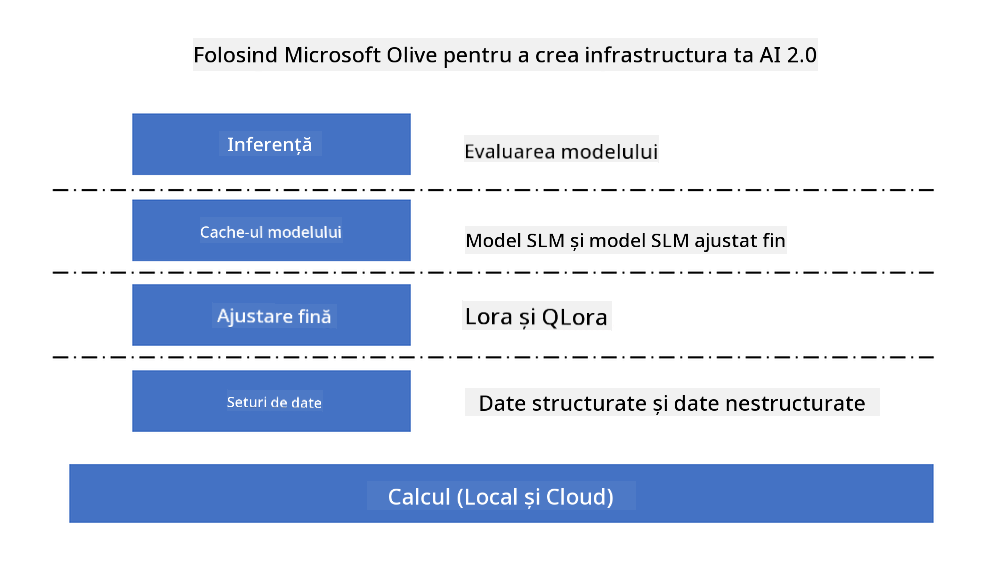
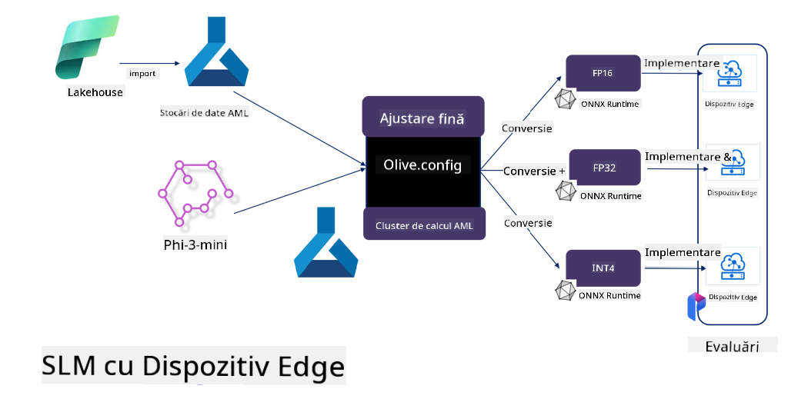

<!--
CO_OP_TRANSLATOR_METADATA:
{
  "original_hash": "5764be88ad2eb4f341e742eb8f14fab1",
  "translation_date": "2025-05-09T20:55:13+00:00",
  "source_file": "md/03.FineTuning/FineTuning_MicrosoftOlive.md",
  "language_code": "ro"
}
-->
# **Fine-tuning Phi-3 cu Microsoft Olive**

[Olive](https://github.com/microsoft/OLive?WT.mc_id=aiml-138114-kinfeylo) este un instrument ușor de utilizat pentru optimizarea modelelor, conștient de hardware, care reunește tehnici de top din industrie pentru compresia, optimizarea și compilarea modelelor.

Este conceput pentru a simplifica procesul de optimizare a modelelor de machine learning, asigurând o utilizare cât mai eficientă a arhitecturilor hardware specifice.

Indiferent dacă lucrezi la aplicații în cloud sau pe dispozitive edge, Olive îți permite să optimizezi modelele fără efort și eficient.

## Caracteristici cheie:
- Olive agregă și automatizează tehnici de optimizare pentru hardware-ul țintă dorit.
- Nicio tehnică de optimizare nu se potrivește tuturor scenariilor, așa că Olive permite extensibilitate, oferind experților din industrie posibilitatea de a integra inovațiile lor în optimizare.

## Reducerea efortului de inginerie:
- Dezvoltatorii trebuie adesea să învețe și să folosească mai multe toolchain-uri specifice vendorilor de hardware pentru a pregăti și optimiza modelele antrenate pentru implementare.
- Olive simplifică această experiență prin automatizarea tehnicilor de optimizare pentru hardware-ul dorit.

## Soluție de optimizare E2E gata de utilizare:

Prin combinarea și reglarea tehnicilor integrate, Olive oferă o soluție unificată pentru optimizarea de la un capăt la altul.
Ia în considerare constrângeri precum acuratețea și latența în timpul optimizării modelelor.

## Utilizarea Microsoft Olive pentru fine-tuning

Microsoft Olive este un instrument open source foarte ușor de folosit pentru optimizarea modelelor, care acoperă atât fine-tuning, cât și referințe în domeniul inteligenței artificiale generative. Necesită doar o configurare simplă, iar combinat cu utilizarea modelelor mici open source și a mediilor de runtime aferente (AzureML / GPU local, CPU, DirectML), poți realiza fine-tuning-ul sau referința modelului prin optimizare automată și găsi cel mai bun model pentru implementare în cloud sau pe dispozitive edge. Permite companiilor să-și construiască propriile modele verticale pe infrastructură locală și în cloud.



## Fine-tuning Phi-3 cu Microsoft Olive



## Exemplu de cod și demonstrație Phi-3 Olive
În acest exemplu vei folosi Olive pentru:

- Fine-tuning unui adaptor LoRA pentru a clasifica fraze în Sad, Joy, Fear, Surprise.
- Combinarea greutăților adaptorului în modelul de bază.
- Optimizarea și cuantizarea modelului în int4.

[Sample Code](../../code/03.Finetuning/olive-ort-example/README.md)

### Instalarea Microsoft Olive

Instalarea Microsoft Olive este foarte simplă și poate fi realizată pentru CPU, GPU, DirectML și Azure ML

```bash
pip install olive-ai
```

Dacă dorești să rulezi un model ONNX pe CPU, poți folosi

```bash
pip install olive-ai[cpu]
```

Dacă vrei să rulezi un model ONNX pe GPU, poți folosi

```python
pip install olive-ai[gpu]
```

Dacă dorești să folosești Azure ML, folosește

```python
pip install git+https://github.com/microsoft/Olive#egg=olive-ai[azureml]
```

**Notă**  
Cerințe OS: Ubuntu 20.04 / 22.04

### **Config.json pentru Microsoft Olive**

După instalare, poți configura setări specifice fiecărui model prin fișierul Config, inclusiv date, calcul, antrenament, implementare și generare de modele.

**1. Date**

Pe Microsoft Olive, antrenamentul pe date locale și în cloud este suportat și poate fi configurat în setări.

*Setări pentru date locale*

Poți configura simplu setul de date care trebuie antrenat pentru fine-tuning, de obicei în format json, adaptându-l cu un șablon de date. Acest lucru trebuie ajustat în funcție de cerințele modelului (de exemplu, adaptat la formatul cerut de Microsoft Phi-3-mini. Dacă ai alte modele, consultă formatele necesare de fine-tuning pentru acestea).

```json

    "data_configs": [
        {
            "name": "dataset_default_train",
            "type": "HuggingfaceContainer",
            "load_dataset_config": {
                "params": {
                    "data_name": "json", 
                    "data_files":"dataset/dataset-classification.json",
                    "split": "train"
                }
            },
            "pre_process_data_config": {
                "params": {
                    "dataset_type": "corpus",
                    "text_cols": [
                            "phrase",
                            "tone"
                    ],
                    "text_template": "### Text: {phrase}\n### The tone is:\n{tone}",
                    "corpus_strategy": "join",
                    "source_max_len": 2048,
                    "pad_to_max_len": false,
                    "use_attention_mask": false
                }
            }
        }
    ],
```

**Setări pentru surse de date în cloud**

Prin conectarea datastore-ului Azure AI Studio/Azure Machine Learning Service pentru acces la datele din cloud, poți alege să imporți diferite surse de date în Azure AI Studio/Azure Machine Learning Service prin Microsoft Fabric și Azure Data, ca suport pentru fine-tuning.

```json

    "data_configs": [
        {
            "name": "dataset_default_train",
            "type": "HuggingfaceContainer",
            "load_dataset_config": {
                "params": {
                    "data_name": "json", 
                    "data_files": {
                        "type": "azureml_datastore",
                        "config": {
                            "azureml_client": {
                                "subscription_id": "Your Azure Subscrition ID",
                                "resource_group": "Your Azure Resource Group",
                                "workspace_name": "Your Azure ML Workspaces name"
                            },
                            "datastore_name": "workspaceblobstore",
                            "relative_path": "Your train_data.json Azure ML Location"
                        }
                    },
                    "split": "train"
                }
            },
            "pre_process_data_config": {
                "params": {
                    "dataset_type": "corpus",
                    "text_cols": [
                            "Question",
                            "Best Answer"
                    ],
                    "text_template": "<|user|>\n{Question}<|end|>\n<|assistant|>\n{Best Answer}\n<|end|>",
                    "corpus_strategy": "join",
                    "source_max_len": 2048,
                    "pad_to_max_len": false,
                    "use_attention_mask": false
                }
            }
        }
    ],
    
```

**2. Configurarea calculului**

Dacă dorești să folosești resurse locale, poți utiliza direct datele locale. Pentru utilizarea resurselor Azure AI Studio / Azure Machine Learning Service, trebuie să configurezi parametrii Azure relevanți, numele resurselor de calcul etc.

```json

    "systems": {
        "aml": {
            "type": "AzureML",
            "config": {
                "accelerators": ["gpu"],
                "hf_token": true,
                "aml_compute": "Your Azure AI Studio / Azure Machine Learning Service Compute Name",
                "aml_docker_config": {
                    "base_image": "Your Azure AI Studio / Azure Machine Learning Service docker",
                    "conda_file_path": "conda.yaml"
                }
            }
        },
        "azure_arc": {
            "type": "AzureML",
            "config": {
                "accelerators": ["gpu"],
                "aml_compute": "Your Azure AI Studio / Azure Machine Learning Service Compute Name",
                "aml_docker_config": {
                    "base_image": "Your Azure AI Studio / Azure Machine Learning Service docker",
                    "conda_file_path": "conda.yaml"
                }
            }
        }
    },
```

***Notă***

Deoarece rulează printr-un container pe Azure AI Studio/Azure Machine Learning Service, mediul necesar trebuie configurat. Aceasta se face în fișierul conda.yaml.

```yaml

name: project_environment
channels:
  - defaults
dependencies:
  - python=3.8.13
  - pip=22.3.1
  - pip:
      - einops
      - accelerate
      - azure-keyvault-secrets
      - azure-identity
      - bitsandbytes
      - datasets
      - huggingface_hub
      - peft
      - scipy
      - sentencepiece
      - torch>=2.2.0
      - transformers
      - git+https://github.com/microsoft/Olive@jiapli/mlflow_loading_fix#egg=olive-ai[gpu]
      - --extra-index-url https://aiinfra.pkgs.visualstudio.com/PublicPackages/_packaging/ORT-Nightly/pypi/simple/ 
      - ort-nightly-gpu==1.18.0.dev20240307004
      - --extra-index-url https://aiinfra.pkgs.visualstudio.com/PublicPackages/_packaging/onnxruntime-genai/pypi/simple/
      - onnxruntime-genai-cuda

    

```

**3. Alege SLM-ul tău**

Poți folosi modelul direct de pe Hugging Face sau îl poți combina cu Catalogul de modele din Azure AI Studio / Azure Machine Learning pentru a selecta modelul dorit. În exemplul de cod de mai jos vom folosi Microsoft Phi-3-mini.

Dacă ai modelul local, poți folosi această metodă

```json

    "input_model":{
        "type": "PyTorchModel",
        "config": {
            "hf_config": {
                "model_name": "model-cache/microsoft/phi-3-mini",
                "task": "text-generation",
                "model_loading_args": {
                    "trust_remote_code": true
                }
            }
        }
    },
```

Dacă vrei să folosești un model din Azure AI Studio / Azure Machine Learning Service, poți folosi această metodă

```json

    "input_model":{
        "type": "PyTorchModel",
        "config": {
            "model_path": {
                "type": "azureml_registry_model",
                "config": {
                    "name": "microsoft/Phi-3-mini-4k-instruct",
                    "registry_name": "azureml-msr",
                    "version": "11"
                }
            },
             "model_file_format": "PyTorch.MLflow",
             "hf_config": {
                "model_name": "microsoft/Phi-3-mini-4k-instruct",
                "task": "text-generation",
                "from_pretrained_args": {
                    "trust_remote_code": true
                }
            }
        }
    },
```

**Notă:**  
Trebuie să integrăm cu Azure AI Studio / Azure Machine Learning Service, deci la configurarea modelului ține cont de versiune și denumiri aferente.

Toate modelele din Azure trebuie setate ca PyTorch.MLflow.

Trebuie să ai un cont Hugging Face și să legi cheia de valoarea Key din Azure AI Studio / Azure Machine Learning.

**4. Algoritm**

Microsoft Olive încorporează foarte bine algoritmii de fine-tuning Lora și QLora. Tot ce trebuie să configurezi sunt câțiva parametri relevanți. Aici iau QLora ca exemplu.

```json
        "lora": {
            "type": "LoRA",
            "config": {
                "target_modules": [
                    "o_proj",
                    "qkv_proj"
                ],
                "double_quant": true,
                "lora_r": 64,
                "lora_alpha": 64,
                "lora_dropout": 0.1,
                "train_data_config": "dataset_default_train",
                "eval_dataset_size": 0.3,
                "training_args": {
                    "seed": 0,
                    "data_seed": 42,
                    "per_device_train_batch_size": 1,
                    "per_device_eval_batch_size": 1,
                    "gradient_accumulation_steps": 4,
                    "gradient_checkpointing": false,
                    "learning_rate": 0.0001,
                    "num_train_epochs": 3,
                    "max_steps": 10,
                    "logging_steps": 10,
                    "evaluation_strategy": "steps",
                    "eval_steps": 187,
                    "group_by_length": true,
                    "adam_beta2": 0.999,
                    "max_grad_norm": 0.3
                }
            }
        },
```

Dacă dorești conversie prin cuantizare, ramura principală Microsoft Olive suportă deja metoda onnxruntime-genai. Poți seta conform nevoilor:

1. combină greutățile adaptorului în modelul de bază  
2. convertește modelul în model onnx cu precizia necesară folosind ModelBuilder

de exemplu conversia în INT4 cuantizat

```json

        "merge_adapter_weights": {
            "type": "MergeAdapterWeights"
        },
        "builder": {
            "type": "ModelBuilder",
            "config": {
                "precision": "int4"
            }
        }
```

**Notă**  
- Dacă folosești QLoRA, conversia prin cuantizare ONNXRuntime-genai nu este suportată momentan.  
- Este important să menționez că poți configura pașii de mai sus în funcție de nevoile tale. Nu este obligatoriu să configurezi toate aceste etape complet. În funcție de cerințe, poți folosi direct pașii algoritmului fără fine-tuning. În final, trebuie să configurezi motoarele relevante.

```json

    "engine": {
        "log_severity_level": 0,
        "host": "aml",
        "target": "aml",
        "search_strategy": false,
        "execution_providers": ["CUDAExecutionProvider"],
        "cache_dir": "../model-cache/models/phi3-finetuned/cache",
        "output_dir" : "../model-cache/models/phi3-finetuned"
    }
```

**5. Finalizarea fine-tuning-ului**

Din linia de comandă, execută în directorul unde se află olive-config.json

```bash
olive run --config olive-config.json  
```

**Declinare a responsabilității**:  
Acest document a fost tradus folosind serviciul de traducere automată AI [Co-op Translator](https://github.com/Azure/co-op-translator). Deși ne străduim pentru acuratețe, vă rugăm să țineți cont că traducerile automate pot conține erori sau inexactități. Documentul original în limba sa nativă trebuie considerat sursa autoritară. Pentru informații critice, se recomandă traducerea profesională realizată de un specialist uman. Nu ne asumăm răspunderea pentru eventualele neînțelegeri sau interpretări greșite care pot apărea în urma utilizării acestei traduceri.