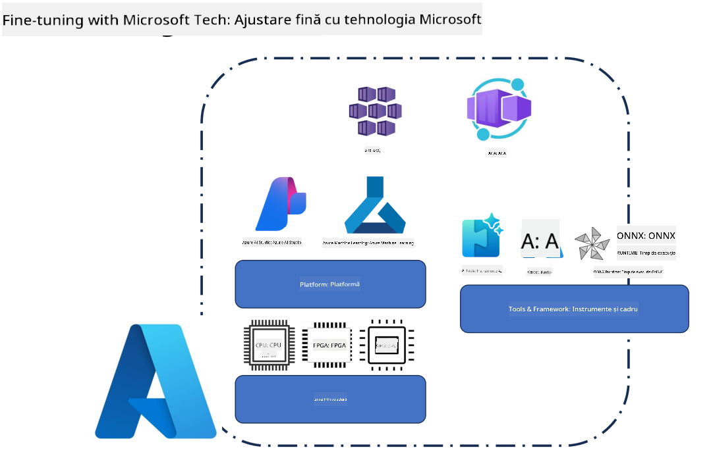
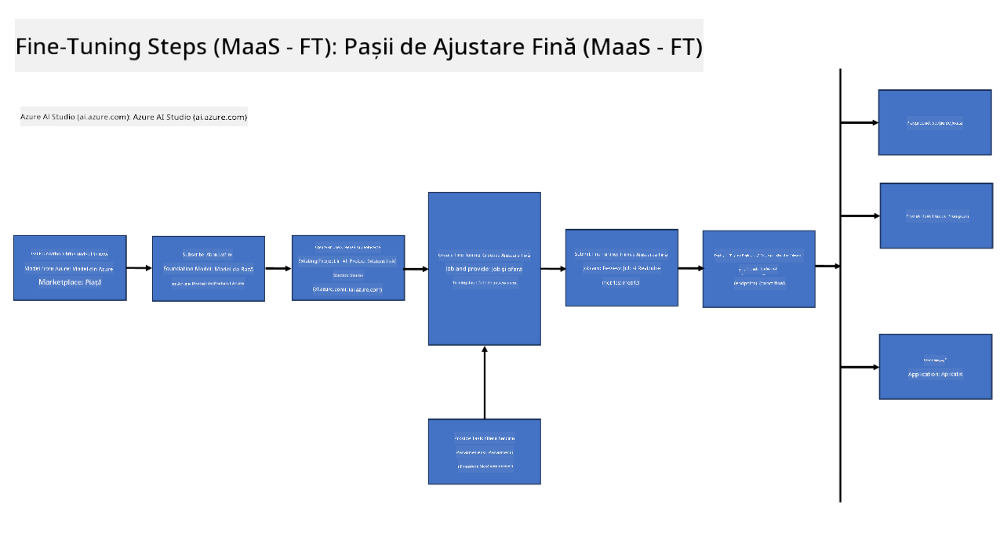
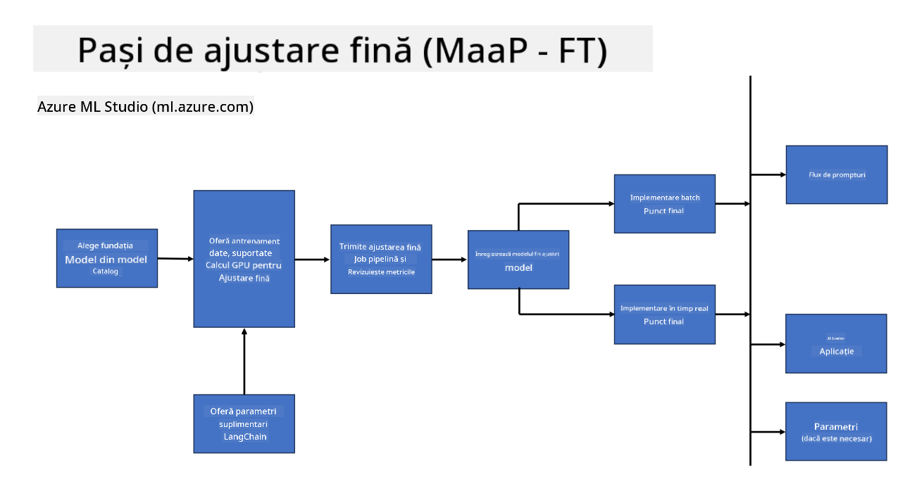
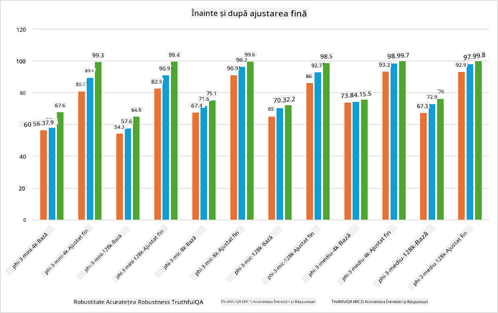

<!--
CO_OP_TRANSLATOR_METADATA:
{
  "original_hash": "cb5648935f63edc17e95ce38f23adc32",
  "translation_date": "2025-05-09T21:57:49+00:00",
  "source_file": "md/03.FineTuning/FineTuning_Scenarios.md",
  "language_code": "ro"
}
-->
## Scenarii de Fine Tuning

**Platformă** Aceasta include diverse tehnologii precum Azure AI Foundry, Azure Machine Learning, AI Tools, Kaito și ONNX Runtime.

**Infrastructură** Aceasta include CPU și FPGA, esențiale pentru procesul de fine-tuning. Permiteți-mi să vă arăt pictogramele pentru fiecare dintre aceste tehnologii.

**Instrumente și Framework** Aceasta include ONNX Runtime și ONNX Runtime. Permiteți-mi să vă arăt pictogramele pentru fiecare dintre aceste tehnologii.  
[Insert icons for ONNX Runtime and ONNX Runtime]

Procesul de fine-tuning cu tehnologiile Microsoft implică diverse componente și instrumente. Prin înțelegerea și utilizarea acestor tehnologii, putem ajusta eficient aplicațiile noastre și crea soluții mai bune.

## Model ca Serviciu

Ajustați modelul folosind fine-tuning găzduit, fără a fi nevoie să creați și să gestionați resurse de calcul.

Fine-tuning fără server este disponibil pentru modelele Phi-3-mini și Phi-3-medium, permițând dezvoltatorilor să personalizeze rapid și ușor modelele pentru scenarii cloud și edge, fără a trebui să se ocupe de resursele de calcul. De asemenea, am anunțat că Phi-3-small este acum disponibil prin oferta noastră Models-as-a-Service, astfel încât dezvoltatorii să poată începe rapid și ușor dezvoltarea AI fără să gestioneze infrastructura de bază.

## Model ca Platformă

Utilizatorii își gestionează propriile resurse de calcul pentru a-și ajusta modelele.

[Fine Tuning Sample](https://github.com/Azure/azureml-examples/blob/main/sdk/python/foundation-models/system/finetune/chat-completion/chat-completion.ipynb)

## Scenarii de Fine Tuning

| | | | | | | |
|-|-|-|-|-|-|-|
|Scenariu|LoRA|QLoRA|PEFT|DeepSpeed|ZeRO|DORA|
|Adaptarea LLM-urilor pre-antrenate la sarcini sau domenii specifice|Da|Da|Da|Da|Da|Da|
|Fine-tuning pentru sarcini NLP precum clasificarea textului, recunoașterea entităților numite și traducerea automată|Da|Da|Da|Da|Da|Da|
|Fine-tuning pentru sarcini de QA|Da|Da|Da|Da|Da|Da|
|Fine-tuning pentru generarea de răspunsuri umane în chatbot-uri|Da|Da|Da|Da|Da|Da|
|Fine-tuning pentru generarea de muzică, artă sau alte forme de creativitate|Da|Da|Da|Da|Da|Da|
|Reducerea costurilor computaționale și financiare|Da|Da|Nu|Da|Da|Nu|
|Reducerea utilizării memoriei|Nu|Da|Nu|Da|Da|Da|
|Folosirea unui număr redus de parametri pentru fine-tuning eficient|Nu|Da|Da|Nu|Nu|Da|
|Formă eficientă din punct de vedere al memoriei de paralelism de date care oferă acces la memoria GPU agregată a tuturor dispozitivelor GPU disponibile|Nu|Nu|Nu|Da|Da|Da|

## Exemple de Performanță Fine Tuning

**Declinare a responsabilității**:  
Acest document a fost tradus folosind serviciul de traducere automată AI [Co-op Translator](https://github.com/Azure/co-op-translator). Deși ne străduim pentru acuratețe, vă rugăm să rețineți că traducerile automate pot conține erori sau inexactități. Documentul original în limba sa nativă trebuie considerat sursa autoritară. Pentru informații critice, se recomandă traducerea profesională realizată de un traducător uman. Nu ne asumăm răspunderea pentru eventualele neînțelegeri sau interpretări greșite rezultate din utilizarea acestei traduceri.