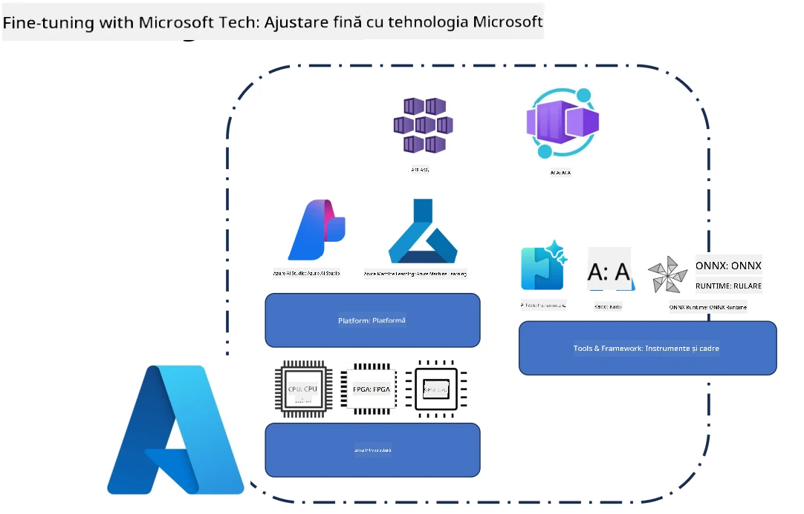
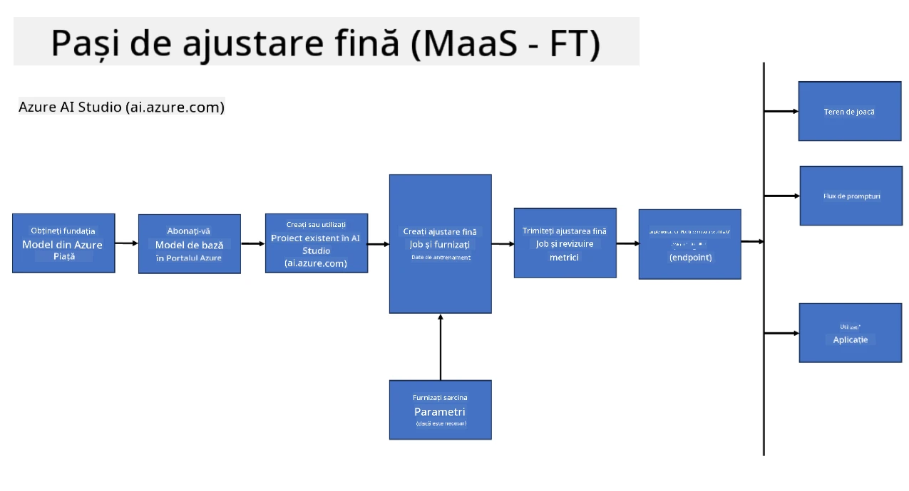
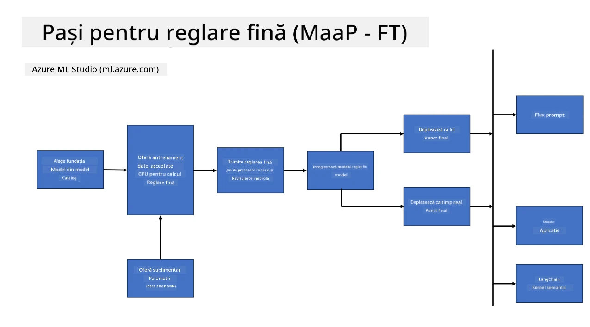
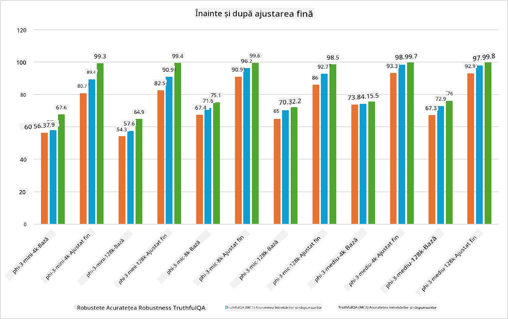

## Scenarii de Fine Tuning

Această secțiune oferă o prezentare generală a scenariilor de fine-tuning în mediile Microsoft Foundry și Azure, incluzând modele de implementare, straturi de infrastructură și tehnici de optimizare des utilizate.

**Platformă**  
Aceasta include servicii gestionate precum Microsoft Foundry (fost Azure AI Foundry) și Azure Machine Learning, care oferă gestionarea modelelor, orchestrare, urmărirea experimentelor și fluxuri de lucru pentru implementare.

**Infrastructură**  
Fine-tuning-ul necesită resurse de calcul scalabile. În mediile Azure, aceasta include de obicei mașini virtuale bazate pe GPU și resurse CPU pentru sarcini ușoare, alături de stocare scalabilă pentru seturi de date și puncte de control.

**Instrumente & Cadre**  
Fluxurile de lucru pentru fine-tuning se bazează adesea pe cadre și biblioteci de optimizare precum Hugging Face Transformers, DeepSpeed și PEFT (Parameter-Efficient Fine-Tuning).

Procesul de fine-tuning cu tehnologii Microsoft acoperă servicii de platformă, infrastructură de calcul și cadre de antrenament. Prin înțelegerea modului în care aceste componente lucrează împreună, dezvoltatorii pot adapta eficient modelele fundamentale la sarcini specifice și scenarii de producție.

## Model ca Serviciu

Realizați fine-tuning modelului utilizând fine-tuning găzduit, fără a fi necesar să creați și să gestionați resurse de calcul.

Fine-tuning-ul serverless este acum disponibil pentru familiile de modele Phi-3, Phi-3.5 și Phi-4, permițând dezvoltatorilor să personalizeze rapid și ușor modelele pentru scenarii cloud și edge, fără a trebui să se ocupe de organizarea resurselor de calcul.

## Model ca Platformă

Utilizatorii își gestionează propriile resurse de calcul pentru a realiza fine-tuning modelelor lor.

[Exemplu Fine Tuning](https://github.com/Azure/azureml-examples/blob/main/sdk/python/foundation-models/system/finetune/chat-completion/chat-completion.ipynb)

## Comparație a Tehnicilor de Fine-Tuning

|Scenariu|LoRA|QLoRA|PEFT|DeepSpeed|ZeRO|DoRA|
|---|---|---|---|---|---|---|
|Adaptarea LLM-urilor pre-antrenate la sarcini sau domenii specifice|Da|Da|Da|Da|Da|Da|
|Fine-tuning pentru sarcini NLP precum clasificarea textului, recunoașterea entităților numite și traducerea automată|Da|Da|Da|Da|Da|Da|
|Fine-tuning pentru sarcini de QA|Da|Da|Da|Da|Da|Da|
|Fine-tuning pentru generarea de răspunsuri asemănătoare celor umane în chatbots|Da|Da|Da|Da|Da|Da|
|Fine-tuning pentru generarea de muzică, artă sau alte forme de creativitate|Da|Da|Da|Da|Da|Da|
|Reducerea costurilor computaționale și financiare|Da|Da|Da|Da|Da|Da|
|Reducerea utilizării memoriei|Da|Da|Da|Da|Da|Da|
|Utilizarea unui număr redus de parametri pentru fine-tuning eficient|Da|Da|Da|Nu|Nu|Da|
|Formă eficientă în memorie de paralelism al datelor care oferă acces la memoria GPU agregată a tuturor dispozitivelor GPU disponibile|Nu|Nu|Nu|Da|Da|Nu|

> [!NOTE]
> LoRA, QLoRA, PEFT și DoRA sunt metode eficiente din punct de vedere al parametrilor pentru fine-tuning, în timp ce DeepSpeed și ZeRO se concentrează pe antrenament distribuit și optimizarea memoriei.

## Exemple de Performanță în Fine Tuning

---

<!-- CO-OP TRANSLATOR DISCLAIMER START -->
**Declinare a responsabilității**:  
Acest document a fost tradus folosind serviciul de traducere AI [Co-op Translator](https://github.com/Azure/co-op-translator). Deși ne străduim pentru acuratețe, vă rugăm să rețineți că traducerile automate pot conține erori sau inexactități. Documentul original în limba sa nativă trebuie considerat sursa autorizată. Pentru informații critice, se recomandă traducerea profesională realizată de un specialist uman. Nu ne asumăm răspunderea pentru orice neînțelegeri sau interpretări greșite care pot apărea în urma utilizării acestei traduceri.
<!-- CO-OP TRANSLATOR DISCLAIMER END -->