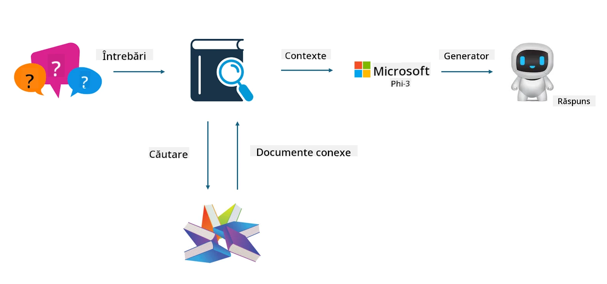

## Finetuning vs RAG

## Retrieval Augmented Generation

RAG este o combinație între recuperarea datelor și generarea de text. Datele structurate și nestructurate ale companiei sunt stocate într-o bază de date vectorială. Când se caută conținut relevant, se găsesc rezumatele și conținutul relevante pentru a forma un context, iar capacitatea de completare a textului a LLM/SLM este folosită pentru a genera conținut.

## Procesul RAG

## Fine-tuning
Fine-tuning-ul se bazează pe îmbunătățirea unui anumit model. Nu este necesar să pornești de la algoritmul modelului, dar datele trebuie acumulate continuu. Dacă dorești o terminologie și o exprimare lingvistică mai precisă în aplicațiile din industrie, fine-tuning-ul este alegerea mai bună. Însă, dacă datele tale se schimbă frecvent, fine-tuning-ul poate deveni complicat.

## Cum să alegi
Dacă răspunsul nostru necesită introducerea de date externe, RAG este cea mai bună opțiune.

Dacă ai nevoie să oferi cunoștințe stabile și precise din industrie, fine-tuning-ul va fi o alegere bună. RAG prioritizează extragerea conținutului relevant, dar s-ar putea să nu surprindă întotdeauna nuanțele specializate.

Fine-tuning-ul necesită un set de date de înaltă calitate, iar dacă este vorba doar de un volum mic de date, diferența nu va fi semnificativă. RAG este mai flexibil.  
Fine-tuning-ul este o cutie neagră, o metafizică, și este dificil să înțelegi mecanismul intern. Dar RAG face mai ușoară identificarea sursei datelor, permițând astfel ajustarea eficientă a halucinațiilor sau erorilor de conținut și oferind o transparență mai bună.

**Declinare de responsabilitate**:  
Acest document a fost tradus folosind serviciul de traducere AI [Co-op Translator](https://github.com/Azure/co-op-translator). Deși ne străduim pentru acuratețe, vă rugăm să rețineți că traducerile automate pot conține erori sau inexactități. Documentul original în limba sa nativă trebuie considerat sursa autorizată. Pentru informații critice, se recomandă traducerea profesională realizată de un specialist uman. Nu ne asumăm răspunderea pentru eventualele neînțelegeri sau interpretări greșite rezultate din utilizarea acestei traduceri.