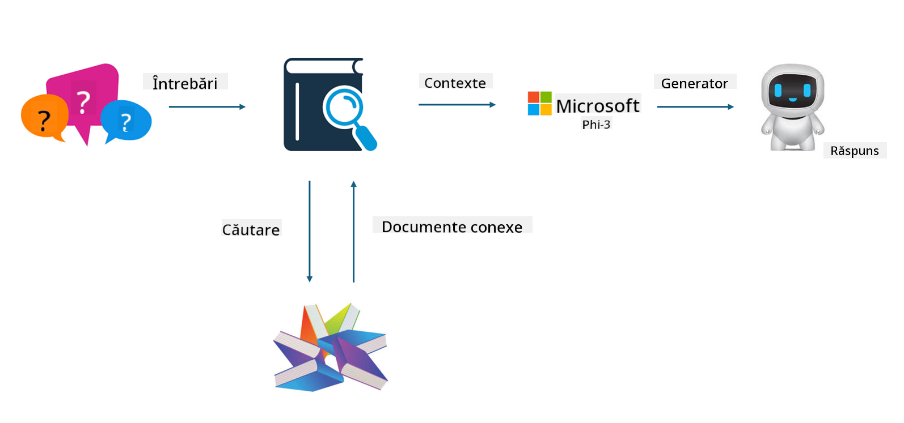

<!--
CO_OP_TRANSLATOR_METADATA:
{
  "original_hash": "e4e010400c2918557b36bb932a14004c",
  "translation_date": "2025-05-09T22:17:17+00:00",
  "source_file": "md/03.FineTuning/FineTuning_vs_RAG.md",
  "language_code": "ro"
}
-->
## Finetuning vs RAG

## Retrieval Augmented Generation

RAG este o combinație între recuperarea datelor și generarea de text. Datele structurate și nestructurate ale companiei sunt stocate în baza de date vectorială. Când se caută conținut relevant, se găsește un rezumat și conținut relevant pentru a forma un context, iar capacitatea de completare a textului a LLM/SLM este combinată pentru a genera conținut.

## Procesul RAG

## Fine-tuning
Fine-tuning se bazează pe îmbunătățirea unui anumit model. Nu este nevoie să pornești de la algoritmul modelului, dar datele trebuie acumulate continuu. Dacă dorești o terminologie și o exprimare mai precisă în aplicațiile din industrie, fine-tuning este alegerea potrivită. Însă dacă datele se schimbă frecvent, fine-tuning poate deveni complicat.

## Cum să alegi
Dacă răspunsul nostru necesită introducerea de date externe, RAG este cea mai bună alegere.

Dacă ai nevoie să livrezi cunoștințe stabile și precise din industrie, fine-tuning va fi o opțiune bună. RAG prioritizează extragerea conținutului relevant, dar poate să nu surprindă întotdeauna nuanțele specializate.

Fine-tuning necesită un set de date de înaltă calitate, iar dacă datele sunt într-un interval mic, diferența nu va fi semnificativă. RAG este mai flexibil.  
Fine-tuning este o cutie neagră, un fel de metafizică, și este dificil de înțeles mecanismul intern. Dar RAG face mai ușor să identifici sursa datelor, permițând astfel ajustarea eficientă a halucinațiilor sau erorilor de conținut și oferind o transparență mai bună.

**Declinare a responsabilității**:  
Acest document a fost tradus folosind serviciul de traducere AI [Co-op Translator](https://github.com/Azure/co-op-translator). Deși ne străduim pentru acuratețe, vă rugăm să rețineți că traducerile automate pot conține erori sau inexactități. Documentul original în limba sa nativă trebuie considerat sursa autorizată. Pentru informații critice, se recomandă traducerea profesională realizată de un specialist uman. Nu ne asumăm responsabilitatea pentru eventualele neînțelegeri sau interpretări greșite care pot rezulta din utilizarea acestei traduceri.