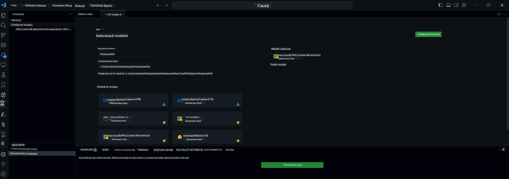

## Bine ați venit la AI Toolkit pentru VS Code

[AI Toolkit pentru VS Code](https://github.com/microsoft/vscode-ai-toolkit/tree/main) reunește diverse modele din Azure AI Studio Catalog și alte cataloage precum Hugging Face. Toolkit-ul simplifică sarcinile comune de dezvoltare pentru crearea aplicațiilor AI cu instrumente și modele generative AI prin:
- Începeți cu descoperirea modelelor și zona de testare.
- Ajustarea fină a modelelor și inferența folosind resurse locale de calcul.
- Ajustarea fină și inferența la distanță folosind resurse Azure.

[Instalează AI Toolkit pentru VSCode](https://marketplace.visualstudio.com/items?itemName=ms-windows-ai-studio.windows-ai-studio)



**[Private Preview]** Provisionare cu un singur clic pentru Azure Container Apps pentru a rula ajustarea fină și inferența modelelor în cloud.

Acum să începem dezvoltarea aplicației tale AI:

- [Bine ați venit la AI Toolkit pentru VS Code](../../../../md/03.FineTuning)
- [Dezvoltare locală](../../../../md/03.FineTuning)
  - [Pregătiri](../../../../md/03.FineTuning)
  - [Activează Conda](../../../../md/03.FineTuning)
  - [Doar ajustare fină a modelului de bază](../../../../md/03.FineTuning)
  - [Ajustare fină și inferență a modelului](../../../../md/03.FineTuning)
  - [Ajustare fină a modelului](../../../../md/03.FineTuning)
  - [Microsoft Olive](../../../../md/03.FineTuning)
  - [Exemple și resurse pentru ajustare fină](../../../../md/03.FineTuning)
- [**\[Private Preview\]** Dezvoltare la distanță](../../../../md/03.FineTuning)
  - [Precondiții](../../../../md/03.FineTuning)
  - [Configurarea unui proiect de dezvoltare la distanță](../../../../md/03.FineTuning)
  - [Provisionare resurse Azure](../../../../md/03.FineTuning)
  - [\[Opțional\] Adăugare token Huggingface la secretul Azure Container App](../../../../md/03.FineTuning)
  - [Rulează ajustarea fină](../../../../md/03.FineTuning)
  - [Provisionare endpoint de inferență](../../../../md/03.FineTuning)
  - [Deplasează endpoint-ul de inferență](../../../../md/03.FineTuning)
  - [Utilizare avansată](../../../../md/03.FineTuning)

## Dezvoltare locală
### Pregătiri

1. Asigură-te că driverul NVIDIA este instalat pe gazdă.
2. Rulează `huggingface-cli login`, dacă folosești HF pentru utilizarea dataset-ului.
3. Explicații pentru setările cheii `Olive` referitoare la orice modifică utilizarea memoriei.

### Activează Conda
Deoarece folosim mediul WSL și este partajat, trebuie să activezi manual mediul conda. După acest pas poți rula ajustarea fină sau inferența.

```bash
conda activate [conda-env-name] 
```

### Doar ajustare fină a modelului de bază
Pentru a testa doar modelul de bază fără ajustare fină, poți rula această comandă după activarea conda.

```bash
cd inference

# Web browser interface allows to adjust a few parameters like max new token length, temperature and so on.
# User has to manually open the link (e.g. http://0.0.0.0:7860) in a browser after gradio initiates the connections.
python gradio_chat.py --baseonly
```

### Ajustare fină și inferență a modelului

Odată ce spațiul de lucru este deschis într-un container de dezvoltare, deschide un terminal (calea implicită este rădăcina proiectului), apoi rulează comanda de mai jos pentru a ajusta fin un LLM pe dataset-ul selectat.

```bash
python finetuning/invoke_olive.py 
```

Checkpoint-urile și modelul final vor fi salvate în folderul `models`.

Apoi rulează inferența cu modelul ajustat fin prin chat-uri în `consolă`, `browser web` sau `prompt flow`.

```bash
cd inference

# Console interface.
python console_chat.py

# Web browser interface allows to adjust a few parameters like max new token length, temperature and so on.
# User has to manually open the link (e.g. http://127.0.0.1:7860) in a browser after gradio initiates the connections.
python gradio_chat.py
```

Pentru a folosi `prompt flow` în VS Code, consultă acest [Quick Start](https://microsoft.github.io/promptflow/how-to-guides/quick-start.html).

### Ajustare fină a modelului

În continuare, descarcă modelul corespunzător în funcție de disponibilitatea unui GPU pe dispozitivul tău.

Pentru a iniția sesiunea locală de ajustare fină folosind QLoRA, selectează un model din catalogul nostru pe care dorești să-l ajustezi.
| Platformă(e) | GPU disponibil | Nume model | Dimensiune (GB) |
|---------|---------|--------|--------|
| Windows | Da | Phi-3-mini-4k-**directml**-int4-awq-block-128-onnx | 2.13GB |
| Linux | Da | Phi-3-mini-4k-**cuda**-int4-onnx | 2.30GB |
| Windows<br>Linux | Nu | Phi-3-mini-4k-**cpu**-int4-rtn-block-32-acc-level-4-onnx | 2.72GB |

**_Notă_** Nu ai nevoie de un cont Azure pentru a descărca modelele.

Modelul Phi3-mini (int4) are aproximativ 2GB-3GB. În funcție de viteza rețelei, descărcarea poate dura câteva minute.

Începe prin a selecta un nume și o locație pentru proiect.
Apoi selectează un model din catalogul de modele. Vei fi invitat să descarci șablonul proiectului. Poți apoi să apeși pe „Configure Project” pentru a ajusta diverse setări.

### Microsoft Olive

Folosim [Olive](https://microsoft.github.io/Olive/why-olive.html) pentru a rula ajustarea fină QLoRA pe un model PyTorch din catalogul nostru. Toate setările sunt presetate cu valorile implicite pentru a optimiza rularea procesului de ajustare fină local, cu utilizare optimizată a memoriei, dar pot fi ajustate pentru scenariul tău.

### Exemple și resurse pentru ajustare fină

- [Ghid de început pentru ajustare fină](https://learn.microsoft.com/windows/ai/toolkit/toolkit-fine-tune)
- [Ajustare fină cu un dataset HuggingFace](https://github.com/microsoft/vscode-ai-toolkit/blob/main/archive/walkthrough-hf-dataset.md)
- [Ajustare fină cu un dataset simplu](https://github.com/microsoft/vscode-ai-toolkit/blob/main/archive/walkthrough-simple-dataset.md)

## **[Private Preview]** Dezvoltare la distanță

### Precondiții

1. Pentru a rula ajustarea fină a modelului în mediul tău Azure Container App la distanță, asigură-te că abonamentul tău are suficientă capacitate GPU. Trimite un [tichet de suport](https://azure.microsoft.com/support/create-ticket/) pentru a solicita capacitatea necesară aplicației tale. [Mai multe informații despre capacitatea GPU](https://learn.microsoft.com/azure/container-apps/workload-profiles-overview)
2. Dacă folosești un dataset privat pe HuggingFace, asigură-te că ai un [cont HuggingFace](https://huggingface.co/?WT.mc_id=aiml-137032-kinfeylo) și [generează un token de acces](https://huggingface.co/docs/hub/security-tokens?WT.mc_id=aiml-137032-kinfeylo)
3. Activează flag-ul pentru funcționalitatea Remote Fine-tuning and Inference în AI Toolkit pentru VS Code
   1. Deschide setările VS Code selectând *File -> Preferences -> Settings*.
   2. Navighează la *Extensions* și selectează *AI Toolkit*.
   3. Bifează opțiunea *"Enable Remote Fine-tuning And Inference"*.
   4. Reîncarcă VS Code pentru ca modificările să intre în vigoare.

- [Ajustare fină la distanță](https://github.com/microsoft/vscode-ai-toolkit/blob/main/archive/remote-finetuning.md)

### Configurarea unui proiect de dezvoltare la distanță
1. Execută paleta de comenzi `AI Toolkit: Focus on Resource View`.
2. Navighează la *Model Fine-tuning* pentru a accesa catalogul de modele. Atribuie un nume proiectului și selectează locația pe mașina ta. Apoi apasă butonul *"Configure Project"*.
3. Configurarea proiectului
    1. Evită să activezi opțiunea *"Fine-tune locally"*.
    2. Vor apărea setările de configurare Olive cu valorile implicite presetate. Ajustează și completează aceste setări după necesități.
    3. Continuă cu *Generate Project*. Această etapă folosește WSL și implică configurarea unui nou mediu Conda, pregătind pentru viitoare actualizări care vor include Dev Containers.
4. Apasă pe *"Relaunch Window In Workspace"* pentru a deschide proiectul tău de dezvoltare la distanță.

> **Notă:** Proiectul funcționează în prezent fie local, fie la distanță în AI Toolkit pentru VS Code. Dacă alegi *"Fine-tune locally"* la crearea proiectului, acesta va funcționa exclusiv în WSL fără capabilități de dezvoltare la distanță. Dacă nu activezi *"Fine-tune locally"*, proiectul va fi limitat la mediul Azure Container App la distanță.

### Provisionare resurse Azure
Pentru a începe, trebuie să provisionezi resursa Azure pentru ajustarea fină la distanță. Fă acest lucru rulând comanda `AI Toolkit: Provision Azure Container Apps job for fine-tuning` din paleta de comenzi.

Monitorizează progresul provisionării prin linkul afișat în canalul de output.

### [Opțional] Adăugare token Huggingface la secretul Azure Container App
Dacă folosești un dataset privat HuggingFace, setează token-ul HuggingFace ca variabilă de mediu pentru a evita autentificarea manuală pe Hugging Face Hub.
Poți face acest lucru folosind comanda `AI Toolkit: Add Azure Container Apps Job secret for fine-tuning`. Cu această comandă, setează numele secretului ca [`HF_TOKEN`](https://huggingface.co/docs/huggingface_hub/package_reference/environment_variables#hftoken) și folosește token-ul tău Hugging Face ca valoare a secretului.

### Rulează ajustarea fină
Pentru a porni job-ul de ajustare fină la distanță, execută comanda `AI Toolkit: Run fine-tuning`.

Pentru a vedea jurnalele sistemului și consola, poți accesa portalul Azure folosind linkul din panoul de output (mai multe detalii la [View and Query Logs on Azure](https://aka.ms/ai-toolkit/remote-provision#view-and-query-logs-on-azure)). Sau poți vizualiza jurnalele consolei direct în panoul de output VSCode rulând comanda `AI Toolkit: Show the running fine-tuning job streaming logs`.
> **Notă:** Job-ul poate fi în coadă din cauza resurselor insuficiente. Dacă jurnalul nu este afișat, execută comanda `AI Toolkit: Show the running fine-tuning job streaming logs`, așteaptă puțin și apoi execută din nou comanda pentru a te reconecta la jurnalul în streaming.

În acest proces, QLoRA va fi folosit pentru ajustarea fină și va crea adaptoare LoRA pentru model, care vor fi utilizate în timpul inferenței.
Rezultatele ajustării fine vor fi stocate în Azure Files.

### Provisionare endpoint de inferență
După ce adaptoarele sunt antrenate în mediul la distanță, folosește o aplicație simplă Gradio pentru a interacționa cu modelul.
Similar procesului de ajustare fină, trebuie să configurezi resursele Azure pentru inferență la distanță rulând comanda `AI Toolkit: Provision Azure Container Apps for inference` din paleta de comenzi.

Implicit, abonamentul și grupul de resurse pentru inferență trebuie să fie aceleași cu cele folosite pentru ajustarea fină. Inferența va folosi același mediu Azure Container App și va accesa modelul și adaptorul modelului stocate în Azure Files, generate în timpul etapei de ajustare fină.

### Deplasează endpoint-ul de inferență
Dacă dorești să modifici codul de inferență sau să reîncarci modelul de inferență, execută comanda `AI Toolkit: Deploy for inference`. Aceasta va sincroniza codul tău cel mai recent cu Azure Container App și va reporni replica.

Odată ce implementarea este finalizată cu succes, poți accesa API-ul de inferență făcând clic pe butonul „*Go to Inference Endpoint*” afișat în notificarea VSCode. Sau, endpoint-ul web API poate fi găsit sub `ACA_APP_ENDPOINT` în `./infra/inference.config.json` și în panoul de output. Acum ești gata să evaluezi modelul folosind acest endpoint.

### Utilizare avansată
Pentru mai multe informații despre dezvoltarea la distanță cu AI Toolkit, consultă documentația [Fine-Tuning models remotely](https://aka.ms/ai-toolkit/remote-provision) și [Inferencing with the fine-tuned model](https://aka.ms/ai-toolkit/remote-inference).

**Declinare de responsabilitate**:  
Acest document a fost tradus folosind serviciul de traducere AI [Co-op Translator](https://github.com/Azure/co-op-translator). Deși ne străduim pentru acuratețe, vă rugăm să rețineți că traducerile automate pot conține erori sau inexactități. Documentul original în limba sa nativă trebuie considerat sursa autorizată. Pentru informații critice, se recomandă traducerea profesională realizată de un specialist uman. Nu ne asumăm răspunderea pentru eventualele neînțelegeri sau interpretări greșite rezultate din utilizarea acestei traduceri.