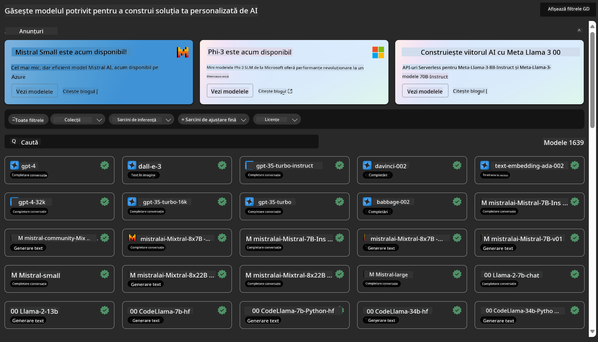
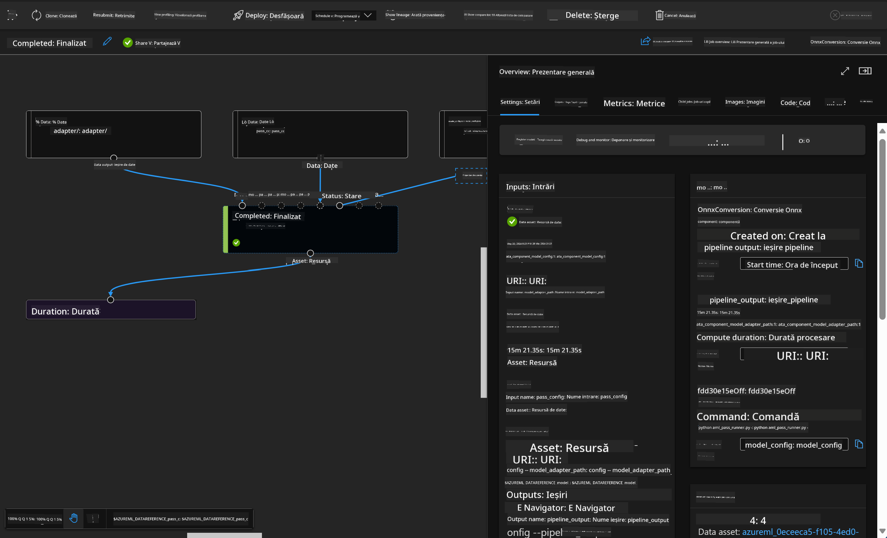

<!--
CO_OP_TRANSLATOR_METADATA:
{
  "original_hash": "7fe541373802e33568e94e13226d463c",
  "translation_date": "2025-05-09T22:23:54+00:00",
  "source_file": "md/03.FineTuning/Introduce_AzureML.md",
  "language_code": "ro"
}
-->
# **Introduce Azure Machine Learning Service**

[Azure Machine Learning](https://ml.azure.com?WT.mc_id=aiml-138114-kinfeylo) este un serviciu cloud pentru accelerarea și gestionarea ciclului de viață al proiectelor de machine learning (ML).

Profesioniștii în ML, data scientist-ii și inginerii îl pot folosi în fluxurile lor de lucru zilnice pentru a:

- Antrena și implementa modele.
- Gestiona operațiunile de machine learning (MLOps).
- Poți crea un model în Azure Machine Learning sau poți folosi un model construit pe o platformă open-source, precum PyTorch, TensorFlow sau scikit-learn.
- Instrumentele MLOps te ajută să monitorizezi, reantrenezi și redeploiezi modelele.

## Pentru cine este Azure Machine Learning?

**Data Scientist-i și Ingineri ML**

Pot folosi uneltele pentru a accelera și automatiza fluxurile lor de lucru zilnice.
Azure ML oferă funcționalități pentru echitate, explicabilitate, urmărire și auditabilitate.

**Dezvoltatori de aplicații:**
Pot integra modelele în aplicații sau servicii fără probleme.

**Dezvoltatori de platformă**

Au acces la un set robust de unelte susținute de API-uri durabile Azure Resource Manager.
Aceste unelte permit construirea unor instrumente avansate pentru ML.

**Companii**

Lucrând în cloud-ul Microsoft Azure, companiile beneficiază de securitate familiară și control acces bazat pe roluri.
Pot configura proiecte pentru a controla accesul la date protejate și operațiuni specifice.

## Productivitate pentru toată echipa
Proiectele ML necesită adesea o echipă cu abilități diverse pentru a construi și menține soluțiile.

Azure ML oferă unelte care îți permit să:
- Colaborezi cu echipa ta prin notebook-uri partajate, resurse de calcul, calcul serverless, date și medii.
- Dezvolți modele cu echitate, explicabilitate, urmărire și auditabilitate pentru a respecta cerințele de trasabilitate și conformitate.
- Implementezi rapid și ușor modele ML la scară largă și să le gestionezi eficient cu MLOps.
- Rulezi sarcini de machine learning oriunde, cu guvernanță, securitate și conformitate integrate.

## Unelte compatibile cross-platform

Oricine din echipa ML poate folosi uneltele preferate pentru a-și duce la bun sfârșit munca.
Indiferent dacă rulezi experimente rapide, ajustezi hiperparametri, construiești pipeline-uri sau gestionezi inferențe, poți folosi interfețe familiare, inclusiv:
- Azure Machine Learning Studio
- Python SDK (v2)
- Azure CLI (v2)
- Azure Resource Manager REST APIs

Pe măsură ce rafinezi modelele și colaborezi pe tot parcursul ciclului de dezvoltare, poți partaja și găsi resurse, active și metrici în interfața Azure Machine Learning studio.

## **LLM/SLM în Azure ML**

Azure ML a adăugat multe funcții legate de LLM/SLM, combinând LLMOps și SLMOps pentru a crea o platformă tehnologică de inteligență artificială generativă la nivel enterprise.

### **Catalogul de modele**

Utilizatorii enterprise pot implementa modele diferite în funcție de scenariile de afaceri prin Catalogul de modele și pot oferi servicii ca Model as Service pentru dezvoltatori sau utilizatori enterprise.

Catalogul de modele din Azure Machine Learning studio este centrul pentru descoperirea și utilizarea unei game largi de modele care îți permit să construiești aplicații de inteligență artificială generativă. Catalogul conține sute de modele de la furnizori precum Azure OpenAI service, Mistral, Meta, Cohere, Nvidia, Hugging Face, inclusiv modele antrenate de Microsoft. Modelele provenite de la furnizori non-Microsoft sunt considerate Produse Non-Microsoft, conform Termenilor de Produs Microsoft, și sunt supuse condițiilor oferite împreună cu modelul.

### **Job Pipeline**

Nucleul unui pipeline de machine learning este împărțirea unei sarcini complete de ML într-un flux de lucru în mai mulți pași. Fiecare pas este un component gestionabil care poate fi dezvoltat, optimizat, configurat și automatizat individual. Pașii sunt conectați prin interfețe bine definite. Serviciul de pipeline Azure Machine Learning orchestrează automat toate dependențele dintre pașii pipeline-ului.

În fine-tuning-ul SLM / LLM, putem gestiona datele, antrenamentul și procesele de generare prin Pipeline.

### **Prompt flow**

Beneficiile utilizării Azure Machine Learning prompt flow
Azure Machine Learning prompt flow oferă o serie de avantaje care ajută utilizatorii să treacă de la idee la experimentare și, în cele din urmă, la aplicații LLM gata de producție:

**Agilitate în ingineria prompturilor**

Experiență interactivă de creare: Azure Machine Learning prompt flow oferă o reprezentare vizuală a structurii fluxului, permițând utilizatorilor să înțeleagă și să navigheze cu ușurință prin proiectele lor. De asemenea, oferă o experiență de codare asemănătoare notebook-urilor pentru dezvoltare și depanare eficiente.
Variante pentru ajustarea prompturilor: Utilizatorii pot crea și compara mai multe variante de prompt, facilitând un proces iterativ de rafinare.

Evaluare: Fluxurile de evaluare integrate permit utilizatorilor să evalueze calitatea și eficiența prompturilor și fluxurilor.

Resurse complete: Azure Machine Learning prompt flow include o bibliotecă de unelte încorporate, exemple și șabloane care servesc ca punct de plecare pentru dezvoltare, inspirând creativitatea și accelerând procesul.

**Pregătirea enterprise pentru aplicații bazate pe LLM**

Colaborare: Azure Machine Learning prompt flow susține colaborarea în echipă, permițând mai multor utilizatori să lucreze împreună la proiecte de inginerie a prompturilor, să împărtășească cunoștințe și să mențină controlul versiunilor.

Platformă all-in-one: Azure Machine Learning prompt flow simplifică întregul proces de inginerie a prompturilor, de la dezvoltare și evaluare până la implementare și monitorizare. Utilizatorii pot implementa cu ușurință fluxurile ca endpoint-uri Azure Machine Learning și pot monitoriza performanța în timp real, asigurând funcționarea optimă și îmbunătățirea continuă.

Soluții Azure Machine Learning Enterprise Readiness: Prompt flow valorifică soluțiile robuste de pregătire enterprise ale Azure Machine Learning, oferind o bază sigură, scalabilă și fiabilă pentru dezvoltarea, experimentarea și implementarea fluxurilor.

Cu Azure Machine Learning prompt flow, utilizatorii pot valorifica agilitatea în ingineria prompturilor, pot colabora eficient și pot folosi soluții de nivel enterprise pentru dezvoltarea și implementarea cu succes a aplicațiilor bazate pe LLM.

Combinând puterea de calcul, datele și diferitele componente ale Azure ML, dezvoltatorii enterprise pot construi cu ușurință propriile aplicații de inteligență artificială.

**Declinare a responsabilității**:  
Acest document a fost tradus folosind serviciul de traducere automată AI [Co-op Translator](https://github.com/Azure/co-op-translator). Deși ne străduim pentru acuratețe, vă rugăm să rețineți că traducerile automate pot conține erori sau inexactități. Documentul original, în limba sa nativă, trebuie considerat sursa autorizată. Pentru informații critice, se recomandă traducerea profesională realizată de un traducător uman. Nu ne asumăm responsabilitatea pentru eventualele neînțelegeri sau interpretări greșite rezultate din utilizarea acestei traduceri.