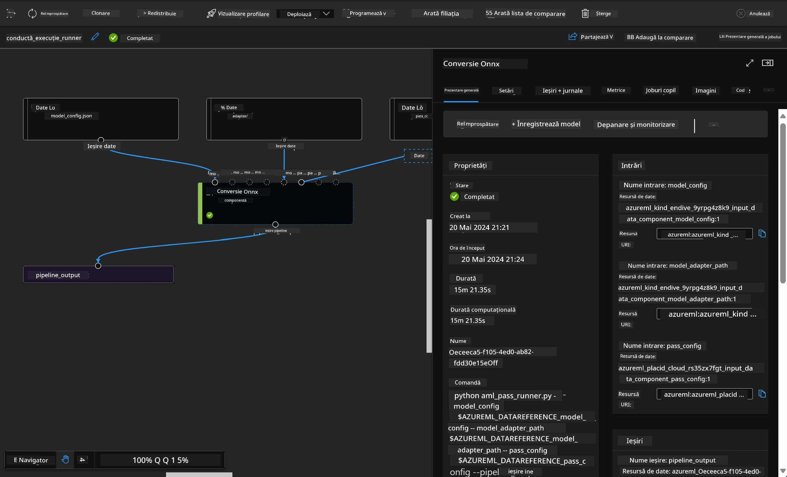

# **Introducere în Azure Machine Learning Service**

[Azure Machine Learning](https://ml.azure.com?WT.mc_id=aiml-138114-kinfeylo) este un serviciu cloud pentru accelerarea și gestionarea ciclului de viață al proiectelor de machine learning (ML).

Profesioniștii ML, data scientist-ii și inginerii îl pot folosi în fluxurile lor de lucru zilnice pentru a:

- Antrena și implementa modele.
- Gestiona operațiunile de machine learning (MLOps).
- Poți crea un model în Azure Machine Learning sau poți folosi un model construit pe o platformă open-source, cum ar fi PyTorch, TensorFlow sau scikit-learn.
- Instrumentele MLOps te ajută să monitorizezi, reantrenezi și redeploiezi modelele.

## Pentru cine este Azure Machine Learning?

**Data Scientist-i și Ingineri ML**

Pot folosi instrumente pentru a accelera și automatiza fluxurile lor de lucru zilnice.  
Azure ML oferă funcționalități pentru echitate, explicabilitate, urmărire și auditabilitate.

**Dezvoltatori de aplicații:**  
Pot integra modelele în aplicații sau servicii fără probleme.

**Dezvoltatori de platformă**

Au acces la un set robust de instrumente susținute de API-uri durabile Azure Resource Manager.  
Aceste instrumente permit construirea unor unelte avansate pentru ML.

**Companii**

Lucrând în cloud-ul Microsoft Azure, companiile beneficiază de securitate familiară și control al accesului bazat pe roluri.  
Pot configura proiecte pentru a controla accesul la date protejate și operațiuni specifice.

## Productivitate pentru toată echipa  
Proiectele ML necesită adesea o echipă cu abilități diverse pentru a construi și întreține.

Azure ML oferă instrumente care îți permit să:  
- Colaborezi cu echipa prin notebook-uri partajate, resurse de calcul, calcul serverless, date și medii.  
- Dezvolți modele cu echitate, explicabilitate, urmărire și auditabilitate pentru a respecta cerințele de trasabilitate și conformitate.  
- Implementezi rapid și ușor modele ML la scară largă și să le gestionezi eficient cu MLOps.  
- Rulezi sarcini de machine learning oriunde, cu guvernanță, securitate și conformitate integrate.

## Instrumente platformă compatibile încrucișat

Oricine din echipa ML poate folosi instrumentele preferate pentru a-și îndeplini sarcinile.  
Indiferent dacă rulezi experimente rapide, ajustezi hiperparametri, construiești pipeline-uri sau gestionezi inferențe, poți folosi interfețe familiare, inclusiv:  
- Azure Machine Learning Studio  
- Python SDK (v2)  
- Azure CLI (v2)  
- Azure Resource Manager REST APIs

Pe măsură ce rafinezi modelele și colaborezi pe tot parcursul ciclului de dezvoltare, poți partaja și găsi active, resurse și metrici în interfața Azure Machine Learning studio.

## **LLM/SLM în Azure ML**

Azure ML a adăugat multe funcții legate de LLM/SLM, combinând LLMOps și SLMOps pentru a crea o platformă tehnologică de inteligență artificială generativă la nivel enterprise.

### **Catalogul de modele**

Utilizatorii enterprise pot implementa modele diferite în funcție de scenarii de afaceri variate prin Catalogul de modele și pot oferi servicii ca Model as Service pentru dezvoltatorii sau utilizatorii enterprise.

Catalogul de modele din Azure Machine Learning studio este centrul pentru descoperirea și utilizarea unei game largi de modele care îți permit să construiești aplicații Generative AI. Catalogul conține sute de modele de la furnizori precum Azure OpenAI service, Mistral, Meta, Cohere, Nvidia, Hugging Face, inclusiv modele antrenate de Microsoft. Modelele de la furnizori non-Microsoft sunt considerate Produse Non-Microsoft, conform Termenilor de produs Microsoft, și sunt supuse termenilor specifici modelului.

### **Job Pipeline**

Nucleul unui pipeline de machine learning este împărțirea unei sarcini complete de ML într-un flux de lucru în mai mulți pași. Fiecare pas este o componentă gestionabilă care poate fi dezvoltată, optimizată, configurată și automatizată individual. Pașii sunt conectați prin interfețe bine definite. Serviciul pipeline Azure Machine Learning orchestrează automat toate dependențele dintre pașii pipeline-ului.

În fine-tuning-ul SLM / LLM, putem gestiona datele, antrenamentul și procesele de generare prin Pipeline.

### **Prompt flow**

Beneficiile utilizării Azure Machine Learning prompt flow  
Azure Machine Learning prompt flow oferă o serie de avantaje care ajută utilizatorii să treacă de la idee la experimentare și, în final, la aplicații LLM gata de producție:

**Agilitate în ingineria prompturilor**

Experiență interactivă de creare: Azure Machine Learning prompt flow oferă o reprezentare vizuală a structurii fluxului, permițând utilizatorilor să înțeleagă și să navigheze ușor prin proiectele lor. De asemenea, oferă o experiență de codare asemănătoare unui notebook pentru dezvoltare și depanare eficientă a fluxului.  
Variante pentru ajustarea prompturilor: Utilizatorii pot crea și compara mai multe variante de prompturi, facilitând un proces iterativ de rafinare.

Evaluare: Fluxurile de evaluare integrate permit utilizatorilor să evalueze calitatea și eficacitatea prompturilor și fluxurilor lor.

Resurse cuprinzătoare: Azure Machine Learning prompt flow include o bibliotecă de unelte, exemple și șabloane încorporate, care servesc ca punct de plecare pentru dezvoltare, inspirând creativitatea și accelerând procesul.

**Pregătire enterprise pentru aplicații bazate pe LLM**

Colaborare: Azure Machine Learning prompt flow susține colaborarea în echipă, permițând mai multor utilizatori să lucreze împreună la proiecte de inginerie a prompturilor, să împărtășească cunoștințe și să mențină controlul versiunilor.

Platformă all-in-one: Azure Machine Learning prompt flow simplifică întregul proces de inginerie a prompturilor, de la dezvoltare și evaluare până la implementare și monitorizare. Utilizatorii pot implementa cu ușurință fluxurile ca endpoint-uri Azure Machine Learning și pot monitoriza performanța în timp real, asigurând o funcționare optimă și îmbunătățire continuă.

Soluții Azure Machine Learning Enterprise Readiness: Prompt flow valorifică soluțiile robuste de pregătire enterprise ale Azure Machine Learning, oferind o bază sigură, scalabilă și fiabilă pentru dezvoltarea, experimentarea și implementarea fluxurilor.

Cu Azure Machine Learning prompt flow, utilizatorii pot valorifica agilitatea în ingineria prompturilor, pot colabora eficient și pot folosi soluții de nivel enterprise pentru dezvoltarea și implementarea cu succes a aplicațiilor bazate pe LLM.

Combinând puterea de calcul, datele și diferitele componente ale Azure ML, dezvoltatorii enterprise pot construi cu ușurință propriile aplicații de inteligență artificială.

**Declinare de responsabilitate**:  
Acest document a fost tradus folosind serviciul de traducere AI [Co-op Translator](https://github.com/Azure/co-op-translator). Deși ne străduim pentru acuratețe, vă rugăm să rețineți că traducerile automate pot conține erori sau inexactități. Documentul original în limba sa nativă trebuie considerat sursa autorizată. Pentru informații critice, se recomandă traducerea profesională realizată de un specialist uman. Nu ne asumăm răspunderea pentru eventualele neînțelegeri sau interpretări greșite rezultate din utilizarea acestei traduceri.