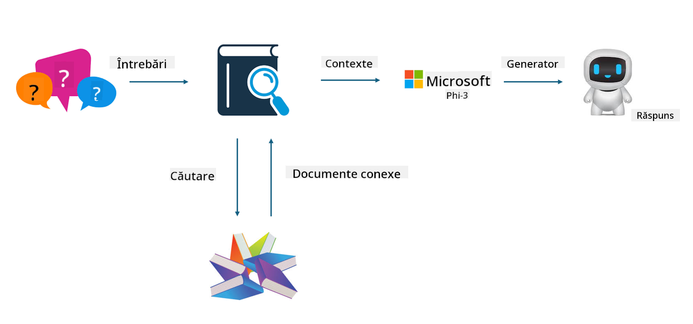
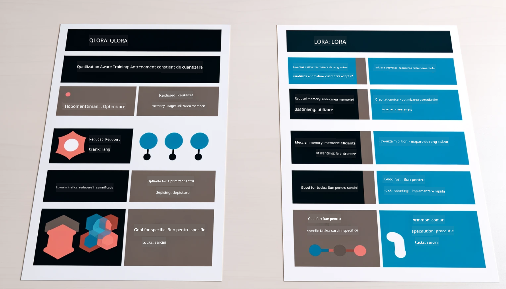

<!--
CO_OP_TRANSLATOR_METADATA:
{
  "original_hash": "743d7e9cb9c4e8ea642d77bee657a7fa",
  "translation_date": "2025-07-17T10:00:57+00:00",
  "source_file": "md/03.FineTuning/LetPhi3gotoIndustriy.md",
  "language_code": "ro"
}
-->
# **Lasă Phi-3 să devină un expert în industrie**

Pentru a integra modelul Phi-3 într-o industrie, trebuie să adaugi date de business specifice industriei în modelul Phi-3. Avem două opțiuni diferite: prima este RAG (Retrieval Augmented Generation) și a doua este Fine Tuning.

## **RAG vs Fine-Tuning**

### **Retrieval Augmented Generation**

RAG este combinarea între recuperarea datelor și generarea de text. Datele structurate și nestructurate ale întreprinderii sunt stocate într-o bază de date vectorială. Când se caută conținut relevant, se găsește un rezumat și conținut relevant pentru a forma un context, iar capacitatea de completare a textului a LLM/SLM este combinată pentru a genera conținut.

### **Fine-tuning**

Fine-tuning se bazează pe îmbunătățirea unui anumit model. Nu este nevoie să pornești de la algoritmul modelului, dar datele trebuie acumulate continuu. Dacă dorești o terminologie și o exprimare lingvistică mai precisă în aplicațiile din industrie, fine-tuning este alegerea mai bună. Dar dacă datele tale se schimbă frecvent, fine-tuning poate deveni complicat.

### **Cum să alegi**

1. Dacă răspunsul nostru necesită introducerea de date externe, RAG este cea mai bună alegere

2. Dacă ai nevoie să oferi cunoștințe stabile și precise din industrie, fine-tuning va fi o alegere bună. RAG prioritizează extragerea conținutului relevant, dar s-ar putea să nu surprindă întotdeauna nuanțele specializate.

3. Fine-tuning necesită un set de date de înaltă calitate, iar dacă este vorba doar de un volum mic de date, nu va face o diferență mare. RAG este mai flexibil.

4. Fine-tuning este o cutie neagră, o metafizică, și este dificil să înțelegi mecanismul intern. Dar RAG poate face mai ușoară identificarea sursei datelor, ajustând astfel eficient halucinațiile sau erorile de conținut și oferind o transparență mai bună.

### **Scenarii**

1. Industriile verticale care necesită vocabular și expresii profesionale specifice, ***Fine-tuning*** va fi cea mai bună alegere

2. Sistemele QA, care implică sinteza diferitelor puncte de cunoștințe, ***RAG*** va fi cea mai bună alegere

3. Combinația de fluxuri automate de business ***RAG + Fine-tuning*** este cea mai bună alegere

## **Cum să folosești RAG**

O bază de date vectorială este o colecție de date stocate în formă matematică. Bazele de date vectoriale facilitează reținerea inputurilor anterioare de către modelele de machine learning, permițând utilizarea machine learning pentru cazuri de utilizare precum căutarea, recomandările și generarea de text. Datele pot fi identificate pe baza metricilor de similaritate, nu doar pe potriviri exacte, permițând modelelor să înțeleagă contextul datelor.

Baza de date vectorială este cheia pentru realizarea RAG. Putem converti datele în stocare vectorială prin modele vectoriale precum text-embedding-3, jina-ai-embedding etc.

Află mai multe despre crearea aplicațiilor RAG [https://github.com/microsoft/Phi-3CookBook](https://github.com/microsoft/Phi-3CookBook?WT.mc_id=aiml-138114-kinfeylo)

## **Cum să folosești Fine-tuning**

Algoritmii folosiți frecvent în Fine-tuning sunt Lora și QLora. Cum să alegi?
- [Află mai multe cu acest notebook exemplu](../../../../code/04.Finetuning/Phi_3_Inference_Finetuning.ipynb)
- [Exemplu de Python FineTuning Sample](../../../../code/04.Finetuning/FineTrainingScript.py)

### **Lora și QLora**

LoRA (Low-Rank Adaptation) și QLoRA (Quantized Low-Rank Adaptation) sunt ambele tehnici folosite pentru fine-tuning-ul modelelor mari de limbaj (LLM) folosind Parameter Efficient Fine Tuning (PEFT). Tehnicile PEFT sunt concepute pentru a antrena modelele mai eficient decât metodele tradiționale.  
LoRA este o tehnică de fine-tuning independentă care reduce amprenta de memorie prin aplicarea unei aproximări de rang redus asupra matricei de actualizare a greutăților. Oferă timpi rapizi de antrenament și menține performanțe apropiate de metodele tradiționale de fine-tuning.

QLoRA este o versiune extinsă a LoRA care încorporează tehnici de cuantizare pentru a reduce și mai mult utilizarea memoriei. QLoRA cuantizează precizia parametrilor de greutate în LLM-ul pre-antrenat la o precizie de 4 biți, ceea ce este mai eficient din punct de vedere al memoriei decât LoRA. Totuși, antrenamentul QLoRA este cu aproximativ 30% mai lent decât cel LoRA din cauza pașilor suplimentari de cuantizare și decuantizare.

QLoRA folosește LoRA ca accesoriu pentru a corecta erorile introduse în timpul cuantizării. QLoRA permite fine-tuning-ul modelelor masive cu miliarde de parametri pe GPU-uri relativ mici și disponibile. De exemplu, QLoRA poate face fine-tuning unui model de 70B parametri care ar necesita 36 GPU-uri doar cu 2...

**Declinare de responsabilitate**:  
Acest document a fost tradus folosind serviciul de traducere AI [Co-op Translator](https://github.com/Azure/co-op-translator). Deși ne străduim pentru acuratețe, vă rugăm să rețineți că traducerile automate pot conține erori sau inexactități. Documentul original în limba sa nativă trebuie considerat sursa autorizată. Pentru informații critice, se recomandă traducerea profesională realizată de un specialist uman. Nu ne asumăm răspunderea pentru eventualele neînțelegeri sau interpretări greșite rezultate din utilizarea acestei traduceri.