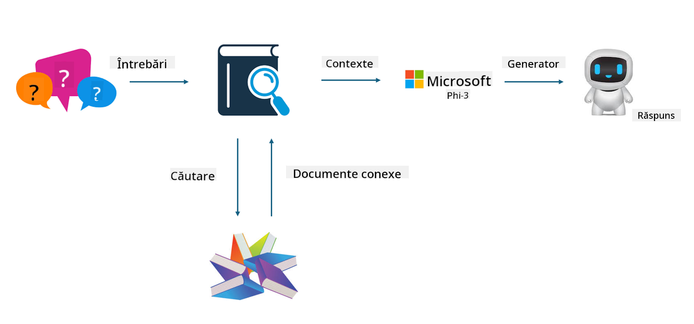

<!--
CO_OP_TRANSLATOR_METADATA:
{
  "original_hash": "743d7e9cb9c4e8ea642d77bee657a7fa",
  "translation_date": "2025-05-09T22:29:41+00:00",
  "source_file": "md/03.FineTuning/LetPhi3gotoIndustriy.md",
  "language_code": "ro"
}
-->
# **Lasă Phi-3 să devină un expert în industrie**

Pentru a integra modelul Phi-3 într-o industrie, trebuie să adaugi date de business specifice industriei în modelul Phi-3. Avem două opțiuni diferite: prima este RAG (Retrieval Augmented Generation), iar a doua este Fine Tuning.

## **RAG vs Fine-Tuning**

### **Retrieval Augmented Generation**

RAG este o combinație între recuperarea datelor și generarea de text. Datele structurate și nestructurate ale companiei sunt stocate într-o bază de date vectorială. Atunci când se caută conținut relevant, se găsește un rezumat și conținut relevant pentru a forma un context, iar capacitatea de completare a textului a LLM/SLM este folosită pentru a genera conținut.

### **Fine-tuning**

Fine-tuning-ul presupune îmbunătățirea unui anumit model existent. Nu este nevoie să pornești de la algoritmul modelului, dar este necesară acumularea continuă de date. Dacă dorești terminologie și exprimare mai precisă în aplicațiile industriale, fine-tuning-ul este alegerea mai bună. Totuși, dacă datele tale se schimbă frecvent, fine-tuning-ul poate deveni complicat.

### **Cum să alegi**

1. Dacă răspunsul necesită introducerea de date externe, RAG este cea mai bună alegere

2. Dacă ai nevoie să livrezi cunoștințe stabile și precise despre industrie, fine-tuning-ul va fi o alegere bună. RAG prioritizează extragerea de conținut relevant, dar nu surprinde întotdeauna nuanțele specializate.

3. Fine-tuning-ul necesită un set de date de înaltă calitate, iar dacă este vorba doar de un volum mic de date, diferența nu va fi mare. RAG este mai flexibil.

4. Fine-tuning-ul este o cutie neagră, o metafizică, și este greu de înțeles mecanismul intern. În schimb, RAG facilitează identificarea sursei datelor, ajutând astfel la corectarea halucinațiilor sau erorilor de conținut și oferind o transparență mai bună.

### **Scenarii**

1. Industriile verticale care necesită vocabular și expresii profesionale specifice, ***Fine-tuning*** este cea mai bună alegere

2. Sistemele QA, care implică sintetizarea diferitelor puncte de cunoștințe, ***RAG*** este cea mai bună alegere

3. Combinația fluxului de business automatizat ***RAG + Fine-tuning*** este cea mai bună alegere

## **Cum să folosești RAG**

O bază de date vectorială este o colecție de date stocate în formă matematică. Bazele de date vectoriale facilitează reținerea inputurilor anterioare de către modelele de machine learning, permițând utilizarea în cazuri precum căutarea, recomandările și generarea de text. Datele pot fi identificate pe baza metricilor de similaritate, nu neapărat pe potriviri exacte, ceea ce ajută modelele să înțeleagă contextul datelor.

Baza de date vectorială este cheia pentru realizarea RAG. Putem converti datele în stocare vectorială folosind modele vectoriale precum text-embedding-3, jina-ai-embedding etc.

Află mai multe despre crearea aplicațiilor RAG [https://github.com/microsoft/Phi-3CookBook](https://github.com/microsoft/Phi-3CookBook?WT.mc_id=aiml-138114-kinfeylo)

## **Cum să folosești Fine-tuning**

Algoritmii folosiți frecvent în Fine-tuning sunt Lora și QLora. Cum să alegi?
- [Află mai multe cu acest notebook exemplu](../../../../code/04.Finetuning/Phi_3_Inference_Finetuning.ipynb)
- [Exemplu de FineTuning în Python](../../../../code/04.Finetuning/FineTrainingScript.py)

### **Lora și QLora**

LoRA (Low-Rank Adaptation) și QLoRA (Quantized Low-Rank Adaptation) sunt tehnici folosite pentru fine-tuning-ul modelelor mari de limbaj (LLMs) folosind Parameter Efficient Fine Tuning (PEFT). Tehnicile PEFT sunt concepute pentru a antrena modelele mai eficient decât metodele tradiționale.  
LoRA este o tehnică independentă de fine-tuning care reduce consumul de memorie prin aplicarea unei aproximații de rang scăzut asupra matricei de actualizare a greutăților. Oferă timpi rapizi de antrenare și menține performanțe apropiate de metodele tradiționale de fine-tuning.

QLoRA este o versiune extinsă a LoRA care încorporează tehnici de cuantizare pentru a reduce și mai mult utilizarea memoriei. QLoRA cuantizează precizia parametrilor de greutate din LLM-ul pre-antrenat la o precizie de 4 biți, ceea ce este mai eficient din punct de vedere al memoriei decât LoRA. Totuși, antrenarea cu QLoRA este cu aproximativ 30% mai lentă decât cu LoRA din cauza pașilor suplimentari de cuantizare și decuantizare.

QLoRA folosește LoRA ca accesoriu pentru a corecta erorile introduse în timpul cuantizării. QLoRA permite fine-tuning-ul modelelor masive cu miliarde de parametri pe GPU-uri relativ mici și disponibile. De exemplu, QLoRA poate face fine-tuning unui model de 70B parametri care necesită 36 GPU-uri doar cu 2...

**Declinare a responsabilității**:  
Acest document a fost tradus folosind serviciul de traducere automată AI [Co-op Translator](https://github.com/Azure/co-op-translator). Deși ne străduim pentru acuratețe, vă rugăm să rețineți că traducerile automate pot conține erori sau inexactități. Documentul original în limba sa nativă trebuie considerat sursa autorizată. Pentru informații critice, se recomandă traducerea profesională realizată de un traducător uman. Nu ne asumăm răspunderea pentru eventualele neînțelegeri sau interpretări greșite rezultate din utilizarea acestei traduceri.