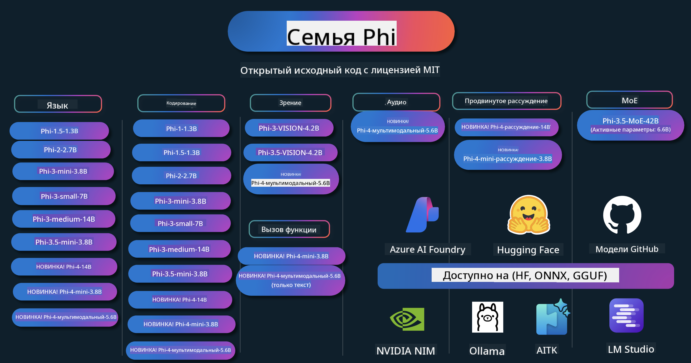

<!--
CO_OP_TRANSLATOR_METADATA:
{
  "original_hash": "ef3a50368712b1a7483d0def1f70c490",
  "translation_date": "2025-12-21T09:53:50+00:00",
  "source_file": "README.md",
  "language_code": "ru"
}
-->
# Phi Cookbook: Hands-On Examples with Microsoft's Phi Models

Phi — серия моделей ИИ с открытым исходным кодом, разработанная Microsoft. 

Phi в настоящее время является наиболее мощной и экономичной небольшой языковой моделью (SLM), с очень хорошими показателями в многоязычии, рассуждении, генерации текста/чата, кодировании, работе с изображениями, аудио и других сценариях. 

Вы можете развернуть Phi в облаке или на периферийных устройствах, и вы можете легко создавать генеративные приложения ИИ при ограниченных вычислительных ресурсах.

Выполните следующие шаги, чтобы начать работу с этими ресурсами :
1. **Форкните репозиторий**: Нажмите 
2. **Клонируйте репозиторий**:   `git clone https://github.com/microsoft/PhiCookBook.git`
3. [**Присоединяйтесь к сообществу Microsoft AI в Discord и познакомьтесь с экспертами и другими разработчиками**](https://discord.com/invite/ByRwuEEgH4?WT.mc_id=aiml-137032-kinfeylo)

### 🌐 Поддержка нескольких языков

#### Поддерживается через GitHub Action (автоматически и всегда актуально)

<!-- CO-OP TRANSLATOR LANGUAGES TABLE START -->
[Арабский](../ar/README.md) | [Бенгали](../bn/README.md) | [Болгарский](../bg/README.md) | [Бирманский (Мьянма)](../my/README.md) | [Китайский (упрощённый)](../zh/README.md) | [Китайский (традиционный, Гонконг)](../hk/README.md) | [Китайский (традиционный, Макао)](../mo/README.md) | [Китайский (традиционный, Тайвань)](../tw/README.md) | [Хорватский](../hr/README.md) | [Чешский](../cs/README.md) | [Датский](../da/README.md) | [Нидерландский](../nl/README.md) | [Эстонский](../et/README.md) | [Финский](../fi/README.md) | [Французский](../fr/README.md) | [Немецкий](../de/README.md) | [Греческий](../el/README.md) | [Иврит](../he/README.md) | [Хинди](../hi/README.md) | [Венгерский](../hu/README.md) | [Индонезийский](../id/README.md) | [Итальянский](../it/README.md) | [Японский](../ja/README.md) | [Каннада](../kn/README.md) | [Корейский](../ko/README.md) | [Литовский](../lt/README.md) | [Малайский](../ms/README.md) | [Малаялам](../ml/README.md) | [Марати](../mr/README.md) | [Непальский](../ne/README.md) | [Нигерийский пиджин](../pcm/README.md) | [Норвежский](../no/README.md) | [Персидский (фарси)](../fa/README.md) | [Польский](../pl/README.md) | [Португальский (Бразилия)](../br/README.md) | [Португальский (Португалия)](../pt/README.md) | [Пенджаби (гурмухи)](../pa/README.md) | [Румынский](../ro/README.md) | [Русский](./README.md) | [Сербский (кириллица)](../sr/README.md) | [Словацкий](../sk/README.md) | [Словенский](../sl/README.md) | [Испанский](../es/README.md) | [Свахили](../sw/README.md) | [Шведский](../sv/README.md) | [Тагальский (филиппинский)](../tl/README.md) | [Тамильский](../ta/README.md) | [Телугу](../te/README.md) | [Тайский](../th/README.md) | [Турецкий](../tr/README.md) | [Украинский](../uk/README.md) | [Урду](../ur/README.md) | [Вьетнамский](../vi/README.md)
<!-- CO-OP TRANSLATOR LANGUAGES TABLE END -->

## Содержание

- Введение
  - [Добро пожаловать в семейство Phi](./md/01.Introduction/01/01.PhiFamily.md)
  - [Настройка окружения](./md/01.Introduction/01/01.EnvironmentSetup.md)
  - [Понимание ключевых технологий](./md/01.Introduction/01/01.Understandingtech.md)
  - [Безопасность ИИ для моделей Phi](./md/01.Introduction/01/01.AISafety.md)
  - [Аппаратная поддержка Phi](./md/01.Introduction/01/01.Hardwaresupport.md)
  - [Модели Phi и их доступность на платформах](./md/01.Introduction/01/01.Edgeandcloud.md)
  - [Использование Guidance-ai и Phi](./md/01.Introduction/01/01.Guidance.md)
  - [Модели на GitHub Marketplace](https://github.com/marketplace/models)
  - [Каталог моделей Azure AI](https://ai.azure.com)

- Инференс Phi в разных средах
    -  [Hugging face](./md/01.Introduction/02/01.HF.md)
    -  [GitHub Models](./md/01.Introduction/02/02.GitHubModel.md)
    -  [Azure AI Foundry Model Catalog](./md/01.Introduction/02/03.AzureAIFoundry.md)
    -  [Ollama](./md/01.Introduction/02/04.Ollama.md)
    -  [AI Toolkit VSCode (AITK)](./md/01.Introduction/02/05.AITK.md)
    -  [NVIDIA NIM](./md/01.Introduction/02/06.NVIDIA.md)
    -  [Foundry Local](./md/01.Introduction/02/07.FoundryLocal.md)

- Инференс семейства Phi
    - [Инференс Phi на iOS](./md/01.Introduction/03/iOS_Inference.md)
    - [Инференс Phi на Android](./md/01.Introduction/03/Android_Inference.md)
    - [Инференс Phi на Jetson](./md/01.Introduction/03/Jetson_Inference.md)
    - [Инференс Phi на AI ПК](./md/01.Introduction/03/AIPC_Inference.md)
    - [Инференс Phi с Apple MLX Framework](./md/01.Introduction/03/MLX_Inference.md)
    - [Инференс Phi на локальном сервере](./md/01.Introduction/03/Local_Server_Inference.md)
    - [Инференс Phi на удалённом сервере с использованием AI Toolkit](./md/01.Introduction/03/Remote_Interence.md)
    - [Инференс Phi с Rust](./md/01.Introduction/03/Rust_Inference.md)
    - [Инференс Phi--Vision локально](./md/01.Introduction/03/Vision_Inference.md)
    - [Инференс Phi с Kaito AKS, Azure Containers(official support)](./md/01.Introduction/03/Kaito_Inference.md)
-  [Квантование семейства Phi](./md/01.Introduction/04/QuantifyingPhi.md)
    - [Квантование Phi-3.5 / 4 с использованием llama.cpp](./md/01.Introduction/04/UsingLlamacppQuantifyingPhi.md)
    - [Квантование Phi-3.5 / 4 с использованием расширений Generative AI для onnxruntime](./md/01.Introduction/04/UsingORTGenAIQuantifyingPhi.md)
    - [Квантование Phi-3.5 / 4 с использованием Intel OpenVINO](./md/01.Introduction/04/UsingIntelOpenVINOQuantifyingPhi.md)
    - [Квантование Phi-3.5 / 4 с использованием Apple MLX Framework](./md/01.Introduction/04/UsingAppleMLXQuantifyingPhi.md)

-  Оценка Phi
    - [Ответственный ИИ](./md/01.Introduction/05/ResponsibleAI.md)
    - [Azure AI Foundry для оценки](./md/01.Introduction/05/AIFoundry.md)
    - [Использование Promptflow для оценки](./md/01.Introduction/05/Promptflow.md)
 
- RAG с Azure AI Search
    - [How to use Phi-4-mini and Phi-4-multimodal(RAG) with Azure AI Search](https://github.com/microsoft/PhiCookBook/blob/main/code/06.E2E/E2E_Phi-4-RAG-Azure-AI-Search.ipynb)

- Примеры разработки приложений Phi
  - Текстовые и чат-приложения
    - Примеры Phi-4 🆕
      - [📓] [Чат с Phi-4-mini ONNX-моделью](./md/02.Application/01.TextAndChat/Phi4/ChatWithPhi4ONNX/README.md)
      - [Чат с локальной ONNX моделью Phi-4 (.NET)](../../md/04.HOL/dotnet/src/LabsPhi4-Chat-01OnnxRuntime)
      - [Консольное приложение .NET: чат с Phi-4 ONNX с использованием Sementic Kernel](../../md/04.HOL/dotnet/src/LabsPhi4-Chat-02SK)
    - Примеры Phi-3 / 3.5
      - [Локальный чат-бот в браузере с использованием Phi3, ONNX Runtime Web и WebGPU](https://github.com/microsoft/onnxruntime-inference-examples/tree/main/js/chat)
      - [Чат на OpenVino](./md/02.Application/01.TextAndChat/Phi3/E2E_OpenVino_Chat.md)
      - [Мульти-модель - интерактивный Phi-3-mini и OpenAI Whisper](./md/02.Application/01.TextAndChat/Phi3/E2E_Phi-3-mini_with_whisper.md)
      - [MLFlow - создание оболочки и использование Phi-3 с MLFlow](./md//02.Application/01.TextAndChat/Phi3/E2E_Phi-3-MLflow.md)
      - [Оптимизация модели - Как оптимизировать модель Phi-3-min для ONNX Runtime Web с помощью Olive](https://github.com/microsoft/Olive/tree/main/examples/phi3)
      - [Приложение WinUI3 с Phi-3 mini-4k-instruct-onnx](https://github.com/microsoft/Phi3-Chat-WinUI3-Sample/)
      -[Пример WinUI3 приложения Multi Model AI Powered Notes](https://github.com/microsoft/ai-powered-notes-winui3-sample)
      - [Тонкая настройка и интеграция пользовательских моделей Phi-3 с Prompt flow](./md/02.Application/01.TextAndChat/Phi3/E2E_Phi-3-FineTuning_PromptFlow_Integration.md)
      - [Тонкая настройка и интеграция пользовательских моделей Phi-3 с Prompt flow в Azure AI Foundry](./md/02.Application/01.TextAndChat/Phi3/E2E_Phi-3-FineTuning_PromptFlow_Integration_AIFoundry.md)
      - [Оценка тонконастроенной модели Phi-3 / Phi-3.5 в Azure AI Foundry с акцентом на принципы ответственного ИИ Microsoft](./md/02.Application/01.TextAndChat/Phi3/E2E_Phi-3-Evaluation_AIFoundry.md)
      - [📓] [Пример предсказания языка Phi-3.5-mini-instruct (китайский/английский)](./md/02.Application/01.TextAndChat/Phi3/phi3-instruct-demo.ipynb)
      - [Phi-3.5-Instruct WebGPU RAG чат-бот](./md/02.Application/01.TextAndChat/Phi3/WebGPUWithPhi35Readme.md)
      - [Использование GPU Windows для создания решения Prompt flow с Phi-3.5-Instruct ONNX](./md/02.Application/01.TextAndChat/Phi3/UsingPromptFlowWithONNX.md)
      - [Использование Microsoft Phi-3.5 tflite для создания Android-приложения](./md/02.Application/01.TextAndChat/Phi3/UsingPhi35TFLiteCreateAndroidApp.md)
      - [Пример Q&A .NET с использованием локальной ONNX модели Phi-3 и Microsoft.ML.OnnxRuntime](../../md/04.HOL/dotnet/src/LabsPhi301)
      - [Консольное чат-приложение .NET с Semantic Kernel и Phi-3](../../md/04.HOL/dotnet/src/LabsPhi302)

  - Azure AI Inference SDK Code Based Samples 
    - Образцы Phi-4 🆕
      - [📓] [Генерация кода проекта с использованием Phi-4-multimodal](./md/02.Application/02.Code/Phi4/GenProjectCode/README.md)
    - Образцы Phi-3 / 3.5
      - [Создайте собственный чат GitHub Copilot для Visual Studio Code с семейством Microsoft Phi-3](./md/02.Application/02.Code/Phi3/VSCodeExt/README.md)
      - [Создайте собственного агента Chat Copilot для Visual Studio Code с Phi-3.5 от GitHub Models](/md/02.Application/02.Code/Phi3/CreateVSCodeChatAgentWithGitHubModels.md)

  - Продвинутые примеры рассуждений
    - Образцы Phi-4 🆕
      - [📓] [Образцы Phi-4-mini-reasoning или Phi-4-reasoning Samples](./md/02.Application/03.AdvancedReasoning/Phi4/AdvancedResoningPhi4mini/README.md)
      - [📓] [Тонкая настройка Phi-4-mini-reasoning с Microsoft Olive](./md/02.Application/03.AdvancedReasoning/Phi4/AdvancedResoningPhi4mini/olive_ft_phi_4_reasoning_with_medicaldata.ipynb)
      - [📓] [Тонкая настройка Phi-4-mini-reasoning с Apple MLX](./md/02.Application/03.AdvancedReasoning/Phi4/AdvancedResoningPhi4mini/mlx_ft_phi_4_reasoning_with_medicaldata.ipynb)
      - [📓] [Phi-4-mini-reasoning с GitHub Models](./md/02.Application/02.Code/Phi4r/github_models_inference.ipynb)
      - [📓] [Phi-4-mini-reasoning с моделями Azure AI Foundry](./md/02.Application/02.Code/Phi4r/azure_models_inference.ipynb)
  - Демонстрации
      - [Phi-4-mini demo, размещённые на Hugging Face Spaces](https://huggingface.co/spaces/microsoft/phi-4-mini?WT.mc_id=aiml-137032-kinfeylo)
      - [Phi-4-multimodal demo, размещённые на Hugginge Face Spaces](https://huggingface.co/spaces/microsoft/phi-4-multimodal?WT.mc_id=aiml-137032-kinfeylo)
  - Vision Samples
    - Образцы Phi-4 🆕
      - [📓] [Использование Phi-4-multimodal для чтения изображений и генерации кода](./md/02.Application/04.Vision/Phi4/CreateFrontend/README.md) 
    - Образцы Phi-3 / 3.5
      -  [📓][Phi-3-vision: преобразование изображения в текст](./md/02.Application/04.Vision/Phi3/E2E_Phi-3-vision-image-text-to-text-online-endpoint.ipynb)
      - [Phi-3-vision-ONNX](https://onnxruntime.ai/docs/genai/tutorials/phi3-v.html)
      - [📓][Phi-3-vision: CLIP-встраивание](./md/02.Application/04.Vision/Phi3/E2E_Phi-3-vision-image-text-to-text-online-endpoint.ipynb)
      - [DEMO: Phi-3 Recycling](https://github.com/jennifermarsman/PhiRecycling/)
      - [Phi-3-vision - Визуальный языковой помощник - с Phi3-Vision и OpenVINO](https://docs.openvino.ai/nightly/notebooks/phi-3-vision-with-output.html)
      - [Phi-3 Vision Nvidia NIM](./md/02.Application/04.Vision/Phi3/E2E_Nvidia_NIM_Vision.md)
      - [Phi-3 Vision OpenVino](./md/02.Application/04.Vision/Phi3/E2E_OpenVino_Phi3Vision.md)
      - [📓][Пример Phi-3.5 Vision для нескольких кадров или изображений](./md/02.Application/04.Vision/Phi3/phi3-vision-demo.ipynb)
      - [Phi-3 Vision Local ONNX Model using the Microsoft.ML.OnnxRuntime .NET](../../md/04.HOL/dotnet/src/LabsPhi303)
      - [Menu based Phi-3 Vision Local ONNX Model using the Microsoft.ML.OnnxRuntime .NET](../../md/04.HOL/dotnet/src/LabsPhi304)

  - Математические примеры
    -  Примеры Phi-4-Mini-Flash-Reasoning-Instruct 🆕 [Математическая демонстрация с Phi-4-Mini-Flash-Reasoning-Instruct](./md/02.Application/09.Math/MathDemo.ipynb)

  - Аудио-примеры
    - Образцы Phi-4 🆕
      - [📓] [Извлечение транскриптов аудио с использованием Phi-4-multimodal](./md/02.Application/05.Audio/Phi4/Transciption/README.md)
      - [📓] [Пример аудио Phi-4-multimodal](./md/02.Application/05.Audio/Phi4/Siri/demo.ipynb)
      - [📓] [Пример перевода речи Phi-4-multimodal](./md/02.Application/05.Audio/Phi4/Translate/demo.ipynb)
      - [.NET console application using Phi-4-multimodal Audio to analyze an audio file and generate transcript](../../md/04.HOL/dotnet/src/LabsPhi4-MultiModal-02Audio)

  - Примеры MOE
    - Образцы Phi-3 / 3.5
      - [📓] [Пример (социальные сети) для моделей Phi-3.5 Mixture of Experts (MoEs)](./md/02.Application/06.MoE/Phi3/phi3_moe_demo.ipynb)
      - [📓] [Построение Retrieval-Augmented Generation (RAG) конвейера с NVIDIA NIM Phi-3 MOE, Azure AI Search и LlamaIndex](./md/02.Application/06.MoE/Phi3/azure-ai-search-nvidia-rag.ipynb)
      - 
  - Примеры вызова функций
    - Образцы Phi-4 🆕
      -  [📓] [Использование Function Calling With Phi-4-mini](./md/02.Application/07.FunctionCalling/Phi4/FunctionCallingBasic/README.md)
      -  [📓] [Использование Function Calling для создания мульти-агентов With Phi-4-mini](./md/02.Application/07.FunctionCalling/Phi4/Multiagents/Phi_4_mini_multiagent.ipynb)
      -  [📓] [Использование Function Calling с Ollama](./md/02.Application/07.FunctionCalling/Phi4/Ollama/ollama_functioncalling.ipynb)
      -  [📓] [Использование Function Calling с ONNX](./md/02.Application/07.FunctionCalling/Phi4/ONNX/onnx_parallel_functioncalling.ipynb)
  - Примеры мультимодального смешения
    - Образцы Phi-4 🆕
      -  [📓] [Использование Phi-4-multimodal в качестве технологического журналиста](./md/02.Application/08.Multimodel/Phi4/TechJournalist/phi_4_mm_audio_text_publish_news.ipynb)
      - [.NET console application using Phi-4-multimodal to analyze images](../../md/04.HOL/dotnet/src/LabsPhi4-MultiModal-01Images)

- Тонкая настройка Phi — примеры
  - [Сценарии тонкой настройки](./md/03.FineTuning/FineTuning_Scenarios.md)
  - [Тонкая настройка vs RAG](./md/03.FineTuning/FineTuning_vs_RAG.md)
  - [Тонкая настройка: сделайте Phi-3 отраслевым экспертом](./md/03.FineTuning/LetPhi3gotoIndustriy.md)
  - [Тонкая настройка Phi-3 с AI Toolkit для VS Code](./md/03.FineTuning/Finetuning_VSCodeaitoolkit.md)
  - [Тонкая настройка Phi-3 с Azure Machine Learning Service](./md/03.FineTuning/Introduce_AzureML.md)
  - [Тонкая настройка Phi-3 с Lora](./md/03.FineTuning/FineTuning_Lora.md)
  - [Тонкая настройка Phi-3 с QLora](./md/03.FineTuning/FineTuning_Qlora.md)
  - [Тонкая настройка Phi-3 с Azure AI Foundry](./md/03.FineTuning/FineTuning_AIFoundry.md)
  - [Тонкая настройка Phi-3 с Azure ML CLI/SDK](./md/03.FineTuning/FineTuning_MLSDK.md)
  - [Тонкая настройка с Microsoft Olive](./md/03.FineTuning/FineTuning_MicrosoftOlive.md)
  - [Практическая лаборатория по тонкой настройке с Microsoft Olive](./md/03.FineTuning/olive-lab/readme.md)
  - [Тонкая настройка Phi-3-vision с Weights and Bias](./md/03.FineTuning/FineTuning_Phi-3-visionWandB.md)
  - [Тонкая настройка Phi-3 с Apple MLX Framework](./md/03.FineTuning/FineTuning_MLX.md)
  - [Тонкая настройка Phi-3-vision (официальная поддержка)](./md/03.FineTuning/FineTuning_Vision.md)
  - [Тонкая настройка Phi-3 с Kaito AKS , Azure Containers(официальная поддержка)](./md/03.FineTuning/FineTuning_Kaito.md)
  - [Тонкая настройка Phi-3 и 3.5 Vision](https://github.com/2U1/Phi3-Vision-Finetune)

- Практическая лаборатория
  - [Исследование передовых моделей: LLMs, SLMs, локальная разработка и многое другое](https://github.com/microsoft/aitour-exploring-cutting-edge-models)
  - [Раскрытие потенциала NLP: тонкая настройка с Microsoft Olive](https://github.com/azure/Ignite_FineTuning_workshop)

- Академические исследовательские статьи и публикации
  - [Textbooks Are All You Need II: технический отчет phi-1.5](https://arxiv.org/abs/2309.05463)
  - [Технический отчет Phi-3: мощная языковая модель локально на вашем телефоне](https://arxiv.org/abs/2404.14219)
  - [Технический отчет Phi-4](https://arxiv.org/abs/2412.08905)
  - [Phi-4-Mini Technical Report: Компактные, но мощные мультимодальные языковые модели с помощью Mixture-of-LoRAs](https://arxiv.org/abs/2503.01743)
  - [Оптимизация небольших языковых моделей для вызова функций в автомобиле](https://arxiv.org/abs/2501.02342)
  - [(WhyPHI) Тонкая настройка PHI-3 для ответов на вопросы с множественным выбором: методология, результаты и проблемы](https://arxiv.org/abs/2501.01588)
  - [Phi-4-reasoning Technical Report](https://www.microsoft.com/en-us/research/wp-content/uploads/2025/04/phi_4_reasoning.pdf)
  - [Phi-4-mini-reasoning Technical Report](https://huggingface.co/microsoft/Phi-4-mini-reasoning/blob/main/Phi-4-Mini-Reasoning.pdf)

## Using Phi Models

### Phi on Azure AI Foundry

You can learn how to use Microsoft Phi and how to build E2E solutions in your different hardware devices. To experience Phi for yourself, start by playing with the models and customizing Phi for your scenarios using the [Azure AI Foundry Azure AI Model Catalog](https://aka.ms/phi3-azure-ai) you can learn more at Getting Started with [Azure AI Foundry](/md/02.QuickStart/AzureAIFoundry_QuickStart.md)

**Песочница**
У каждой модели есть отдельная песочница для тестирования модели [Azure AI Playground](https://aka.ms/try-phi3).

### Phi on GitHub Models

You can learn how to use Microsoft Phi and how to build E2E solutions in your different hardware devices. To experience Phi for yourself, start by playing with the model and customizing Phi for your scenarios using the [GitHub Model Catalog](https://github.com/marketplace/models?WT.mc_id=aiml-137032-kinfeylo) you can learn more at Getting Started with [GitHub Model Catalog](/md/02.QuickStart/GitHubModel_QuickStart.md)

**Песочница**
У каждой модели есть отдельная [песочница для тестирования модели](/md/02.QuickStart/GitHubModel_QuickStart.md).

### Phi on Hugging Face

You can also find the model on the [Hugging Face](https://huggingface.co/microsoft)

**Песочница**
 [Песочница Hugging Chat](https://huggingface.co/chat/models/microsoft/Phi-3-mini-4k-instruct)

 ## 🎒 Другие курсы

Наша команда выпускает и другие курсы! Ознакомьтесь:

<!-- CO-OP TRANSLATOR OTHER COURSES START -->
### LangChain

---

### Azure / Edge / MCP / Agents

---
 
### Generative AI Series

[-9333EA?style=for-the-badge&labelColor=E5E7EB&color=9333EA)](https://github.com/microsoft/Generative-AI-for-beginners-dotnet?WT.mc_id=academic-105485-koreyst)
[-C084FC?style=for-the-badge&labelColor=E5E7EB&color=C084FC)](https://github.com/microsoft/generative-ai-for-beginners-java?WT.mc_id=academic-105485-koreyst)
[-E879F9?style=for-the-badge&labelColor=E5E7EB&color=E879F9)](https://github.com/microsoft/generative-ai-with-javascript?WT.mc_id=academic-105485-koreyst)

---
 
### Базовое обучение

---
 
### Серия Copilot

<!-- CO-OP TRANSLATOR OTHER COURSES END -->

## Responsible AI 

Microsoft is committed to helping our customers use our AI products responsibly, sharing our learnings, and building trust-based partnerships through tools like Transparency Notes and Impact Assessments. Many of these resources can be found at [https://aka.ms/RAI](https://aka.ms/RAI).
Microsoft’s approach to responsible AI is grounded in our AI principles of fairness, reliability and safety, privacy and security, inclusiveness, transparency, and accountability.

Large-scale natural language, image, and speech models - like the ones used in this sample - can potentially behave in ways that are unfair, unreliable, or offensive, in turn causing harms. Please consult the [Azure OpenAI service Transparency note](https://learn.microsoft.com/legal/cognitive-services/openai/transparency-note?tabs=text) to be informed about risks and limitations.

The recommended approach to mitigating these risks is to include a safety system in your architecture that can detect and prevent harmful behavior. [Azure AI Content Safety](https://learn.microsoft.com/azure/ai-services/content-safety/overview) provides an independent layer of protection, able to detect harmful user-generated and AI-generated content in applications and services. Azure AI Content Safety includes text and image APIs that allow you to detect material that is harmful. Within Azure AI Foundry, the Content Safety service allows you to view, explore and try out sample code for detecting harmful content across different modalities. The following [quickstart documentation](https://learn.microsoft.com/azure/ai-services/content-safety/quickstart-text?tabs=visual-studio%2Clinux&pivots=programming-language-rest) guides you through making requests to the service.

Another aspect to take into account is the overall application performance. With multi-modal and multi-models applications, we consider performance to mean that the system performs as you and your users expect, including not generating harmful outputs. It's important to assess the performance of your overall application using [Performance and Quality and Risk and Safety evaluators](https://learn.microsoft.com/azure/ai-studio/concepts/evaluation-metrics-built-in). You also have the ability to create and evaluate with [custom evaluators](https://learn.microsoft.com/azure/ai-studio/how-to/develop/evaluate-sdk#custom-evaluators).

You can evaluate your AI application in your development environment using the [Azure AI Evaluation SDK](https://microsoft.github.io/promptflow/index.html). Given either a test dataset or a target, your generative AI application generations are quantitatively measured with built-in evaluators or custom evaluators of your choice. To get started with the azure ai evaluation sdk to evaluate your system, you can follow the [quickstart guide](https://learn.microsoft.com/azure/ai-studio/how-to/develop/flow-evaluate-sdk). Once you execute an evaluation run, you can [visualize the results in Azure AI Foundry](https://learn.microsoft.com/azure/ai-studio/how-to/evaluate-flow-results). 

## Торговые марки
Этот проект может содержать товарные знаки или логотипы проектов, продуктов или услуг. Разрешённое использование товарных знаков или логотипов Microsoft регламентируется и должно соответствовать [Руководству Microsoft по товарным знакам и бренду](https://www.microsoft.com/legal/intellectualproperty/trademarks/usage/general).
Использование товарных знаков или логотипов Microsoft в изменённых версиях этого проекта не должно вводить в заблуждение или предполагать спонсорство со стороны Microsoft. Любое использование товарных знаков или логотипов третьих сторон подчиняется политикам этих третьих сторон.

## Получение помощи

Если вы застряли или у вас есть вопросы по созданию приложений с ИИ, присоединяйтесь:

Если у вас есть отзывы о продукте или вы столкнулись с ошибками при разработке, посетите:

---

<!-- CO-OP TRANSLATOR DISCLAIMER START -->
Отказ от ответственности:
Этот документ был переведён с помощью сервиса ИИ-перевода [Co-op Translator](https://github.com/Azure/co-op-translator). Несмотря на наши усилия по обеспечению точности, имейте в виду, что автоматические переводы могут содержать ошибки или неточности. Оригинальный документ на исходном языке следует считать авторитетным источником. Для критически важной информации рекомендуется профессиональный перевод, выполненный человеком. Мы не несем ответственности за любые недоразумения или неверные толкования, возникшие в результате использования этого перевода.
<!-- CO-OP TRANSLATOR DISCLAIMER END -->