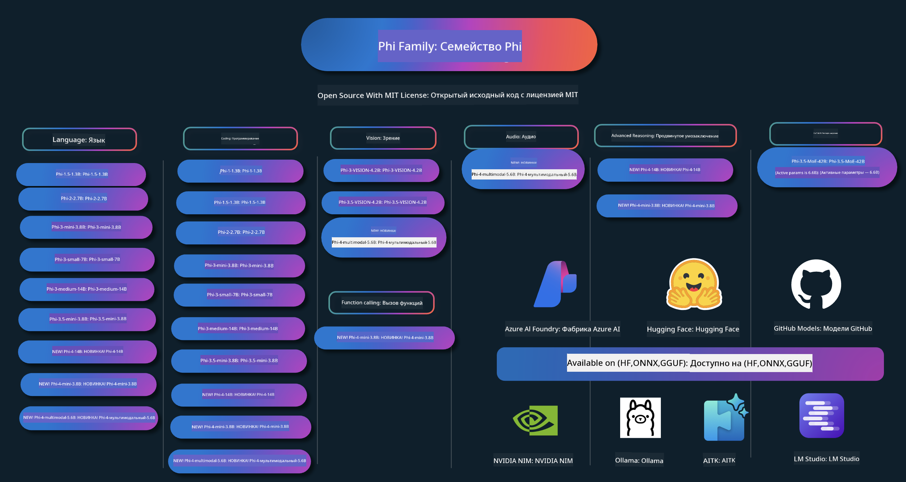

<!--
CO_OP_TRANSLATOR_METADATA:
{
  "original_hash": "469e2c58e8d576f8bfdf9e4ca2218897",
  "translation_date": "2025-05-06T11:01:53+00:00",
  "source_file": "README.md",
  "language_code": "ru"
}
-->
# Phi Cookbook: Практические примеры с моделями Phi от Microsoft

  

  
  
  

  
  

Phi — это серия моделей искусственного интеллекта с открытым исходным кодом, разработанных Microsoft.

В настоящее время Phi является самой мощной и экономичной небольшой языковой моделью (SLM), демонстрирующей отличные результаты в многоязычных задачах, логическом мышлении, генерации текста/чата, программировании, работе с изображениями, аудио и других сценариях.

Вы можете развернуть Phi в облаке или на устройствах на периферии сети, а также легко создавать генеративные AI-приложения с ограниченными вычислительными ресурсами.

Следуйте этим шагам, чтобы начать работу с этими ресурсами:  
1. **Сделайте форк репозитория**: Нажмите   
2. **Клонируйте репозиторий**: `git clone https://github.com/microsoft/PhiCookBook.git`  
3. [**Присоединяйтесь к сообществу Microsoft AI в Discord и общайтесь с экспертами и разработчиками**](https://discord.com/invite/ByRwuEEgH4?WT.mc_id=aiml-137032-kinfeylo)

## 🌐 Поддержка нескольких языков

### Поддерживается через GitHub Action (автоматически и всегда актуально)

[French](../fr/README.md) | [Spanish](../es/README.md) | [German](../de/README.md) | [Russian](./README.md) | [Arabic](../ar/README.md) | [Persian (Farsi)](../fa/README.md) | [Urdu](../ur/README.md) | [Chinese (Simplified)](../zh/README.md) | [Chinese (Traditional, Macau)](../mo/README.md) | [Chinese (Traditional, Hong Kong)](../hk/README.md) | [Chinese (Traditional, Taiwan)](../tw/README.md) | [Japanese](../ja/README.md) | [Korean](../ko/README.md) | [Hindi](../hi/README.md)

### Поддерживается через CLI — в разработке
[Bengali](../bn/README.md) | [Marathi](../mr/README.md) | [Nepali](../ne/README.md) | [Punjabi (Gurmukhi)](../pa/README.md) | [Portuguese (Portugal)](../pt/README.md) | [Portuguese (Brazil)](../br/README.md) | [Italian](../it/README.md) | [Polish](../pl/README.md) | [Turkish](../tr/README.md) | [Greek](../el/README.md) | [Thai](../th/README.md) | [Swedish](../sv/README.md) | [Danish](../da/README.md) | [Norwegian](../no/README.md) | [Finnish](../fi/README.md) | [Dutch](../nl/README.md) | [Hebrew](../he/README.md) | [Vietnamese](../vi/README.md) | [Indonesian](../id/README.md) | [Malay](../ms/README.md) | [Tagalog (Filipino)](../tl/README.md) | [Swahili](../sw/README.md) | [Hungarian](../hu/README.md) | [Czech](../cs/README.md) | [Slovak](../sk/README.md) | [Romanian](../ro/README.md) | [Bulgarian](../bg/README.md) | [Serbian (Cyrillic)](../sr/README.md) | [Croatian](../hr/README.md) | [Slovenian](../sl/README.md)

## Содержание

- Введение
- [Добро пожаловать в семью Phi](./md/01.Introduction/01/01.PhiFamily.md)
  - [Настройка вашей среды](./md/01.Introduction/01/01.EnvironmentSetup.md)
  - [Понимание ключевых технологий](./md/01.Introduction/01/01.Understandingtech.md)
  - [Безопасность ИИ для моделей Phi](./md/01.Introduction/01/01.AISafety.md)
  - [Поддержка оборудования Phi](./md/01.Introduction/01/01.Hardwaresupport.md)
  - [Модели Phi и их доступность на разных платформах](./md/01.Introduction/01/01.Edgeandcloud.md)
  - [Использование Guidance-ai и Phi](./md/01.Introduction/01/01.Guidance.md)
  - [Модели на GitHub Marketplace](https://github.com/marketplace/models)
  - [Каталог моделей Azure AI](https://ai.azure.com)

- Запуск Phi в разных средах
    -  [Hugging face](./md/01.Introduction/02/01.HF.md)
    -  [Модели GitHub](./md/01.Introduction/02/02.GitHubModel.md)
    -  [Каталог моделей Azure AI Foundry](./md/01.Introduction/02/03.AzureAIFoundry.md)
    -  [Ollama](./md/01.Introduction/02/04.Ollama.md)
    -  [AI Toolkit VSCode (AITK)](./md/01.Introduction/02/05.AITK.md)
    -  [NVIDIA NIM](./md/01.Introduction/02/06.NVIDIA.md)

- Запуск Phi Family
    - [Запуск Phi на iOS](./md/01.Introduction/03/iOS_Inference.md)
    - [Запуск Phi на Android](./md/01.Introduction/03/Android_Inference.md)
    - [Запуск Phi на Jetson](./md/01.Introduction/03/Jetson_Inference.md)
    - [Запуск Phi на AI PC](./md/01.Introduction/03/AIPC_Inference.md)
    - [Запуск Phi с использованием Apple MLX Framework](./md/01.Introduction/03/MLX_Inference.md)
    - [Запуск Phi на локальном сервере](./md/01.Introduction/03/Local_Server_Inference.md)
    - [Запуск Phi на удалённом сервере с помощью AI Toolkit](./md/01.Introduction/03/Remote_Interence.md)
    - [Запуск Phi с Rust](./md/01.Introduction/03/Rust_Inference.md)
    - [Запуск Phi--Vision локально](./md/01.Introduction/03/Vision_Inference.md)
    - [Запуск Phi с Kaito AKS, Azure Containers (официальная поддержка)](./md/01.Introduction/03/Kaito_Inference.md)
-  [Квантование Phi Family](./md/01.Introduction/04/QuantifyingPhi.md)
    - [Квантование Phi-3.5 / 4 с помощью llama.cpp](./md/01.Introduction/04/UsingLlamacppQuantifyingPhi.md)
    - [Квантование Phi-3.5 / 4 с помощью расширений Generative AI для onnxruntime](./md/01.Introduction/04/UsingORTGenAIQuantifyingPhi.md)
    - [Квантование Phi-3.5 / 4 с использованием Intel OpenVINO](./md/01.Introduction/04/UsingIntelOpenVINOQuantifyingPhi.md)
    - [Квантование Phi-3.5 / 4 с использованием Apple MLX Framework](./md/01.Introduction/04/UsingAppleMLXQuantifyingPhi.md)

-  Оценка Phi
- [Response AI](./md/01.Introduction/05/ResponsibleAI.md)
    - [Azure AI Foundry для оценки](./md/01.Introduction/05/AIFoundry.md)
    - [Использование Promptflow для оценки](./md/01.Introduction/05/Promptflow.md)
 
- RAG с Azure AI Search
    - [Как использовать Phi-4-mini и Phi-4-multimodal(RAG) с Azure AI Search](https://github.com/microsoft/PhiCookBook/blob/main/code/06.E2E/E2E_Phi-4-RAG-Azure-AI-Search.ipynb)

- Примеры разработки приложений Phi
  - Текстовые и чат-приложения
    - Образцы Phi-4 🆕
      - [📓] [Чат с моделью Phi-4-mini ONNX](./md/02.Application/01.TextAndChat/Phi4/ChatWithPhi4ONNX/README.md)
      - [Чат с локальной моделью Phi-4 ONNX на .NET](../../md/04.HOL/dotnet/src/LabsPhi4-Chat-01OnnxRuntime)
      - [Консольное чат-приложение .NET с Phi-4 ONNX и Semantic Kernel](../../md/04.HOL/dotnet/src/LabsPhi4-Chat-02SK)
    - Образцы Phi-3 / 3.5
      - [Локальный чатбот в браузере с использованием Phi3, ONNX Runtime Web и WebGPU](https://github.com/microsoft/onnxruntime-inference-examples/tree/main/js/chat)
      - [OpenVino Chat](./md/02.Application/01.TextAndChat/Phi3/E2E_OpenVino_Chat.md)
      - [Мульти-модель — интерактивный Phi-3-mini и OpenAI Whisper](./md/02.Application/01.TextAndChat/Phi3/E2E_Phi-3-mini_with_whisper.md)
      - [MLFlow — создание обертки и использование Phi-3 с MLFlow](./md//02.Application/01.TextAndChat/Phi3/E2E_Phi-3-MLflow.md)
      - [Оптимизация модели — как оптимизировать Phi-3-mini для ONNX Runtime Web с Olive](https://github.com/microsoft/Olive/tree/main/examples/phi3)
      - [WinUI3 приложение с Phi-3 mini-4k-instruct-onnx](https://github.com/microsoft/Phi3-Chat-WinUI3-Sample/)
      - [Пример приложения заметок с поддержкой нескольких моделей на WinUI3](https://github.com/microsoft/ai-powered-notes-winui3-sample)
      - [Тонкая настройка и интеграция кастомных моделей Phi-3 с Prompt flow](./md/02.Application/01.TextAndChat/Phi3/E2E_Phi-3-FineTuning_PromptFlow_Integration.md)
      - [Тонкая настройка и интеграция кастомных моделей Phi-3 с Prompt flow в Azure AI Foundry](./md/02.Application/01.TextAndChat/Phi3/E2E_Phi-3-FineTuning_PromptFlow_Integration_AIFoundry.md)
      - [Оценка тонко настроенной модели Phi-3 / Phi-3.5 в Azure AI Foundry с фокусом на принципы Responsible AI от Microsoft](./md/02.Application/01.TextAndChat/Phi3/E2E_Phi-3-Evaluation_AIFoundry.md)
      - [📓] [Пример языкового предсказания Phi-3.5-mini-instruct (китайский/английский)](../../md/02.Application/01.TextAndChat/Phi3/phi3-instruct-demo.ipynb)
      - [Phi-3.5-Instruct WebGPU RAG чатбот](./md/02.Application/01.TextAndChat/Phi3/WebGPUWithPhi35Readme.md)
      - [Использование Windows GPU для создания решения Prompt flow с Phi-3.5-Instruct ONNX](./md/02.Application/01.TextAndChat/Phi3/UsingPromptFlowWithONNX.md)
      - [Использование Microsoft Phi-3.5 tflite для создания Android-приложения](./md/02.Application/01.TextAndChat/Phi3/UsingPhi35TFLiteCreateAndroidApp.md)
      - [Пример Q&A на .NET с использованием локальной модели ONNX Phi-3 и Microsoft.ML.OnnxRuntime](../../md/04.HOL/dotnet/src/LabsPhi301)
      - [Консольное чат-приложение .NET с Semantic Kernel и Phi-3](../../md/04.HOL/dotnet/src/LabsPhi302)

  - Примеры кода на базе Azure AI Inference SDK
    - Образцы Phi-4 🆕
      - [📓] [Генерация кода проекта с использованием Phi-4-multimodal](./md/02.Application/02.Code/Phi4/GenProjectCode/README.md)
    - Образцы Phi-3 / 3.5
      - [Создайте свой чат GitHub Copilot для Visual Studio Code с Microsoft Phi-3 Family](./md/02.Application/02.Code/Phi3/VSCodeExt/README.md)
      - [Создайте своего чат-агента для Visual Studio Code с Phi-3.5 на базе моделей GitHub](./md/02.Application/02.Code/Phi3/CreateVSCodeChatAgentWithGitHubModels.md)

  - Примеры продвинутого рассуждения
    - Образцы Phi-4 🆕
      - [📓] [Образцы Phi-4-mini-reasoning или Phi-4-reasoning](./md/02.Application/03.AdvancedReasoning/Phi4/AdvancedResoningPhi4mini/README.md)
      - [📓] [Тонкая настройка Phi-4-mini-reasoning с Microsoft Olive](../../md/02.Application/03.AdvancedReasoning/Phi4/AdvancedResoningPhi4mini/olive_ft_phi_4_reasoning_with_medicaldata.ipynb)
      - [📓] [Тонкая настройка Phi-4-mini-reasoning с Apple MLX](../../md/02.Application/03.AdvancedReasoning/Phi4/AdvancedResoningPhi4mini/mlx_ft_phi_4_reasoning_with_medicaldata.ipynb)
      - [📓] [Phi-4-mini-reasoning с моделями GitHub](../../md/02.Application/02.Code/Phi4r/github_models_inference.ipynb)
- [📓] [Phi-4-mini reasoning с моделями Azure AI Foundry](../../md/02.Application/02.Code/Phi4r/azure_models_inference.ipynb)
  - Демонстрации
      - [Phi-4-mini демонстрации на Hugging Face Spaces](https://huggingface.co/spaces/microsoft/phi-4-mini?WT.mc_id=aiml-137032-kinfeylo)
      - [Phi-4-мультимодальные демонстрации на Hugging Face Spaces](https://huggingface.co/spaces/microsoft/phi-4-multimodal?WT.mc_id=aiml-137032-kinfeylo)
  - Примеры Vision
    - Примеры Phi-4 🆕
      - [📓] [Использование Phi-4-мультимодального для чтения изображений и генерации кода](./md/02.Application/04.Vision/Phi4/CreateFrontend/README.md) 
    - Примеры Phi-3 / 3.5
      -  [📓][Phi-3-vision: преобразование текста на изображении в текст](../../md/02.Application/04.Vision/Phi3/E2E_Phi-3-vision-image-text-to-text-online-endpoint.ipynb)
      - [Phi-3-vision-ONNX](https://onnxruntime.ai/docs/genai/tutorials/phi3-v.html)
      - [📓][Phi-3-vision CLIP Embedding](../../md/02.Application/04.Vision/Phi3/E2E_Phi-3-vision-image-text-to-text-online-endpoint.ipynb)
      - [ДЕМО: Phi-3 Recycling](https://github.com/jennifermarsman/PhiRecycling/)
      - [Phi-3-vision — визуальный языковой ассистент с Phi3-Vision и OpenVINO](https://docs.openvino.ai/nightly/notebooks/phi-3-vision-with-output.html)
      - [Phi-3 Vision Nvidia NIM](./md/02.Application/04.Vision/Phi3/E2E_Nvidia_NIM_Vision.md)
      - [Phi-3 Vision OpenVino](./md/02.Application/04.Vision/Phi3/E2E_OpenVino_Phi3Vision.md)
      - [📓][Phi-3.5 Vision пример с несколькими кадрами или изображениями](../../md/02.Application/04.Vision/Phi3/phi3-vision-demo.ipynb)
      - [Phi-3 Vision локальная ONNX модель с использованием Microsoft.ML.OnnxRuntime .NET](../../md/04.HOL/dotnet/src/LabsPhi303)
      - [Меню для Phi-3 Vision локальной ONNX модели с использованием Microsoft.ML.OnnxRuntime .NET](../../md/04.HOL/dotnet/src/LabsPhi304)

  - Примеры Audio
    - Примеры Phi-4 🆕
      - [📓] [Извлечение транскриптов аудио с помощью Phi-4-мультимодального](./md/02.Application/05.Audio/Phi4/Transciption/README.md)
      - [📓] [Пример аудио с Phi-4-мультимодальным](../../md/02.Application/05.Audio/Phi4/Siri/demo.ipynb)
      - [📓] [Пример перевода речи с Phi-4-мультимодальным](../../md/02.Application/05.Audio/Phi4/Translate/demo.ipynb)
      - [.NET консольное приложение с использованием Phi-4-мультимодального для анализа аудиофайла и генерации транскрипта](../../md/04.HOL/dotnet/src/LabsPhi4-MultiModal-02Audio)

  - Примеры MOE
    - Примеры Phi-3 / 3.5
      - [📓] [Пример модели Mixture of Experts (MoEs) Phi-3.5 для социальных сетей](../../md/02.Application/06.MoE/Phi3/phi3_moe_demo.ipynb)
      - [📓] [Создание RAG-пайплайна с NVIDIA NIM Phi-3 MOE, Azure AI Search и LlamaIndex](../../md/02.Application/06.MoE/Phi3/azure-ai-search-nvidia-rag.ipynb)
  - Примеры вызова функций
    - Примеры Phi-4 🆕
      -  [📓] [Использование вызова функций с Phi-4-mini](./md/02.Application/07.FunctionCalling/Phi4/FunctionCallingBasic/README.md)
      -  [📓] [Использование вызова функций для создания мультиагентов с Phi-4-mini](../../md/02.Application/07.FunctionCalling/Phi4/Multiagents/Phi_4_mini_multiagent.ipynb)
      -  [📓] [Использование вызова функций с Ollama](../../md/02.Application/07.FunctionCalling/Phi4/Ollama/ollama_functioncalling.ipynb)
  - Примеры мультимодального смешивания
    - Примеры Phi-4 🆕
      -  [📓] [Использование Phi-4-мультимодального в роли технологического журналиста](../../md/02.Application/08.Multimodel/Phi4/TechJournalist/phi_4_mm_audio_text_publish_news.ipynb)
      - [.NET консольное приложение с использованием Phi-4-мультимодального для анализа изображений](../../md/04.HOL/dotnet/src/LabsPhi4-MultiModal-01Images)

- Примеры тонкой настройки Phi
  - [Сценарии тонкой настройки](./md/03.FineTuning/FineTuning_Scenarios.md)
  - [Тонкая настройка против RAG](./md/03.FineTuning/FineTuning_vs_RAG.md)
  - [Тонкая настройка: сделайте Phi-3 экспертом в отрасли](./md/03.FineTuning/LetPhi3gotoIndustriy.md)
  - [Тонкая настройка Phi-3 с AI Toolkit для VS Code](./md/03.FineTuning/Finetuning_VSCodeaitoolkit.md)
  - [Тонкая настройка Phi-3 с Azure Machine Learning Service](./md/03.FineTuning/Introduce_AzureML.md)
- [Тонкая настройка Phi-3 с помощью Lora](./md/03.FineTuning/FineTuning_Lora.md)
  - [Тонкая настройка Phi-3 с QLora](./md/03.FineTuning/FineTuning_Qlora.md)
  - [Тонкая настройка Phi-3 с Azure AI Foundry](./md/03.FineTuning/FineTuning_AIFoundry.md)
  - [Тонкая настройка Phi-3 с Azure ML CLI/SDK](./md/03.FineTuning/FineTuning_MLSDK.md)
  - [Тонкая настройка с Microsoft Olive](./md/03.FineTuning/FineTuning_MicrosoftOlive.md)
  - [Практическая лаборатория по тонкой настройке с Microsoft Olive](./md/03.FineTuning/olive-lab/readme.md)
  - [Тонкая настройка Phi-3-vision с Weights and Bias](./md/03.FineTuning/FineTuning_Phi-3-visionWandB.md)
  - [Тонкая настройка Phi-3 с Apple MLX Framework](./md/03.FineTuning/FineTuning_MLX.md)
  - [Тонкая настройка Phi-3-vision (официальная поддержка)](./md/03.FineTuning/FineTuning_Vision.md)
  - [Тонкая настройка Phi-3 с Kaito AKS, Azure Containers (официальная поддержка)](./md/03.FineTuning/FineTuning_Kaito.md)
  - [Тонкая настройка Phi-3 и 3.5 Vision](https://github.com/2U1/Phi3-Vision-Finetune)

- Практическая лаборатория
  - [Изучение передовых моделей: LLM, SLM, локальная разработка и многое другое](https://github.com/microsoft/aitour-exploring-cutting-edge-models)
  - [Раскрытие потенциала NLP: тонкая настройка с Microsoft Olive](https://github.com/azure/Ignite_FineTuning_workshop)

- Академические исследования и публикации
  - [Textbooks Are All You Need II: технический отчет phi-1.5](https://arxiv.org/abs/2309.05463)
  - [Технический отчет Phi-3: высокоэффективная языковая модель локально на вашем телефоне](https://arxiv.org/abs/2404.14219)
  - [Технический отчет Phi-4](https://arxiv.org/abs/2412.08905)
  - [Технический отчет Phi-4-Mini: компактные, но мощные мультимодальные языковые модели через Mixture-of-LoRAs](https://arxiv.org/abs/2503.01743)
  - [Оптимизация небольших языковых моделей для вызова функций в автомобиле](https://arxiv.org/abs/2501.02342)
  - [(WhyPHI) Тонкая настройка PHI-3 для ответов на вопросы с выбором ответа: методология, результаты и вызовы](https://arxiv.org/abs/2501.01588)
  - [Технический отчет Phi-4-reasoning](https://www.microsoft.com/en-us/research/wp-content/uploads/2025/04/phi_4_reasoning.pdf)
  - [Технический отчет Phi-4-mini-reasoning](https://huggingface.co/microsoft/Phi-4-mini-reasoning/blob/main/Phi-4-Mini-Reasoning.pdf)

## Использование моделей Phi

### Phi на Azure AI Foundry

Вы можете узнать, как использовать Microsoft Phi и создавать комплексные решения для различных аппаратных устройств. Чтобы попробовать Phi самостоятельно, начните с работы с моделями и настройки Phi под ваши задачи, используя [Azure AI Foundry Azure AI Model Catalog](https://aka.ms/phi3-azure-ai). Подробнее смотрите в разделе Начало работы с [Azure AI Foundry](/md/02.QuickStart/AzureAIFoundry_QuickStart.md)

**Песочница**  
Для каждой модели есть отдельная песочница для тестирования модели [Azure AI Playground](https://aka.ms/try-phi3).

### Phi на GitHub Models

Вы можете узнать, как использовать Microsoft Phi и создавать комплексные решения для различных аппаратных устройств. Чтобы попробовать Phi самостоятельно, начните с работы с моделью и настройки Phi под ваши задачи, используя [GitHub Model Catalog](https://github.com/marketplace/models?WT.mc_id=aiml-137032-kinfeylo). Подробнее смотрите в разделе Начало работы с [GitHub Model Catalog](/md/02.QuickStart/GitHubModel_QuickStart.md)

**Песочница**  
Для каждой модели есть отдельная [песочница для тестирования модели](/md/02.QuickStart/GitHubModel_QuickStart.md).

### Phi на Hugging Face

Модель также доступна на [Hugging Face](https://huggingface.co/microsoft)

**Песочница**  
[Hugging Chat playground](https://huggingface.co/chat/models/microsoft/Phi-3-mini-4k-instruct)

## Ответственный ИИ

Microsoft стремится помогать нашим клиентам использовать ИИ-продукты ответственно, делиться нашими знаниями и строить партнерские отношения на основе доверия с помощью таких инструментов, как Transparency Notes и Impact Assessments. Многие из этих ресурсов доступны по адресу [https://aka.ms/RAI](https://aka.ms/RAI).  
Подход Microsoft к ответственному ИИ основан на принципах справедливости, надежности и безопасности, конфиденциальности и защите данных, инклюзивности, прозрачности и подотчетности.
Крупномасштабные модели обработки естественного языка, изображений и речи — такие, как используемые в этом примере — могут иногда вести себя несправедливо, ненадежно или оскорбительно, что может причинять вред. Пожалуйста, ознакомьтесь с [заметкой о прозрачности службы Azure OpenAI](https://learn.microsoft.com/legal/cognitive-services/openai/transparency-note?tabs=text), чтобы быть в курсе рисков и ограничений.

Рекомендуемый подход к снижению этих рисков — включить в архитектуру систему безопасности, которая сможет обнаруживать и предотвращать вредоносное поведение. [Azure AI Content Safety](https://learn.microsoft.com/azure/ai-services/content-safety/overview) предоставляет независимый уровень защиты, способный выявлять вредоносный контент, созданный пользователями и ИИ, в приложениях и сервисах. Azure AI Content Safety включает API для работы с текстом и изображениями, которые позволяют обнаруживать вредоносный материал. В рамках Azure AI Foundry сервис Content Safety позволяет просматривать, изучать и пробовать пример кода для обнаружения вредоносного контента в разных форматах. Следующая [документация по быстрому старту](https://learn.microsoft.com/azure/ai-services/content-safety/quickstart-text?tabs=visual-studio%2Clinux&pivots=programming-language-rest) проведет вас через процесс отправки запросов к сервису.

Еще один важный аспект — общая производительность приложения. В многомодальных и многомодельных приложениях под производительностью понимается соответствие работы системы вашим и ожиданиям пользователей, включая отсутствие генерации вредоносного контента. Важно оценивать производительность всего приложения с помощью [оценщиков производительности, качества, риска и безопасности](https://learn.microsoft.com/azure/ai-studio/concepts/evaluation-metrics-built-in). У вас также есть возможность создавать и оценивать систему с помощью [пользовательских оценщиков](https://learn.microsoft.com/azure/ai-studio/how-to/develop/evaluate-sdk#custom-evaluators).

Вы можете оценить ваше AI-приложение в среде разработки с помощью [Azure AI Evaluation SDK](https://microsoft.github.io/promptflow/index.html). Имея тестовый набор данных или целевой результат, генерации вашего генеративного AI-приложения количественно измеряются встроенными или пользовательскими оценщиками по вашему выбору. Чтобы начать работу с Azure AI Evaluation SDK для оценки вашей системы, вы можете следовать [руководству по быстрому старту](https://learn.microsoft.com/azure/ai-studio/how-to/develop/flow-evaluate-sdk). После выполнения оценки вы можете [визуализировать результаты в Azure AI Foundry](https://learn.microsoft.com/azure/ai-studio/how-to/evaluate-flow-results).

## Товарные знаки

Этот проект может содержать товарные знаки или логотипы проектов, продуктов или сервисов. Авторизованное использование товарных знаков или логотипов Microsoft подчиняется и должно соответствовать [Правилам использования товарных знаков и брендов Microsoft](https://www.microsoft.com/legal/intellectualproperty/trademarks/usage/general). Использование товарных знаков или логотипов Microsoft в изменённых версиях этого проекта не должно вызывать путаницу или создавать впечатление спонсорства со стороны Microsoft. Любое использование товарных знаков или логотипов третьих сторон подчиняется политикам соответствующих третьих сторон.

**Отказ от ответственности**:  
Этот документ был переведен с помощью сервиса автоматического перевода [Co-op Translator](https://github.com/Azure/co-op-translator). Несмотря на наши усилия по обеспечению точности, пожалуйста, имейте в виду, что автоматический перевод может содержать ошибки или неточности. Оригинальный документ на его исходном языке следует считать авторитетным источником. Для получения критически важной информации рекомендуется обратиться к профессиональному переводу, выполненному человеком. Мы не несем ответственности за любые недоразумения или неправильные толкования, возникшие в результате использования данного перевода.