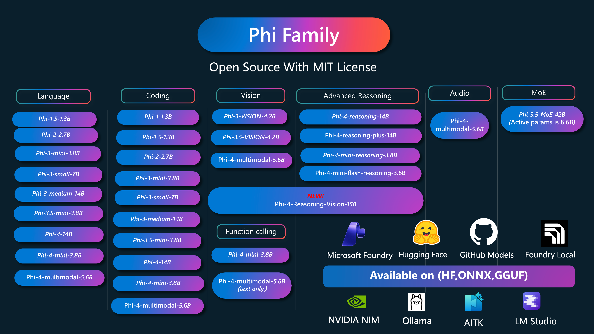

<!--
CO_OP_TRANSLATOR_METADATA:
{
  "original_hash": "a73c59eecd7ad4ec494fd4333a29e208",
  "translation_date": "2025-10-11T10:31:19+00:00",
  "source_file": "README.md",
  "language_code": "ru"
}
-->
# Книга рецептов Phi: Практические примеры с моделями Microsoft Phi

Phi — это серия моделей искусственного интеллекта с открытым исходным кодом, разработанных Microsoft.

Phi в настоящее время является самой мощной и экономически эффективной малой языковой моделью (SLM), демонстрирующей отличные результаты в многозадачности, рассуждениях, генерации текста/чатов, кодировании, обработке изображений, аудио и других сценариях.

Вы можете развернуть Phi в облаке или на периферийных устройствах, а также легко создавать приложения генеративного ИИ с ограниченными вычислительными ресурсами.

Следуйте этим шагам, чтобы начать использовать эти ресурсы:
1. **Сделайте форк репозитория**: Нажмите 
2. **Клонируйте репозиторий**:   `git clone https://github.com/microsoft/PhiCookBook.git`
3. [**Присоединяйтесь к сообществу Microsoft AI Discord и общайтесь с экспертами и разработчиками**](https://discord.com/invite/ByRwuEEgH4?WT.mc_id=aiml-137032-kinfeylo)

### 🌐 Поддержка нескольких языков

#### Поддерживается через GitHub Action (автоматически и всегда актуально)

<!-- CO-OP TRANSLATOR LANGUAGES TABLE START -->
[Арабский](../ar/README.md) | [Бенгальский](../bn/README.md) | [Болгарский](../bg/README.md) | [Бирманский (Мьянма)](../my/README.md) | [Китайский (упрощенный)](../zh/README.md) | [Китайский (традиционный, Гонконг)](../hk/README.md) | [Китайский (традиционный, Макао)](../mo/README.md) | [Китайский (традиционный, Тайвань)](../tw/README.md) | [Хорватский](../hr/README.md) | [Чешский](../cs/README.md) | [Датский](../da/README.md) | [Голландский](../nl/README.md) | [Эстонский](../et/README.md) | [Финский](../fi/README.md) | [Французский](../fr/README.md) | [Немецкий](../de/README.md) | [Греческий](../el/README.md) | [Иврит](../he/README.md) | [Хинди](../hi/README.md) | [Венгерский](../hu/README.md) | [Индонезийский](../id/README.md) | [Итальянский](../it/README.md) | [Японский](../ja/README.md) | [Корейский](../ko/README.md) | [Литовский](../lt/README.md) | [Малайский](../ms/README.md) | [Маратхи](../mr/README.md) | [Непальский](../ne/README.md) | [Норвежский](../no/README.md) | [Персидский (фарси)](../fa/README.md) | [Польский](../pl/README.md) | [Португальский (Бразилия)](../br/README.md) | [Португальский (Португалия)](../pt/README.md) | [Панджаби (гурмукхи)](../pa/README.md) | [Румынский](../ro/README.md) | [Русский](./README.md) | [Сербский (кириллица)](../sr/README.md) | [Словацкий](../sk/README.md) | [Словенский](../sl/README.md) | [Испанский](../es/README.md) | [Суахили](../sw/README.md) | [Шведский](../sv/README.md) | [Тагальский (филиппинский)](../tl/README.md) | [Тамильский](../ta/README.md) | [Тайский](../th/README.md) | [Турецкий](../tr/README.md) | [Украинский](../uk/README.md) | [Урду](../ur/README.md) | [Вьетнамский](../vi/README.md)
<!-- CO-OP TRANSLATOR LANGUAGES TABLE END -->

## Содержание

- Введение
  - [Добро пожаловать в семью Phi](./md/01.Introduction/01/01.PhiFamily.md)
  - [Настройка окружения](./md/01.Introduction/01/01.EnvironmentSetup.md)
  - [Понимание ключевых технологий](./md/01.Introduction/01/01.Understandingtech.md)
  - [Безопасность ИИ для моделей Phi](./md/01.Introduction/01/01.AISafety.md)
  - [Поддержка оборудования для Phi](./md/01.Introduction/01/01.Hardwaresupport.md)
  - [Модели Phi и доступность на различных платформах](./md/01.Introduction/01/01.Edgeandcloud.md)
  - [Использование Guidance-ai и Phi](./md/01.Introduction/01/01.Guidance.md)
  - [Модели на GitHub Marketplace](https://github.com/marketplace/models)
  - [Каталог моделей Azure AI](https://ai.azure.com)

- Использование Phi в различных средах
    -  [Hugging face](./md/01.Introduction/02/01.HF.md)
    -  [Модели GitHub](./md/01.Introduction/02/02.GitHubModel.md)
    -  [Каталог моделей Azure AI Foundry](./md/01.Introduction/02/03.AzureAIFoundry.md)
    -  [Ollama](./md/01.Introduction/02/04.Ollama.md)
    -  [AI Toolkit VSCode (AITK)](./md/01.Introduction/02/05.AITK.md)
    -  [NVIDIA NIM](./md/01.Introduction/02/06.NVIDIA.md)
    -  [Foundry Local](./md/01.Introduction/02/07.FoundryLocal.md)

- Использование семейства Phi
    - [Использование Phi на iOS](./md/01.Introduction/03/iOS_Inference.md)
    - [Использование Phi на Android](./md/01.Introduction/03/Android_Inference.md)
    - [Использование Phi на Jetson](./md/01.Introduction/03/Jetson_Inference.md)
    - [Использование Phi на AI PC](./md/01.Introduction/03/AIPC_Inference.md)
    - [Использование Phi с Apple MLX Framework](./md/01.Introduction/03/MLX_Inference.md)
    - [Использование Phi на локальном сервере](./md/01.Introduction/03/Local_Server_Inference.md)
    - [Использование Phi на удаленном сервере с AI Toolkit](./md/01.Introduction/03/Remote_Interence.md)
    - [Использование Phi с Rust](./md/01.Introduction/03/Rust_Inference.md)
    - [Использование Phi--Vision локально](./md/01.Introduction/03/Vision_Inference.md)
    - [Использование Phi с Kaito AKS, Azure Containers (официальная поддержка)](./md/01.Introduction/03/Kaito_Inference.md)
-  [Квантование семейства Phi](./md/01.Introduction/04/QuantifyingPhi.md)
    - [Квантование Phi-3.5 / 4 с использованием llama.cpp](./md/01.Introduction/04/UsingLlamacppQuantifyingPhi.md)
    - [Квантование Phi-3.5 / 4 с использованием расширений Generative AI для onnxruntime](./md/01.Introduction/04/UsingORTGenAIQuantifyingPhi.md)
    - [Квантование Phi-3.5 / 4 с использованием Intel OpenVINO](./md/01.Introduction/04/UsingIntelOpenVINOQuantifyingPhi.md)
    - [Квантование Phi-3.5 / 4 с использованием Apple MLX Framework](./md/01.Introduction/04/UsingAppleMLXQuantifyingPhi.md)

-  Оценка Phi
    - [Ответственный ИИ](./md/01.Introduction/05/ResponsibleAI.md)
    - [Оценка с помощью Azure AI Foundry](./md/01.Introduction/05/AIFoundry.md)
    - [Использование Promptflow для оценки](./md/01.Introduction/05/Promptflow.md)
 
- RAG с Azure AI Search
    - [Как использовать Phi-4-mini и Phi-4-multimodal (RAG) с Azure AI Search](https://github.com/microsoft/PhiCookBook/blob/main/code/06.E2E/E2E_Phi-4-RAG-Azure-AI-Search.ipynb)

- Примеры разработки приложений Phi
  - Текстовые и чат-приложения
    - Примеры Phi-4 🆕
      - [📓] [Чат с Phi-4-mini ONNX Model](./md/02.Application/01.TextAndChat/Phi4/ChatWithPhi4ONNX/README.md)
      - [Чат с локальной моделью Phi-4 ONNX .NET](../../md/04.HOL/dotnet/src/LabsPhi4-Chat-01OnnxRuntime)
      - [Консольное приложение .NET для чата с Phi-4 ONNX с использованием Semantic Kernel](../../md/04.HOL/dotnet/src/LabsPhi4-Chat-02SK)
    - Примеры Phi-3 / 3.5
      - [Локальный чат-бот в браузере с использованием Phi3, ONNX Runtime Web и WebGPU](https://github.com/microsoft/onnxruntime-inference-examples/tree/main/js/chat)
      - [Чат с OpenVino](./md/02.Application/01.TextAndChat/Phi3/E2E_OpenVino_Chat.md)
      - [Мульти-модель: интерактивный Phi-3-mini и OpenAI Whisper](./md/02.Application/01.TextAndChat/Phi3/E2E_Phi-3-mini_with_whisper.md)
      - [MLFlow - создание оболочки и использование Phi-3 с MLFlow](./md//02.Application/01.TextAndChat/Phi3/E2E_Phi-3-MLflow.md)
      - [Оптимизация модели - как оптимизировать модель Phi-3-min для ONNX Runtime Web с помощью Olive](https://github.com/microsoft/Olive/tree/main/examples/phi3)
- [Приложение WinUI3 с Phi-3 mini-4k-instruct-onnx](https://github.com/microsoft/Phi3-Chat-WinUI3-Sample/)
- [Пример приложения заметок на базе ИИ с несколькими моделями для WinUI3](https://github.com/microsoft/ai-powered-notes-winui3-sample)
- [Тонкая настройка и интеграция пользовательских моделей Phi-3 с Prompt flow](./md/02.Application/01.TextAndChat/Phi3/E2E_Phi-3-FineTuning_PromptFlow_Integration.md)
- [Тонкая настройка и интеграция пользовательских моделей Phi-3 с Prompt flow в Azure AI Foundry](./md/02.Application/01.TextAndChat/Phi3/E2E_Phi-3-FineTuning_PromptFlow_Integration_AIFoundry.md)
- [Оценка настроенной модели Phi-3 / Phi-3.5 в Azure AI Foundry с акцентом на принципы ответственного ИИ Microsoft](./md/02.Application/01.TextAndChat/Phi3/E2E_Phi-3-Evaluation_AIFoundry.md)
- [📓] [Пример языкового предсказания Phi-3.5-mini-instruct (китайский/английский)](../../md/02.Application/01.TextAndChat/Phi3/phi3-instruct-demo.ipynb)
- [Чат-бот Phi-3.5-Instruct WebGPU RAG](./md/02.Application/01.TextAndChat/Phi3/WebGPUWithPhi35Readme.md)
- [Использование GPU Windows для создания решения Prompt flow с Phi-3.5-Instruct ONNX](./md/02.Application/01.TextAndChat/Phi3/UsingPromptFlowWithONNX.md)
- [Создание Android-приложения с использованием Microsoft Phi-3.5 tflite](./md/02.Application/01.TextAndChat/Phi3/UsingPhi35TFLiteCreateAndroidApp.md)
- [Пример Q&A на .NET с использованием локальной модели ONNX Phi-3 и Microsoft.ML.OnnxRuntime](../../md/04.HOL/dotnet/src/LabsPhi301)
- [Консольное приложение чата на .NET с Semantic Kernel и Phi-3](../../md/04.HOL/dotnet/src/LabsPhi302)

- Примеры кода с использованием Azure AI Inference SDK
  - Примеры Phi-4 🆕
    - [📓] [Генерация кода проекта с использованием Phi-4-multimodal](./md/02.Application/02.Code/Phi4/GenProjectCode/README.md)
  - Примеры Phi-3 / 3.5
    - [Создайте свой собственный чат GitHub Copilot в Visual Studio Code с семейством Microsoft Phi-3](./md/02.Application/02.Code/Phi3/VSCodeExt/README.md)
    - [Создайте своего агента чата в Visual Studio Code с Phi-3.5 и моделями GitHub](/md/02.Application/02.Code/Phi3/CreateVSCodeChatAgentWithGitHubModels.md)

- Примеры продвинутого рассуждения
  - Примеры Phi-4 🆕
    - [📓] [Примеры Phi-4-mini-reasoning или Phi-4-reasoning](./md/02.Application/03.AdvancedReasoning/Phi4/AdvancedResoningPhi4mini/README.md)
    - [📓] [Тонкая настройка Phi-4-mini-reasoning с помощью Microsoft Olive](../../md/02.Application/03.AdvancedReasoning/Phi4/AdvancedResoningPhi4mini/olive_ft_phi_4_reasoning_with_medicaldata.ipynb)
    - [📓] [Тонкая настройка Phi-4-mini-reasoning с помощью Apple MLX](../../md/02.Application/03.AdvancedReasoning/Phi4/AdvancedResoningPhi4mini/mlx_ft_phi_4_reasoning_with_medicaldata.ipynb)
    - [📓] [Phi-4-mini-reasoning с моделями GitHub](../../md/02.Application/02.Code/Phi4r/github_models_inference.ipynb)
    - [📓] [Phi-4-mini-reasoning с моделями Azure AI Foundry](../../md/02.Application/02.Code/Phi4r/azure_models_inference.ipynb)
- Демонстрации
    - [Демонстрации Phi-4-mini, размещенные на Hugging Face Spaces](https://huggingface.co/spaces/microsoft/phi-4-mini?WT.mc_id=aiml-137032-kinfeylo)
    - [Демонстрации Phi-4-multimodal, размещенные на Hugging Face Spaces](https://huggingface.co/spaces/microsoft/phi-4-multimodal?WT.mc_id=aiml-137032-kinfeylo)
- Примеры для работы с изображениями
  - Примеры Phi-4 🆕
    - [📓] [Использование Phi-4-multimodal для чтения изображений и генерации кода](./md/02.Application/04.Vision/Phi4/CreateFrontend/README.md) 
  - Примеры Phi-3 / 3.5
    - [📓][Phi-3-vision: преобразование текста на изображении в текст](../../md/02.Application/04.Vision/Phi3/E2E_Phi-3-vision-image-text-to-text-online-endpoint.ipynb)
    - [Phi-3-vision-ONNX](https://onnxruntime.ai/docs/genai/tutorials/phi3-v.html)
    - [📓][Phi-3-vision: встраивание CLIP](../../md/02.Application/04.Vision/Phi3/E2E_Phi-3-vision-image-text-to-text-online-endpoint.ipynb)
    - [ДЕМО: Phi-3 Recycling](https://github.com/jennifermarsman/PhiRecycling/)
    - [Phi-3-vision - Визуальный языковой помощник - с Phi3-Vision и OpenVINO](https://docs.openvino.ai/nightly/notebooks/phi-3-vision-with-output.html)
    - [Phi-3 Vision Nvidia NIM](./md/02.Application/04.Vision/Phi3/E2E_Nvidia_NIM_Vision.md)
    - [Phi-3 Vision OpenVino](./md/02.Application/04.Vision/Phi3/E2E_OpenVino_Phi3Vision.md)
    - [📓][Пример работы с несколькими кадрами или изображениями в Phi-3.5 Vision](../../md/02.Application/04.Vision/Phi3/phi3-vision-demo.ipynb)
    - [Локальная модель ONNX Phi-3 Vision с использованием Microsoft.ML.OnnxRuntime .NET](../../md/04.HOL/dotnet/src/LabsPhi303)
    - [Меню на основе локальной модели ONNX Phi-3 Vision с использованием Microsoft.ML.OnnxRuntime .NET](../../md/04.HOL/dotnet/src/LabsPhi304)

- Примеры для работы с математикой
  - Примеры Phi-4-Mini-Flash-Reasoning-Instruct 🆕 [Математическая демонстрация с Phi-4-Mini-Flash-Reasoning-Instruct](../../md/02.Application/09.Math/MathDemo.ipynb)

- Примеры для работы с аудио
  - Примеры Phi-4 🆕
    - [📓] [Извлечение транскриптов аудио с использованием Phi-4-multimodal](./md/02.Application/05.Audio/Phi4/Transciption/README.md)
    - [📓] [Пример работы с аудио Phi-4-multimodal](../../md/02.Application/05.Audio/Phi4/Siri/demo.ipynb)
    - [📓] [Пример перевода речи с использованием Phi-4-multimodal](../../md/02.Application/05.Audio/Phi4/Translate/demo.ipynb)
    - [Консольное приложение .NET с использованием Phi-4-multimodal для анализа аудиофайла и создания транскрипта](../../md/04.HOL/dotnet/src/LabsPhi4-MultiModal-02Audio)

- Примеры MoE
  - Примеры Phi-3 / 3.5
    - [📓] [Пример моделей Mixture of Experts (MoEs) Phi-3.5 для социальных сетей](../../md/02.Application/06.MoE/Phi3/phi3_moe_demo.ipynb)
    - [📓] [Создание конвейера генерации с дополнением поиска (RAG) с NVIDIA NIM Phi-3 MOE, Azure AI Search и LlamaIndex](../../md/02.Application/06.MoE/Phi3/azure-ai-search-nvidia-rag.ipynb)

- Примеры вызова функций
  - Примеры Phi-4 🆕
    - [📓] [Использование вызова функций с Phi-4-mini](./md/02.Application/07.FunctionCalling/Phi4/FunctionCallingBasic/README.md)
    - [📓] [Использование вызова функций для создания мультиагентов с Phi-4-mini](../../md/02.Application/07.FunctionCalling/Phi4/Multiagents/Phi_4_mini_multiagent.ipynb)
    - [📓] [Использование вызова функций с Ollama](../../md/02.Application/07.FunctionCalling/Phi4/Ollama/ollama_functioncalling.ipynb)
    - [📓] [Использование вызова функций с ONNX](../../md/02.Application/07.FunctionCalling/Phi4/ONNX/onnx_parallel_functioncalling.ipynb)

- Примеры смешивания мультимодальностей
  - Примеры Phi-4 🆕
    - [📓] [Использование Phi-4-multimodal в качестве технологического журналиста](../../md/02.Application/08.Multimodel/Phi4/TechJournalist/phi_4_mm_audio_text_publish_news.ipynb)
    - [Консольное приложение .NET с использованием Phi-4-multimodal для анализа изображений](../../md/04.HOL/dotnet/src/LabsPhi4-MultiModal-01Images)

- Примеры тонкой настройки Phi
  - [Сценарии тонкой настройки](./md/03.FineTuning/FineTuning_Scenarios.md)
  - [Тонкая настройка vs RAG](./md/03.FineTuning/FineTuning_vs_RAG.md)
  - [Тонкая настройка: превращение Phi-3 в эксперта отрасли](./md/03.FineTuning/LetPhi3gotoIndustriy.md)
  - [Тонкая настройка Phi-3 с помощью AI Toolkit для VS Code](./md/03.FineTuning/Finetuning_VSCodeaitoolkit.md)
  - [Тонкая настройка Phi-3 с помощью Azure Machine Learning Service](./md/03.FineTuning/Introduce_AzureML.md)
  - [Тонкая настройка Phi-3 с помощью Lora](./md/03.FineTuning/FineTuning_Lora.md)
  - [Тонкая настройка Phi-3 с помощью QLora](./md/03.FineTuning/FineTuning_Qlora.md)
  - [Тонкая настройка Phi-3 с помощью Azure AI Foundry](./md/03.FineTuning/FineTuning_AIFoundry.md)
  - [Тонкая настройка Phi-3 с помощью Azure ML CLI/SDK](./md/03.FineTuning/FineTuning_MLSDK.md)
  - [Тонкая настройка с Microsoft Olive](./md/03.FineTuning/FineTuning_MicrosoftOlive.md)
  - [Практическая лаборатория по тонкой настройке с Microsoft Olive](./md/03.FineTuning/olive-lab/readme.md)
  - [Тонкая настройка Phi-3-vision с Weights and Bias](./md/03.FineTuning/FineTuning_Phi-3-visionWandB.md)
  - [Тонкая настройка Phi-3 с помощью Apple MLX Framework](./md/03.FineTuning/FineTuning_MLX.md)
  - [Тонкая настройка Phi-3-vision (официальная поддержка)](./md/03.FineTuning/FineTuning_Vision.md)
  - [Тонкая настройка Phi-3 с Kaito AKS, Azure Containers (официальная поддержка)](./md/03.FineTuning/FineTuning_Kaito.md)
  - [Тонкая настройка Phi-3 и 3.5 Vision](https://github.com/2U1/Phi3-Vision-Finetune)

- Практические лаборатории
  - [Изучение передовых моделей: LLM, SLM, локальная разработка и многое другое](https://github.com/microsoft/aitour-exploring-cutting-edge-models)
  - [Раскрытие потенциала NLP: Тонкая настройка с Microsoft Olive](https://github.com/azure/Ignite_FineTuning_workshop)

- Научные исследования и публикации
  - [Учебники - это все, что вам нужно II: технический отчет phi-1.5](https://arxiv.org/abs/2309.05463)
  - [Технический отчет Phi-3: Высококачественная языковая модель на вашем телефоне](https://arxiv.org/abs/2404.14219)
  - [Технический отчет Phi-4](https://arxiv.org/abs/2412.08905)
  - [Технический отчет Phi-4-Mini: Компактные, но мощные мультимодальные языковые модели с использованием Mixture-of-LoRAs](https://arxiv.org/abs/2503.01743)
- [Оптимизация небольших языковых моделей для вызова функций в автомобиле](https://arxiv.org/abs/2501.02342)
- [(WhyPHI) Тонкая настройка PHI-3 для ответов на вопросы с множественным выбором: методология, результаты и вызовы](https://arxiv.org/abs/2501.01588)
- [Технический отчет по Phi-4-reasoning](https://www.microsoft.com/en-us/research/wp-content/uploads/2025/04/phi_4_reasoning.pdf)
- [Технический отчет по Phi-4-mini-reasoning](https://huggingface.co/microsoft/Phi-4-mini-reasoning/blob/main/Phi-4-Mini-Reasoning.pdf)

## Использование моделей Phi

### Phi на Azure AI Foundry

Вы можете узнать, как использовать Microsoft Phi и создавать комплексные решения для различных аппаратных устройств. Чтобы попробовать Phi самостоятельно, начните с тестирования моделей и настройки Phi для ваших сценариев, используя [каталог моделей Azure AI Foundry](https://aka.ms/phi3-azure-ai). Подробнее можно узнать в разделе "Начало работы с [Azure AI Foundry](/md/02.QuickStart/AzureAIFoundry_QuickStart.md)".

**Песочница**  
Каждая модель имеет отдельную песочницу для тестирования [Azure AI Playground](https://aka.ms/try-phi3).

### Phi на GitHub Models

Вы можете узнать, как использовать Microsoft Phi и создавать комплексные решения для различных аппаратных устройств. Чтобы попробовать Phi самостоятельно, начните с тестирования модели и настройки Phi для ваших сценариев, используя [каталог моделей GitHub](https://github.com/marketplace/models?WT.mc_id=aiml-137032-kinfeylo). Подробнее можно узнать в разделе "Начало работы с [каталогом моделей GitHub](/md/02.QuickStart/GitHubModel_QuickStart.md)".

**Песочница**  
Каждая модель имеет отдельную [песочницу для тестирования модели](/md/02.QuickStart/GitHubModel_QuickStart.md).

### Phi на Hugging Face

Модель также доступна на [Hugging Face](https://huggingface.co/microsoft).

**Песочница**  
[Песочница Hugging Chat](https://huggingface.co/chat/models/microsoft/Phi-3-mini-4k-instruct).

## Ответственный подход к ИИ

Microsoft стремится помогать клиентам использовать наши продукты на основе ИИ ответственно, делиться накопленным опытом и строить партнерские отношения, основанные на доверии, с помощью таких инструментов, как Прозрачные заметки и Оценка воздействия. Многие из этих ресурсов доступны по адресу [https://aka.ms/RAI](https://aka.ms/RAI).  
Подход Microsoft к ответственному ИИ основан на наших принципах: справедливость, надежность и безопасность, конфиденциальность и защита, инклюзивность, прозрачность и ответственность.

Крупномасштабные модели обработки естественного языка, изображений и речи, такие как те, что используются в этом примере, могут вести себя несправедливо, ненадежно или оскорбительно, что может привести к негативным последствиям. Ознакомьтесь с [Прозрачной заметкой службы Azure OpenAI](https://learn.microsoft.com/legal/cognitive-services/openai/transparency-note?tabs=text), чтобы узнать о рисках и ограничениях.

Рекомендуемый подход к снижению этих рисков — включить систему безопасности в вашу архитектуру, которая сможет обнаруживать и предотвращать вредоносное поведение. [Azure AI Content Safety](https://learn.microsoft.com/azure/ai-services/content-safety/overview) предоставляет независимый уровень защиты, способный обнаруживать вредоносный контент, созданный пользователями или ИИ, в приложениях и сервисах. Azure AI Content Safety включает API для текста и изображений, которые позволяют обнаруживать вредоносные материалы. В рамках Azure AI Foundry служба Content Safety позволяет просматривать, изучать и тестировать пример кода для обнаружения вредоносного контента в различных модальностях. Следующая [документация по быстрому старту](https://learn.microsoft.com/azure/ai-services/content-safety/quickstart-text?tabs=visual-studio%2Clinux&pivots=programming-language-rest) поможет вам сделать запросы к сервису.

Еще один аспект, который следует учитывать, — это общая производительность приложения. В мультимодальных и многомодельных приложениях производительность означает, что система работает так, как ожидаете вы и ваши пользователи, включая предотвращение генерации вредоносных результатов. Важно оценить производительность вашего приложения с помощью [оценщиков производительности и качества, а также рисков и безопасности](https://learn.microsoft.com/azure/ai-studio/concepts/evaluation-metrics-built-in). У вас также есть возможность создавать и оценивать [пользовательские оценщики](https://learn.microsoft.com/azure/ai-studio/how-to/develop/evaluate-sdk#custom-evaluators).

Вы можете оценить ваше приложение на основе ИИ в вашей среде разработки, используя [Azure AI Evaluation SDK](https://microsoft.github.io/promptflow/index.html). Используя тестовый набор данных или целевую задачу, генерации вашего приложения на основе генеративного ИИ количественно измеряются с помощью встроенных или пользовательских оценщиков на ваш выбор. Чтобы начать работу с Azure AI Evaluation SDK для оценки вашей системы, следуйте [руководству по быстрому старту](https://learn.microsoft.com/azure/ai-studio/how-to/develop/flow-evaluate-sdk). После выполнения оценки вы можете [визуализировать результаты в Azure AI Foundry](https://learn.microsoft.com/azure/ai-studio/how-to/evaluate-flow-results).

## Торговые марки

Этот проект может содержать торговые марки или логотипы для проектов, продуктов или услуг. Разрешенное использование торговых марок или логотипов Microsoft должно соответствовать и следовать [Руководству по использованию торговых марок и брендов Microsoft](https://www.microsoft.com/legal/intellectualproperty/trademarks/usage/general).  
Использование торговых марок или логотипов Microsoft в модифицированных версиях этого проекта не должно вызывать путаницу или подразумевать спонсорство Microsoft. Любое использование торговых марок или логотипов третьих сторон должно соответствовать политике этих третьих сторон.

---

**Отказ от ответственности**:  
Этот документ был переведен с помощью сервиса автоматического перевода [Co-op Translator](https://github.com/Azure/co-op-translator). Несмотря на наши усилия обеспечить точность перевода, автоматические переводы могут содержать ошибки или неточности. Оригинальный документ на его родном языке следует считать авторитетным источником. Для получения критически важной информации рекомендуется профессиональный перевод человеком. Мы не несем ответственности за любые недоразумения или неправильные интерпретации, возникшие в результате использования данного перевода.