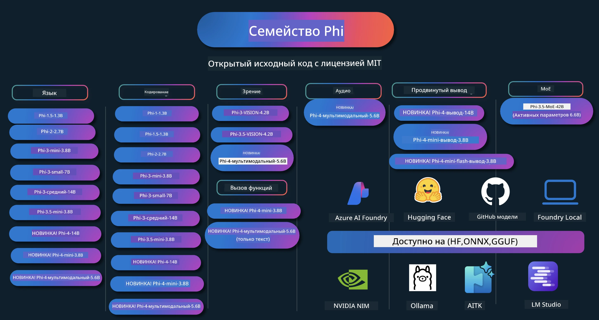

# Кулинарная книга Phi: практические примеры с моделями Phi от Microsoft

[](https://codespaces.new/microsoft/phicookbook)
[](https://vscode.dev/redirect?url=vscode://ms-vscode-remote.remote-containers/cloneInVolume?url=https://github.com/microsoft/phicookbook)

[](https://GitHub.com/microsoft/phicookbook/graphs/contributors/?WT.mc_id=aiml-137032-kinfeylo)
[](https://GitHub.com/microsoft/phicookbook/issues/?WT.mc_id=aiml-137032-kinfeylo)
[](https://GitHub.com/microsoft/phicookbook/pulls/?WT.mc_id=aiml-137032-kinfeylo)
[](http://makeapullrequest.com?WT.mc_id=aiml-137032-kinfeylo)

[](https://GitHub.com/microsoft/phicookbook/watchers/?WT.mc_id=aiml-137032-kinfeylo)
[](https://GitHub.com/microsoft/phicookbook/network/?WT.mc_id=aiml-137032-kinfeylo)
[](https://GitHub.com/microsoft/phicookbook/stargazers/?WT.mc_id=aiml-137032-kinfeylo)

[](https://discord.com/invite/ByRwuEEgH4)

Phi — это серия моделей искусственного интеллекта с открытым исходным кодом, разработанных Microsoft.

Phi в настоящее время является самой мощной и экономичной малой языковой моделью (SLM), показывающей очень хорошие показатели в многоязычии, рассуждениях, генерации текста/чата, программировании, работе с изображениями, аудио и других сценариях.

Вы можете развернуть Phi в облаке или на периферийных устройствах, а также легко создавать генеративные приложения искусственного интеллекта при ограниченных вычислительных ресурсах.

Чтобы начать использовать эти ресурсы, выполните следующие шаги:
1. **Форкнуть репозиторий**: Нажмите [](https://GitHub.com/microsoft/phicookbook/network/?WT.mc_id=aiml-137032-kinfeylo)
2. **Клонировать репозиторий**:   `git clone https://github.com/microsoft/PhiCookBook.git`
3. [**Присоединиться к сообществу Microsoft AI Discord и познакомиться с экспертами и разработчиками**](https://discord.com/invite/ByRwuEEgH4?WT.mc_id=aiml-137032-kinfeylo)



### 🌐 Многоязычная поддержка

#### Поддерживается через GitHub Action (автоматически и всегда в актуальном состоянии)

<!-- CO-OP TRANSLATOR LANGUAGES TABLE START -->
[Арабский](../ar/README.md) | [Бенгальский](../bn/README.md) | [Болгарский](../bg/README.md) | [Бирманский (Мьянма)](../my/README.md) | [Китайский (упрощенный)](../zh-CN/README.md) | [Китайский (традиционный, Гонконг)](../zh-HK/README.md) | [Китайский (традиционный, Макао)](../zh-MO/README.md) | [Китайский (традиционный, Тайвань)](../zh-TW/README.md) | [Хорватский](../hr/README.md) | [Чешский](../cs/README.md) | [Датский](../da/README.md) | [Голландский](../nl/README.md) | [Эстонский](../et/README.md) | [Финский](../fi/README.md) | [Французский](../fr/README.md) | [Немецкий](../de/README.md) | [Греческий](../el/README.md) | [Иврит](../he/README.md) | [Хинди](../hi/README.md) | [Венгерский](../hu/README.md) | [Индонезийский](../id/README.md) | [Итальянский](../it/README.md) | [Японский](../ja/README.md) | [Каннада](../kn/README.md) | [Корейский](../ko/README.md) | [Литовский](../lt/README.md) | [Малайский](../ms/README.md) | [Малаялам](../ml/README.md) | [Маратхи](../mr/README.md) | [Непальский](../ne/README.md) | [Нигерийский пиджин](../pcm/README.md) | [Норвежский](../no/README.md) | [Персидский (фарси)](../fa/README.md) | [Польский](../pl/README.md) | [Португальский (Бразилия)](../pt-BR/README.md) | [Португальский (Португалия)](../pt-PT/README.md) | [Пенджаби (Гурмукхи)](../pa/README.md) | [Румынский](../ro/README.md) | [Русский](./README.md) | [Сербский (кириллица)](../sr/README.md) | [Словацкий](../sk/README.md) | [Словенский](../sl/README.md) | [Испанский](../es/README.md) | [Свахили](../sw/README.md) | [Шведский](../sv/README.md) | [Тагальский (филиппинский)](../tl/README.md) | [Тамильский](../ta/README.md) | [Телугу](../te/README.md) | [Тайский](../th/README.md) | [Турецкий](../tr/README.md) | [Украинский](../uk/README.md) | [Урду](../ur/README.md) | [Вьетнамский](../vi/README.md)

> **Предпочитаете клонировать локально?**

> В этом репозитории содержится более 50 переводов на разные языки, что значительно увеличивает размер загрузки. Чтобы клонировать без переводов, используйте sparse checkout:
> ```bash
> git clone --filter=blob:none --sparse https://github.com/microsoft/PhiCookBook.git
> cd PhiCookBook
> git sparse-checkout set --no-cone '/*' '!translations' '!translated_images'
> ```
> Это даст вам всё необходимое для прохождения курса с гораздо более быстрой загрузкой.
<!-- CO-OP TRANSLATOR LANGUAGES TABLE END -->

## Содержание

- Введение
  - [Добро пожаловать в семью Phi](./md/01.Introduction/01/01.PhiFamily.md)
  - [Настройка вашей среды](./md/01.Introduction/01/01.EnvironmentSetup.md)
  - [Понимание ключевых технологий](./md/01.Introduction/01/01.Understandingtech.md)
  - [Безопасность ИИ для моделей Phi](./md/01.Introduction/01/01.AISafety.md)
  - [Поддержка оборудования Phi](./md/01.Introduction/01/01.Hardwaresupport.md)
  - [Модели Phi и их доступность на разных платформах](./md/01.Introduction/01/01.Edgeandcloud.md)
  - [Использование Guidance-ai и Phi](./md/01.Introduction/01/01.Guidance.md)
  - [Модели на GitHub Marketplace](https://github.com/marketplace/models)
  - [Каталог моделей Azure AI](https://ai.azure.com)

- Запуск Phi в разных средах
    -  [Hugging face](./md/01.Introduction/02/01.HF.md)
    -  [Модели GitHub](./md/01.Introduction/02/02.GitHubModel.md)
    -  [Каталог моделей Azure AI Foundry](./md/01.Introduction/02/03.AzureAIFoundry.md)
    -  [Ollama](./md/01.Introduction/02/04.Ollama.md)
    -  [AI Toolkit VSCode (AITK)](./md/01.Introduction/02/05.AITK.md)
    -  [NVIDIA NIM](./md/01.Introduction/02/06.NVIDIA.md)
    -  [Foundry Local](./md/01.Introduction/02/07.FoundryLocal.md)

- Запуск Phi Family
    - [Запуск Phi на iOS](./md/01.Introduction/03/iOS_Inference.md)
    - [Запуск Phi на Android](./md/01.Introduction/03/Android_Inference.md)
    - [Запуск Phi на Jetson](./md/01.Introduction/03/Jetson_Inference.md)
    - [Запуск Phi на AI PC](./md/01.Introduction/03/AIPC_Inference.md)
    - [Запуск Phi с помощью Apple MLX Framework](./md/01.Introduction/03/MLX_Inference.md)
    - [Запуск Phi на локальном сервере](./md/01.Introduction/03/Local_Server_Inference.md)
    - [Запуск Phi на удаленном сервере с использованием AI Toolkit](./md/01.Introduction/03/Remote_Interence.md)
    - [Запуск Phi с Rust](./md/01.Introduction/03/Rust_Inference.md)
    - [Запуск Phi--Vision локально](./md/01.Introduction/03/Vision_Inference.md)
    - [Запуск Phi с Kaito AKS, Azure Containers (официальная поддержка)](./md/01.Introduction/03/Kaito_Inference.md)
-  [Квантование Phi Family](./md/01.Introduction/04/QuantifyingPhi.md)
    - [Квантование Phi-3.5 / 4 с использованием llama.cpp](./md/01.Introduction/04/UsingLlamacppQuantifyingPhi.md)
    - [Квантование Phi-3.5 / 4 с использованием расширений Generative AI для onnxruntime](./md/01.Introduction/04/UsingORTGenAIQuantifyingPhi.md)
    - [Квантование Phi-3.5 / 4 с использованием Intel OpenVINO](./md/01.Introduction/04/UsingIntelOpenVINOQuantifyingPhi.md)
    - [Квантование Phi-3.5 / 4 с использованием Apple MLX Framework](./md/01.Introduction/04/UsingAppleMLXQuantifyingPhi.md)

-  Оценка Phi
    - [Ответственный ИИ](./md/01.Introduction/05/ResponsibleAI.md)
    - [Оценка с использованием Azure AI Foundry](./md/01.Introduction/05/AIFoundry.md)
    - [Использование Promptflow для оценки](./md/01.Introduction/05/Promptflow.md)
 
- RAG с Azure AI Search
    - [Как использовать Phi-4-mini и Phi-4-мультимодальный (RAG) с Azure AI Search](https://github.com/microsoft/PhiCookBook/blob/main/code/06.E2E/E2E_Phi-4-RAG-Azure-AI-Search.ipynb)

- Примеры разработки приложений Phi
  - Текстовые и чат-приложения
    - Образцы Phi-4 🆕
      - [📓] [Чат с моделью Phi-4-mini ONNX](./md/02.Application/01.TextAndChat/Phi4/ChatWithPhi4ONNX/README.md)
      - [Чат с локальной моделью Phi-4 ONNX .NET](../../md/04.HOL/dotnet/src/LabsPhi4-Chat-01OnnxRuntime)
      - [Чат консольного приложения .NET с Phi-4 ONNX и использованием Semantic Kernel](../../md/04.HOL/dotnet/src/LabsPhi4-Chat-02SK)
    - Образцы Phi-3 / 3.5
      - [Локальный чатбот в браузере с использованием Phi3, ONNX Runtime Web и WebGPU](https://github.com/microsoft/onnxruntime-inference-examples/tree/main/js/chat)
      - [OpenVino чат](./md/02.Application/01.TextAndChat/Phi3/E2E_OpenVino_Chat.md)
      - [Много моделей - интерактивные Phi-3-mini и OpenAI Whisper](./md/02.Application/01.TextAndChat/Phi3/E2E_Phi-3-mini_with_whisper.md)
      - [MLFlow - Создание обертки и использование Phi-3 с MLFlow](./md//02.Application/01.TextAndChat/Phi3/E2E_Phi-3-MLflow.md)
      - [Оптимизация модели - Как оптимизировать модель Phi-3-min для ONNX Runtime Web с помощью Olive](https://github.com/microsoft/Olive/tree/main/examples/phi3)
      - [WinUI3 приложение с Phi-3 mini-4k-instruct-onnx](https://github.com/microsoft/Phi3-Chat-WinUI3-Sample/)
      -[Пример приложения для заметок с несколькими моделями WinUI3 в AI](https://github.com/microsoft/ai-powered-notes-winui3-sample)
      - [Тонкая настройка и интеграция пользовательских моделей Phi-3 с Prompt flow](./md/02.Application/01.TextAndChat/Phi3/E2E_Phi-3-FineTuning_PromptFlow_Integration.md)
      - [Тонкая настройка и интеграция пользовательских моделей Phi-3 с Prompt flow в Azure AI Foundry](./md/02.Application/01.TextAndChat/Phi3/E2E_Phi-3-FineTuning_PromptFlow_Integration_AIFoundry.md)
      - [Оценка тонко настроенной модели Phi-3 / Phi-3.5 в Azure AI Foundry с акцентом на принципы ответственного ИИ Microsoft](./md/02.Application/01.TextAndChat/Phi3/E2E_Phi-3-Evaluation_AIFoundry.md)
      - [📓] [Пример языкового прогнозирования Phi-3.5-mini-instruct (китайский/английский)](./md/02.Application/01.TextAndChat/Phi3/phi3-instruct-demo.ipynb)
      - [Веб-GPU чат-бот Phi-3.5-Instruct RAG](./md/02.Application/01.TextAndChat/Phi3/WebGPUWithPhi35Readme.md)
      - [Использование Windows GPU для создания решения Prompt flow с Phi-3.5-Instruct ONNX](./md/02.Application/01.TextAndChat/Phi3/UsingPromptFlowWithONNX.md)
      - [Использование Microsoft Phi-3.5 tflite для создания Android приложения](./md/02.Application/01.TextAndChat/Phi3/UsingPhi35TFLiteCreateAndroidApp.md)
      - [Пример Q&A на .NET с использованием локальной модели ONNX Phi-3 с Microsoft.ML.OnnxRuntime](../../md/04.HOL/dotnet/src/LabsPhi301)
      - [Консольное чат-приложение на .NET с Semantic Kernel и Phi-3](../../md/04.HOL/dotnet/src/LabsPhi302)

  - Примеры кода на основе Azure AI Inference SDK 
    - Примеры Phi-4 🆕
      - [📓] [Генерация кода проекта с использованием Phi-4-multimodal](./md/02.Application/02.Code/Phi4/GenProjectCode/README.md)
    - Примеры Phi-3 / 3.5
      - [Создайте свой собственный чат GitHub Copilot для Visual Studio Code с Microsoft Phi-3 Family](./md/02.Application/02.Code/Phi3/VSCodeExt/README.md)
      - [Создайте собственного агента чата Visual Studio Code Copilot с Phi-3.5 от GitHub Models](/md/02.Application/02.Code/Phi3/CreateVSCodeChatAgentWithGitHubModels.md)

  - Примеры расширенного рассуждения
    - Примеры Phi-4 🆕
      - [📓] [Примеры Phi-4-mini-reasoning или Phi-4-reasoning](./md/02.Application/03.AdvancedReasoning/Phi4/AdvancedResoningPhi4mini/README.md)
      - [📓] [Тонкая настройка Phi-4-mini-reasoning с Microsoft Olive](./md/02.Application/03.AdvancedReasoning/Phi4/AdvancedResoningPhi4mini/olive_ft_phi_4_reasoning_with_medicaldata.ipynb)
      - [📓] [Тонкая настройка Phi-4-mini-reasoning с Apple MLX](./md/02.Application/03.AdvancedReasoning/Phi4/AdvancedResoningPhi4mini/mlx_ft_phi_4_reasoning_with_medicaldata.ipynb)
      - [📓] [Phi-4-mini-reasoning с GitHub Models](./md/02.Application/02.Code/Phi4r/github_models_inference.ipynb)
      - [📓] [Phi-4-mini-reasoning с Azure AI Foundry Models](./md/02.Application/02.Code/Phi4r/azure_models_inference.ipynb)
  - Демонстрации
      - [Phi-4-mini демонстрации на Hugging Face Spaces](https://huggingface.co/spaces/microsoft/phi-4-mini?WT.mc_id=aiml-137032-kinfeylo)
      - [Phi-4-multimodal демонстрации на Hugginge Face Spaces](https://huggingface.co/spaces/microsoft/phi-4-multimodal?WT.mc_id=aiml-137032-kinfeylo)
  - Примеры для Vision
    - Примеры Phi-4 🆕
      - [📓] [Использование Phi-4-multimodal для чтения изображений и генерации кода](./md/02.Application/04.Vision/Phi4/CreateFrontend/README.md) 
    - Примеры Phi-3 / 3.5
      -  [📓][Phi-3-vision - текст с изображения на текст](./md/02.Application/04.Vision/Phi3/E2E_Phi-3-vision-image-text-to-text-online-endpoint.ipynb)
      - [Phi-3-vision-ONNX](https://onnxruntime.ai/docs/genai/tutorials/phi3-v.html)
      - [📓][Phi-3-vision CLIP Embedding](./md/02.Application/04.Vision/Phi3/E2E_Phi-3-vision-image-text-to-text-online-endpoint.ipynb)
      - [ДЕМО: Phi-3 Recycling](https://github.com/jennifermarsman/PhiRecycling/)
      - [Phi-3-vision - Визуальный языковой помощник - с Phi3-Vision и OpenVINO](https://docs.openvino.ai/nightly/notebooks/phi-3-vision-with-output.html)
      - [Phi-3 Vision Nvidia NIM](./md/02.Application/04.Vision/Phi3/E2E_Nvidia_NIM_Vision.md)
      - [Phi-3 Vision OpenVino](./md/02.Application/04.Vision/Phi3/E2E_OpenVino_Phi3Vision.md)
      - [📓][Phi-3.5 Vision пример мультикадра или мульти-изображения](./md/02.Application/04.Vision/Phi3/phi3-vision-demo.ipynb)
      - [Phi-3 Vision локальная модель ONNX с использованием Microsoft.ML.OnnxRuntime .NET](../../md/04.HOL/dotnet/src/LabsPhi303)
      - [Меню-ориентированная локальная модель Phi-3 Vision ONNX с использованием Microsoft.ML.OnnxRuntime .NET](../../md/04.HOL/dotnet/src/LabsPhi304)

  - Примеры для математики
    -  Примеры Phi-4-Mini-Flash-Reasoning-Instruct 🆕 [Демонстрация математики с Phi-4-Mini-Flash-Reasoning-Instruct](./md/02.Application/09.Math/MathDemo.ipynb)

  - Примеры работы с аудио
    - Примеры Phi-4 🆕
      - [📓] [Извлечение аудиотранскриптов с помощью Phi-4-multimodal](./md/02.Application/05.Audio/Phi4/Transciption/README.md)
      - [📓] [Аудио пример Phi-4-multimodal](./md/02.Application/05.Audio/Phi4/Siri/demo.ipynb)
      - [📓] [Пример перевода речи Phi-4-multimodal](./md/02.Application/05.Audio/Phi4/Translate/demo.ipynb)
      - [Консольное .NET приложение с использованием Phi-4-multimodal Audio для анализа аудиофайла и генерации транскрипта](../../md/04.HOL/dotnet/src/LabsPhi4-MultiModal-02Audio)

  - Примеры MoE
    - Примеры Phi-3 / 3.5
      - [📓] [Phi-3.5 модели смеси экспертов (MoEs) пример для социальных сетей](./md/02.Application/06.MoE/Phi3/phi3_moe_demo.ipynb)
      - [📓] [Создание канала выборки и генерации (RAG) с NVIDIA NIM Phi-3 MOE, Azure AI Search и LlamaIndex](./md/02.Application/06.MoE/Phi3/azure-ai-search-nvidia-rag.ipynb)
      - 
  - Примеры вызова функций
    - Примеры Phi-4 🆕
      -  [📓] [Использование вызова функций с Phi-4-mini](./md/02.Application/07.FunctionCalling/Phi4/FunctionCallingBasic/README.md)
      -  [📓] [Использование вызова функций для создания многоагентных систем с Phi-4-mini](./md/02.Application/07.FunctionCalling/Phi4/Multiagents/Phi_4_mini_multiagent.ipynb)
      -  [📓] [Использование вызова функций с Ollama](./md/02.Application/07.FunctionCalling/Phi4/Ollama/ollama_functioncalling.ipynb)
      -  [📓] [Использование вызова функций с ONNX](./md/02.Application/07.FunctionCalling/Phi4/ONNX/onnx_parallel_functioncalling.ipynb)
  - Примеры мультимодального смешивания
    - Примеры Phi-4 🆕
      -  [📓] [Использование Phi-4-multimodal в роли технологического журналиста](./md/02.Application/08.Multimodel/Phi4/TechJournalist/phi_4_mm_audio_text_publish_news.ipynb)
      - [Консольное .NET приложение с использованием Phi-4-multimodal для анализа изображений](../../md/04.HOL/dotnet/src/LabsPhi4-MultiModal-01Images)

- Тонкая настройка Phi моделей
  - [Сценарии тонкой настройки](./md/03.FineTuning/FineTuning_Scenarios.md)
  - [Тонкая настройка против RAG](./md/03.FineTuning/FineTuning_vs_RAG.md)
  - [Тонкая настройка: пусть Phi-3 станет отраслевым экспертом](./md/03.FineTuning/LetPhi3gotoIndustriy.md)
  - [Тонкая настройка Phi-3 с AI Toolkit для VS Code](./md/03.FineTuning/Finetuning_VSCodeaitoolkit.md)
  - [Тонкая настройка Phi-3 с Azure Machine Learning Service](./md/03.FineTuning/Introduce_AzureML.md)
  - [Тонкая настройка Phi-3 с Lora](./md/03.FineTuning/FineTuning_Lora.md)
  - [Тонкая настройка Phi-3 с QLora](./md/03.FineTuning/FineTuning_Qlora.md)
  - [Тонкая настройка Phi-3 с Azure AI Foundry](./md/03.FineTuning/FineTuning_AIFoundry.md)
  - [Тонкая настройка Phi-3 с Azure ML CLI/SDK](./md/03.FineTuning/FineTuning_MLSDK.md)
  - [Тонкая настройка с Microsoft Olive](./md/03.FineTuning/FineTuning_MicrosoftOlive.md)
  - [Практическая лаборатория по тонкой настройке с Microsoft Olive](./md/03.FineTuning/olive-lab/readme.md)
  - [Тонкая настройка Phi-3-vision с Weights and Bias](./md/03.FineTuning/FineTuning_Phi-3-visionWandB.md)
  - [Тонкая настройка Phi-3 с Apple MLX Framework](./md/03.FineTuning/FineTuning_MLX.md)
  - [Тонкая настройка Phi-3-vision (официальная поддержка)](./md/03.FineTuning/FineTuning_Vision.md)
  - [Тонкая настройка Phi-3 с Kaito AKS, Azure Containers (официальная поддержка)](./md/03.FineTuning/FineTuning_Kaito.md)
  - [Тонкая настройка Phi-3 и 3.5 Vision](https://github.com/2U1/Phi3-Vision-Finetune)

- Практическая лаборатория
  - [Изучение передовых моделей: LLM, SLM, локальная разработка и многое другое](https://github.com/microsoft/aitour-exploring-cutting-edge-models)
  - [Раскрытие потенциала NLP: Тонкая настройка с Microsoft Olive](https://github.com/azure/Ignite_FineTuning_workshop)

- Академические исследовательские работы и публикации
  - [Учебники — всё, что вам нужно II: технический отчет phi-1.5](https://arxiv.org/abs/2309.05463)
  - [Технический отчет Phi-3: высокоэффективная языковая модель локально на вашем телефоне](https://arxiv.org/abs/2404.14219)
  - [Технический отчет Phi-4](https://arxiv.org/abs/2412.08905)
  - [Технический отчет Phi-4-Mini: компактные, но мощные мультимодальные языковые модели с помощью смеси LoRA](https://arxiv.org/abs/2503.01743)
  - [Оптимизация небольших языковых моделей для вызова функций в автомобиле](https://arxiv.org/abs/2501.02342)
  - [(WhyPHI) Точная настройка PHI-3 для ответов на вопросы с множественным выбором: методология, результаты и проблемы](https://arxiv.org/abs/2501.01588)
  - [Технический отчет Phi-4-reasoning](https://www.microsoft.com/en-us/research/wp-content/uploads/2025/04/phi_4_reasoning.pdf)
  - [Технический отчет Phi-4-mini-reasoning](https://huggingface.co/microsoft/Phi-4-mini-reasoning/blob/main/Phi-4-Mini-Reasoning.pdf)

## Использование моделей Phi

### Phi в Azure AI Foundry

Вы можете узнать, как использовать Microsoft Phi и создавать комплексные решения на различных устройствах. Чтобы познакомиться с Phi самостоятельно, начните с экспериментов с моделями и настройте Phi для своих сценариев, используя [каталог моделей Azure AI Foundry](https://aka.ms/phi3-azure-ai). Подробнее можно узнать в разделе Начало работы с [Azure AI Foundry](/md/02.QuickStart/AzureAIFoundry_QuickStart.md)

**Песочница**  
Для каждой модели предусмотрена отдельная песочница для тестирования — [Azure AI Playground](https://aka.ms/try-phi3).

### Phi в моделях на GitHub

Вы можете узнать, как использовать Microsoft Phi и создавать комплексные решения на различных устройствах. Чтобы познакомиться с Phi самостоятельно, начните с экспериментов с моделью и настройте Phi для своих сценариев, используя [каталог моделей GitHub](https://github.com/marketplace/models?WT.mc_id=aiml-137032-kinfeylo). Подробнее можно узнать в разделе Начало работы с [каталогом моделей GitHub](/md/02.QuickStart/GitHubModel_QuickStart.md)

**Песочница**  
Для каждой модели предусмотрена отдельная [песочница для тестирования модели](/md/02.QuickStart/GitHubModel_QuickStart.md).

### Phi на Hugging Face

Также модель доступна на [Hugging Face](https://huggingface.co/microsoft)

**Песочница**  
[Песочница Hugging Chat](https://huggingface.co/chat/models/microsoft/Phi-3-mini-4k-instruct)

## 🎒 Другие курсы

Наша команда выпускает и другие курсы! Посмотрите:

<!-- CO-OP TRANSLATOR OTHER COURSES START -->
### LangChain
[](https://aka.ms/langchain4j-for-beginners)
[](https://aka.ms/langchainjs-for-beginners?WT.mc_id=m365-94501-dwahlin)
[](https://github.com/microsoft/langchain-for-beginners?WT.mc_id=m365-94501-dwahlin)
---

### Azure / Edge / MCP / Agents
[](https://github.com/microsoft/AZD-for-beginners?WT.mc_id=academic-105485-koreyst)
[](https://github.com/microsoft/edgeai-for-beginners?WT.mc_id=academic-105485-koreyst)
[](https://github.com/microsoft/mcp-for-beginners?WT.mc_id=academic-105485-koreyst)
[](https://github.com/microsoft/ai-agents-for-beginners?WT.mc_id=academic-105485-koreyst)

---

### Серия Generative AI
[](https://github.com/microsoft/generative-ai-for-beginners?WT.mc_id=academic-105485-koreyst)
[-9333EA?style=for-the-badge&labelColor=E5E7EB&color=9333EA)](https://github.com/microsoft/Generative-AI-for-beginners-dotnet?WT.mc_id=academic-105485-koreyst)
[-C084FC?style=for-the-badge&labelColor=E5E7EB&color=C084FC)](https://github.com/microsoft/generative-ai-for-beginners-java?WT.mc_id=academic-105485-koreyst)
[-E879F9?style=for-the-badge&labelColor=E5E7EB&color=E879F9)](https://github.com/microsoft/generative-ai-with-javascript?WT.mc_id=academic-105485-koreyst)

---

### Основы обучения
[](https://aka.ms/ml-beginners?WT.mc_id=academic-105485-koreyst)
[](https://aka.ms/datascience-beginners?WT.mc_id=academic-105485-koreyst)
[](https://aka.ms/ai-beginners?WT.mc_id=academic-105485-koreyst)
[](https://github.com/microsoft/Security-101?WT.mc_id=academic-96948-sayoung)
[](https://aka.ms/webdev-beginners?WT.mc_id=academic-105485-koreyst)
[](https://aka.ms/iot-beginners?WT.mc_id=academic-105485-koreyst)
[](https://github.com/microsoft/xr-development-for-beginners?WT.mc_id=academic-105485-koreyst)

---

### Серия Copilot
[](https://aka.ms/GitHubCopilotAI?WT.mc_id=academic-105485-koreyst)
[](https://github.com/microsoft/mastering-github-copilot-for-dotnet-csharp-developers?WT.mc_id=academic-105485-koreyst)
[](https://github.com/microsoft/CopilotAdventures?WT.mc_id=academic-105485-koreyst)
<!-- CO-OP TRANSLATOR OTHER COURSES END -->

## Ответственный ИИ

Microsoft стремится помочь клиентам использовать наши продукты ИИ ответственно, делится своим опытом и строит партнерские отношения на основе доверия с помощью таких инструментов, как Заметки о прозрачности и Оценки воздействия. Многие из этих ресурсов можно найти по адресу [https://aka.ms/RAI](https://aka.ms/RAI).  
Подход Microsoft к ответственному использованию ИИ основан на наших принципах ИИ: справедливость, надежность и безопасность, конфиденциальность и безопасность, инклюзивность, прозрачность и подотчетность.

Крупномасштабные модели обработки естественного языка, изображения и речи — как используемые в данном примере — могут вести себя несправедливо, ненадежно или оскорбительно, что может причинять вред. Пожалуйста, ознакомьтесь с [Заметкой о прозрачности службы Azure OpenAI](https://learn.microsoft.com/legal/cognitive-services/openai/transparency-note?tabs=text), чтобы быть информированными о рисках и ограничениях.

Рекомендуемый подход к снижению этих рисков — включить в архитектуру систему безопасности, которая может обнаруживать и предотвращать вредоносное поведение. [Azure AI Content Safety](https://learn.microsoft.com/azure/ai-services/content-safety/overview) предоставляет независимый уровень защиты, способный обнаруживать вредоносный пользовательский и сгенерированный ИИ контент в приложениях и сервисах. Сервис Content Safety в Azure AI Foundry позволяет просматривать, исследовать и пробовать пример кода для обнаружения вредоносного контента в разных модальностях. Следующая [документация быстрого старта](https://learn.microsoft.com/azure/ai-services/content-safety/quickstart-text?tabs=visual-studio%2Clinux&pivots=programming-language-rest) проведет вас через процесс отправки запросов к сервису.
Еще один аспект, который следует учитывать, — это общая производительность приложения. В многомодальных и мультимодельных приложениях под производительностью мы понимаем, что система работает так, как вы и ваши пользователи ожидаете, включая отсутствие генерации вредоносного контента. Важно оценивать производительность вашего общего приложения с помощью [оценщиков производительности, качества, риска и безопасности](https://learn.microsoft.com/azure/ai-studio/concepts/evaluation-metrics-built-in). У вас также есть возможность создавать и оценивать приложение с помощью [пользовательских оценщиков](https://learn.microsoft.com/azure/ai-studio/how-to/develop/evaluate-sdk#custom-evaluators).

Вы можете оценить свое AI-приложение в среде разработки, используя [Azure AI Evaluation SDK](https://microsoft.github.io/promptflow/index.html). Имея тестовый набор данных или целевое значение, поколения вашего генеративного AI-приложения количественно измеряются с помощью встроенных или выбранных вами пользовательских оценщиков. Чтобы начать использовать azure ai evaluation sdk для оценки вашей системы, вы можете следовать [руководству быстрого старта](https://learn.microsoft.com/azure/ai-studio/how-to/develop/flow-evaluate-sdk). После запуска оценки вы можете [визуализировать результаты в Azure AI Foundry](https://learn.microsoft.com/azure/ai-studio/how-to/evaluate-flow-results). 

## Товарные знаки

В этом проекте могут использоваться товарные знаки или логотипы проектов, продуктов или услуг. Авторизованное использование товарных знаков или логотипов Microsoft подчиняется и должно соответствовать [Руководству по товарным знакам и брендам Microsoft](https://www.microsoft.com/legal/intellectualproperty/trademarks/usage/general).
Использование товарных знаков или логотипов Microsoft в измененных версиях этого проекта не должно вызывать путаницы или подразумевать спонсорство Microsoft. Любое использование товарных знаков или логотипов третьих лиц подчиняется политикам этих третьих лиц.

## Получение помощи

Если у вас возникнут затруднения или вопросы по созданию AI-приложений, присоединяйтесь:

[](https://aka.ms/foundry/discord)

Если у вас есть отзывы о продукте или ошибки при создании, посетите:

[](https://aka.ms/foundry/forum)

---

<!-- CO-OP TRANSLATOR DISCLAIMER START -->
**Отказ от ответственности**:
Этот документ был переведен с использованием сервиса автоматического перевода [Co-op Translator](https://github.com/Azure/co-op-translator). Несмотря на наши усилия обеспечить точность, пожалуйста, имейте в виду, что автоматические переводы могут содержать ошибки или неточности. Оригинальный документ на его исходном языке следует считать авторитетным источником. Для критически важной информации рекомендуется профессиональный перевод человеком. Мы не несем ответственности за любые недоразумения или неправильные толкования, возникшие в результате использования данного перевода.
<!-- CO-OP TRANSLATOR DISCLAIMER END -->