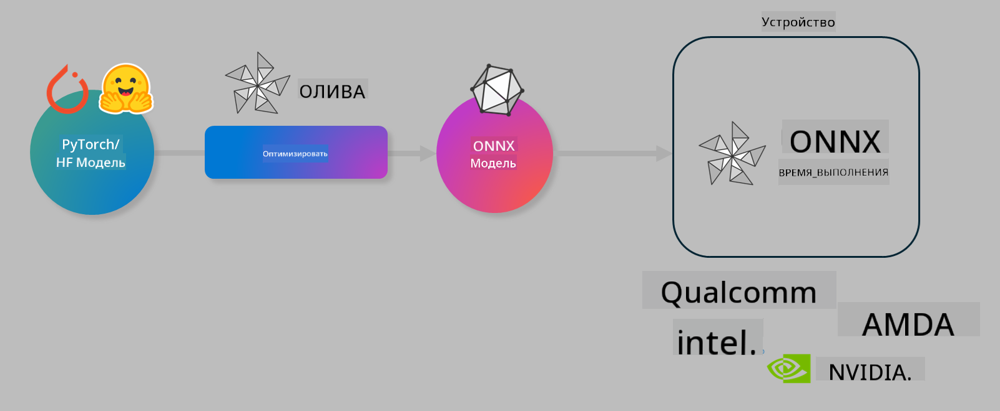

<!--
CO_OP_TRANSLATOR_METADATA:
{
  "original_hash": "6bbe47de3b974df7eea29dfeccf6032b",
  "translation_date": "2025-05-07T15:16:28+00:00",
  "source_file": "code/03.Finetuning/olive-lab/readme.md",
  "language_code": "ru"
}
-->
# Лабораторная работа. Оптимизация AI моделей для инференса на устройстве

## Введение

> [!IMPORTANT]
> Для выполнения этой лабораторной работы требуется **видеокарта Nvidia A10 или A100** с установленными драйверами и CUDA toolkit (версия 12+).

> [!NOTE]
> Эта лабораторная работа занимает **35 минут** и даст вам практическое введение в основные концепции оптимизации моделей для инференса на устройстве с помощью OLIVE.

## Цели обучения

К концу этой лабораторной работы вы сможете использовать OLIVE для:

- Квантования AI модели с использованием метода квантования AWQ.
- Дообучения AI модели для конкретной задачи.
- Генерации LoRA адаптеров (дообученной модели) для эффективного инференса на устройстве с помощью ONNX Runtime.

### Что такое Olive

Olive (*O*NNX *live*) — это набор инструментов для оптимизации моделей с командным интерфейсом (CLI), который позволяет поставлять модели для ONNX runtime +++https://onnxruntime.ai+++ с высоким качеством и производительностью.



На входе у Olive обычно модель PyTorch или Hugging Face, а на выходе — оптимизированная ONNX модель, которая запускается на устройстве (целевой платформе) с ONNX runtime. Olive оптимизирует модель под AI ускоритель целевого устройства (NPU, GPU, CPU), предоставляемый такими производителями оборудования, как Qualcomm, AMD, Nvidia или Intel.

Olive выполняет *workflow* — упорядоченную последовательность отдельных задач оптимизации модели, называемых *passes* (проходы). Примеры проходов: сжатие модели, захват графа, квантование, оптимизация графа. Каждый проход имеет набор параметров, которые можно настраивать для достижения лучших показателей, например, точности и задержки, оцениваемых соответствующим эвальюатором. Olive использует стратегию поиска, применяя алгоритм для автоматической настройки каждого прохода по отдельности или группы проходов вместе.

#### Преимущества Olive

- **Сокращение времени и уменьшение разочарования** при ручных экспериментах методом проб и ошибок с различными техниками оптимизации графа, сжатия и квантования. Определите свои требования к качеству и производительности, и Olive автоматически подберет лучшую модель для вас.
- **Более 40 встроенных компонентов оптимизации моделей**, охватывающих передовые методы квантования, сжатия, оптимизации графа и дообучения.
- **Простой в использовании CLI** для типовых задач оптимизации моделей. Например, olive quantize, olive auto-opt, olive finetune.
- Встроенная упаковка и деплой моделей.
- Поддержка генерации моделей для **Multi LoRA сервинга**.
- Создание workflow с помощью YAML/JSON для оркестрации задач оптимизации и деплоя моделей.
- Интеграция с **Hugging Face** и **Azure AI**.
- Встроенный механизм **кэширования** для **снижения затрат**.

## Инструкция по выполнению лабораторной работы

> [!NOTE]
> Убедитесь, что вы создали Azure AI Hub и проект, а также настроили вычислительный кластер A100 согласно Лабораторной работе 1.

### Шаг 0: Подключение к вашему Azure AI Compute

Вы подключитесь к Azure AI compute с помощью функции удаленного подключения в **VS Code**.

1. Откройте приложение **VS Code** на рабочем столе.
2. Откройте **палитру команд** с помощью **Shift+Ctrl+P**.
3. В палитре команд найдите **AzureML - remote: Connect to compute instance in New Window**.
4. Следуйте инструкциям на экране для подключения к Compute. Вам потребуется выбрать вашу подписку Azure, группу ресурсов, проект и имя вычислительного кластера, который вы настроили в Лабораторной работе 1.
5. После подключения к вашему узлу Azure ML Compute, это будет отображено в **нижнем левом углу Visual Studio Code** `><Azure ML: Compute Name`

### Шаг 1: Клонирование репозитория

В VS Code откройте новый терминал с помощью **Ctrl+J** и клонируйте этот репозиторий:

В терминале вы увидите приглашение

```
azureuser@computername:~/cloudfiles/code$ 
```  
Клонировать решение

```bash
cd ~/localfiles
git clone https://github.com/microsoft/phi-3cookbook.git
```

### Шаг 2: Открытие папки в VS Code

Чтобы открыть VS Code в нужной папке, выполните в терминале следующую команду, которая откроет новое окно:

```bash
code phi-3cookbook/code/04.Finetuning/Olive-lab
```

Альтернативно, вы можете открыть папку через меню **File** > **Open Folder**.

### Шаг 3: Установка зависимостей

Откройте терминал в VS Code на вашем Azure AI Compute Instance (совет: **Ctrl+J**) и выполните следующие команды для установки зависимостей:

```bash
conda create -n olive-ai python=3.11 -y
conda activate olive-ai
pip install -r requirements.txt
az extension remove -n azure-cli-ml
az extension add -n ml
```

> [!NOTE]
> Установка всех зависимостей займет около 5 минут.

В этой лабораторной работе вы будете скачивать и загружать модели в каталог Azure AI. Чтобы получить доступ к каталогу моделей, необходимо войти в Azure с помощью:

```bash
az login
```

> [!NOTE]
> При входе вас попросят выбрать подписку. Убедитесь, что выбрали подписку, предоставленную для этой лабораторной работы.

### Шаг 4: Выполнение команд Olive

Откройте терминал в VS Code на вашем Azure AI Compute Instance (совет: **Ctrl+J**) и убедитесь, что активирована среда conda `olive-ai`:

```bash
conda activate olive-ai
```

Далее выполните следующие команды Olive в командной строке.

1. **Просмотр данных:** В этом примере вы будете дообучать модель Phi-3.5-Mini, чтобы она была специализирована на ответах на вопросы, связанные с путешествиями. Код ниже выводит первые несколько записей датасета, который представлен в формате JSON lines:

    ```bash
    head data/data_sample_travel.jsonl
    ```

2. **Квантование модели:** Перед обучением модели сначала выполните квантование с помощью команды, использующей метод Active Aware Quantization (AWQ) +++https://arxiv.org/abs/2306.00978+++. AWQ квантует веса модели, учитывая активации, возникающие во время инференса. Это значит, что процесс квантования учитывает реальное распределение данных в активациях, что позволяет лучше сохранить точность модели по сравнению с традиционными методами квантования весов.

    ```bash
    olive quantize \
       --model_name_or_path microsoft/Phi-3.5-mini-instruct \
       --trust_remote_code \
       --algorithm awq \
       --output_path models/phi/awq \
       --log_level 1
    ```

    Квантование AWQ занимает примерно **8 минут** и позволяет **сократить размер модели с ~7.5 ГБ до ~2.5 ГБ**.

    В этой лабораторной работе показано, как загружать модели из Hugging Face (например: `microsoft/Phi-3.5-mini-instruct`). However, Olive also allows you to input models from the Azure AI catalog by updating the `model_name_or_path` argument to an Azure AI asset ID (for example:  `azureml://registries/azureml/models/Phi-3.5-mini-instruct/versions/4`). 

1. **Train the model:** Next, the `olive finetune` команда дообучает квантованную модель). Квантование модели *до* дообучения, а не после, обеспечивает лучшую точность, так как процесс дообучения частично компенсирует потери от квантования.

    ```bash
    olive finetune \
        --method lora \
        --model_name_or_path models/phi/awq \
        --data_files "data/data_sample_travel.jsonl" \
        --data_name "json" \
        --text_template "<|user|>\n{prompt}<|end|>\n<|assistant|>\n{response}<|end|>" \
        --max_steps 100 \
        --output_path ./models/phi/ft \
        --log_level 1
    ```

    Дообучение занимает примерно **6 минут** (100 шагов).

3. **Оптимизация:** После обучения модели выполните оптимизацию с помощью команды Olive `auto-opt` command, which will capture the ONNX graph and automatically perform a number of optimizations to improve the model performance for CPU by compressing the model and doing fusions. It should be noted, that you can also optimize for other devices such as NPU or GPU by just updating the `--device` and `--provider`. Для целей этой лабораторной работы будет использоваться CPU.

    ```bash
    olive auto-opt \
       --model_name_or_path models/phi/ft/model \
       --adapter_path models/phi/ft/adapter \
       --device cpu \
       --provider CPUExecutionProvider \
       --use_ort_genai \
       --output_path models/phi/onnx-ao \
       --log_level 1
    ```

    Оптимизация занимает примерно **5 минут**.

### Шаг 5: Быстрый тест инференса модели

Чтобы протестировать инференс модели, создайте в вашей папке Python файл с именем **app.py** и скопируйте в него следующий код:

```python
import onnxruntime_genai as og
import numpy as np

print("loading model and adapters...", end="", flush=True)
model = og.Model("models/phi/onnx-ao/model")
adapters = og.Adapters(model)
adapters.load("models/phi/onnx-ao/model/adapter_weights.onnx_adapter", "travel")
print("DONE!")

tokenizer = og.Tokenizer(model)
tokenizer_stream = tokenizer.create_stream()

params = og.GeneratorParams(model)
params.set_search_options(max_length=100, past_present_share_buffer=False)
user_input = "what is the best thing to see in chicago"
params.input_ids = tokenizer.encode(f"<|user|>\n{user_input}<|end|>\n<|assistant|>\n")

generator = og.Generator(model, params)

generator.set_active_adapter(adapters, "travel")

print(f"{user_input}")

while not generator.is_done():
    generator.compute_logits()
    generator.generate_next_token()

    new_token = generator.get_next_tokens()[0]
    print(tokenizer_stream.decode(new_token), end='', flush=True)

print("\n")
```

Запустите код с помощью:

```bash
python app.py
```

### Шаг 6: Загрузка модели в Azure AI

Загрузка модели в репозиторий Azure AI позволяет делиться моделью с другими членами вашей команды и обеспечивает управление версиями модели. Для загрузки модели выполните следующую команду:

> [!NOTE]
> Обновите значения `{}`` placeholders with the name of your resource group and Azure AI Project Name. 

To find your resource group ` для вашей группы ресурсов и имени проекта Azure AI и выполните команду:

```
az ml workspace show
```

Или зайдите на +++ai.azure.com+++ и выберите **management center** > **project** > **overview**

Замените `{}` на имя вашей группы ресурсов и имя проекта Azure AI.

```bash
az ml model create \
    --name ft-for-travel \
    --version 1 \
    --path ./models/phi/onnx-ao \
    --resource-group {RESOURCE_GROUP_NAME} \
    --workspace-name {PROJECT_NAME}
```

После этого вы сможете увидеть загруженную модель и развернуть её на https://ml.azure.com/model/list

**Отказ от ответственности**:  
Этот документ был переведен с помощью сервиса автоматического перевода [Co-op Translator](https://github.com/Azure/co-op-translator). Несмотря на наши усилия по обеспечению точности, имейте в виду, что автоматический перевод может содержать ошибки или неточности. Оригинальный документ на его родном языке следует считать авторитетным источником. Для критически важной информации рекомендуется профессиональный перевод человеком. Мы не несем ответственности за любые недоразумения или неправильные толкования, возникшие в результате использования данного перевода.