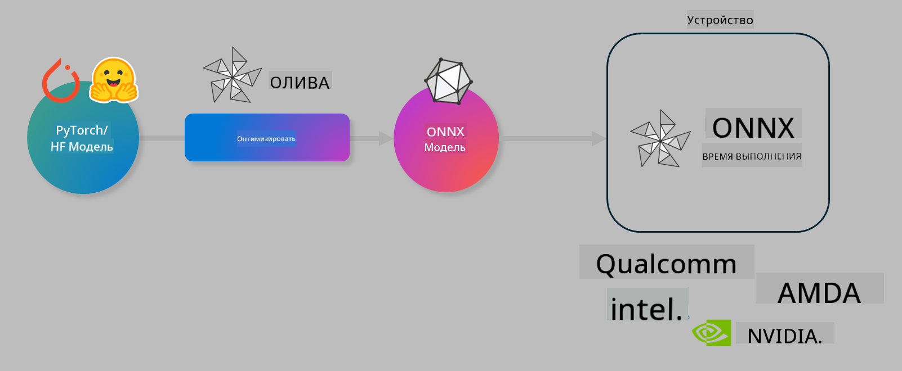

<!--
CO_OP_TRANSLATOR_METADATA:
{
  "original_hash": "6bbe47de3b974df7eea29dfeccf6032b",
  "translation_date": "2025-05-07T15:13:17+00:00",
  "source_file": "code/04.Finetuning/olive-lab/readme.md",
  "language_code": "ru"
}
-->
# Лабораторная работа. Оптимизация AI моделей для инференса на устройстве

## Введение

> [!IMPORTANT]
> Для выполнения этой лабораторной работы требуется **видеокарта Nvidia A10 или A100** с установленными драйверами и CUDA toolkit (версии 12 и выше).

> [!NOTE]
> Это **35-минутная** лабораторная работа, которая даст вам практическое понимание основных концепций оптимизации моделей для инференса на устройстве с использованием OLIVE.

## Цели обучения

К концу этой лабораторной работы вы сможете использовать OLIVE для:

- Квантования AI модели с помощью метода квантования AWQ.
- Тонкой настройки AI модели для конкретной задачи.
- Генерации LoRA адаптеров (тонко настроенной модели) для эффективного инференса на устройстве с использованием ONNX Runtime.

### Что такое Olive

Olive (*O*NNX *live*) — это набор инструментов для оптимизации моделей с командным интерфейсом (CLI), который позволяет доставлять модели для ONNX runtime +++https://onnxruntime.ai+++ с сохранением качества и производительности.



На вход Olive обычно подается модель PyTorch или Hugging Face, а на выходе получается оптимизированная ONNX модель, которая запускается на устройстве (целевой платформе) с ONNX runtime. Olive оптимизирует модель под AI-ускоритель целевой платформы (NPU, GPU, CPU), предоставляемый такими производителями аппаратного обеспечения, как Qualcomm, AMD, Nvidia или Intel.

Olive выполняет *workflow* — упорядоченную последовательность отдельных задач оптимизации модели, называемых *passes* (проходами). Примеры таких проходов: сжатие модели, захват графа, квантование, оптимизация графа. Каждый проход имеет набор параметров, которые можно настраивать для достижения лучших метрик, таких как точность и задержка, которые оцениваются соответствующим оценщиком. Olive использует стратегию поиска, которая применяет алгоритм поиска для автоматической настройки каждого прохода по отдельности или группы проходов вместе.

#### Преимущества Olive

- **Сокращение времени и устранение разочарований** от ручного метода проб и ошибок при экспериментах с оптимизацией графа, сжатием и квантованием. Определите свои требования к качеству и производительности, а Olive автоматически подберет для вас лучшую модель.
- **Более 40 встроенных компонентов оптимизации моделей**, охватывающих передовые методы квантования, сжатия, оптимизации графа и тонкой настройки.
- **Удобный CLI** для выполнения распространённых задач оптимизации моделей, например, olive quantize, olive auto-opt, olive finetune.
- Встроенные средства упаковки и развертывания моделей.
- Поддержка генерации моделей для **Multi LoRA сервинга**.
- Возможность создания workflow с помощью YAML/JSON для оркестрации задач оптимизации и развертывания моделей.
- Интеграция с **Hugging Face** и **Azure AI**.
- Встроенный механизм **кэширования** для **снижения затрат**.

## Инструкция по лабораторной работе

> [!NOTE]
> Убедитесь, что вы настроили Azure AI Hub и проект, а также вычислительный кластер A100 согласно Лабораторной работе 1.

### Шаг 0: Подключение к Azure AI Compute

Подключитесь к вычислительному кластеру Azure AI с помощью функции удаленного подключения в **VS Code**.

1. Откройте приложение **VS Code** на рабочем столе.
2. Откройте **палитру команд** сочетанием клавиш **Shift+Ctrl+P**.
3. В палитре команд найдите **AzureML - remote: Connect to compute instance in New Window**.
4. Следуйте инструкциям на экране для подключения к вычислительному кластеру. Вам потребуется выбрать подписку Azure, группу ресурсов, проект и имя вычислительного кластера, который вы настроили в Лабораторной работе 1.
5. После подключения к вашему узлу Azure ML Compute, информация об этом отобразится в **левом нижнем углу Visual Studio Code** `><Azure ML: Compute Name`

### Шаг 1: Клонирование репозитория

В VS Code откройте новый терминал сочетанием клавиш **Ctrl+J** и клонируйте репозиторий:

В терминале появится приглашение

```
azureuser@computername:~/cloudfiles/code$ 
```
Клонировать решение

```bash
cd ~/localfiles
git clone https://github.com/microsoft/phi-3cookbook.git
```

### Шаг 2: Открытие папки в VS Code

Чтобы открыть VS Code в нужной папке, выполните следующую команду в терминале, которая откроет новое окно:

```bash
code phi-3cookbook/code/04.Finetuning/Olive-lab
```

Или откройте папку через меню, выбрав **File** > **Open Folder**.

### Шаг 3: Установка зависимостей

Откройте терминал в VS Code на вашем Azure AI Compute Instance (подсказка: **Ctrl+J**) и выполните следующие команды для установки зависимостей:

```bash
conda create -n olive-ai python=3.11 -y
conda activate olive-ai
pip install -r requirements.txt
az extension remove -n azure-cli-ml
az extension add -n ml
```

> [!NOTE]
> Установка всех зависимостей займет примерно 5 минут.

В этой лабораторной работе вы будете загружать и выгружать модели в каталог моделей Azure AI. Для доступа к каталогу моделей необходимо войти в Azure с помощью:

```bash
az login
```

> [!NOTE]
> При входе вас попросят выбрать подписку. Убедитесь, что выбрана подписка, предоставленная для этой лабораторной работы.

### Шаг 4: Выполнение команд Olive

Откройте терминал в VS Code на вашем Azure AI Compute Instance (подсказка: **Ctrl+J**) и убедитесь, что активирована среда conda `olive-ai`:

```bash
conda activate olive-ai
```

Далее выполните следующие команды Olive в командной строке.

1. **Просмотр данных:** В этом примере вы будете тонко настраивать модель Phi-3.5-Mini, чтобы она была специализирована на ответах на вопросы, связанные с путешествиями. Код ниже отображает первые записи набора данных, который представлен в формате JSON lines:

    ```bash
    head data/data_sample_travel.jsonl
    ```
2. **Квантование модели:** Перед обучением модели выполните квантование с помощью команды, использующей метод Active Aware Quantization (AWQ) +++https://arxiv.org/abs/2306.00978+++. AWQ квантует веса модели, учитывая активации, возникающие во время инференса. Это означает, что процесс квантования учитывает реальное распределение данных в активациях, что позволяет лучше сохранить точность модели по сравнению с традиционными методами квантования весов.

    ```bash
    olive quantize \
       --model_name_or_path microsoft/Phi-3.5-mini-instruct \
       --trust_remote_code \
       --algorithm awq \
       --output_path models/phi/awq \
       --log_level 1
    ```

    Процесс AWQ квантования занимает **около 8 минут** и **уменьшает размер модели примерно с 7.5 ГБ до 2.5 ГБ**.

    В этой лабораторной работе мы показываем, как использовать модели из Hugging Face (например, `microsoft/Phi-3.5-mini-instruct`). However, Olive also allows you to input models from the Azure AI catalog by updating the `model_name_or_path` argument to an Azure AI asset ID (for example:  `azureml://registries/azureml/models/Phi-3.5-mini-instruct/versions/4`). 

1. **Train the model:** Next, the `olive finetune` команда выполняет тонкую настройку квантованной модели. Квантование модели *до* тонкой настройки, а не после, обеспечивает лучшую точность, так как процесс тонкой настройки компенсирует часть потерь от квантования.

    ```bash
    olive finetune \
        --method lora \
        --model_name_or_path models/phi/awq \
        --data_files "data/data_sample_travel.jsonl" \
        --data_name "json" \
        --text_template "<|user|>\n{prompt}<|end|>\n<|assistant|>\n{response}<|end|>" \
        --max_steps 100 \
        --output_path ./models/phi/ft \
        --log_level 1
    ```

    Тонкая настройка занимает **около 6 минут** (100 шагов).

3. **Оптимизация:** После обучения модели выполните оптимизацию с помощью команды Olive `auto-opt` command, which will capture the ONNX graph and automatically perform a number of optimizations to improve the model performance for CPU by compressing the model and doing fusions. It should be noted, that you can also optimize for other devices such as NPU or GPU by just updating the `--device` and `--provider`. Для целей этой лабораторной работы используйте CPU.

    ```bash
    olive auto-opt \
       --model_name_or_path models/phi/ft/model \
       --adapter_path models/phi/ft/adapter \
       --device cpu \
       --provider CPUExecutionProvider \
       --use_ort_genai \
       --output_path models/phi/onnx-ao \
       --log_level 1
    ```

    Оптимизация занимает **около 5 минут**.

### Шаг 5: Быстрый тест инференса модели

Для проверки инференса модели создайте в вашей папке файл Python с именем **app.py** и скопируйте в него следующий код:

```python
import onnxruntime_genai as og
import numpy as np

print("loading model and adapters...", end="", flush=True)
model = og.Model("models/phi/onnx-ao/model")
adapters = og.Adapters(model)
adapters.load("models/phi/onnx-ao/model/adapter_weights.onnx_adapter", "travel")
print("DONE!")

tokenizer = og.Tokenizer(model)
tokenizer_stream = tokenizer.create_stream()

params = og.GeneratorParams(model)
params.set_search_options(max_length=100, past_present_share_buffer=False)
user_input = "what is the best thing to see in chicago"
params.input_ids = tokenizer.encode(f"<|user|>\n{user_input}<|end|>\n<|assistant|>\n")

generator = og.Generator(model, params)

generator.set_active_adapter(adapters, "travel")

print(f"{user_input}")

while not generator.is_done():
    generator.compute_logits()
    generator.generate_next_token()

    new_token = generator.get_next_tokens()[0]
    print(tokenizer_stream.decode(new_token), end='', flush=True)

print("\n")
```

Запустите код командой:

```bash
python app.py
```

### Шаг 6: Загрузка модели в Azure AI

Загрузка модели в репозиторий моделей Azure AI позволяет делиться моделью с другими членами вашей команды и обеспечивает контроль версий модели. Для загрузки модели выполните следующую команду:

> [!NOTE]
> Обновите значения `{}`` placeholders with the name of your resource group and Azure AI Project Name. 

To find your resource group ` для группы ресурсов и имени проекта Azure AI, затем выполните команду

```
az ml workspace show
```

Или зайдите на +++ai.azure.com+++, выберите **management center** > **project** > **overview**.

Замените заполнители `{}` на имя вашей группы ресурсов и имя проекта Azure AI.

```bash
az ml model create \
    --name ft-for-travel \
    --version 1 \
    --path ./models/phi/onnx-ao \
    --resource-group {RESOURCE_GROUP_NAME} \
    --workspace-name {PROJECT_NAME}
```

После этого вы сможете увидеть загруженную модель и развернуть её на https://ml.azure.com/model/list

**Отказ от ответственности**:  
Этот документ был переведен с помощью сервиса автоматического перевода [Co-op Translator](https://github.com/Azure/co-op-translator). Несмотря на наши усилия по обеспечению точности, пожалуйста, имейте в виду, что автоматический перевод может содержать ошибки или неточности. Оригинальный документ на исходном языке следует считать авторитетным источником. Для критически важной информации рекомендуется профессиональный перевод человеком. Мы не несем ответственности за любые недоразумения или неправильные толкования, возникшие в результате использования данного перевода.