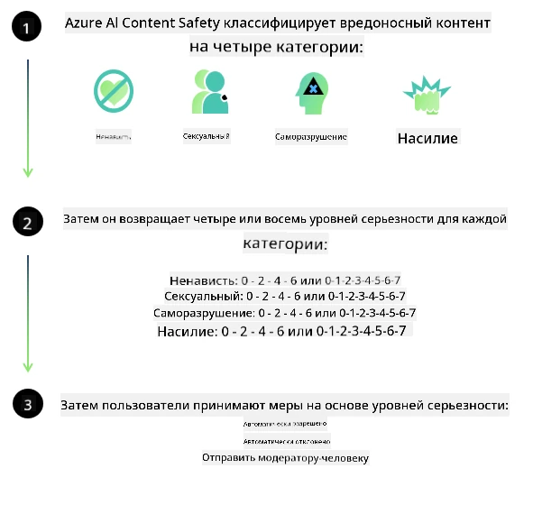
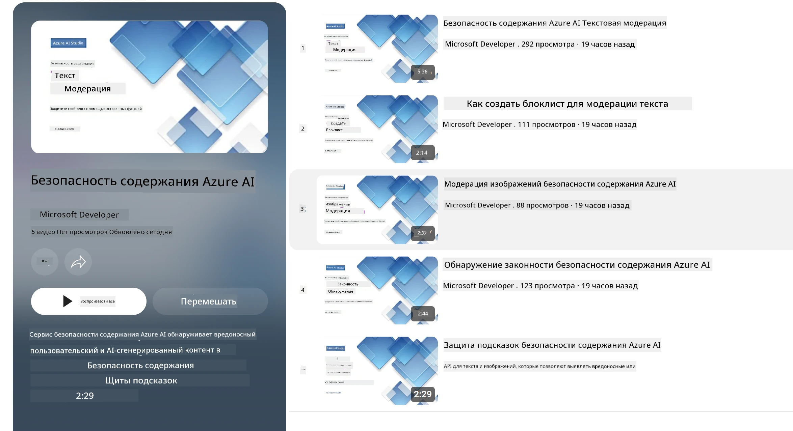

<!--
CO_OP_TRANSLATOR_METADATA:
{
  "original_hash": "839ccc4b3886ef10cfd4e64977f5792d",
  "translation_date": "2026-01-05T08:27:39+00:00",
  "source_file": "md/01.Introduction/01/01.AISafety.md",
  "language_code": "ru"
}
-->
# Безопасность ИИ для моделей Phi
Семейство моделей Phi было разработано в соответствии с [Microsoft Responsible AI Standard](https://www.microsoft.com/ai/principles-and-approach#responsible-ai-standard), который представляет собой общефирменный набор требований, основанный на следующих шести принципах: подотчетность, прозрачность, справедливость, надежность и безопасность, конфиденциальность и безопасность, а также инклюзивность, которые образуют [Принципы ответственного ИИ Microsoft](https://www.microsoft.com/ai/responsible-ai).

Как и для предыдущих моделей Phi, была принята многоаспектная оценка безопасности и подход к безопасному постобучению с дополнительными мерами, учитывающими многоязычные возможности этого релиза. Наш подход к обучению безопасности и оценке, включая тестирование на нескольких языках и по категориям рисков, подробно описан в [Phi Safety Post-Training Paper](https://arxiv.org/abs/2407.13833). Несмотря на преимущества этого подхода для моделей Phi, разработчики должны применять лучшие практики ответственного ИИ, включая картирование, измерение и смягчение рисков, связанных с их конкретным случаем использования, а также с культурным и лингвистическим контекстом.

## Лучшие практики

Как и другие модели, семейство моделей Phi потенциально может вести себя несправедливо, ненадежно или оскорбительно.

Некоторые из ограничений моделей SLM и LLM, о которых следует знать:

- **Качество обслуживания:** Модели Phi обучены преимущественно на английских текстах. Для языков, отличных от английского, производительность будет хуже. Варианты английского языка, которые представлены в обучающих данных меньше, могут показывать худшую производительность, чем стандартный американский английский.
- **Представление вреда и увековечение стереотипов:** Эти модели могут пере- или недопредставлять группы людей, стирать представление некоторых групп или усиливать унижающие или негативные стереотипы. Несмотря на последующее обучение в целях безопасности, эти ограничения все еще могут присутствовать из-за различных уровней представления разных групп или наличия примеров негативных стереотипов в обучающих данных, отражающих реальные паттерны и социальные предубеждения.
- **Неуместный или оскорбительный контент:** Эти модели могут создавать другие виды неуместного или оскорбительного контента, что может сделать их непригодными для развертывания в чувствительных контекстах без дополнительных мер смягчения, специфичных для конкретного случая использования.
- **Надежность информации:** Языковые модели могут генерировать бессмысленный контент или фабриковать информацию, которая может звучать правдоподобно, но является неточной или устаревшей.
- **Ограниченный охват по коду:** Большая часть обучающих данных Phi-3 основана на Python и использует распространённые пакеты, такие как "typing, math, random, collections, datetime, itertools". Если модель генерирует скрипты Python, использующие другие пакеты, или скрипты на других языках, мы настоятельно рекомендуем пользователям вручную проверять все вызовы API.

Разработчики должны применять лучшие практики ответственного ИИ и несут ответственность за обеспечение соответствия конкретного случая использования применимым законам и нормативным актам (например, конфиденциальности, торговле и т. д.).

## Рассмотрение ответственного ИИ

Как и другие языковые модели, модели серии Phi потенциально могут вести себя несправедливо, ненадежно или оскорбительно. Некоторые ограничения, о которых следует знать:

**Качество обслуживания:** Модели Phi обучены преимущественно на английских текстах. Для языков, отличных от английского, производительность будет хуже. Варианты английского языка с меньшим представительством в учебных данных могут показывать худшую производительность, чем стандартный американский английский.

**Представление вреда и увековечение стереотипов:** Эти модели могут пере- или недопредставлять группы людей, стирать представление некоторых групп или усиливать унижающие или негативные стереотипы. Несмотря на последующее обучение в целях безопасности, эти ограничения все еще могут присутствовать из-за различных уровней представления разных групп или наличия примеров негативных стереотипов в обучающих данных, отражающих реальные паттерны и социальные предубеждения.

**Неуместный или оскорбительный контент:** Эти модели могут создавать другие виды неуместного или оскорбительного контента, что может сделать их непригодными для развертывания в чувствительных контекстах без дополнительных мер смягчения, специфичных для конкретного случая использования.  
Надежность информации: языковые модели могут генерировать бессмысленный контент или придумывать информацию, которая может звучать правдоподобно, но является неточной или устаревшей.

**Ограниченный охват по коду:** Большая часть обучающих данных Phi-3 основана на Python и использует распространённые пакеты, такие как "typing, math, random, collections, datetime, itertools". Если модель генерирует скрипты Python, использующие другие пакеты, или скрипты на других языках, мы настоятельно рекомендуем пользователям вручную проверять все вызовы API.

Разработчики должны применять лучшие практики ответственного ИИ и несут ответственность за обеспечение соответствия конкретного случая использования применимым законам и нормативным актам (например, конфиденциальности, торговле и т. д.). Важные области для рассмотрения включают:

**Распределение:** Модели могут не подходить для сценариев, которые могут иметь значительное влияние на юридический статус или распределение ресурсов или жизненных возможностей (например, жильё, трудоустройство, кредиты и т. д.) без дополнительных оценок и методов борьбы с предвзятостью.

**Сценарии с высоким риском:** Разработчики должны оценить пригодность использования моделей в сценариях с высоким риском, где несправедливые, ненадежные или оскорбительные результаты могут стать чрезвычайно дорогостоящими или привести к вреду. Это включает предоставление советов в чувствительных или экспертных областях, где точность и надежность важны (например, юридические или медицинские консультации). Дополнительные меры защиты следует реализовать на уровне приложения в соответствии с контекстом развертывания.

**Дезинформация:** Модели могут предоставлять неточную информацию. Разработчики должны следовать лучшим практикам прозрачности и информировать конечных пользователей о том, что они взаимодействуют с системой ИИ. На уровне приложения разработчики могут создавать механизмы обратной связи и конвейеры, чтобы подкреплять ответы информацией, специфичной для случая использования и контекста, что известно как Retrieval Augmented Generation (RAG).

**Генерация вредоносного контента:** Разработчики должны оценивать генерируемый контент в его контексте и использовать доступные классификаторы безопасности или специальные решения, соответствующие их кейсам.

**Злоупотребление:** Возможны и другие формы злоупотреблений, такие как мошенничество, спам или создание вредоносного ПО, и разработчики должны обеспечить, что их приложения не нарушают применимые законы и нормативы.

### Финетюнинг и безопасность ИИ контента

После дообучения модели мы настоятельно рекомендуем использовать меры [Azure AI Content Safety](https://learn.microsoft.com/azure/ai-services/content-safety/overview) для мониторинга контента, создаваемого моделями, выявления и блокировки потенциальных рисков, угроз и проблем с качеством.

[Azure AI Content Safety](https://learn.microsoft.com/azure/ai-services/content-safety/overview) поддерживает как текстовый, так и графический контент. Он может быть развернут в облаке, в изолированных контейнерах и на периферийных/встроенных устройствах.

## Обзор Azure AI Content Safety

Azure AI Content Safety не является универсальным решением; его можно настраивать в соответствии с конкретными политиками бизнеса. Кроме того, его многоязычные модели позволяют одновременно понимать несколько языков.

- **Azure AI Content Safety**
- **Microsoft Developer**
- **5 видео**

Служба Azure AI Content Safety обнаруживает вредоносный контент, созданный пользователями и ИИ, в приложениях и сервисах. Она включает в себя API для текста и изображений, позволяющие выявлять вредоносные или неуместные материалы.

[AI Content Safety Playlist](https://www.youtube.com/playlist?list=PLlrxD0HtieHjaQ9bJjyp1T7FeCbmVcPkQ)

---

<!-- CO-OP TRANSLATOR DISCLAIMER START -->
**Отказ от ответственности**:
Этот документ был переведен с помощью AI-сервиса переводов [Co-op Translator](https://github.com/Azure/co-op-translator). Несмотря на наши усилия обеспечить точность, просим учитывать, что автоматический перевод может содержать ошибки или неточности. Оригинальный документ на его родном языке следует считать авторитетным источником. Для критически важной информации рекомендуется профессиональный перевод человеком. Мы не несем ответственности за любые недоразумения или ошибки в интерпретации, возникшие в результате использования данного перевода.
<!-- CO-OP TRANSLATOR DISCLAIMER END -->