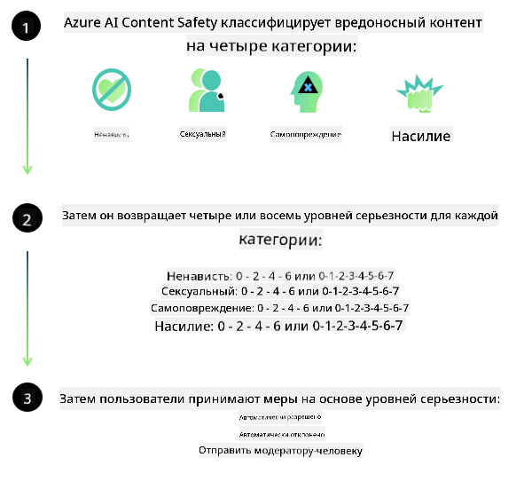
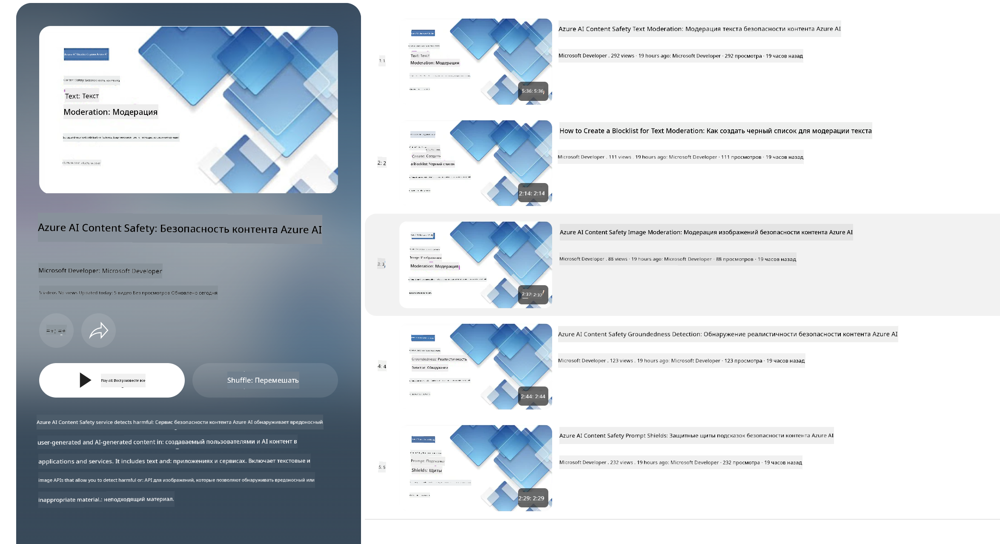

<!--
CO_OP_TRANSLATOR_METADATA:
{
  "original_hash": "c8273672cc57df2be675407a1383aaf0",
  "translation_date": "2025-05-07T14:54:48+00:00",
  "source_file": "md/01.Introduction/01/01.AISafety.md",
  "language_code": "ru"
}
-->
# Безопасность ИИ для моделей Phi  
Семейство моделей Phi было разработано в соответствии с [Microsoft Responsible AI Standard](https://query.prod.cms.rt.microsoft.com/cms/api/am/binary/RE5cmFl) — общекорпоративным набором требований, основанных на шести принципах: подотчетность, прозрачность, справедливость, надежность и безопасность, конфиденциальность и защита, а также инклюзивность, которые составляют [принципы ответственного ИИ Microsoft](https://www.microsoft.com/ai/responsible-ai).

Как и в предыдущих моделях Phi, был применён комплексный подход к оценке безопасности и посттренировочной доработке с дополнительными мерами, учитывающими многоязычные возможности этой версии. Наш подход к обучению безопасности и оценкам, включая тестирование на нескольких языках и в разных категориях рисков, изложен в [статье по безопасности Phi после обучения](https://arxiv.org/abs/2407.13833). Несмотря на преимущества этого подхода, разработчики должны применять лучшие практики ответственного ИИ, включая идентификацию, измерение и снижение рисков, связанных с конкретным случаем использования и культурным и языковым контекстом.

## Лучшие практики

Как и другие модели, семейство Phi может вести себя несправедливо, ненадёжно или оскорбительно.

Некоторые ограничения поведения SLM и LLM, о которых следует знать:

- **Качество обслуживания:** Модели Phi обучены преимущественно на английском языке. Для других языков производительность будет хуже. Диалекты английского с меньшим представлением в обучающих данных могут показывать результаты хуже, чем стандартный американский английский.
- **Представление вреда и закрепление стереотипов:** Модели могут чрезмерно или недостаточно представлять определённые группы людей, исключать некоторые группы или усиливать уничижительные или негативные стереотипы. Несмотря на посттренировочную доработку по безопасности, эти ограничения могут сохраняться из-за различного уровня представления групп или наличия примеров негативных стереотипов в обучающих данных, отражающих реальные социальные паттерны и предубеждения.
- **Неподходящий или оскорбительный контент:** Модели могут генерировать и другие типы неподходящего или оскорбительного контента, что делает их использование в чувствительных контекстах нежелательным без дополнительных мер, адаптированных к конкретному случаю.
- **Надёжность информации:** Языковые модели могут создавать бессмысленный контент или выдумывать информацию, которая может звучать убедительно, но является неточной или устаревшей.
- **Ограниченный охват для кода:** Большая часть обучающих данных Phi-3 основана на Python и использует распространённые пакеты, такие как "typing, math, random, collections, datetime, itertools". Если модель генерирует Python-скрипты с использованием других пакетов или скрипты на других языках, настоятельно рекомендуем пользователям вручную проверять все вызовы API.

Разработчики должны применять лучшие практики ответственного ИИ и отвечают за соблюдение применимых законов и нормативных актов для конкретного случая использования (например, конфиденциальность, торговля и т. д.).

## Соображения по ответственному ИИ

Как и другие языковые модели, модели серии Phi могут вести себя несправедливо, ненадёжно или оскорбительно. Основные ограничения, которые стоит учитывать:

**Качество обслуживания:** Модели Phi обучены преимущественно на английском языке. Для других языков производительность будет хуже. Диалекты английского с меньшим представлением в обучающих данных могут показывать результаты хуже, чем стандартный американский английский.

**Представление вреда и закрепление стереотипов:** Модели могут чрезмерно или недостаточно представлять определённые группы, исключать некоторые из них или усиливать уничижительные или негативные стереотипы. Несмотря на посттренировочную доработку по безопасности, эти ограничения могут сохраняться из-за различного уровня представления групп или наличия примеров негативных стереотипов в обучающих данных, отражающих реальные социальные паттерны и предубеждения.

**Неподходящий или оскорбительный контент:** Модели могут генерировать неподходящий или оскорбительный контент, что делает их использование в чувствительных контекстах нежелательным без дополнительных мер, адаптированных к конкретному случаю.  
**Надёжность информации:** Языковые модели могут создавать бессмысленный контент или выдумывать информацию, которая может звучать убедительно, но является неточной или устаревшей.

**Ограниченный охват для кода:** Большая часть обучающих данных Phi-3 основана на Python и использует распространённые пакеты, такие как "typing, math, random, collections, datetime, itertools". Если модель генерирует Python-скрипты с использованием других пакетов или скрипты на других языках, настоятельно рекомендуем пользователям вручную проверять все вызовы API.

Разработчики должны применять лучшие практики ответственного ИИ и отвечают за соблюдение применимых законов и нормативных актов для конкретного случая использования (например, конфиденциальность, торговля и т. д.). Важные аспекты для рассмотрения включают:

**Распределение:** Модели могут быть неприемлемы для сценариев, которые могут существенно повлиять на юридический статус или распределение ресурсов и жизненных возможностей (например, жильё, трудоустройство, кредит и т. д.) без дополнительных оценок и методов устранения предвзятости.

**Сценарии с высоким риском:** Разработчикам следует оценивать пригодность использования моделей в сценариях с высоким риском, где несправедливые, ненадёжные или оскорбительные результаты могут привести к серьёзным последствиям или вреду. Это включает консультации в чувствительных или экспертных областях, где точность и надёжность критичны (например, юридические или медицинские советы). Дополнительные меры защиты должны внедряться на уровне приложения в зависимости от контекста использования.

**Дезинформация:** Модели могут генерировать неточную информацию. Разработчикам рекомендуется соблюдать лучшие практики прозрачности и информировать конечных пользователей о взаимодействии с системой ИИ. На уровне приложения можно создавать механизмы обратной связи и использовать методы, которые позволяют опираться на контекстно-специфичную информацию, известные как Retrieval Augmented Generation (RAG).

**Генерация вредоносного контента:** Разработчикам следует оценивать результаты с учётом контекста и использовать доступные классификаторы безопасности или создавать собственные решения, соответствующие их случаю использования.

**Злоупотребления:** Возможны и другие формы злоупотреблений, такие как мошенничество, спам или создание вредоносного ПО, поэтому разработчики должны гарантировать, что их приложения не нарушают применимые законы и нормы.

### Тонкая настройка и безопасность контента ИИ

После тонкой настройки модели настоятельно рекомендуем использовать меры [Azure AI Content Safety](https://learn.microsoft.com/azure/ai-services/content-safety/overview) для мониторинга генерируемого контента, выявления и блокировки потенциальных рисков, угроз и проблем с качеством.

[Azure AI Content Safety](https://learn.microsoft.com/azure/ai-services/content-safety/overview) поддерживает как текстовый, так и графический контент. Сервис можно развернуть в облаке, в изолированных контейнерах и на периферийных/встроенных устройствах.

## Обзор Azure AI Content Safety

Azure AI Content Safety не является универсальным решением; его можно настраивать в соответствии с политиками конкретного бизнеса. Кроме того, многоязычные модели позволяют одновременно обрабатывать несколько языков.

- **Azure AI Content Safety**  
- **Microsoft Developer**  
- **5 видео**

Сервис Azure AI Content Safety обнаруживает вредоносный контент, созданный пользователями и ИИ, в приложениях и сервисах. Включает API для текста и изображений, позволяющие выявлять вредоносные или неподходящие материалы.

[AI Content Safety Playlist](https://www.youtube.com/playlist?list=PLlrxD0HtieHjaQ9bJjyp1T7FeCbmVcPkQ)

**Отказ от ответственности**:  
Этот документ был переведен с помощью сервиса автоматического перевода [Co-op Translator](https://github.com/Azure/co-op-translator). Несмотря на наши усилия по обеспечению точности, имейте в виду, что автоматические переводы могут содержать ошибки или неточности. Оригинальный документ на исходном языке следует считать авторитетным источником. Для критически важной информации рекомендуется использовать профессиональный перевод, выполненный человеком. Мы не несем ответственности за любые недоразумения или неправильные толкования, возникшие в результате использования данного перевода.