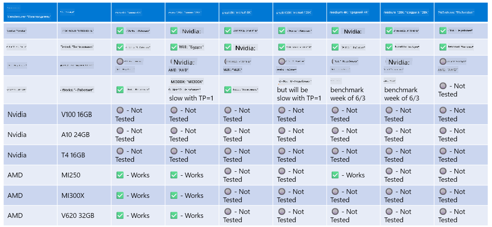

<!--
CO_OP_TRANSLATOR_METADATA:
{
  "original_hash": "8cdc17ce0f10535da30b53d23fe1a795",
  "translation_date": "2025-05-07T14:56:37+00:00",
  "source_file": "md/01.Introduction/01/01.Hardwaresupport.md",
  "language_code": "ru"
}
-->
# Поддержка оборудования Phi

Microsoft Phi оптимизирован для ONNX Runtime и поддерживает Windows DirectML. Он хорошо работает на различных типах оборудования, включая GPU, CPU и даже мобильные устройства.

## Оборудование устройства  
В частности, поддерживаемое оборудование включает:

- GPU SKU: RTX 4090 (DirectML)
- GPU SKU: 1 A100 80GB (CUDA)
- CPU SKU: Standard F64s v2 (64 vCPU, 128 ГБ памяти)

## Мобильные устройства

- Android – Samsung Galaxy S21
- Apple iPhone 14 или выше с процессором A16/A17

## Технические характеристики оборудования Phi

- Минимальные требования к конфигурации.
- Windows: GPU с поддержкой DirectX 12 и минимум 4 ГБ совмещённой оперативной памяти

CUDA: GPU NVIDIA с Compute Capability >= 7.02



## Запуск onnxruntime на нескольких GPU

В настоящее время доступные модели Phi ONNX поддерживают только 1 GPU. Поддержка нескольких GPU для модели Phi возможна, но ORT с 2 GPU не гарантирует большую пропускную способность по сравнению с запуском 2 экземпляров ort. Пожалуйста, смотрите [ONNX Runtime](https://onnxruntime.ai/) для последних обновлений.

На [Build 2024 команда GenAI ONNX](https://youtu.be/WLW4SE8M9i8?si=EtG04UwDvcjunyfC) объявила, что они включили поддержку мульти-инстансов вместо мульти-GPU для моделей Phi.

В настоящее время это позволяет запускать один экземпляр onnxruntime или onnxruntime-genai с переменной окружения CUDA_VISIBLE_DEVICES следующим образом.

```Python
CUDA_VISIBLE_DEVICES=0 python infer.py
CUDA_VISIBLE_DEVICES=1 python infer.py
```

Не стесняйтесь изучать Phi подробнее в [Azure AI Foundry](https://ai.azure.com)

**Отказ от ответственности**:  
Этот документ был переведен с помощью сервиса автоматического перевода [Co-op Translator](https://github.com/Azure/co-op-translator). Несмотря на наши усилия по обеспечению точности, имейте в виду, что автоматические переводы могут содержать ошибки или неточности. Оригинальный документ на исходном языке следует считать авторитетным источником. Для критически важной информации рекомендуется использовать профессиональный перевод, выполненный человеком. Мы не несем ответственности за любые недоразумения или неправильные толкования, возникшие в результате использования данного перевода.