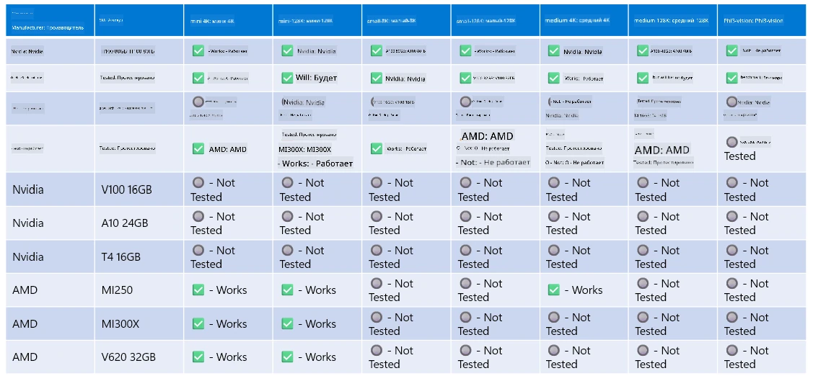

# Поддержка оборудования Phi

Microsoft Phi оптимизирован для ONNX Runtime и поддерживает Windows DirectML. Он хорошо работает на различных типах оборудования, включая GPU, CPU и даже мобильные устройства.

## Аппаратное обеспечение устройства  
В частности, поддерживаемое оборудование включает:

- GPU SKU: RTX 4090 (DirectML)
- GPU SKU: 1 A100 80GB (CUDA)
- CPU SKU: Standard F64s v2 (64 vCPU, 128 ГБ памяти)

## Мобильные устройства

- Android — Samsung Galaxy S21
- Apple iPhone 14 или новее с процессором A16/A17

## Технические характеристики оборудования Phi

- Минимальные требования к конфигурации.
- Windows: GPU с поддержкой DirectX 12 и минимум 4 ГБ общей оперативной памяти

CUDA: NVIDIA GPU с Compute Capability >= 7.02



## Запуск onnxruntime на нескольких GPU

В настоящее время доступные модели Phi ONNX поддерживают только 1 GPU. Теоретически возможно поддерживать несколько GPU для модели Phi, но ORT с 2 GPU не гарантирует увеличения пропускной способности по сравнению с запуском 2 отдельных экземпляров ort. Для последних обновлений смотрите [ONNX Runtime](https://onnxruntime.ai/).

На конференции [Build 2024 команда GenAI ONNX](https://youtu.be/WLW4SE8M9i8?si=EtG04UwDvcjunyfC) объявила, что они включили поддержку мульти-инстансов вместо мульти-GPU для моделей Phi.

В настоящее время это позволяет запускать один экземпляр onnxruntime или onnxruntime-genai с переменной окружения CUDA_VISIBLE_DEVICES следующим образом.

```Python
CUDA_VISIBLE_DEVICES=0 python infer.py
CUDA_VISIBLE_DEVICES=1 python infer.py
```

Не стесняйтесь подробнее изучать Phi в [Azure AI Foundry](https://ai.azure.com)

**Отказ от ответственности**:  
Этот документ был переведен с помощью сервиса автоматического перевода [Co-op Translator](https://github.com/Azure/co-op-translator). Несмотря на наши усилия по обеспечению точности, просим учитывать, что автоматический перевод может содержать ошибки или неточности. Оригинальный документ на его исходном языке следует считать авторитетным источником. Для получения критически важной информации рекомендуется обращаться к профессиональному человеческому переводу. Мы не несем ответственности за любые недоразумения или неправильные толкования, возникшие в результате использования данного перевода.