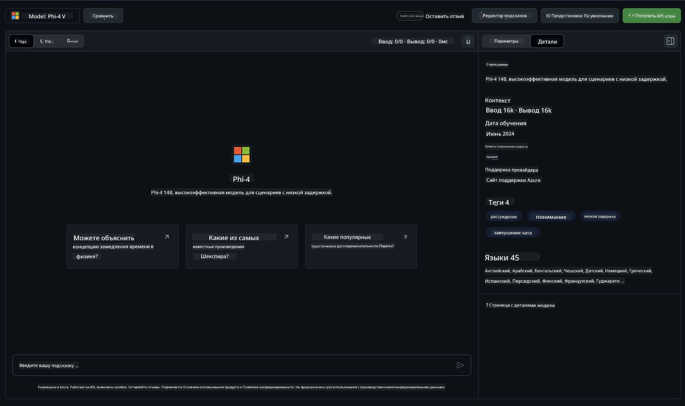

<!--
CO_OP_TRANSLATOR_METADATA:
{
  "original_hash": "fb67a08b9fc911a10ed58081fadef416",
  "translation_date": "2025-07-16T18:56:58+00:00",
  "source_file": "md/01.Introduction/02/02.GitHubModel.md",
  "language_code": "ru"
}
-->
## Семейство Phi в GitHub Models

Добро пожаловать в [GitHub Models](https://github.com/marketplace/models)! У нас всё готово для вашего знакомства с AI-моделями, размещёнными на Azure AI.


Для получения дополнительной информации о доступных моделях на GitHub Models посетите [GitHub Model Marketplace](https://github.com/marketplace/models)

## Доступные модели

Для каждой модели есть отдельная площадка для экспериментов и примеры кода



### Семейство Phi в каталоге моделей GitHub

- [Phi-4](https://github.com/marketplace/models/azureml/Phi-4)

- [Phi-3.5-MoE instruct (128k)](https://github.com/marketplace/models/azureml/Phi-3-5-MoE-instruct)

- [Phi-3.5-vision instruct (128k)](https://github.com/marketplace/models/azureml/Phi-3-5-vision-instruct)

- [Phi-3.5-mini instruct (128k)](https://github.com/marketplace/models/azureml/Phi-3-5-mini-instruct)

- [Phi-3-Medium-128k-Instruct](https://github.com/marketplace/models/azureml/Phi-3-medium-128k-instruct)

- [Phi-3-medium-4k-instruct](https://github.com/marketplace/models/azureml/Phi-3-medium-4k-instruct)

- [Phi-3-mini-128k-instruct](https://github.com/marketplace/models/azureml/Phi-3-mini-128k-instruct)

- [Phi-3-mini-4k-instruct](https://github.com/marketplace/models/azureml/Phi-3-mini-4k-instruct)

- [Phi-3-small-128k-instruct](https://github.com/marketplace/models/azureml/Phi-3-small-128k-instruct)

- [Phi-3-small-8k-instruct](https://github.com/marketplace/models/azureml/Phi-3-small-8k-instruct)

## Начало работы

Есть несколько простых примеров, которые вы можете сразу запустить. Они находятся в каталоге samples. Если хотите сразу перейти к любимому языку программирования, примеры доступны на следующих языках:

- Python
- JavaScript
- C#
- Java
- cURL

Также доступна специальная среда Codespaces для запуска примеров и моделей.


## Пример кода

Ниже приведены примеры кода для нескольких сценариев использования. Для дополнительной информации об Azure AI Inference SDK смотрите полную документацию и примеры.

## Настройка

1. Создайте персональный токен доступа  
Токен не требует предоставления каких-либо разрешений. Обратите внимание, что токен будет отправлен в сервис Microsoft.

Чтобы использовать приведённые ниже примеры кода, создайте переменную окружения с вашим токеном в качестве ключа для клиентского кода.

Если вы используете bash:  
```
export GITHUB_TOKEN="<your-github-token-goes-here>"
```  
Если вы в powershell:  

```
$Env:GITHUB_TOKEN="<your-github-token-goes-here>"
```  

Если вы используете командную строку Windows:  

```
set GITHUB_TOKEN=<your-github-token-goes-here>
```  

## Пример на Python

### Установка зависимостей  
Установите Azure AI Inference SDK с помощью pip (требуется Python версии 3.8 и выше):

```
pip install azure-ai-inference
```  
### Запуск базового примера кода

Этот пример демонстрирует простой вызов API для завершения чата. Используется конечная точка GitHub AI модели и ваш GitHub токен. Вызов синхронный.

```python
import os
from azure.ai.inference import ChatCompletionsClient
from azure.ai.inference.models import SystemMessage, UserMessage
from azure.core.credentials import AzureKeyCredential

endpoint = "https://models.inference.ai.azure.com"
model_name = "Phi-4"
token = os.environ["GITHUB_TOKEN"]

client = ChatCompletionsClient(
    endpoint=endpoint,
    credential=AzureKeyCredential(token),
)

response = client.complete(
    messages=[
        UserMessage(content="I have $20,000 in my savings account, where I receive a 4% profit per year and payments twice a year. Can you please tell me how long it will take for me to become a millionaire? Also, can you please explain the math step by step as if you were explaining it to an uneducated person?"),
    ],
    temperature=0.4,
    top_p=1.0,
    max_tokens=2048,
    model=model_name
)

print(response.choices[0].message.content)
```

### Запуск многошагового диалога

Этот пример показывает, как вести многошаговый диалог с API завершения чата. При использовании модели для чат-приложения необходимо управлять историей диалога и отправлять модели последние сообщения.

```
import os
from azure.ai.inference import ChatCompletionsClient
from azure.ai.inference.models import AssistantMessage, SystemMessage, UserMessage
from azure.core.credentials import AzureKeyCredential

token = os.environ["GITHUB_TOKEN"]
endpoint = "https://models.inference.ai.azure.com"
# Replace Model_Name
model_name = "Phi-4"

client = ChatCompletionsClient(
    endpoint=endpoint,
    credential=AzureKeyCredential(token),
)

messages = [
    SystemMessage(content="You are a helpful assistant."),
    UserMessage(content="What is the capital of France?"),
    AssistantMessage(content="The capital of France is Paris."),
    UserMessage(content="What about Spain?"),
]

response = client.complete(messages=messages, model=model_name)

print(response.choices[0].message.content)
```

### Потоковая передача вывода

Для лучшего пользовательского опыта рекомендуется передавать ответ модели по частям, чтобы первые токены появлялись сразу и не приходилось ждать весь ответ целиком.

```
import os
from azure.ai.inference import ChatCompletionsClient
from azure.ai.inference.models import SystemMessage, UserMessage
from azure.core.credentials import AzureKeyCredential

token = os.environ["GITHUB_TOKEN"]
endpoint = "https://models.inference.ai.azure.com"
# Replace Model_Name
model_name = "Phi-4"

client = ChatCompletionsClient(
    endpoint=endpoint,
    credential=AzureKeyCredential(token),
)

response = client.complete(
    stream=True,
    messages=[
        SystemMessage(content="You are a helpful assistant."),
        UserMessage(content="Give me 5 good reasons why I should exercise every day."),
    ],
    model=model_name,
)

for update in response:
    if update.choices:
        print(update.choices[0].delta.content or "", end="")

client.close()
```

## Бесплатное использование и ограничения по скорости для GitHub Models


[Ограничения по скорости для площадки и бесплатного API](https://docs.github.com/en/github-models/prototyping-with-ai-models#rate-limits) предназначены для того, чтобы вы могли экспериментировать с моделями и создавать прототипы AI-приложений. Для использования за пределами этих ограничений и масштабирования приложения необходимо выделить ресурсы через аккаунт Azure и аутентифицироваться через него, а не через персональный токен GitHub. В остальном менять код не нужно. По этой ссылке вы можете узнать, как выйти за рамки бесплатного тарифа в Azure AI.

### Важные замечания

Помните, что при работе с моделью вы экспериментируете с AI, поэтому возможны ошибки в содержании.

Функция имеет различные ограничения (включая количество запросов в минуту, в день, токенов на запрос и одновременных запросов) и не предназначена для использования в продакшене.

GitHub Models использует Azure AI Content Safety. Эти фильтры нельзя отключить в рамках работы с GitHub Models. Если вы решите использовать модели через платный сервис, настройте фильтры контента в соответствии с вашими требованиями.

Этот сервис работает в рамках условий предварительного релиза GitHub.

**Отказ от ответственности**:  
Этот документ был переведен с помощью сервиса автоматического перевода [Co-op Translator](https://github.com/Azure/co-op-translator). Несмотря на наши усилия по обеспечению точности, просим учитывать, что автоматический перевод может содержать ошибки или неточности. Оригинальный документ на его исходном языке следует считать авторитетным источником. Для получения критически важной информации рекомендуется обращаться к профессиональному переводу, выполненному человеком. Мы не несем ответственности за любые недоразумения или неправильные толкования, возникшие в результате использования данного перевода.