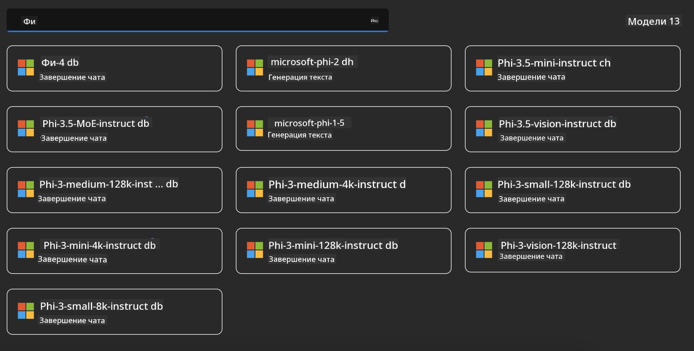
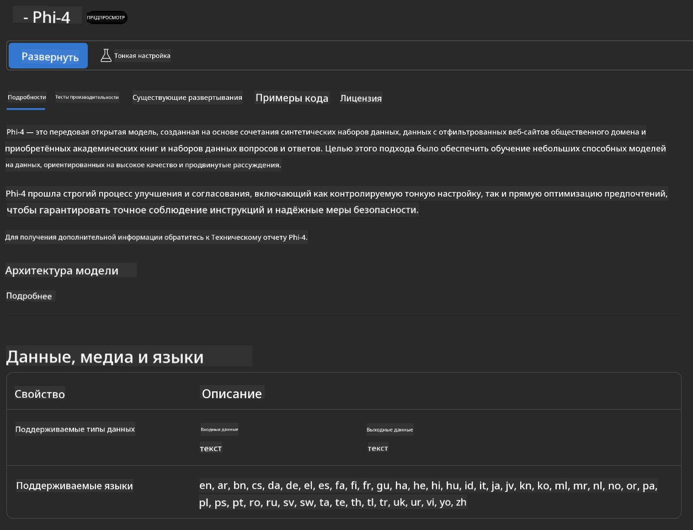

<!--
CO_OP_TRANSLATOR_METADATA:
{
  "original_hash": "3ae21dc5554e888defbe57946ee995ee",
  "translation_date": "2025-07-16T19:06:46+00:00",
  "source_file": "md/01.Introduction/02/03.AzureAIFoundry.md",
  "language_code": "ru"
}
-->
## Семейство Phi в Azure AI Foundry

[Azure AI Foundry](https://ai.azure.com) — это надежная платформа, которая помогает разработчикам внедрять инновации и формировать будущее с помощью ИИ безопасным, защищённым и ответственным образом.

[Azure AI Foundry](https://ai.azure.com) создана для разработчиков, чтобы:

- Создавать приложения с генеративным ИИ на платформе корпоративного уровня.
- Изучать, создавать, тестировать и развёртывать с использованием передовых инструментов ИИ и моделей машинного обучения, основанных на принципах ответственного ИИ.
- Сотрудничать в команде на всех этапах жизненного цикла разработки приложений.

С помощью Azure AI Foundry вы можете исследовать широкий спектр моделей, сервисов и возможностей, а также создавать ИИ-приложения, которые максимально соответствуют вашим целям. Платформа Azure AI Foundry обеспечивает масштабируемость, позволяя легко превращать прототипы в полнофункциональные производственные приложения. Непрерывный мониторинг и доработка поддерживают долгосрочный успех.


Помимо использования Azure AOAI Service в Azure AI Foundry, вы также можете применять сторонние модели из Каталога моделей Azure AI Foundry. Это отличный вариант, если вы хотите использовать Azure AI Foundry в качестве платформы для своих ИИ-решений.

Мы можем быстро развернуть модели семейства Phi через Каталог моделей в Azure AI Foundry

[Модели Microsoft Phi в Azure AI Foundry Models](https://ai.azure.com/explore/models/?selectedCollection=phi)



### **Развёртывание Phi-4 в Azure AI Foundry**



### **Тестирование Phi-4 в Azure AI Foundry Playground**


### **Запуск Python-кода для вызова Azure AI Foundry Phi-4**

```python

import os  
import base64
from openai import AzureOpenAI  
from azure.identity import DefaultAzureCredential, get_bearer_token_provider  
        
endpoint = os.getenv("ENDPOINT_URL", "Your Azure AOAI Service Endpoint")  
deployment = os.getenv("DEPLOYMENT_NAME", "Phi-4")  
      
token_provider = get_bearer_token_provider(  
    DefaultAzureCredential(),  
    "https://cognitiveservices.azure.com/.default"  
)  
  
client = AzureOpenAI(  
    azure_endpoint=endpoint,  
    azure_ad_token_provider=token_provider,  
    api_version="2024-05-01-preview",  
)  
  

chat_prompt = [
    {
        "role": "system",
        "content": "You are an AI assistant that helps people find information."
    },
    {
        "role": "user",
        "content": "can you introduce yourself"
    }
] 
    
# Include speech result if speech is enabled  
messages = chat_prompt 

completion = client.chat.completions.create(  
    model=deployment,  
    messages=messages,
    max_tokens=800,  
    temperature=0.7,  
    top_p=0.95,  
    frequency_penalty=0,  
    presence_penalty=0,
    stop=None,  
    stream=False  
)  
  
print(completion.to_json())  

```

**Отказ от ответственности**:  
Этот документ был переведен с помощью сервиса автоматического перевода [Co-op Translator](https://github.com/Azure/co-op-translator). Несмотря на наши усилия по обеспечению точности, просим учитывать, что автоматический перевод может содержать ошибки или неточности. Оригинальный документ на его исходном языке следует считать авторитетным источником. Для получения критически важной информации рекомендуется обращаться к профессиональному переводу, выполненному человеком. Мы не несем ответственности за любые недоразумения или неправильные толкования, возникшие в результате использования данного перевода.