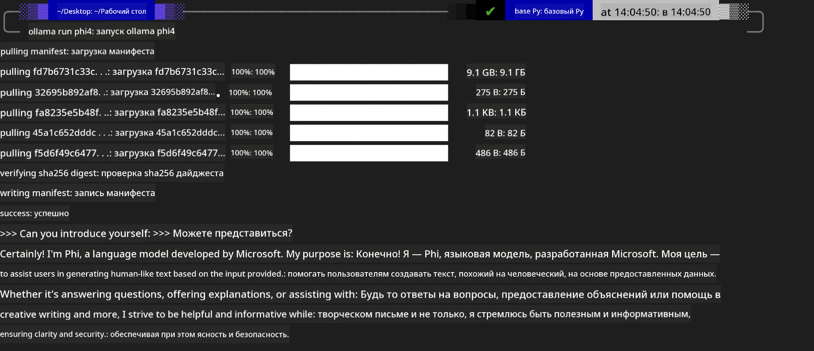
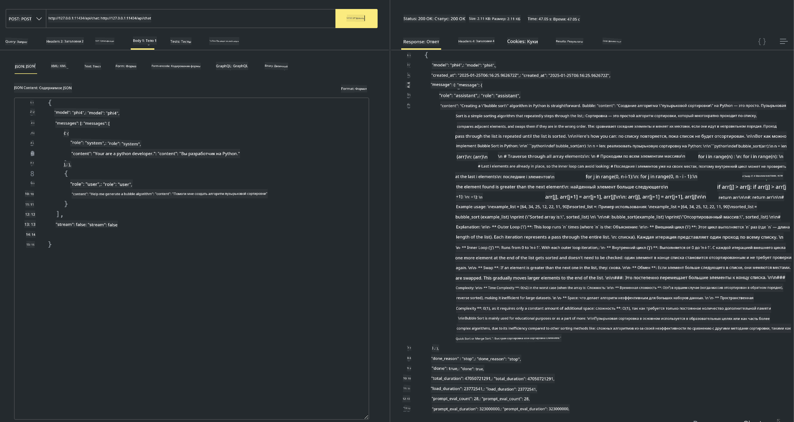

<!--
CO_OP_TRANSLATOR_METADATA:
{
  "original_hash": "2aa35f3c8b437fd5dc9995d53909d495",
  "translation_date": "2025-12-21T09:58:42+00:00",
  "source_file": "md/01.Introduction/02/04.Ollama.md",
  "language_code": "ru"
}
-->
## Семейство Phi в Ollama


[Ollama](https://ollama.com) позволяет большему числу людей напрямую разворачивать open source LLM или SLM с помощью простых скриптов, а также может создавать API для локальных сценариев применения Copilot.

## **1. Установка**

Ollama поддерживает работу в Windows, macOS и Linux. Вы можете установить Ollama по этой ссылке ([https://ollama.com/download](https://ollama.com/download)). После успешной установки вы можете напрямую использовать скрипт Ollama для вызова Phi-3 через окно терминала. Вы можете просмотреть все [доступные библиотеки в Ollama](https://ollama.com/library). Если вы откроете этот репозиторий в Codespace, в нём уже будет установлен Ollama.

```bash

ollama run phi4

```

> [!NOTE]
> Модель будет загружена при первом запуске. Конечно, вы также можете напрямую указать уже загруженную модель Phi-4. В качестве примера мы используем WSL для выполнения команды. После успешной загрузки модели вы можете взаимодействовать напрямую в терминале.



## **2. Вызов API phi-4 из Ollama**

Если вы хотите вызвать API Phi-4, сгенерированный ollama, вы можете использовать эту команду в терминале, чтобы запустить сервер Ollama.

```bash

ollama serve

```

> [!NOTE]
> Если вы запускаете MacOS или Linux, обратите внимание, что вы можете столкнуться со следующей ошибкой **"Error: listen tcp 127.0.0.1:11434: bind: address already in use"**. Эта ошибка может появиться при выполнении команды. Вы можете либо игнорировать её, поскольку она обычно указывает на то, что сервер уже запущен, либо остановить и перезапустить Ollama:

**macOS**

```bash

brew services restart ollama

```

**Linux**

```bash

sudo systemctl stop ollama

```

Ollama поддерживает два API: generate и chat. Вы можете вызывать API модели, предоставляемые Ollama, в зависимости от ваших потребностей, отправляя запросы на локальный сервис, работающий на порту 11434.

**Chat**

```bash

curl http://127.0.0.1:11434/api/chat -d '{
  "model": "phi3",
  "messages": [
    {
      "role": "system",
      "content": "Your are a python developer."
    },
    {
      "role": "user",
      "content": "Help me generate a bubble algorithm"
    }
  ],
  "stream": false
  
}'
```

Это результат в Postman



## Дополнительные ресурсы

Просмотрите список доступных моделей в Ollama в [их библиотеке](https://ollama.com/library).

Получите модель с сервера Ollama с помощью этой команды

```bash
ollama pull phi4
```

Запустите модель с помощью этой команды

```bash
ollama run phi4
```

***Примечание:*** Посетите эту ссылку [https://github.com/ollama/ollama/blob/main/docs/api.md](https://github.com/ollama/ollama/blob/main/docs/api.md), чтобы узнать больше

## Вызов Ollama из Python

Вы можете использовать `requests` или `urllib3` для отправки запросов к локальным конечным точкам сервера, указанным выше. Однако популярным способом использования Ollama в Python является SDK [openai](https://pypi.org/project/openai/), поскольку Ollama также предоставляет совместимые с OpenAI серверные конечные точки.

Вот пример для phi3-mini:

```python
import openai

client = openai.OpenAI(
    base_url="http://localhost:11434/v1",
    api_key="nokeyneeded",
)

response = client.chat.completions.create(
    model="phi4",
    temperature=0.7,
    n=1,
    messages=[
        {"role": "system", "content": "You are a helpful assistant."},
        {"role": "user", "content": "Write a haiku about a hungry cat"},
    ],
)

print("Response:")
print(response.choices[0].message.content)
```

## Вызов Ollama из JavaScript 

```javascript
// Пример суммаризации файла с помощью Phi-4
script({
    model: "ollama:phi4",
    title: "Summarize with Phi-4",
    system: ["system"],
})

// Пример суммаризации
const file = def("FILE", env.files)
$`Summarize ${file} in a single paragraph.`
```

## Вызов Ollama из C#

Создайте новое консольное приложение C# и добавьте следующий пакет NuGet:

```bash
dotnet add package Microsoft.SemanticKernel --version 1.34.0
```

Затем замените этим кодом содержимое файла `Program.cs`

```csharp
using Microsoft.SemanticKernel;
using Microsoft.SemanticKernel.ChatCompletion;

// add chat completion service using the local ollama server endpoint
#pragma warning disable SKEXP0001, SKEXP0003, SKEXP0010, SKEXP0011, SKEXP0050, SKEXP0052
builder.AddOpenAIChatCompletion(
    modelId: "phi4",
    endpoint: new Uri("http://localhost:11434/"),
    apiKey: "non required");

// invoke a simple prompt to the chat service
string prompt = "Write a joke about kittens";
var response = await kernel.InvokePromptAsync(prompt);
Console.WriteLine(response.GetValue<string>());
```

Запустите приложение командой:

```bash
dotnet run
```

---

<!-- CO-OP TRANSLATOR DISCLAIMER START -->
Отказ от ответственности:
Этот документ был переведён с помощью сервиса перевода на базе ИИ [Co-op Translator](https://github.com/Azure/co-op-translator). Несмотря на наши усилия по обеспечению точности, имейте в виду, что автоматические переводы могут содержать ошибки или неточности. Оригинальный документ на языке оригинала следует считать авторитетным источником. Для критически важной информации рекомендуется профессиональный перевод, выполненный человеком. Мы не несем ответственности за любые недоразумения или искажения смысла, возникшие в результате использования этого перевода.
<!-- CO-OP TRANSLATOR DISCLAIMER END -->