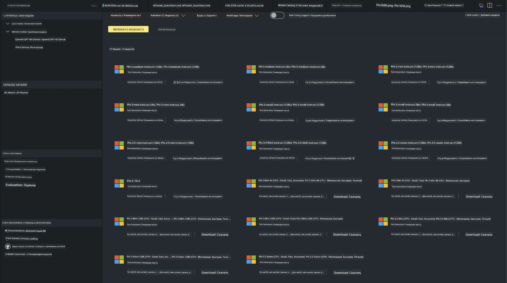
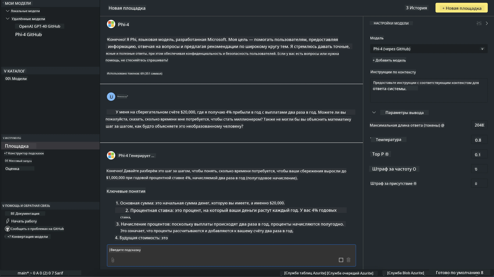

<!--
CO_OP_TRANSLATOR_METADATA:
{
  "original_hash": "4951d458c0b60c02cd1e751b40903877",
  "translation_date": "2025-07-16T19:21:03+00:00",
  "source_file": "md/01.Introduction/02/05.AITK.md",
  "language_code": "ru"
}
-->
# Семейство Phi в AITK

[AI Toolkit для VS Code](https://marketplace.visualstudio.com/items?itemName=ms-windows-ai-studio.windows-ai-studio) упрощает разработку приложений с генеративным ИИ, объединяя передовые инструменты и модели из Azure AI Foundry Catalog и других каталогов, таких как Hugging Face. Вы сможете просматривать каталог моделей ИИ, поддерживаемый GitHub Models и Azure AI Foundry Model Catalogs, загружать их локально или удалённо, дообучать, тестировать и использовать в своих приложениях.

Предварительная версия AI Toolkit запускается локально. Локальный вывод или дообучение зависят от выбранной модели, для некоторых из них может потребоваться GPU, например NVIDIA CUDA GPU. Вы также можете запускать модели GitHub напрямую через AITK.

## Начало работы

[Узнайте, как установить подсистему Windows для Linux](https://learn.microsoft.com/windows/wsl/install?WT.mc_id=aiml-137032-kinfeylo)

и [как изменить дистрибутив по умолчанию](https://learn.microsoft.com/windows/wsl/install#change-the-default-linux-distribution-installed).

[Репозиторий AI Toolkit на GitHub](https://github.com/microsoft/vscode-ai-toolkit/)

- Windows, Linux, macOS
  
- Для дообучения как на Windows, так и на Linux потребуется видеокарта Nvidia. Кроме того, **Windows** требует подсистему Linux с дистрибутивом Ubuntu 18.4 или новее. [Узнайте, как установить подсистему Windows для Linux](https://learn.microsoft.com/windows/wsl/install) и [как изменить дистрибутив по умолчанию](https://learn.microsoft.com/windows/wsl/install#change-the-default-linux-distribution-installed).

### Установка AI Toolkit

AI Toolkit поставляется в виде [расширения для Visual Studio Code](https://code.visualstudio.com/docs/setup/additional-components#_vs-code-extensions), поэтому сначала нужно установить [VS Code](https://code.visualstudio.com/docs/setup/windows?WT.mc_id=aiml-137032-kinfeylo), а затем скачать AI Toolkit из [VS Marketplace](https://marketplace.visualstudio.com/items?itemName=ms-windows-ai-studio.windows-ai-studio).  
[AI Toolkit доступен в Visual Studio Marketplace](https://marketplace.visualstudio.com/items?itemName=ms-windows-ai-studio.windows-ai-studio) и устанавливается как любое другое расширение VS Code.

Если вы не знакомы с установкой расширений для VS Code, выполните следующие шаги:

### Вход в систему

1. В панели активности VS Code выберите **Extensions**  
1. В строке поиска расширений введите "AI Toolkit"  
1. Выберите "AI Toolkit for Visual Studio code"  
1. Нажмите **Install**

Теперь расширение готово к использованию!

Вас попросят войти в GitHub, нажмите "Allow" для продолжения. Вы будете перенаправлены на страницу входа GitHub.

Пожалуйста, войдите и следуйте инструкциям. После успешного входа вы вернётесь в VS Code.

После установки расширения в панели активности появится иконка AI Toolkit.

Давайте изучим доступные действия!

### Доступные действия

Основная боковая панель AI Toolkit организована по разделам:

- **Models**  
- **Resources**  
- **Playground**  
- **Fine-tuning**  
- **Evaluation**

Разделы доступны в секции Resources. Для начала выберите **Model Catalog**.

### Загрузка модели из каталога

При запуске AI Toolkit из боковой панели VS Code вы можете выбрать следующие опции:



- Найти поддерживаемую модель в **Model Catalog** и скачать её локально  
- Протестировать вывод модели в **Model Playground**  
- Дообучить модель локально или удалённо в **Model Fine-tuning**  
- Развернуть дообученные модели в облаке через командную палитру AI Toolkit  
- Оценка моделей

> [!NOTE]
>
> **GPU против CPU**
>
> Обратите внимание, что карточки моделей показывают размер модели, платформу и тип ускорителя (CPU, GPU). Для оптимальной производительности на **устройствах Windows с хотя бы одним GPU** выбирайте версии моделей, ориентированные только на Windows.
>
> Это гарантирует, что модель оптимизирована для ускорителя DirectML.
>
> Имена моделей имеют формат
>
> - `{model_name}-{accelerator}-{quantization}-{format}`.
>
>Чтобы проверить наличие GPU на вашем устройстве с Windows, откройте **Диспетчер задач** и перейдите на вкладку **Производительность**. Если GPU есть, они будут отображаться под именами вроде "GPU 0" или "GPU 1".

### Запуск модели в playground

После настройки всех параметров нажмите **Generate Project**.

Когда модель загрузится, выберите **Load in Playground** на карточке модели в каталоге:

- Запустить загрузку модели  
- Установить все необходимые зависимости и компоненты  
- Создать рабочее пространство VS Code



### Использование REST API в вашем приложении

AI Toolkit поставляется с локальным REST API веб-сервером **на порту 5272**, который использует формат [OpenAI chat completions](https://platform.openai.com/docs/api-reference/chat/create).

Это позволяет тестировать ваше приложение локально без необходимости обращаться к облачному сервису ИИ. Например, следующий JSON-файл показывает, как настроить тело запроса:

```json
{
    "model": "Phi-4",
    "messages": [
        {
            "role": "user",
            "content": "what is the golden ratio?"
        }
    ],
    "temperature": 0.7,
    "top_p": 1,
    "top_k": 10,
    "max_tokens": 100,
    "stream": true
}
```

Вы можете тестировать REST API с помощью, например, [Postman](https://www.postman.com/) или утилиты CURL (Client URL):

```bash
curl -vX POST http://127.0.0.1:5272/v1/chat/completions -H 'Content-Type: application/json' -d @body.json
```

### Использование библиотеки OpenAI для Python

```python
from openai import OpenAI

client = OpenAI(
    base_url="http://127.0.0.1:5272/v1/", 
    api_key="x" # required for the API but not used
)

chat_completion = client.chat.completions.create(
    messages=[
        {
            "role": "user",
            "content": "what is the golden ratio?",
        }
    ],
    model="Phi-4",
)

print(chat_completion.choices[0].message.content)
```

### Использование библиотеки Azure OpenAI для .NET

Добавьте [Azure OpenAI client library для .NET](https://www.nuget.org/packages/Azure.AI.OpenAI/) в ваш проект через NuGet:

```bash
dotnet add {project_name} package Azure.AI.OpenAI --version 1.0.0-beta.17
```

Добавьте в проект файл C# с именем **OverridePolicy.cs** и вставьте следующий код:

```csharp
// OverridePolicy.cs
using Azure.Core.Pipeline;
using Azure.Core;

internal partial class OverrideRequestUriPolicy(Uri overrideUri)
    : HttpPipelineSynchronousPolicy
{
    private readonly Uri _overrideUri = overrideUri;

    public override void OnSendingRequest(HttpMessage message)
    {
        message.Request.Uri.Reset(_overrideUri);
    }
}
```

Затем вставьте следующий код в файл **Program.cs**:

```csharp
// Program.cs
using Azure.AI.OpenAI;

Uri localhostUri = new("http://localhost:5272/v1/chat/completions");

OpenAIClientOptions clientOptions = new();
clientOptions.AddPolicy(
    new OverrideRequestUriPolicy(localhostUri),
    Azure.Core.HttpPipelinePosition.BeforeTransport);
OpenAIClient client = new(openAIApiKey: "unused", clientOptions);

ChatCompletionsOptions options = new()
{
    DeploymentName = "Phi-4",
    Messages =
    {
        new ChatRequestSystemMessage("You are a helpful assistant. Be brief and succinct."),
        new ChatRequestUserMessage("What is the golden ratio?"),
    }
};

StreamingResponse<StreamingChatCompletionsUpdate> streamingChatResponse
    = await client.GetChatCompletionsStreamingAsync(options);

await foreach (StreamingChatCompletionsUpdate chatChunk in streamingChatResponse)
{
    Console.Write(chatChunk.ContentUpdate);
}
```


## Дообучение с AI Toolkit

- Начните с поиска моделей и playground.  
- Дообучение и вывод модели с использованием локальных ресурсов.  
- Удалённое дообучение и вывод с использованием ресурсов Azure.

[Дообучение с AI Toolkit](../../03.FineTuning/Finetuning_VSCodeaitoolkit.md)

## Ресурсы по вопросам и ответам AI Toolkit

Пожалуйста, обратитесь к нашей [странице вопросов и ответов](https://github.com/microsoft/vscode-ai-toolkit/blob/main/archive/QA.md) для решения наиболее распространённых проблем и вопросов.

**Отказ от ответственности**:  
Этот документ был переведен с помощью сервиса автоматического перевода [Co-op Translator](https://github.com/Azure/co-op-translator). Несмотря на наши усилия по обеспечению точности, просим учитывать, что автоматический перевод может содержать ошибки или неточности. Оригинальный документ на его исходном языке следует считать авторитетным источником. Для получения критически важной информации рекомендуется обращаться к профессиональному переводу, выполненному человеком. Мы не несем ответственности за любые недоразумения или неправильные толкования, возникшие в результате использования данного перевода.