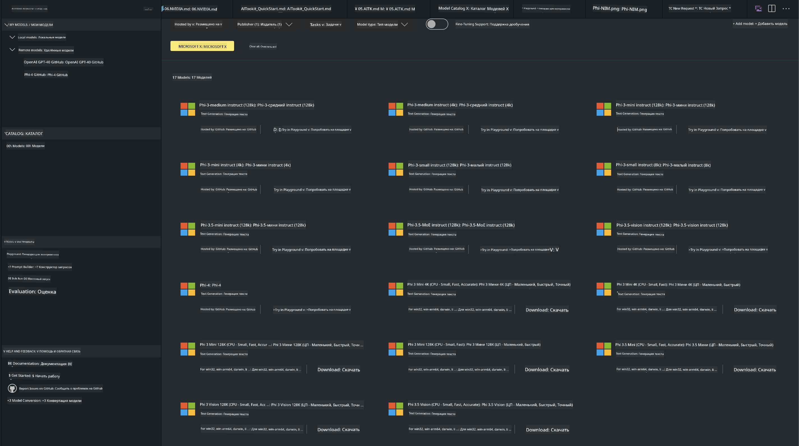
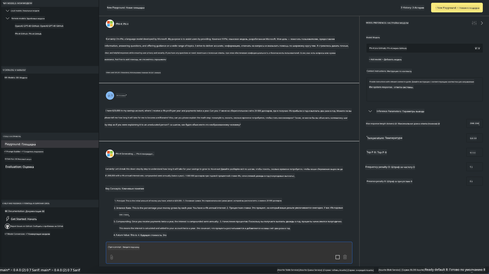

<!--
CO_OP_TRANSLATOR_METADATA:
{
  "original_hash": "4951d458c0b60c02cd1e751b40903877",
  "translation_date": "2025-05-07T15:05:01+00:00",
  "source_file": "md/01.Introduction/02/05.AITK.md",
  "language_code": "ru"
}
-->
# Phi Family в AITK

[AI Toolkit для VS Code](https://marketplace.visualstudio.com/items?itemName=ms-windows-ai-studio.windows-ai-studio) упрощает разработку генеративных AI-приложений, объединяя передовые инструменты и модели из Azure AI Foundry Catalog и других каталогов, таких как Hugging Face. Вы сможете просматривать каталог AI-моделей, поддерживаемый GitHub Models и Azure AI Foundry Model Catalogs, загружать их локально или удаленно, дообучать, тестировать и использовать в своих приложениях.

Предварительная версия AI Toolkit работает локально. Локальное инференс или дообучение зависят от выбранной модели, возможно, вам понадобится GPU, например NVIDIA CUDA GPU. Вы также можете запускать GitHub Models напрямую через AITK.

## Начало работы

[Узнайте, как установить Windows Subsystem for Linux](https://learn.microsoft.com/windows/wsl/install?WT.mc_id=aiml-137032-kinfeylo)

и [как изменить дистрибутив по умолчанию](https://learn.microsoft.com/windows/wsl/install#change-the-default-linux-distribution-installed).

[Репозиторий AI Toolkit на GitHub](https://github.com/microsoft/vscode-ai-toolkit/)

- Windows, Linux, macOS

- Для дообучения как на Windows, так и на Linux потребуется видеокарта Nvidia. Кроме того, **Windows** требует установленный Windows Subsystem for Linux с дистрибутивом Ubuntu 18.4 или новее. [Узнайте, как установить Windows Subsystem for Linux](https://learn.microsoft.com/windows/wsl/install) и [как изменить дистрибутив по умолчанию](https://learn.microsoft.com/windows/wsl/install#change-the-default-linux-distribution-installed).

### Установка AI Toolkit

AI Toolkit поставляется в виде [расширения для Visual Studio Code](https://code.visualstudio.com/docs/setup/additional-components#_vs-code-extensions), поэтому сначала необходимо установить [VS Code](https://code.visualstudio.com/docs/setup/windows?WT.mc_id=aiml-137032-kinfeylo), а затем скачать AI Toolkit из [VS Marketplace](https://marketplace.visualstudio.com/items?itemName=ms-windows-ai-studio.windows-ai-studio).  
[AI Toolkit доступен в Visual Studio Marketplace](https://marketplace.visualstudio.com/items?itemName=ms-windows-ai-studio.windows-ai-studio) и устанавливается как любое другое расширение VS Code.

Если вы не знакомы с установкой расширений VS Code, выполните следующие шаги:

### Вход в систему

1. В Activity Bar в VS Code выберите **Extensions**  
2. В строке поиска расширений введите "AI Toolkit"  
3. Выберите "AI Toolkit for Visual Studio code"  
4. Нажмите **Install**

Теперь вы готовы использовать расширение!

Вас попросят войти в GitHub, нажмите "Allow" для продолжения. Вы будете перенаправлены на страницу входа GitHub.

Пожалуйста, войдите и следуйте инструкциям. После успешного входа вы вернётесь в VS Code.

После установки расширения в вашей Activity Bar появится иконка AI Toolkit.

Давайте изучим доступные действия!

### Доступные действия

Основная боковая панель AI Toolkit организована по разделам:

- **Models**  
- **Resources**  
- **Playground**  
- **Fine-tuning**  
- **Evaluation**

Разделы доступны в Resources. Для начала выберите **Model Catalog**.

### Загрузка модели из каталога

После запуска AI Toolkit из боковой панели VS Code вы можете выбрать следующие опции:



- Найти поддерживаемую модель в **Model Catalog** и скачать локально  
- Протестировать инференс модели в **Model Playground**  
- Дообучить модель локально или удалённо в **Model Fine-tuning**  
- Развернуть дообученные модели в облаке через командную палитру AI Toolkit  
- Оценка моделей

> [!NOTE]
>
> **GPU против CPU**
>
> На карточках моделей указаны размер модели, платформа и тип ускорителя (CPU, GPU). Для оптимальной производительности на **устройствах Windows с хотя бы одним GPU** выбирайте версии моделей, ориентированные только на Windows.
>
> Это гарантирует оптимизацию модели под DirectML ускоритель.
>
> Имена моделей имеют формат
>
> - `{model_name}-{accelerator}-{quantization}-{format}`.
>
>Чтобы проверить наличие GPU на вашем устройстве с Windows, откройте **Диспетчер задач** и выберите вкладку **Производительность**. Если у вас есть GPU, они будут отображаться с названиями вроде "GPU 0" или "GPU 1".

### Запуск модели в playground

После настройки всех параметров нажмите **Generate Project**.

Когда модель загрузится, выберите **Load in Playground** на карточке модели в каталоге:

- Запустить загрузку модели  
- Установить все необходимые зависимости и требования  
- Создать рабочее пространство VS Code



### Использование REST API в вашем приложении

AI Toolkit поставляется с локальным REST API веб-сервером **на порту 5272**, который использует формат [OpenAI chat completions](https://platform.openai.com/docs/api-reference/chat/create).

Это позволяет тестировать ваше приложение локально, не полагаясь на облачные AI-сервисы. Например, следующий JSON-файл показывает, как настроить тело запроса:

```json
{
    "model": "Phi-4",
    "messages": [
        {
            "role": "user",
            "content": "what is the golden ratio?"
        }
    ],
    "temperature": 0.7,
    "top_p": 1,
    "top_k": 10,
    "max_tokens": 100,
    "stream": true
}
```

Вы можете тестировать REST API с помощью, например, [Postman](https://www.postman.com/) или утилиты CURL:

```bash
curl -vX POST http://127.0.0.1:5272/v1/chat/completions -H 'Content-Type: application/json' -d @body.json
```

### Использование клиентской библиотеки OpenAI для Python

```python
from openai import OpenAI

client = OpenAI(
    base_url="http://127.0.0.1:5272/v1/", 
    api_key="x" # required for the API but not used
)

chat_completion = client.chat.completions.create(
    messages=[
        {
            "role": "user",
            "content": "what is the golden ratio?",
        }
    ],
    model="Phi-4",
)

print(chat_completion.choices[0].message.content)
```

### Использование Azure OpenAI клиентской библиотеки для .NET

Добавьте [Azure OpenAI клиентскую библиотеку для .NET](https://www.nuget.org/packages/Azure.AI.OpenAI/) в ваш проект через NuGet:

```bash
dotnet add {project_name} package Azure.AI.OpenAI --version 1.0.0-beta.17
```

Добавьте в проект файл C# с именем **OverridePolicy.cs** и вставьте следующий код:

```csharp
// OverridePolicy.cs
using Azure.Core.Pipeline;
using Azure.Core;

internal partial class OverrideRequestUriPolicy(Uri overrideUri)
    : HttpPipelineSynchronousPolicy
{
    private readonly Uri _overrideUri = overrideUri;

    public override void OnSendingRequest(HttpMessage message)
    {
        message.Request.Uri.Reset(_overrideUri);
    }
}
```

Затем вставьте следующий код в файл **Program.cs**:

```csharp
// Program.cs
using Azure.AI.OpenAI;

Uri localhostUri = new("http://localhost:5272/v1/chat/completions");

OpenAIClientOptions clientOptions = new();
clientOptions.AddPolicy(
    new OverrideRequestUriPolicy(localhostUri),
    Azure.Core.HttpPipelinePosition.BeforeTransport);
OpenAIClient client = new(openAIApiKey: "unused", clientOptions);

ChatCompletionsOptions options = new()
{
    DeploymentName = "Phi-4",
    Messages =
    {
        new ChatRequestSystemMessage("You are a helpful assistant. Be brief and succinct."),
        new ChatRequestUserMessage("What is the golden ratio?"),
    }
};

StreamingResponse<StreamingChatCompletionsUpdate> streamingChatResponse
    = await client.GetChatCompletionsStreamingAsync(options);

await foreach (StreamingChatCompletionsUpdate chatChunk in streamingChatResponse)
{
    Console.Write(chatChunk.ContentUpdate);
}
```


## Дообучение с AI Toolkit

- Начните с поиска моделей и playground.  
- Дообучение и инференс модели с использованием локальных ресурсов.  
- Дообучение и инференс модели с использованием удалённых ресурсов Azure.

[Дообучение с AI Toolkit](../../03.FineTuning/Finetuning_VSCodeaitoolkit.md)

## Ресурсы Q&A по AI Toolkit

Пожалуйста, обратитесь к нашей [странице вопросов и ответов](https://github.com/microsoft/vscode-ai-toolkit/blob/main/archive/QA.md) для решения наиболее распространённых проблем и вопросов.

**Отказ от ответственности**:  
Этот документ был переведен с помощью сервиса автоматического перевода [Co-op Translator](https://github.com/Azure/co-op-translator). Несмотря на наши усилия по обеспечению точности, пожалуйста, имейте в виду, что автоматический перевод может содержать ошибки или неточности. Оригинальный документ на исходном языке следует считать авторитетным источником. Для критически важной информации рекомендуется использовать профессиональный перевод, выполненный человеком. Мы не несем ответственности за любые недоразумения или неправильные толкования, возникшие в результате использования данного перевода.