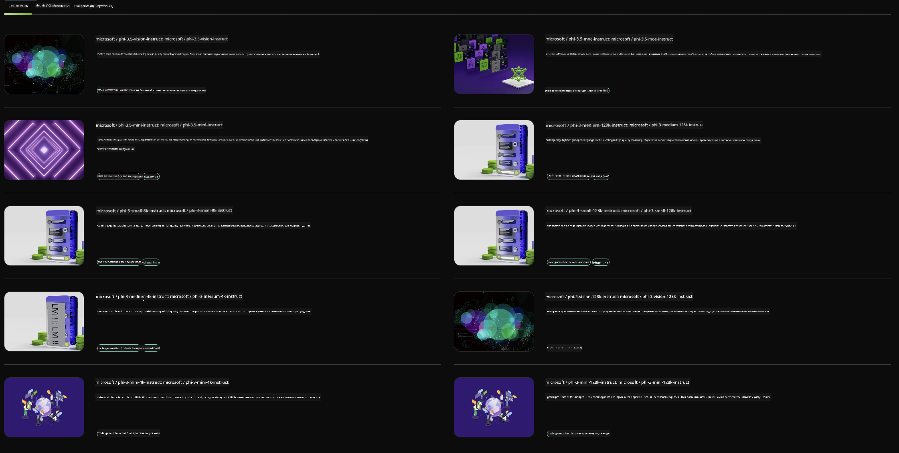

<!--
CO_OP_TRANSLATOR_METADATA:
{
  "original_hash": "7b08e277df2a9307f861ae54bc30c772",
  "translation_date": "2025-07-16T19:32:58+00:00",
  "source_file": "md/01.Introduction/02/06.NVIDIA.md",
  "language_code": "ru"
}
-->
## Семейство Phi в NVIDIA NIM

NVIDIA NIM — это набор простых в использовании микросервисов, созданных для ускорения развертывания генеративных моделей ИИ в облаке, дата-центрах и на рабочих станциях. NIM классифицируются по семействам моделей и по каждой модели отдельно. Например, NVIDIA NIM для больших языковых моделей (LLM) приносит мощь передовых LLM в корпоративные приложения, обеспечивая непревзойденные возможности обработки и понимания естественного языка.

NIM упрощает для IT и DevOps команд самостоятельное размещение больших языковых моделей (LLM) в собственных управляемых средах, при этом предоставляя разработчикам стандартные API, которые позволяют создавать мощных помощников, чат-ботов и ИИ-ассистентов, способных трансформировать бизнес. Используя передовое GPU-ускорение NVIDIA и масштабируемое развертывание, NIM предлагает самый быстрый путь к инференсу с непревзойденной производительностью.

Вы можете использовать NVIDIA NIM для инференса моделей семейства Phi



### **Примеры - Phi-3-Vision в NVIDIA NIM**

Представьте, что у вас есть изображение (`demo.png`), и вы хотите сгенерировать Python-код, который обработает это изображение и сохранит новую версию (`phi-3-vision.jpg`).

Приведённый выше код автоматизирует этот процесс, выполняя следующие шаги:

1. Настройка окружения и необходимых конфигураций.
2. Создание запроса (prompt), который инструктирует модель сгенерировать нужный Python-код.
3. Отправка запроса модели и сбор сгенерированного кода.
4. Извлечение и выполнение сгенерированного кода.
5. Отображение исходного и обработанного изображений.

Такой подход использует возможности ИИ для автоматизации задач обработки изображений, делая процесс проще и быстрее.

[Пример решения кода](../../../../../code/06.E2E/E2E_Nvidia_NIM_Phi3_Vision.ipynb)

Давайте разберём, что делает весь код шаг за шагом:

1. **Установка необходимого пакета**:
    ```python
    !pip install langchain_nvidia_ai_endpoints -U
    ```  
    Эта команда устанавливает пакет `langchain_nvidia_ai_endpoints`, гарантируя, что используется последняя версия.

2. **Импорт необходимых модулей**:
    ```python
    from langchain_nvidia_ai_endpoints import ChatNVIDIA
    import getpass
    import os
    import base64
    ```  
    Эти импорты подключают модули для взаимодействия с NVIDIA AI endpoints, безопасного ввода паролей, работы с операционной системой и кодирования/декодирования данных в формате base64.

3. **Настройка API ключа**:
    ```python
    if not os.getenv("NVIDIA_API_KEY"):
        os.environ["NVIDIA_API_KEY"] = getpass.getpass("Enter your NVIDIA API key: ")
    ```  
    Этот код проверяет, установлен ли переменная окружения `NVIDIA_API_KEY`. Если нет, он запрашивает у пользователя ввод ключа безопасным способом.

4. **Определение модели и пути к изображению**:
    ```python
    model = 'microsoft/phi-3-vision-128k-instruct'
    chat = ChatNVIDIA(model=model)
    img_path = './imgs/demo.png'
    ```  
    Здесь задаётся модель для использования, создаётся экземпляр `ChatNVIDIA` с указанной моделью и определяется путь к файлу изображения.

5. **Создание текстового запроса (prompt)**:
    ```python
    text = "Please create Python code for image, and use plt to save the new picture under imgs/ and name it phi-3-vision.jpg."
    ```  
    Определяется текстовый запрос, который инструктирует модель сгенерировать Python-код для обработки изображения.

6. **Кодирование изображения в base64**:
    ```python
    with open(img_path, "rb") as f:
        image_b64 = base64.b64encode(f.read()).decode()
    image = f''
    ```  
    Этот код читает файл изображения, кодирует его в base64 и создаёт HTML-тег изображения с закодированными данными.

7. **Объединение текста и изображения в один запрос**:
    ```python
    prompt = f"{text} {image}"
    ```  
    Здесь текстовый запрос и HTML-тег изображения объединяются в одну строку.

8. **Генерация кода с помощью ChatNVIDIA**:
    ```python
    code = ""
    for chunk in chat.stream(prompt):
        print(chunk.content, end="")
        code += chunk.content
    ```  
    Этот код отправляет запрос модели `ChatNVIDIA` и собирает сгенерированный код по частям, выводя и добавляя каждую часть в строку `code`.

9. **Извлечение Python-кода из сгенерированного содержимого**:
    ```python
    begin = code.index('```python') + 9  
    code = code[begin:]  
    end = code.index('```')
    code = code[:end]
    ```  
    Этот шаг извлекает сам Python-код из сгенерированного содержимого, удаляя markdown-разметку.

10. **Выполнение сгенерированного кода**:
    ```python
    import subprocess
    result = subprocess.run(["python", "-c", code], capture_output=True)
    ```  
    Здесь извлечённый Python-код запускается как подпроцесс, и захватывается его вывод.

11. **Отображение изображений**:
    ```python
    from IPython.display import Image, display
    display(Image(filename='./imgs/phi-3-vision.jpg'))
    display(Image(filename='./imgs/demo.png'))
    ```  
    Эти строки отображают изображения с помощью модуля `IPython.display`.

**Отказ от ответственности**:  
Этот документ был переведен с помощью сервиса автоматического перевода [Co-op Translator](https://github.com/Azure/co-op-translator). Несмотря на наши усилия по обеспечению точности, просим учитывать, что автоматический перевод может содержать ошибки или неточности. Оригинальный документ на его исходном языке следует считать авторитетным источником. Для получения критически важной информации рекомендуется обращаться к профессиональному переводу, выполненному человеком. Мы не несем ответственности за любые недоразумения или неправильные толкования, возникшие в результате использования данного перевода.