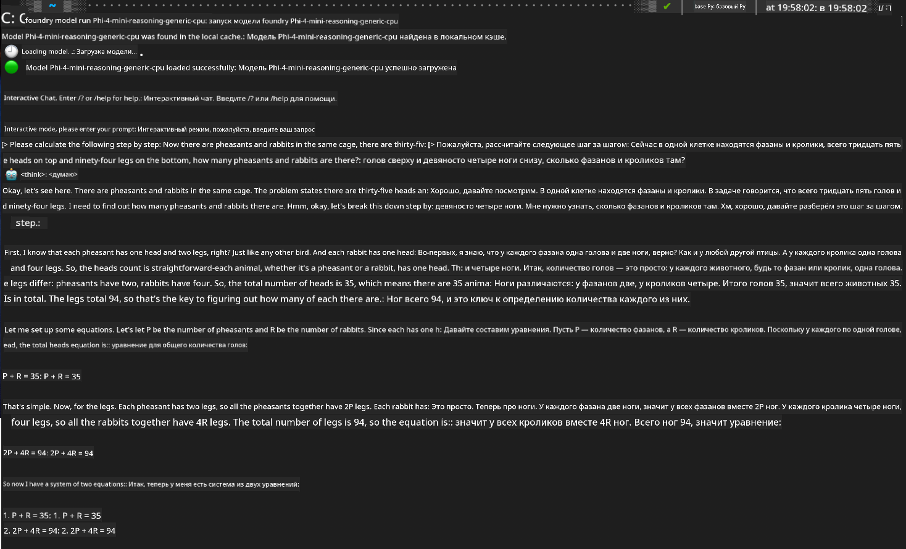

<!--
CO_OP_TRANSLATOR_METADATA:
{
  "original_hash": "52973a5680a65a810aa80b7036afd31f",
  "translation_date": "2025-07-16T19:42:01+00:00",
  "source_file": "md/01.Introduction/02/07.FoundryLocal.md",
  "language_code": "ru"
}
-->
## Начало работы с моделями Phi-Family в Foundry Local

### Введение в Foundry Local

Foundry Local — это мощное решение для локального AI-инференса, которое переносит корпоративные возможности искусственного интеллекта прямо на ваше локальное оборудование. В этом руководстве вы узнаете, как настроить и использовать модели Phi-Family с Foundry Local, получая полный контроль над AI-задачами при сохранении конфиденциальности и снижении затрат.

Foundry Local обеспечивает высокую производительность, конфиденциальность, гибкость настройки и экономию, запуская AI-модели непосредственно на вашем устройстве. Он легко интегрируется в существующие рабочие процессы и приложения через удобный CLI, SDK и REST API.


### Почему стоит выбрать Foundry Local?

Понимание преимуществ Foundry Local поможет вам принять обоснованное решение по стратегии внедрения AI:

- **Инференс на устройстве:** Запускайте модели локально на своем оборудовании, снижая расходы и сохраняя все данные на устройстве.

- **Настройка моделей:** Используйте предустановленные модели или свои собственные для решения конкретных задач и сценариев.

- **Экономия средств:** Избавьтесь от постоянных затрат на облачные сервисы, используя уже имеющееся оборудование, делая AI более доступным.

- **Бесшовная интеграция:** Подключайтесь к приложениям через SDK, API или CLI с возможностью масштабирования до Azure AI Foundry по мере роста потребностей.

> **Примечание для начала работы:** В этом руководстве основное внимание уделяется использованию Foundry Local через интерфейсы CLI и SDK. Вы познакомитесь с обоими способами, чтобы выбрать наиболее подходящий для вашего случая.

## Часть 1: Настройка Foundry Local CLI

### Шаг 1: Установка

Foundry Local CLI — ваш инструмент для управления и запуска AI-моделей локально. Начнем с его установки на вашу систему.

**Поддерживаемые платформы:** Windows и macOS

Подробные инструкции по установке доступны в [официальной документации Foundry Local](https://github.com/microsoft/Foundry-Local/blob/main/README.md).

### Шаг 2: Ознакомление с доступными моделями

После установки Foundry Local CLI вы можете узнать, какие модели доступны для вашего сценария. Эта команда покажет все поддерживаемые модели:

```bash
foundry model list
```

### Шаг 3: Понимание моделей Phi Family

Семейство Phi предлагает набор моделей, оптимизированных для разных задач и аппаратных конфигураций. Вот модели Phi, доступные в Foundry Local:

**Доступные модели Phi:** 

- **phi-3.5-mini** — компактная модель для базовых задач
- **phi-3-mini-128k** — версия с расширенным контекстом для длительных диалогов
- **phi-3-mini-4k** — стандартная модель с обычным контекстом для общего использования
- **phi-4** — продвинутая модель с улучшенными возможностями
- **phi-4-mini** — облегчённая версия Phi-4
- **phi-4-mini-reasoning** — специализированная для сложных задач с рассуждениями

> **Совместимость с оборудованием:** Каждую модель можно настроить под разное аппаратное ускорение (CPU, GPU) в зависимости от возможностей вашей системы.

### Шаг 4: Запуск первой модели Phi

Давайте перейдем к практическому примеру. Запустим модель `phi-4-mini-reasoning`, которая отлично справляется с пошаговым решением сложных задач.

**Команда для запуска модели:**

```bash
foundry model run Phi-4-mini-reasoning-generic-cpu
```

> **Первый запуск:** При первом запуске модель автоматически загрузится на ваше устройство. Время загрузки зависит от скорости вашего интернета, поэтому наберитесь терпения.

### Шаг 5: Тестирование модели на реальной задаче

Теперь проверим модель на классической логической задаче, чтобы увидеть, как она выполняет пошаговые рассуждения:

**Пример задачи:**

```txt
Please calculate the following step by step: Now there are pheasants and rabbits in the same cage, there are thirty-five heads on top and ninety-four legs on the bottom, how many pheasants and rabbits are there?
```

**Ожидаемое поведение:** Модель должна разбить задачу на логические шаги, используя факт, что у фазанов по 2 ноги, а у кроликов — по 4, чтобы решить систему уравнений.

**Результаты:**



## Часть 2: Создание приложений с Foundry Local SDK

### Зачем использовать SDK?

CLI отлично подходит для тестирования и быстрых взаимодействий, а SDK позволяет программно интегрировать Foundry Local в ваши приложения. Это открывает возможности для:

- Создания кастомных AI-приложений
- Автоматизации рабочих процессов
- Внедрения AI в существующие системы
- Разработки чат-ботов и интерактивных инструментов

### Поддерживаемые языки программирования

Foundry Local предлагает SDK для нескольких языков, чтобы вы могли выбрать удобный для себя:

**📦 Доступные SDK:**

- **C# (.NET):** [Документация и примеры SDK](https://github.com/microsoft/Foundry-Local/tree/main/sdk/cs)
- **Python:** [Документация и примеры SDK](https://github.com/microsoft/Foundry-Local/tree/main/sdk/python)
- **JavaScript:** [Документация и примеры SDK](https://github.com/microsoft/Foundry-Local/tree/main/sdk/js)
- **Rust:** [Документация и примеры SDK](https://github.com/microsoft/Foundry-Local/tree/main/sdk/rust)

### Следующие шаги

1. **Выберите подходящий SDK** в зависимости от вашей среды разработки  
2. **Изучите документацию SDK** для подробных инструкций по реализации  
3. **Начните с простых примеров**, прежде чем создавать сложные приложения  
4. **Ознакомьтесь с примерным кодом**, доступным в каждом репозитории SDK  

## Заключение

Теперь вы знаете, как:
- ✅ Установить и настроить Foundry Local CLI  
- ✅ Найти и запустить модели Phi Family  
- ✅ Проверить модели на реальных задачах  
- ✅ Ознакомиться с вариантами SDK для разработки приложений  

Foundry Local предоставляет мощную платформу для внедрения AI прямо в вашу локальную среду, обеспечивая контроль над производительностью, конфиденциальностью и затратами, при этом сохраняя гибкость масштабирования в облако при необходимости.

**Отказ от ответственности**:  
Этот документ был переведен с помощью сервиса автоматического перевода [Co-op Translator](https://github.com/Azure/co-op-translator). Несмотря на наши усилия по обеспечению точности, просим учитывать, что автоматический перевод может содержать ошибки или неточности. Оригинальный документ на его исходном языке следует считать авторитетным источником. Для получения критически важной информации рекомендуется обращаться к профессиональному переводу, выполненному человеком. Мы не несем ответственности за любые недоразумения или неправильные толкования, возникшие в результате использования данного перевода.