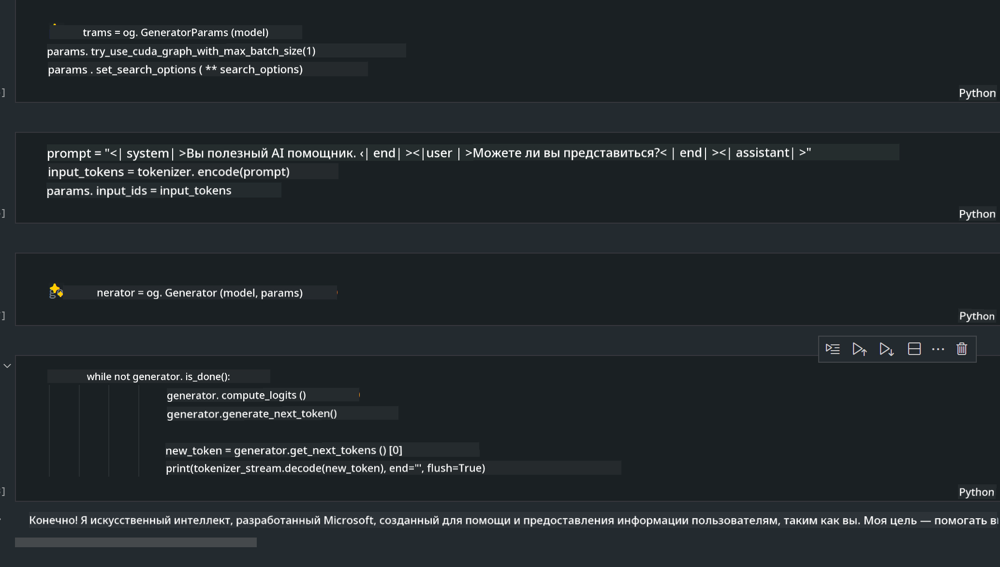

<!--
CO_OP_TRANSLATOR_METADATA:
{
  "original_hash": "e08ce816e23ad813244a09ca34ebb8ac",
  "translation_date": "2025-05-07T14:35:06+00:00",
  "source_file": "md/01.Introduction/03/AIPC_Inference.md",
  "language_code": "ru"
}
-->
# **Вывод Phi-3 на AI ПК**

С развитием генеративного ИИ и улучшением аппаратных возможностей устройств на периферии, всё больше моделей генеративного ИИ можно интегрировать в устройства пользователей Bring Your Own Device (BYOD). AI ПК — одни из таких моделей. Начиная с 2024 года, Intel, AMD и Qualcomm сотрудничают с производителями ПК для выпуска AI ПК, которые облегчают развертывание локальных генеративных моделей ИИ через аппаратные изменения. В этом обсуждении мы сосредоточимся на AI ПК Intel и рассмотрим, как развернуть Phi-3 на AI ПК Intel.

### Что такое NPU

NPU (Neural Processing Unit) — это специализированный процессор или вычислительный блок в составе более крупного SoC, разработанный специально для ускорения операций нейронных сетей и задач ИИ. В отличие от универсальных CPU и GPU, NPU оптимизированы для параллельных вычислений с данными, что делает их очень эффективными при обработке больших объемов мультимедийных данных, таких как видео и изображения, а также для обработки данных нейронных сетей. Они особенно хорошо справляются с задачами ИИ, такими как распознавание речи, размытие фона в видеозвонках и процессы редактирования фото или видео, например, обнаружение объектов.

## NPU vs GPU

Хотя многие задачи ИИ и машинного обучения выполняются на GPU, между GPU и NPU есть важное различие.  
GPU известны своими возможностями параллельных вычислений, но не все GPU одинаково эффективны вне графической обработки. NPU, напротив, созданы специально для сложных вычислений, связанных с операциями нейронных сетей, что делает их особенно эффективными для задач ИИ.

В итоге, NPU — это настоящие мастера математики, которые ускоряют вычисления ИИ и играют ключевую роль в новой эре AI ПК!

***Этот пример основан на последнем процессоре Intel Core Ultra***

## **1. Использование NPU для запуска модели Phi-3**

Устройство Intel® NPU — это ускоритель вывода ИИ, интегрированный с клиентскими CPU Intel, начиная с процессоров Intel® Core™ Ultra (ранее известные как Meteor Lake). Оно обеспечивает энергоэффективное выполнение задач искусственных нейронных сетей.


**Intel NPU Acceleration Library**

Библиотека Intel NPU Acceleration Library [https://github.com/intel/intel-npu-acceleration-library](https://github.com/intel/intel-npu-acceleration-library) — это Python-библиотека, созданная для повышения эффективности ваших приложений за счёт использования возможностей Intel Neural Processing Unit (NPU) для высокоскоростных вычислений на совместимом оборудовании.

Пример Phi-3-mini на AI ПК с процессорами Intel® Core™ Ultra.


Установка Python-библиотеки через pip

```bash

   pip install intel-npu-acceleration-library

```

***Примечание*** Проект всё ещё в разработке, но эталонная модель уже достаточно полная.

### **Запуск Phi-3 с Intel NPU Acceleration Library**

Используя ускорение Intel NPU, эта библиотека не влияет на традиционный процесс кодирования. Вам нужно лишь использовать её для квантизации исходной модели Phi-3, например FP16, INT8, INT4, например

```python
from transformers import AutoTokenizer, pipeline,TextStreamer
from intel_npu_acceleration_library import NPUModelForCausalLM, int4
from intel_npu_acceleration_library.compiler import CompilerConfig
import warnings

model_id = "microsoft/Phi-3-mini-4k-instruct"

compiler_conf = CompilerConfig(dtype=int4)
model = NPUModelForCausalLM.from_pretrained(
    model_id, use_cache=True, config=compiler_conf, attn_implementation="sdpa"
).eval()

tokenizer = AutoTokenizer.from_pretrained(model_id)

text_streamer = TextStreamer(tokenizer, skip_prompt=True)
```

После успешной квантизации продолжите выполнение, вызвав NPU для запуска модели Phi-3.

```python
generation_args = {
   "max_new_tokens": 1024,
   "return_full_text": False,
   "temperature": 0.3,
   "do_sample": False,
   "streamer": text_streamer,
}

pipe = pipeline(
   "text-generation",
   model=model,
   tokenizer=tokenizer,
)

query = "<|system|>You are a helpful AI assistant.<|end|><|user|>Can you introduce yourself?<|end|><|assistant|>"

with warnings.catch_warnings():
    warnings.simplefilter("ignore")
    pipe(query, **generation_args)
```

При выполнении кода можно отслеживать состояние NPU через Диспетчер задач


***Примеры*** : [AIPC_NPU_DEMO.ipynb](../../../../../code/03.Inference/AIPC/AIPC_NPU_DEMO.ipynb)

## **2. Использование DirectML + ONNX Runtime для запуска модели Phi-3**

### **Что такое DirectML**

[DirectML](https://github.com/microsoft/DirectML) — это высокопроизводительная аппаратно-ускоренная библиотека DirectX 12 для машинного обучения. DirectML обеспечивает ускорение на GPU для распространённых задач машинного обучения на широком спектре поддерживаемого оборудования и драйверов, включая все GPU с поддержкой DirectX 12 от таких производителей, как AMD, Intel, NVIDIA и Qualcomm.

При использовании отдельно, API DirectML — это низкоуровневая библиотека DirectX 12, подходящая для высокопроизводительных приложений с низкой задержкой, таких как фреймворки, игры и другие приложения в реальном времени. Бесшовная совместимость DirectML с Direct3D 12, а также низкие накладные расходы и единообразие работы на разных устройствах делают DirectML идеальным для ускорения машинного обучения, когда важны и высокая производительность, и надёжность результатов на разном оборудовании.

***Примечание*** : Последняя версия DirectML уже поддерживает NPU (https://devblogs.microsoft.com/directx/introducing-neural-processor-unit-npu-support-in-directml-developer-preview/)

### DirectML и CUDA с точки зрения возможностей и производительности:

**DirectML** — библиотека машинного обучения от Microsoft. Предназначена для ускорения задач машинного обучения на устройствах Windows, включая настольные ПК, ноутбуки и устройства периферии.  
- Основана на DX12: DirectML построена поверх DirectX 12, что обеспечивает широкую поддержку аппаратуры на GPU, включая NVIDIA и AMD.  
- Широкая поддержка: благодаря DX12 DirectML может работать с любыми GPU, поддерживающими DX12, включая интегрированные GPU.  
- Обработка изображений: DirectML обрабатывает изображения и другие данные с помощью нейронных сетей, что подходит для задач распознавания изображений, обнаружения объектов и др.  
- Простота настройки: установка DirectML проста и не требует специфичных SDK или библиотек от производителей GPU.  
- Производительность: в некоторых случаях DirectML работает хорошо и может быть быстрее CUDA, особенно для определённых задач.  
- Ограничения: однако бывают случаи, когда DirectML медленнее, особенно при больших пакетах данных с float16.

**CUDA** — платформа параллельных вычислений и программирования от NVIDIA. Позволяет разработчикам использовать мощь GPU NVIDIA для общего программирования, включая машинное обучение и научные симуляции.  
- Специфично для NVIDIA: CUDA тесно интегрирована с GPU NVIDIA и разработана специально для них.  
- Высокая оптимизация: обеспечивает отличную производительность GPU-ускоренных задач, особенно на GPU NVIDIA.  
- Широкое использование: многие фреймворки и библиотеки машинного обучения (TensorFlow, PyTorch и др.) поддерживают CUDA.  
- Настройка: разработчики могут тонко настраивать CUDA под конкретные задачи для оптимальной производительности.  
- Ограничения: зависимость от оборудования NVIDIA ограничивает совместимость с другими GPU.

### Выбор между DirectML и CUDA

Выбор между DirectML и CUDA зависит от конкретного случая, доступного оборудования и предпочтений.  
Если нужна широкая совместимость и простота настройки, DirectML — хороший вариант. Если у вас GPU NVIDIA и требуется максимальная производительность, CUDA остаётся сильным решением. В итоге и DirectML, и CUDA имеют свои плюсы и минусы, поэтому учитывайте требования и доступное оборудование при выборе.

### **Генеративный ИИ с ONNX Runtime**

В эпоху ИИ переносимость моделей очень важна. ONNX Runtime позволяет легко развертывать обученные модели на разных устройствах. Разработчикам не нужно заботиться о конкретном фреймворке вывода — они используют единый API для выполнения инференса. В эпоху генеративного ИИ ONNX Runtime также выполняет оптимизацию кода (https://onnxruntime.ai/docs/genai/). Благодаря оптимизированному ONNX Runtime, квантизированную генеративную модель ИИ можно запускать на разных устройствах. В Generative AI с ONNX Runtime можно выполнять инференс моделей ИИ через Python, C#, C/C++. Развёртывание на iPhone может использовать преимущества C++ API Generative AI с ONNX Runtime.

[Пример кода](https://github.com/Azure-Samples/Phi-3MiniSamples/tree/main/onnx)

***Компиляция библиотеки Generative AI с ONNX Runtime***

```bash

winget install --id=Kitware.CMake  -e

git clone https://github.com/microsoft/onnxruntime.git

cd .\onnxruntime\

./build.bat --build_shared_lib --skip_tests --parallel --use_dml --config Release

cd ../

git clone https://github.com/microsoft/onnxruntime-genai.git

cd .\onnxruntime-genai\

mkdir ort

cd ort

mkdir include

mkdir lib

copy ..\onnxruntime\include\onnxruntime\core\providers\dml\dml_provider_factory.h ort\include

copy ..\onnxruntime\include\onnxruntime\core\session\onnxruntime_c_api.h ort\include

copy ..\onnxruntime\build\Windows\Release\Release\*.dll ort\lib

copy ..\onnxruntime\build\Windows\Release\Release\onnxruntime.lib ort\lib

python build.py --use_dml


```

**Установка библиотеки**

```bash

pip install .\onnxruntime_genai_directml-0.3.0.dev0-cp310-cp310-win_amd64.whl

```

Результат выполнения



***Примеры*** : [AIPC_DirectML_DEMO.ipynb](../../../../../code/03.Inference/AIPC/AIPC_DirectML_DEMO.ipynb)

## **3. Использование Intel OpenVINO для запуска модели Phi-3**

### **Что такое OpenVINO**

[OpenVINO](https://github.com/openvinotoolkit/openvino) — это открытый набор инструментов для оптимизации и развёртывания моделей глубокого обучения. Он повышает производительность моделей для задач зрения, аудио и обработки языка из популярных фреймворков, таких как TensorFlow, PyTorch и других. Начните работу с OpenVINO. OpenVINO также можно использовать в сочетании с CPU и GPU для запуска модели Phi-3.

***Примечание***: В настоящее время OpenVINO не поддерживает NPU.

### **Установка библиотеки OpenVINO**

```bash

 pip install git+https://github.com/huggingface/optimum-intel.git

 pip install git+https://github.com/openvinotoolkit/nncf.git

 pip install openvino-nightly

```

### **Запуск Phi-3 с OpenVINO**

Как и NPU, OpenVINO выполняет вызов генеративных моделей ИИ через запуск квантизированных моделей. Сначала нужно квантизировать модель Phi-3, выполнив квантизацию через командную строку с помощью optimum-cli

**INT4**

```bash

optimum-cli export openvino --model "microsoft/Phi-3-mini-4k-instruct" --task text-generation-with-past --weight-format int4 --group-size 128 --ratio 0.6  --sym  --trust-remote-code ./openvinomodel/phi3/int4

```

**FP16**

```bash

optimum-cli export openvino --model "microsoft/Phi-3-mini-4k-instruct" --task text-generation-with-past --weight-format fp16 --trust-remote-code ./openvinomodel/phi3/fp16

```

Преобразованный формат выглядит так


Загрузите пути к модели (model_dir), связанные конфигурации (ov_config = {"PERFORMANCE_HINT": "LATENCY", "NUM_STREAMS": "1", "CACHE_DIR": ""}) и аппаратно-ускоренные устройства (GPU.0) через OVModelForCausalLM

```python

ov_model = OVModelForCausalLM.from_pretrained(
     model_dir,
     device='GPU.0',
     ov_config=ov_config,
     config=AutoConfig.from_pretrained(model_dir, trust_remote_code=True),
     trust_remote_code=True,
)

```

При выполнении кода можно отслеживать загрузку GPU через Диспетчер задач


***Примеры*** : [AIPC_OpenVino_Demo.ipynb](../../../../../code/03.Inference/AIPC/AIPC_OpenVino_Demo.ipynb)

### ***Примечание*** : Все три приведённые метода имеют свои преимущества, но для вывода на AI ПК рекомендуется использовать ускорение через NPU.

**Отказ от ответственности**:  
Этот документ был переведен с помощью сервиса автоматического перевода [Co-op Translator](https://github.com/Azure/co-op-translator). Несмотря на наши усилия по обеспечению точности, имейте в виду, что автоматические переводы могут содержать ошибки или неточности. Оригинальный документ на исходном языке следует считать авторитетным источником. Для получения критически важной информации рекомендуется обращаться к профессиональному человеческому переводу. Мы не несем ответственности за любые недоразумения или неправильные толкования, возникшие в результате использования данного перевода.