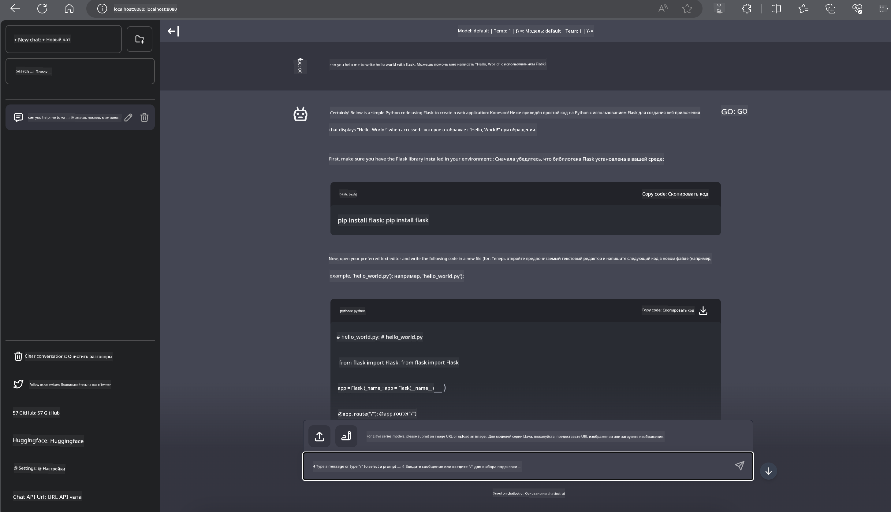

<!--
CO_OP_TRANSLATOR_METADATA:
{
  "original_hash": "be4101a30d98e95a71d42c276e8bcd37",
  "translation_date": "2025-07-16T20:39:07+00:00",
  "source_file": "md/01.Introduction/03/Jetson_Inference.md",
  "language_code": "ru"
}
-->
# **Инференс Phi-3 на Nvidia Jetson**

Nvidia Jetson — это серия встроенных вычислительных плат от Nvidia. Модели Jetson TK1, TX1 и TX2 оснащены процессором Tegra (или SoC) от Nvidia, который включает центральный процессор (CPU) с архитектурой ARM. Jetson — это энергоэффективная система, разработанная для ускорения приложений машинного обучения. Nvidia Jetson используется профессиональными разработчиками для создания прорывных AI-продуктов в различных отраслях, а также студентами и энтузиастами для практического изучения ИИ и создания впечатляющих проектов. SLM развёртывается на edge-устройствах, таких как Jetson, что позволяет лучше реализовывать промышленные сценарии применения генеративного ИИ.

## Развёртывание на NVIDIA Jetson:
Разработчики, работающие с автономной робототехникой и встроенными устройствами, могут использовать Phi-3 Mini. Компактный размер Phi-3 делает его идеальным для edge-развёртывания. Параметры тщательно настроены во время обучения, что обеспечивает высокую точность ответов.

### Оптимизация TensorRT-LLM:
Библиотека NVIDIA [TensorRT-LLM](https://github.com/NVIDIA/TensorRT-LLM?WT.mc_id=aiml-138114-kinfeylo) оптимизирует инференс больших языковых моделей. Она поддерживает длинное контекстное окно Phi-3 Mini, улучшая как пропускную способность, так и задержки. Оптимизации включают такие технологии, как LongRoPE, FP8 и inflight batching.

### Доступность и развёртывание:
Разработчики могут ознакомиться с Phi-3 Mini с контекстным окном 128K на [NVIDIA AI](https://www.nvidia.com/en-us/ai-data-science/generative-ai/). Модель упакована как NVIDIA NIM — микросервис со стандартным API, который можно развернуть в любом месте. Также доступны [реализации TensorRT-LLM на GitHub](https://github.com/NVIDIA/TensorRT-LLM).

## **1. Подготовка**

a. Jetson Orin NX / Jetson NX

b. JetPack 5.1.2+

c. Cuda 11.8

d. Python 3.8+

## **2. Запуск Phi-3 на Jetson**

Можно выбрать [Ollama](https://ollama.com) или [LlamaEdge](https://llamaedge.com)

Если вы хотите использовать gguf одновременно в облаке и на edge-устройствах, LlamaEdge можно рассматривать как WasmEdge (WasmEdge — это лёгкая, высокопроизводительная и масштабируемая среда выполнения WebAssembly, подходящая для облачных, edge и децентрализованных приложений. Она поддерживает бессерверные приложения, встроенные функции, микросервисы, смарт-контракты и IoT-устройства). Через LlamaEdge вы можете развернуть квантизированную модель gguf как на edge-устройствах, так и в облаке.


Вот шаги для использования:

1. Установите и скачайте необходимые библиотеки и файлы

```bash

curl -sSf https://raw.githubusercontent.com/WasmEdge/WasmEdge/master/utils/install.sh | bash -s -- --plugin wasi_nn-ggml

curl -LO https://github.com/LlamaEdge/LlamaEdge/releases/latest/download/llama-api-server.wasm

curl -LO https://github.com/LlamaEdge/chatbot-ui/releases/latest/download/chatbot-ui.tar.gz

tar xzf chatbot-ui.tar.gz

```

**Примечание**: файлы llama-api-server.wasm и chatbot-ui должны находиться в одной директории

2. Запустите скрипты в терминале

```bash

wasmedge --dir .:. --nn-preload default:GGML:AUTO:{Your gguf path} llama-api-server.wasm -p phi-3-chat

```

Вот результат выполнения



***Пример кода*** [Phi-3 mini WASM Notebook Sample](https://github.com/Azure-Samples/Phi-3MiniSamples/tree/main/wasm)

В итоге, Phi-3 Mini — это значительный шаг вперёд в области языкового моделирования, сочетающий эффективность, понимание контекста и оптимизации NVIDIA. Независимо от того, создаёте ли вы роботов или edge-приложения, Phi-3 Mini — мощный инструмент, который стоит иметь в виду.

**Отказ от ответственности**:  
Этот документ был переведен с помощью сервиса автоматического перевода [Co-op Translator](https://github.com/Azure/co-op-translator). Несмотря на наши усилия по обеспечению точности, просим учитывать, что автоматический перевод может содержать ошибки или неточности. Оригинальный документ на его исходном языке следует считать авторитетным источником. Для получения критически важной информации рекомендуется обращаться к профессиональному переводу, выполненному человеком. Мы не несем ответственности за любые недоразумения или неправильные толкования, возникшие в результате использования данного перевода.