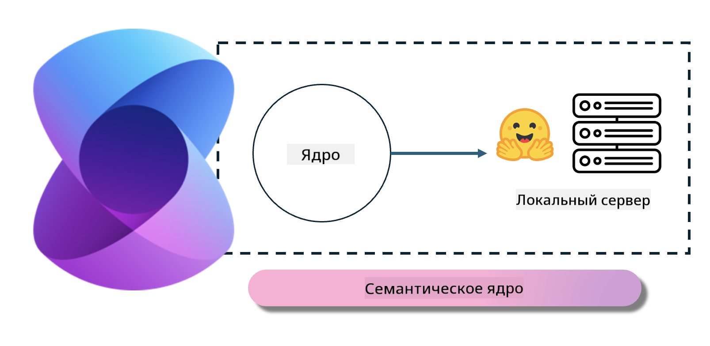

<!--
CO_OP_TRANSLATOR_METADATA:
{
  "original_hash": "bcf5dd7031db0031abdb9dd0c05ba118",
  "translation_date": "2025-05-07T14:30:34+00:00",
  "source_file": "md/01.Introduction/03/Local_Server_Inference.md",
  "language_code": "ru"
}
-->
# **Инференс Phi-3 на локальном сервере**

Мы можем развернуть Phi-3 на локальном сервере. Пользователи могут выбрать решения [Ollama](https://ollama.com) или [LM Studio](https://llamaedge.com), либо написать собственный код. Вы можете подключить локальные сервисы Phi-3 через [Semantic Kernel](https://github.com/microsoft/semantic-kernel?WT.mc_id=aiml-138114-kinfeylo) или [Langchain](https://www.langchain.com/), чтобы создавать приложения Copilot.

## **Использование Semantic Kernel для доступа к Phi-3-mini**

В приложении Copilot мы создаём приложения с помощью Semantic Kernel / LangChain. Такая архитектура приложений обычно совместима с Azure OpenAI Service / моделями OpenAI, а также может поддерживать open source модели на Hugging Face и локальные модели. Что делать, если мы хотим использовать Semantic Kernel для доступа к Phi-3-mini? В качестве примера на .NET мы можем совместить его с Hugging Face Connector в Semantic Kernel. По умолчанию он соответствует id модели на Hugging Face (при первом использовании модель скачивается с Hugging Face, что занимает много времени). Также можно подключиться к локальному сервису, развернутому самостоятельно. Из двух вариантов мы рекомендуем второй, так как он обеспечивает большую автономность, особенно для корпоративных приложений.

Судя по рисунку, доступ к локальным сервисам через Semantic Kernel позволяет легко подключиться к самостоятельно развернутому серверу модели Phi-3-mini. Ниже показан результат работы:

***Пример кода*** https://github.com/kinfey/Phi3MiniSamples/tree/main/semantickernel

**Отказ от ответственности**:  
Этот документ был переведен с помощью сервиса автоматического перевода [Co-op Translator](https://github.com/Azure/co-op-translator). Несмотря на наши усилия обеспечить точность, пожалуйста, имейте в виду, что автоматический перевод может содержать ошибки или неточности. Оригинальный документ на его исходном языке следует считать авторитетным источником. Для критически важной информации рекомендуется профессиональный перевод человеком. Мы не несем ответственности за любые недоразумения или неправильные толкования, возникшие в результате использования этого перевода.