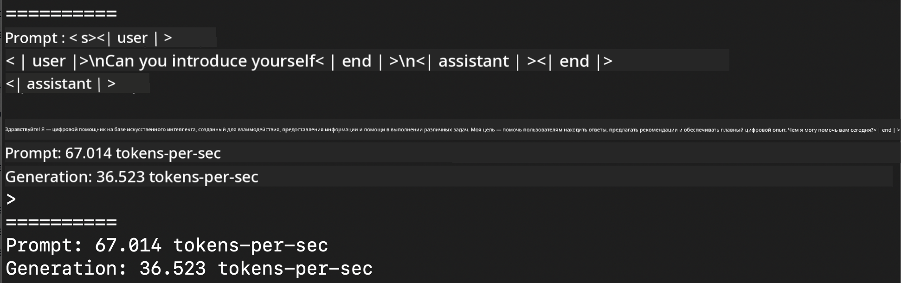
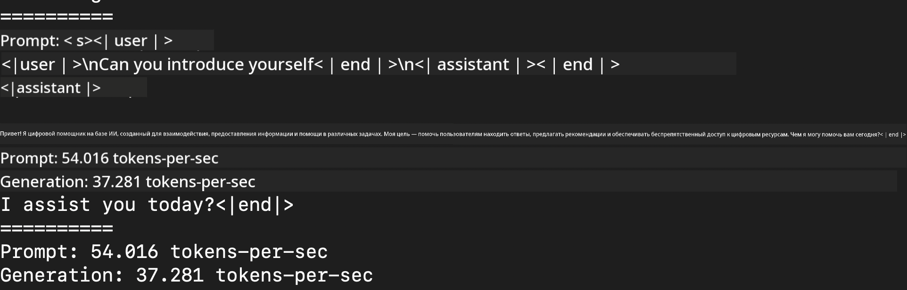
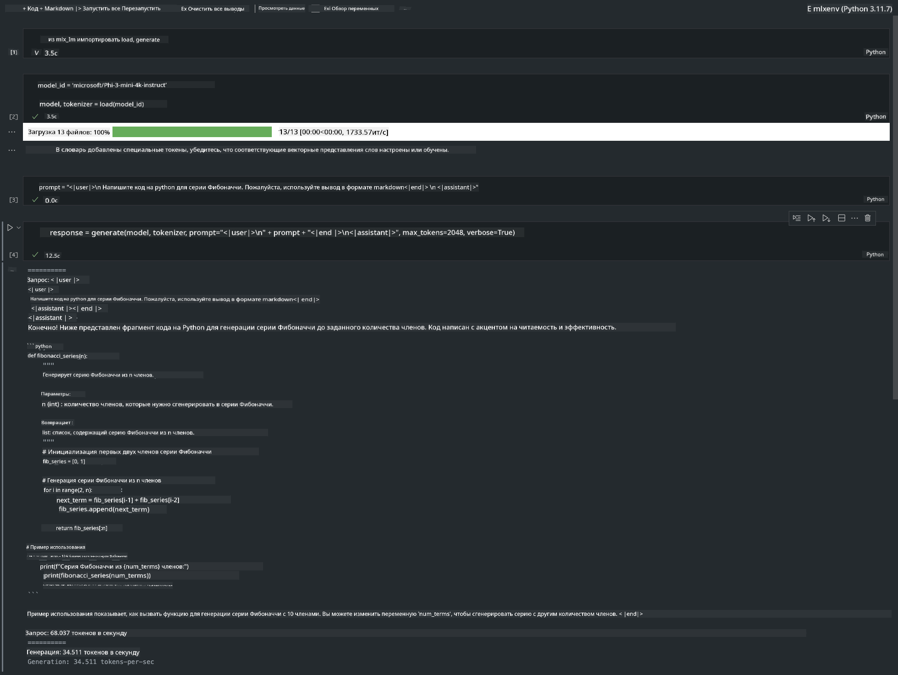

<!--
CO_OP_TRANSLATOR_METADATA:
{
  "original_hash": "dcb656f3d206fc4968e236deec5d4384",
  "translation_date": "2025-05-07T14:37:10+00:00",
  "source_file": "md/01.Introduction/03/MLX_Inference.md",
  "language_code": "ru"
}
-->
# **Инференс Phi-3 с использованием Apple MLX Framework**

## **Что такое MLX Framework**

MLX — это фреймворк для работы с массивами данных в области машинного обучения на устройствах Apple Silicon, разработанный исследователями машинного обучения Apple.

MLX создан исследователями машинного обучения для исследователей машинного обучения. Фреймворк ориентирован на удобство использования, при этом оставаясь эффективным для обучения и развертывания моделей. Концепция дизайна фреймворка также проста. Мы стремимся сделать MLX легко расширяемым и улучшаемым исследователями, чтобы быстро тестировать новые идеи.

Большие языковые модели (LLM) могут ускоряться на устройствах Apple Silicon с помощью MLX, а запуск моделей локально становится очень удобным.

## **Использование MLX для инференса Phi-3-mini**

### **1. Настройка окружения MLX**

1. Python 3.11.x  
2. Установите библиотеку MLX

```bash

pip install mlx-lm

```

### **2. Запуск Phi-3-mini в терминале с MLX**

```bash

python -m mlx_lm.generate --model microsoft/Phi-3-mini-4k-instruct --max-token 2048 --prompt  "<|user|>\nCan you introduce yourself<|end|>\n<|assistant|>"

```

Результат (мое окружение — Apple M1 Max, 64GB):



### **3. Квантование Phi-3-mini с MLX в терминале**

```bash

python -m mlx_lm.convert --hf-path microsoft/Phi-3-mini-4k-instruct

```

***Note：*** Модель можно квантовать с помощью mlx_lm.convert, при этом по умолчанию используется квантование INT4. В этом примере Phi-3-mini квантуется в INT4.

Модель можно квантовать через mlx_lm.convert, при этом по умолчанию используется INT4. В этом примере Phi-3-mini квантуется в INT4. После квантования модель сохраняется в директории по умолчанию ./mlx_model

Мы можем протестировать квантованную модель с MLX из терминала

```bash

python -m mlx_lm.generate --model ./mlx_model/ --max-token 2048 --prompt  "<|user|>\nCan you introduce yourself<|end|>\n<|assistant|>"

```

Результат:



### **4. Запуск Phi-3-mini с MLX в Jupyter Notebook**



***Note:*** Пожалуйста, ознакомьтесь с этим примером [по этой ссылке](../../../../../code/03.Inference/MLX/MLX_DEMO.ipynb)

## **Ресурсы**

1. Узнать больше об Apple MLX Framework [https://ml-explore.github.io](https://ml-explore.github.io/mlx/build/html/index.html)

2. Репозиторий Apple MLX на GitHub [https://github.com/ml-explore](https://github.com/ml-explore)

**Отказ от ответственности**:  
Этот документ был переведен с помощью сервиса автоматического перевода [Co-op Translator](https://github.com/Azure/co-op-translator). Несмотря на наши усилия обеспечить точность, имейте в виду, что автоматический перевод может содержать ошибки или неточности. Оригинальный документ на его исходном языке следует считать авторитетным источником. Для критически важной информации рекомендуется использовать профессиональный перевод, выполненный человеком. Мы не несем ответственности за любые недоразумения или неправильные толкования, возникшие в результате использования данного перевода.