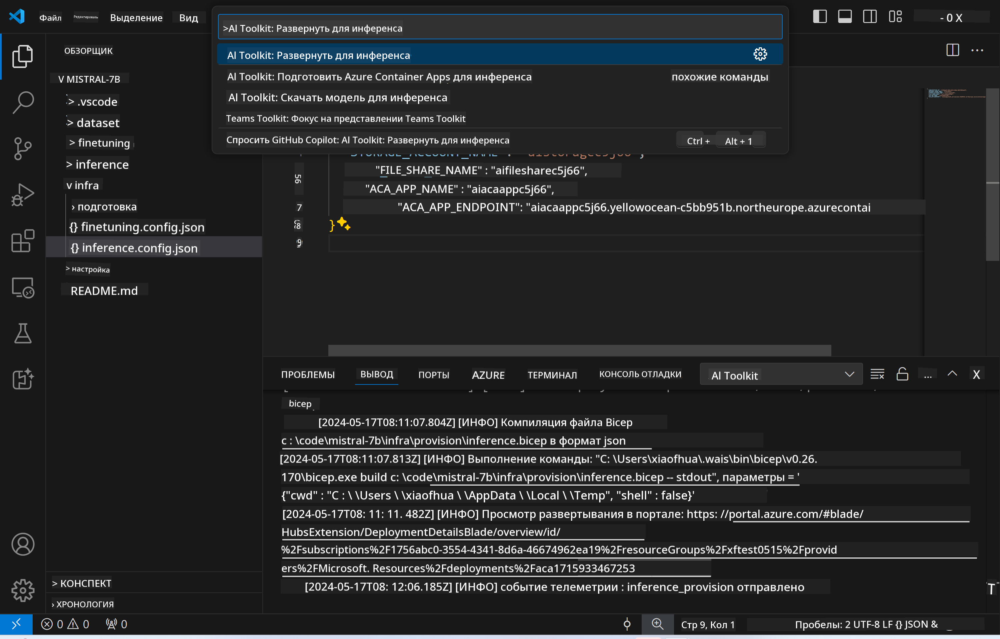

<!--
CO_OP_TRANSLATOR_METADATA:
{
  "original_hash": "a54cd3d65b6963e4e8ce21e143c3ab04",
  "translation_date": "2025-07-16T21:14:58+00:00",
  "source_file": "md/01.Introduction/03/Remote_Interence.md",
  "language_code": "ru"
}
-->
# Удалённое инференс с дообученной моделью

После того как адаптеры обучены в удалённой среде, используйте простое приложение Gradio для взаимодействия с моделью.


### Подготовка ресурсов Azure  
Для удалённого инференса необходимо настроить ресурсы Azure, выполнив команду `AI Toolkit: Provision Azure Container Apps for inference` из палитры команд. Во время настройки вам будет предложено выбрать подписку Azure и группу ресурсов.  

   
По умолчанию подписка и группа ресурсов для инференса должны совпадать с теми, что использовались для дообучения. Инференс будет использовать ту же среду Azure Container App и получать доступ к модели и адаптеру модели, сохранённым в Azure Files, которые были созданы на этапе дообучения.

## Использование AI Toolkit

### Развёртывание для инференса  
Если вы хотите изменить код инференса или перезагрузить модель инференса, выполните команду `AI Toolkit: Deploy for inference`. Это синхронизирует ваш последний код с ACA и перезапустит реплику.



После успешного завершения развёртывания модель готова к оценке через этот endpoint.

### Доступ к API инференса

Вы можете получить доступ к API инференса, нажав на кнопку "*Go to Inference Endpoint*" в уведомлении VSCode. Также веб-адрес API можно найти в `ACA_APP_ENDPOINT` в файле `./infra/inference.config.json` и в панели вывода.


> **Note:** Endpoint инференса может потребовать несколько минут для полной готовности.

## Компоненты инференса, включённые в шаблон

| Папка | Содержимое |
| ------ |--------- |
| `infra` | Содержит все необходимые конфигурации для удалённой работы. |
| `infra/provision/inference.parameters.json` | Хранит параметры для bicep-шаблонов, используемых для подготовки ресурсов Azure для инференса. |
| `infra/provision/inference.bicep` | Содержит шаблоны для подготовки ресурсов Azure для инференса. |
| `infra/inference.config.json` | Конфигурационный файл, созданный командой `AI Toolkit: Provision Azure Container Apps for inference`. Используется как входные данные для других команд в палитре. |

### Использование AI Toolkit для настройки Provision Azure Resources  
Настройте [AI Toolkit](https://marketplace.visualstudio.com/items?itemName=ms-windows-ai-studio.windows-ai-studio)

Выполните команду Provision Azure Container Apps for inference.

Параметры конфигурации можно найти в файле `./infra/provision/inference.parameters.json`. Вот их описание:  
| Параметр | Описание |
| --------- |------------ |
| `defaultCommands` | Команды для запуска веб-API. |
| `maximumInstanceCount` | Максимальное количество GPU-инстансов. |
| `location` | Местоположение, где будут созданы ресурсы Azure. По умолчанию совпадает с местоположением выбранной группы ресурсов. |
| `storageAccountName`, `fileShareName`, `acaEnvironmentName`, `acaEnvironmentStorageName`, `acaAppName`, `acaLogAnalyticsName` | Эти параметры задают имена ресурсов Azure для подготовки. По умолчанию они совпадают с именами ресурсов, использованных для дообучения. Вы можете указать новое, неиспользуемое имя для создания собственных ресурсов или имя уже существующего ресурса Azure, если хотите использовать его. Подробнее см. раздел [Using existing Azure Resources](../../../../../md/01.Introduction/03). |

### Использование существующих ресурсов Azure

По умолчанию для инференса используется та же среда Azure Container App, учётная запись хранения, Azure File Share и Azure Log Analytics, что и для дообучения. Отдельное приложение Azure Container App создаётся только для API инференса.

Если вы изменяли ресурсы Azure на этапе дообучения или хотите использовать свои собственные существующие ресурсы для инференса, укажите их имена в файле `./infra/inference.parameters.json`. Затем выполните команду `AI Toolkit: Provision Azure Container Apps for inference` из палитры команд. Это обновит указанные ресурсы и создаст отсутствующие.

Например, если у вас уже есть существующая среда Azure Container, ваш файл `./infra/finetuning.parameters.json` должен выглядеть так:

```json
{
    "$schema": "https://schema.management.azure.com/schemas/2019-04-01/deploymentParameters.json#",
    "contentVersion": "1.0.0.0",
    "parameters": {
      ...
      "acaEnvironmentName": {
        "value": "<your-aca-env-name>"
      },
      "acaEnvironmentStorageName": {
        "value": null
      },
      ...
    }
  }
```

### Ручная подготовка  
Если вы предпочитаете настраивать ресурсы Azure вручную, вы можете использовать предоставленные bicep-файлы в папках `./infra/provision`. Если вы уже настроили и сконфигурировали все ресурсы Azure без использования палитры команд AI Toolkit, просто укажите имена ресурсов в файле `inference.config.json`.

Например:

```json
{
  "SUBSCRIPTION_ID": "<your-subscription-id>",
  "RESOURCE_GROUP_NAME": "<your-resource-group-name>",
  "STORAGE_ACCOUNT_NAME": "<your-storage-account-name>",
  "FILE_SHARE_NAME": "<your-file-share-name>",
  "ACA_APP_NAME": "<your-aca-name>",
  "ACA_APP_ENDPOINT": "<your-aca-endpoint>"
}
```

**Отказ от ответственности**:  
Этот документ был переведен с помощью сервиса автоматического перевода [Co-op Translator](https://github.com/Azure/co-op-translator). Несмотря на наши усилия по обеспечению точности, просим учитывать, что автоматический перевод может содержать ошибки или неточности. Оригинальный документ на его исходном языке следует считать авторитетным источником. Для получения критически важной информации рекомендуется обращаться к профессиональному человеческому переводу. Мы не несем ответственности за любые недоразумения или неправильные толкования, возникшие в результате использования данного перевода.