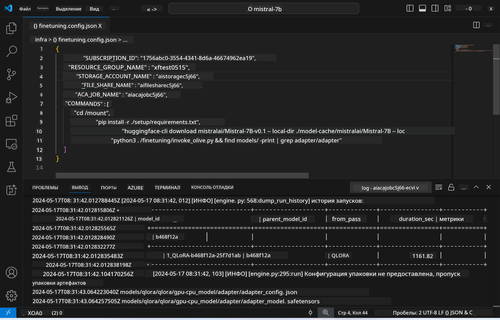
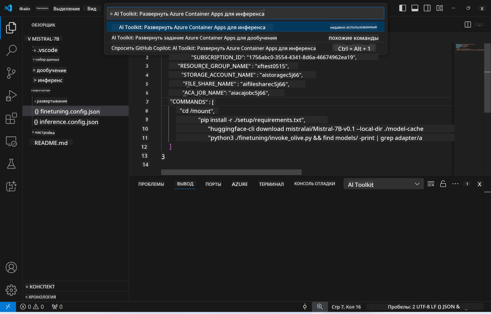

<!--
CO_OP_TRANSLATOR_METADATA:
{
  "original_hash": "a54cd3d65b6963e4e8ce21e143c3ab04",
  "translation_date": "2025-05-07T14:32:26+00:00",
  "source_file": "md/01.Introduction/03/Remote_Interence.md",
  "language_code": "ru"
}
-->
# Удалённый вывод с использованием дообученной модели

После обучения адаптеров в удалённой среде используйте простое приложение Gradio для взаимодействия с моделью.



### Подготовка ресурсов Azure
Для удалённого вывода необходимо настроить ресурсы Azure, выполнив команду `AI Toolkit: Provision Azure Container Apps for inference` из палитры команд. Во время настройки вам будет предложено выбрать подписку Azure и группу ресурсов.  

   
По умолчанию подписка и группа ресурсов для вывода должны совпадать с теми, что использовались для дообучения. Для вывода будет использоваться та же среда Azure Container App и доступ к модели и адаптеру модели, хранящимся в Azure Files, которые были созданы на этапе дообучения.

## Использование AI Toolkit

### Развёртывание для вывода  
Если вы хотите изменить код вывода или перезагрузить модель вывода, выполните команду `AI Toolkit: Deploy for inference`. Это синхронизирует ваш последний код с ACA и перезапустит реплику.


После успешного завершения развёртывания модель готова к оценке через этот endpoint.

### Доступ к API вывода

Вы можете получить доступ к API вывода, нажав кнопку "*Go to Inference Endpoint*" в уведомлении VSCode. Также веб-API endpoint можно найти в `ACA_APP_ENDPOINT` в `./infra/inference.config.json` и в панели вывода.


> **Note:** Endpoint для вывода может потребовать несколько минут для полной готовности.

## Компоненты вывода, включённые в шаблон

| Папка | Содержимое |
| ------ |--------- |
| `infra` | Содержит все необходимые конфигурации для удалённой работы. |
| `infra/provision/inference.parameters.json` | Хранит параметры для шаблонов bicep, используемых для настройки ресурсов Azure для вывода. |
| `infra/provision/inference.bicep` | Содержит шаблоны для настройки ресурсов Azure для вывода. |
| `infra/inference.config.json` | Конфигурационный файл, созданный командой `AI Toolkit: Provision Azure Container Apps for inference`. Используется как входные данные для других команд из палитры удалённых команд. |

### Использование AI Toolkit для настройки Provision Azure Resources
Настройте [AI Toolkit](https://marketplace.visualstudio.com/items?itemName=ms-windows-ai-studio.windows-ai-studio)

Настройте Azure Container Apps для вывода` command.

You can find configuration parameters in `./infra/provision/inference.parameters.json` file. Here are the details:
| Parameter | Description |
| --------- |------------ |
| `defaultCommands` | This is the commands to initiate a web API. |
| `maximumInstanceCount` | This parameter sets the maximum capacity of GPU instances. |
| `location` | This is the location where Azure resources are provisioned. The default value is the same as the chosen resource group's location. |
| `storageAccountName`, `fileShareName` `acaEnvironmentName`, `acaEnvironmentStorageName`, `acaAppName`,  `acaLogAnalyticsName` | These parameters are used to name the Azure resources for provision. By default, they will be same to the fine-tuning resource name. You can input a new, unused resource name to create your own custom-named resources, or you can input the name of an already existing Azure resource if you'd prefer to use that. For details, refer to the section [Using existing Azure Resources](../../../../../md/01.Introduction/03). |

### Using Existing Azure Resources

By default, the inference provision use the same Azure Container App Environment, Storage Account, Azure File Share, and Azure Log Analytics that were used for fine-tuning. A separate Azure Container App is created solely for the inference API. 

If you have customized the Azure resources during the fine-tuning step or want to use your own existing Azure resources for inference, specify their names in the `./infra/inference.parameters.json` файл. Затем выполните команду `AI Toolkit: Provision Azure Container Apps for inference` из палитры команд. Эта команда обновит указанные ресурсы и создаст отсутствующие.

Например, если у вас уже есть существующая среда Azure container, ваш файл `./infra/finetuning.parameters.json` должен выглядеть так:

```json
{
    "$schema": "https://schema.management.azure.com/schemas/2019-04-01/deploymentParameters.json#",
    "contentVersion": "1.0.0.0",
    "parameters": {
      ...
      "acaEnvironmentName": {
        "value": "<your-aca-env-name>"
      },
      "acaEnvironmentStorageName": {
        "value": null
      },
      ...
    }
  }
```

### Ручная настройка  
Если вы предпочитаете вручную настраивать ресурсы Azure, вы можете использовать предоставленные bicep-файлы в `./infra/provision` folders. If you have already set up and configured all the Azure resources without using the AI Toolkit command palette, you can simply enter the resource names in the `inference.config.json`.

Например:

```json
{
  "SUBSCRIPTION_ID": "<your-subscription-id>",
  "RESOURCE_GROUP_NAME": "<your-resource-group-name>",
  "STORAGE_ACCOUNT_NAME": "<your-storage-account-name>",
  "FILE_SHARE_NAME": "<your-file-share-name>",
  "ACA_APP_NAME": "<your-aca-name>",
  "ACA_APP_ENDPOINT": "<your-aca-endpoint>"
}
```

**Отказ от ответственности**:  
Этот документ был переведен с помощью сервиса автоматического перевода [Co-op Translator](https://github.com/Azure/co-op-translator). Несмотря на наши усилия по обеспечению точности, просим учитывать, что автоматический перевод может содержать ошибки или неточности. Оригинальный документ на его исходном языке следует считать авторитетным источником. Для критически важной информации рекомендуется использовать профессиональный перевод, выполненный человеком. Мы не несем ответственности за любые недоразумения или неправильные толкования, возникшие в результате использования данного перевода.