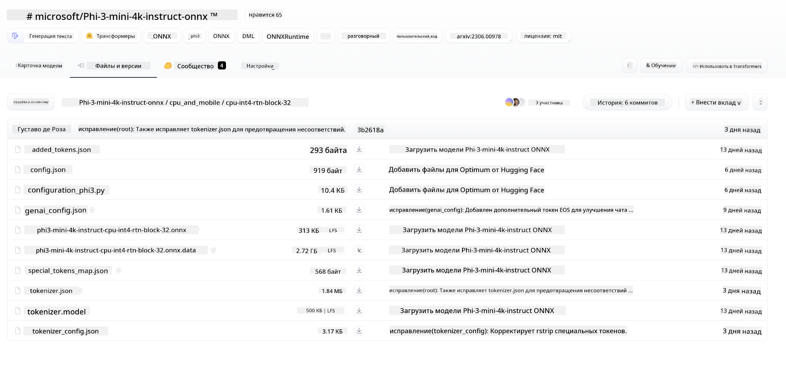
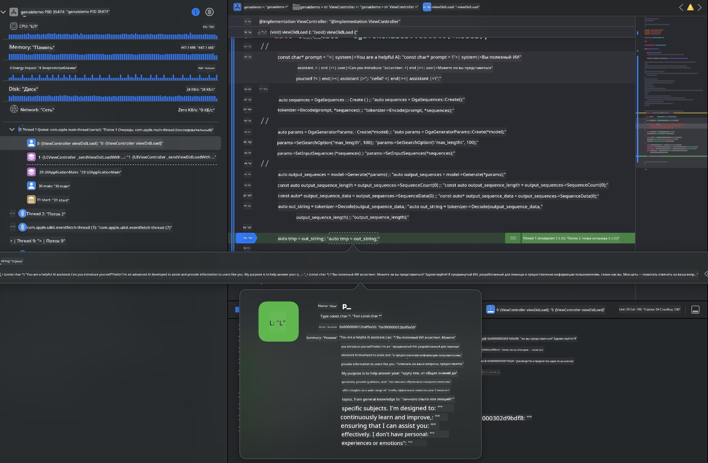

<!--
CO_OP_TRANSLATOR_METADATA:
{
  "original_hash": "82af197df38d25346a98f1f0e84d1698",
  "translation_date": "2025-07-16T20:17:46+00:00",
  "source_file": "md/01.Introduction/03/iOS_Inference.md",
  "language_code": "ru"
}
-->
# **Инференс Phi-3 на iOS**

Phi-3-mini — это новая серия моделей от Microsoft, которая позволяет запускать большие языковые модели (LLM) на устройствах на периферии и в IoT. Phi-3-mini доступна для iOS, Android и Edge Device, что даёт возможность развёртывать генеративный ИИ в средах BYOD. В этом примере показано, как развернуть Phi-3-mini на iOS.

## **1. Подготовка**

- **a.** macOS 14+
- **b.** Xcode 15+
- **c.** iOS SDK 17.x (iPhone 14 A16 или новее)
- **d.** Установите Python 3.10+ (рекомендуется Conda)
- **e.** Установите Python-библиотеку: `python-flatbuffers`
- **f.** Установите CMake

### Semantic Kernel и инференс

Semantic Kernel — это фреймворк для создания приложений, совместимых с Azure OpenAI Service, моделями OpenAI и даже локальными моделями. Доступ к локальным сервисам через Semantic Kernel позволяет легко интегрировать ваш собственный сервер модели Phi-3-mini.

### Вызов квантизированных моделей с помощью Ollama или LlamaEdge

Многие пользователи предпочитают использовать квантизированные модели для локального запуска. [Ollama](https://ollama.com) и [LlamaEdge](https://llamaedge.com) позволяют вызывать разные квантизированные модели:

#### **Ollama**

Вы можете запустить `ollama run phi3` напрямую или настроить офлайн. Создайте Modelfile с указанием пути к вашему файлу `gguf`. Пример кода для запуска квантизированной модели Phi-3-mini:

```gguf
FROM {Add your gguf file path}
TEMPLATE \"\"\"<|user|> .Prompt<|end|> <|assistant|>\"\"\"
PARAMETER stop <|end|>
PARAMETER num_ctx 4096
```

#### **LlamaEdge**

Если вы хотите использовать `gguf` одновременно в облаке и на edge-устройствах, LlamaEdge — отличный выбор.

## **2. Компиляция ONNX Runtime для iOS**

```bash

git clone https://github.com/microsoft/onnxruntime.git

cd onnxruntime

./build.sh --build_shared_lib --ios --skip_tests --parallel --build_dir ./build_ios --ios --apple_sysroot iphoneos --osx_arch arm64 --apple_deploy_target 17.5 --cmake_generator Xcode --config Release

cd ../

```

### **Внимание**

- **a.** Перед компиляцией убедитесь, что Xcode настроен правильно и установлен как активный каталог разработчика в терминале:

    ```bash
    sudo xcode-select -switch /Applications/Xcode.app/Contents/Developer
    ```

- **b.** ONNX Runtime нужно компилировать для разных платформ. Для iOS можно собрать под `arm64` или `x86_64`.

- **c.** Рекомендуется использовать последнюю версию iOS SDK для компиляции, но при необходимости можно использовать и более старую версию для совместимости.

## **3. Компиляция Generative AI с ONNX Runtime для iOS**

> **Note:** Поскольку Generative AI с ONNX Runtime находится в превью, возможны изменения.

```bash

git clone https://github.com/microsoft/onnxruntime-genai
 
cd onnxruntime-genai
 
mkdir ort
 
cd ort
 
mkdir include
 
mkdir lib
 
cd ../
 
cp ../onnxruntime/include/onnxruntime/core/session/onnxruntime_c_api.h ort/include
 
cp ../onnxruntime/build_ios/Release/Release-iphoneos/libonnxruntime*.dylib* ort/lib
 
export OPENCV_SKIP_XCODEBUILD_FORCE_TRYCOMPILE_DEBUG=1
 
python3 build.py --parallel --build_dir ./build_ios --ios --ios_sysroot iphoneos --ios_arch arm64 --ios_deployment_target 17.5 --cmake_generator Xcode --cmake_extra_defines CMAKE_XCODE_ATTRIBUTE_CODE_SIGNING_ALLOWED=NO

```

## **4. Создание приложения в Xcode**

Я выбрал Objective-C для разработки приложения, так как при использовании Generative AI с ONNX Runtime C++ API Objective-C обеспечивает лучшую совместимость. Конечно, можно также реализовать вызовы через Swift bridging.


## **5. Копирование квантизированной модели ONNX INT4 в проект приложения**

Нужно импортировать модель с квантизацией INT4 в формате ONNX, которую необходимо сначала скачать.



После загрузки добавьте её в папку Resources проекта в Xcode.


## **6. Добавление C++ API в ViewControllers**

> **Внимание:**

- **a.** Добавьте соответствующие заголовочные файлы C++ в проект.

  

- **b.** Подключите динамическую библиотеку `onnxruntime-genai` в Xcode.

  

- **c.** Используйте пример кода на C для тестирования. Также можно добавить дополнительные функции, например ChatUI, для расширения возможностей.

- **d.** Поскольку в проекте используется C++, переименуйте `ViewController.m` в `ViewController.mm` для поддержки Objective-C++.

```objc

    NSString *llmPath = [[NSBundle mainBundle] resourcePath];
    char const *modelPath = llmPath.cString;

    auto model =  OgaModel::Create(modelPath);

    auto tokenizer = OgaTokenizer::Create(*model);

    const char* prompt = "<|system|>You are a helpful AI assistant.<|end|><|user|>Can you introduce yourself?<|end|><|assistant|>";

    auto sequences = OgaSequences::Create();
    tokenizer->Encode(prompt, *sequences);

    auto params = OgaGeneratorParams::Create(*model);
    params->SetSearchOption("max_length", 100);
    params->SetInputSequences(*sequences);

    auto output_sequences = model->Generate(*params);
    const auto output_sequence_length = output_sequences->SequenceCount(0);
    const auto* output_sequence_data = output_sequences->SequenceData(0);
    auto out_string = tokenizer->Decode(output_sequence_data, output_sequence_length);
    
    auto tmp = out_string;

```

## **7. Запуск приложения**

После завершения настройки можно запустить приложение и увидеть результаты инференса модели Phi-3-mini.



Для получения дополнительного примера кода и подробных инструкций посетите репозиторий [Phi-3 Mini Samples](https://github.com/Azure-Samples/Phi-3MiniSamples/tree/main/ios).

**Отказ от ответственности**:  
Этот документ был переведен с помощью сервиса автоматического перевода [Co-op Translator](https://github.com/Azure/co-op-translator). Несмотря на наши усилия по обеспечению точности, просим учитывать, что автоматический перевод может содержать ошибки или неточности. Оригинальный документ на его исходном языке следует считать авторитетным источником. Для получения критически важной информации рекомендуется обращаться к профессиональному переводу, выполненному человеком. Мы не несем ответственности за любые недоразумения или неправильные толкования, возникшие в результате использования данного перевода.