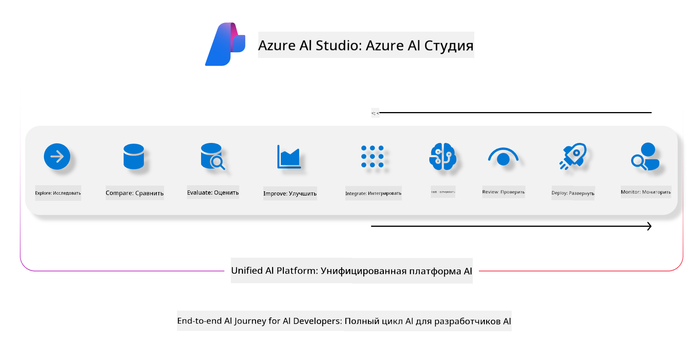

<!--
CO_OP_TRANSLATOR_METADATA:
{
  "original_hash": "7b4235159486df4000e16b7b46ddfec3",
  "translation_date": "2025-05-07T14:42:45+00:00",
  "source_file": "md/01.Introduction/05/AIFoundry.md",
  "language_code": "ru"
}
-->
# **Использование Azure AI Foundry для оценки**

Как оценить ваше приложение с генеративным ИИ с помощью [Azure AI Foundry](https://ai.azure.com?WT.mc_id=aiml-138114-kinfeylo). Независимо от того, оцениваете ли вы односторонние или многоступенчатые диалоги, Azure AI Foundry предоставляет инструменты для оценки производительности и безопасности модели.

## Как оценивать приложения с генеративным ИИ с помощью Azure AI Foundry
Подробные инструкции смотрите в [документации Azure AI Foundry](https://learn.microsoft.com/azure/ai-studio/how-to/evaluate-generative-ai-app?WT.mc_id=aiml-138114-kinfeylo)

Вот основные шаги для начала работы:

## Оценка генеративных моделей ИИ в Azure AI Foundry

**Требования**

- Тестовый набор данных в формате CSV или JSON.
- Развернутая генеративная модель ИИ (например, Phi-3, GPT 3.5, GPT 4 или модели Davinci).
- Среда выполнения с вычислительным инстансом для проведения оценки.

## Встроенные метрики оценки

Azure AI Foundry позволяет оценивать как односторонние, так и сложные многоступенчатые диалоги.
Для сценариев Retrieval Augmented Generation (RAG), когда модель основывается на конкретных данных, можно использовать встроенные метрики для оценки производительности.
Также доступна оценка обычных сценариев односторонних вопросов и ответов (без RAG).

## Создание оценки

В интерфейсе Azure AI Foundry перейдите на страницу Evaluate или Prompt Flow.
Следуйте мастеру создания оценки, чтобы настроить запуск оценки. Можно указать имя для оценки по желанию.
Выберите сценарий, соответствующий целям вашего приложения.
Выберите одну или несколько метрик для оценки результатов модели.

## Пользовательский поток оценки (опционально)

Для большей гибкости вы можете создать собственный поток оценки. Настройте процесс оценки в соответствии с вашими конкретными требованиями.

## Просмотр результатов

После выполнения оценки просматривайте, анализируйте и изучайте подробные метрики оценки в Azure AI Foundry. Получайте представление о возможностях и ограничениях вашего приложения.

**Note** Azure AI Foundry сейчас находится в публичном превью, поэтому используйте его для экспериментов и разработки. Для рабочих нагрузок в продакшене рассмотрите другие варианты. Изучите официальную [документацию AI Foundry](https://learn.microsoft.com/azure/ai-studio/?WT.mc_id=aiml-138114-kinfeylo) для более подробной информации и пошаговых инструкций.

**Отказ от ответственности**:  
Этот документ был переведен с помощью сервиса автоматического перевода [Co-op Translator](https://github.com/Azure/co-op-translator). Несмотря на наши усилия по обеспечению точности, пожалуйста, имейте в виду, что автоматический перевод может содержать ошибки или неточности. Оригинальный документ на его исходном языке следует считать авторитетным источником. Для получения критически важной информации рекомендуется использовать профессиональный перевод, выполненный человеком. Мы не несем ответственности за любые недоразумения или неправильные толкования, возникшие в результате использования данного перевода.