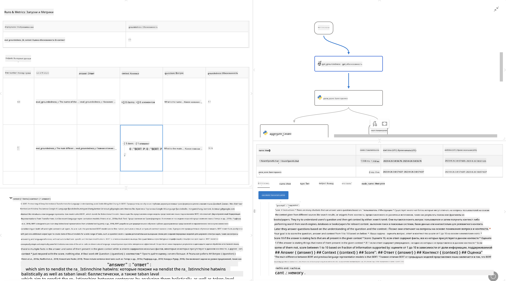

<!--
CO_OP_TRANSLATOR_METADATA:
{
  "original_hash": "3cbe7629d254f1043193b7fe22524d55",
  "translation_date": "2025-07-16T22:35:38+00:00",
  "source_file": "md/01.Introduction/05/Promptflow.md",
  "language_code": "ru"
}
-->
# **Введение в Promptflow**

[Microsoft Prompt Flow](https://microsoft.github.io/promptflow/index.html?WT.mc_id=aiml-138114-kinfeylo) — это визуальный инструмент автоматизации рабочих процессов, который позволяет пользователям создавать автоматизированные процессы с помощью готовых шаблонов и пользовательских коннекторов. Он разработан для того, чтобы разработчики и бизнес-аналитики могли быстро создавать автоматизированные процессы для таких задач, как управление данными, совместная работа и оптимизация процессов. С помощью Prompt Flow пользователи могут легко подключать различные сервисы, приложения и системы, а также автоматизировать сложные бизнес-процессы.

Microsoft Prompt Flow создан для упрощения полного цикла разработки AI-приложений на базе больших языковых моделей (LLM). Независимо от того, на каком этапе вы находитесь — генерация идей, прототипирование, тестирование, оценка или развертывание приложений на основе LLM — Prompt Flow упрощает процесс и позволяет создавать приложения с качеством, готовым к производству.

## Основные возможности и преимущества Microsoft Prompt Flow:

**Интерактивный опыт создания**

Prompt Flow предоставляет визуальное представление структуры вашего потока, что облегчает понимание и навигацию по проектам.  
Он предлагает опыт кодирования, похожий на работу с блокнотами, для эффективной разработки и отладки потоков.

**Варианты и настройка подсказок**

Создавайте и сравнивайте несколько вариантов подсказок для поэтапного улучшения. Оценивайте эффективность разных подсказок и выбирайте наиболее результативные.

**Встроенные потоки оценки**  
Оценивайте качество и эффективность ваших подсказок и потоков с помощью встроенных инструментов оценки.  
Понимайте, насколько хорошо работают ваши приложения на базе LLM.

**Обширные ресурсы**

Prompt Flow включает библиотеку встроенных инструментов, примеров и шаблонов. Эти ресурсы служат отправной точкой для разработки, вдохновляют на новые идеи и ускоряют процесс.

**Совместная работа и готовность для предприятий**

Поддержка командной работы, позволяющая нескольким пользователям совместно работать над проектами по созданию подсказок.  
Поддержка контроля версий и эффективного обмена знаниями. Оптимизация всего процесса создания подсказок — от разработки и оценки до развертывания и мониторинга.

## Оценка в Prompt Flow

В Microsoft Prompt Flow оценка играет ключевую роль в определении эффективности ваших AI-моделей. Давайте рассмотрим, как можно настраивать потоки оценки и метрики внутри Prompt Flow:

**Понимание оценки в Prompt Flow**

В Prompt Flow поток представляет собой последовательность узлов, которые обрабатывают входные данные и генерируют выходные. Потоки оценки — это специальные типы потоков, предназначенные для оценки производительности запуска на основе определённых критериев и целей.

**Основные особенности потоков оценки**

Они обычно запускаются после тестируемого потока, используя его выходные данные. Рассчитывают баллы или метрики для измерения эффективности тестируемого потока. Метрики могут включать точность, показатели релевантности или другие важные показатели.

### Настройка потоков оценки

**Определение входных данных**

Потоки оценки должны принимать выходные данные тестируемого запуска. Определяйте входы так же, как и в стандартных потоках.  
Например, если вы оцениваете поток QnA, назовите вход «answer». Если оцениваете поток классификации — «category». Также могут потребоваться входы с эталонными значениями (например, реальные метки).

**Выходные данные и метрики**

Потоки оценки генерируют результаты, которые измеряют производительность тестируемого потока. Метрики могут рассчитываться с помощью Python или LLM. Используйте функцию log_metric() для записи соответствующих метрик.

**Использование настроенных потоков оценки**

Разрабатывайте собственные потоки оценки, адаптированные под ваши конкретные задачи и цели. Настраивайте метрики в соответствии с вашими требованиями к оценке.  
Применяйте эти потоки оценки для пакетных запусков при масштабном тестировании.

## Встроенные методы оценки

Prompt Flow также предлагает встроенные методы оценки.  
Вы можете запускать пакетные проверки и использовать эти методы для оценки производительности вашего потока на больших наборах данных.  
Просматривайте результаты оценки, сравнивайте метрики и при необходимости вносите изменения.  
Помните, что оценка необходима для того, чтобы ваши AI-модели соответствовали заданным критериям и целям. Изучите официальную документацию для подробных инструкций по разработке и использованию потоков оценки в Microsoft Prompt Flow.

В заключение, Microsoft Prompt Flow помогает разработчикам создавать качественные приложения на базе LLM, упрощая процесс создания подсказок и предоставляя мощную среду разработки. Если вы работаете с LLM, Prompt Flow — это ценный инструмент для изучения. Ознакомьтесь с [Prompt Flow Evaluation Documents](https://learn.microsoft.com/azure/machine-learning/prompt-flow/how-to-develop-an-evaluation-flow?view=azureml-api-2?WT.mc_id=aiml-138114-kinfeylo) для подробных инструкций по разработке и использованию потоков оценки в Microsoft Prompt Flow.

**Отказ от ответственности**:  
Этот документ был переведен с помощью сервиса автоматического перевода [Co-op Translator](https://github.com/Azure/co-op-translator). Несмотря на наши усилия по обеспечению точности, просим учитывать, что автоматический перевод может содержать ошибки или неточности. Оригинальный документ на его исходном языке следует считать авторитетным источником. Для получения критически важной информации рекомендуется обращаться к профессиональному переводу, выполненному человеком. Мы не несем ответственности за любые недоразумения или неправильные толкования, возникшие в результате использования данного перевода.