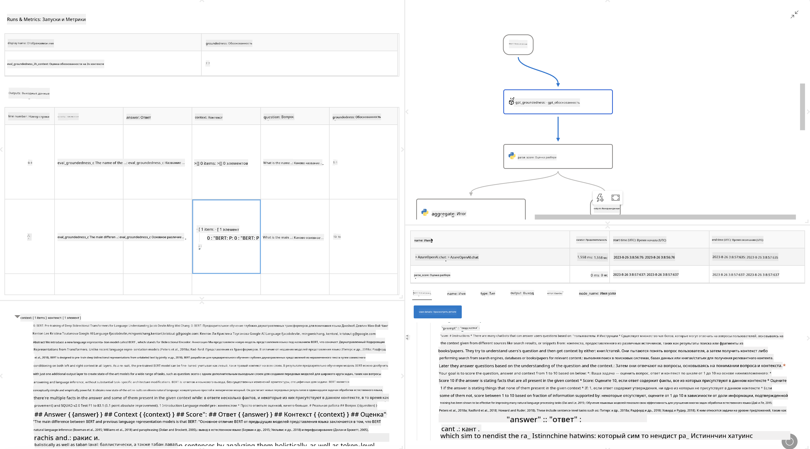

<!--
CO_OP_TRANSLATOR_METADATA:
{
  "original_hash": "3cbe7629d254f1043193b7fe22524d55",
  "translation_date": "2025-05-07T14:45:47+00:00",
  "source_file": "md/01.Introduction/05/Promptflow.md",
  "language_code": "ru"
}
-->
# **Введение в Promptflow**

[Microsoft Prompt Flow](https://microsoft.github.io/promptflow/index.html?WT.mc_id=aiml-138114-kinfeylo) — это визуальный инструмент автоматизации рабочих процессов, который позволяет пользователям создавать автоматизированные процессы с помощью готовых шаблонов и настраиваемых коннекторов. Он разработан, чтобы помочь разработчикам и бизнес-аналитикам быстро создавать автоматизированные процессы для задач, таких как управление данными, совместная работа и оптимизация процессов. С помощью Prompt Flow пользователи могут легко связывать различные сервисы, приложения и системы, а также автоматизировать сложные бизнес-процессы.

Microsoft Prompt Flow создан для упрощения полного цикла разработки AI-приложений на базе больших языковых моделей (LLM). Независимо от того, на каком этапе вы находитесь — идея, прототипирование, тестирование, оценка или развертывание приложений на основе LLM — Prompt Flow упрощает процесс и позволяет создавать приложения с качеством, пригодным для продакшена.

## Основные возможности и преимущества Microsoft Prompt Flow:

**Интерактивный опыт создания**

Prompt Flow предоставляет визуальное представление структуры вашего потока, что облегчает понимание и навигацию по проектам.  
Он предлагает опыт, похожий на работу с блокнотом, для эффективной разработки и отладки потоков.

**Варианты и настройка Prompt**

Создавайте и сравнивайте несколько вариантов prompt для поэтапного улучшения. Оценивайте эффективность разных prompt и выбирайте лучшие.

**Встроенные оценочные потоки**  
Оценивайте качество и эффективность ваших prompt и потоков с помощью встроенных инструментов оценки.  
Понимайте, насколько хорошо работают ваши приложения на базе LLM.

**Обширные ресурсы**  
Prompt Flow включает библиотеку встроенных инструментов, примеров и шаблонов. Эти ресурсы служат отправной точкой для разработки, вдохновляют и ускоряют процесс.

**Совместная работа и готовность для предприятий**  
Поддержка командной работы позволяет нескольким пользователям совместно работать над проектами по созданию prompt.  
Поддержка контроля версий и эффективного обмена знаниями. Оптимизация всего процесса создания prompt — от разработки и оценки до развертывания и мониторинга.

## Оценка в Prompt Flow

В Microsoft Prompt Flow оценка играет ключевую роль в понимании того, насколько хорошо работают ваши AI-модели. Давайте рассмотрим, как можно настраивать оценочные потоки и метрики в Prompt Flow:

**Понимание оценки в Prompt Flow**

В Prompt Flow поток представляет собой последовательность узлов, которые обрабатывают входные данные и генерируют выходные. Оценочные потоки — это специальные потоки, созданные для оценки производительности запуска на основе определённых критериев и целей.

**Ключевые особенности оценочных потоков**

Они обычно запускаются после тестируемого потока и используют его выходные данные.  
Вычисляют оценки или метрики для измерения производительности тестируемого потока.  
Метрики могут включать точность, релевантность или другие важные показатели.

### Настройка оценочных потоков

**Определение входных данных**

Оценочные потоки должны принимать выходные данные тестируемого запуска. Определяйте входные данные так же, как и в стандартных потоках.  
Например, если вы оцениваете QnA-поток, назовите вход «answer». Если оцениваете поток классификации — «category». Также могут понадобиться входы с истинными значениями (ground truth), например, реальные метки.

**Выходные данные и метрики**

Оценочные потоки выдают результаты, измеряющие эффективность тестируемого потока. Метрики можно рассчитывать с помощью Python или LLM. Для записи метрик используйте функцию log_metric().

**Использование настроенных оценочных потоков**

Разрабатывайте собственные оценочные потоки, адаптированные под ваши задачи и цели. Настраивайте метрики в соответствии с критериями оценки.  
Применяйте эти потоки для пакетного тестирования на больших объёмах данных.

## Встроенные методы оценки

Prompt Flow также предлагает встроенные методы оценки.  
Вы можете запускать пакетные тесты и использовать эти методы для оценки производительности потока на больших наборах данных.  
Просматривайте результаты, сравнивайте метрики и при необходимости улучшайте.  
Помните, что оценка — важный этап для гарантии соответствия AI-моделей заданным критериям и целям. Изучите официальную документацию для подробных инструкций по разработке и использованию оценочных потоков в Microsoft Prompt Flow.

В итоге, Microsoft Prompt Flow помогает разработчикам создавать качественные приложения на базе LLM, упрощая процесс создания prompt и предоставляя надёжную среду разработки. Если вы работаете с LLM, Prompt Flow — ценный инструмент для изучения. Ознакомьтесь с [Prompt Flow Evaluation Documents](https://learn.microsoft.com/azure/machine-learning/prompt-flow/how-to-develop-an-evaluation-flow?view=azureml-api-2?WT.mc_id=aiml-138114-kinfeylo) для подробных инструкций по созданию и использованию оценочных потоков в Microsoft Prompt Flow.

**Отказ от ответственности**:  
Этот документ был переведен с помощью сервиса автоматического перевода [Co-op Translator](https://github.com/Azure/co-op-translator). Несмотря на наши усилия по обеспечению точности, пожалуйста, имейте в виду, что автоматический перевод может содержать ошибки или неточности. Оригинальный документ на его исходном языке следует считать авторитетным источником. Для критически важной информации рекомендуется профессиональный перевод человеком. Мы не несем ответственности за любые недоразумения или неправильные толкования, возникшие в результате использования данного перевода.