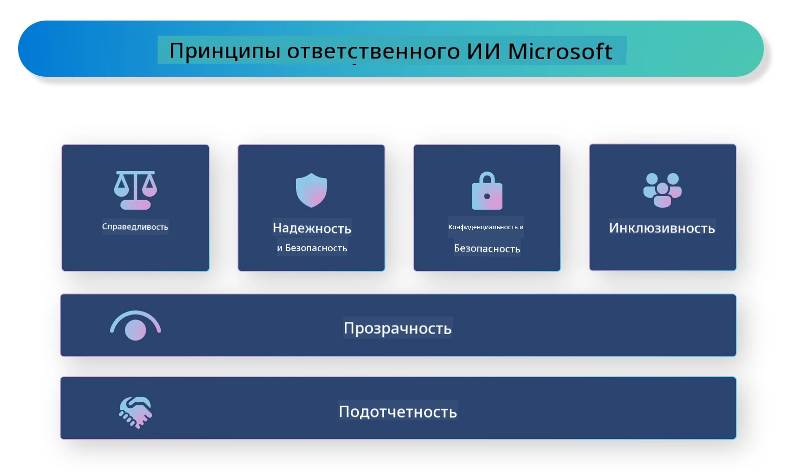

<!--
CO_OP_TRANSLATOR_METADATA:
{
  "original_hash": "805b96b20152936d8f4c587d90d6e06e",
  "translation_date": "2025-07-16T22:47:18+00:00",
  "source_file": "md/01.Introduction/05/ResponsibleAI.md",
  "language_code": "ru"
}
-->
# **Введение в Responsible AI**

[Microsoft Responsible AI](https://www.microsoft.com/ai/responsible-ai?WT.mc_id=aiml-138114-kinfeylo) — это инициатива, направленная на помощь разработчикам и организациям в создании ИИ-систем, которые являются прозрачными, надежными и подотчетными. Эта инициатива предоставляет рекомендации и ресурсы для разработки ответственных ИИ-решений, соответствующих этическим принципам, таким как конфиденциальность, справедливость и прозрачность. Мы также рассмотрим некоторые вызовы и лучшие практики, связанные с созданием ответственных ИИ-систем.

## Обзор Microsoft Responsible AI

**Этические принципы**

Microsoft Responsible AI руководствуется набором этических принципов, таких как конфиденциальность, справедливость, прозрачность, подотчетность и безопасность. Эти принципы призваны обеспечить этичную и ответственную разработку ИИ-систем.

**Прозрачный ИИ**

Microsoft Responsible AI подчеркивает важность прозрачности в ИИ-системах. Это включает предоставление понятных объяснений того, как работают модели ИИ, а также обеспечение публичного доступа к источникам данных и алгоритмам.

**Подотчетный ИИ**

[Microsoft Responsible AI](https://www.microsoft.com/ai/responsible-ai?WT.mc_id=aiml-138114-kinfeylo) способствует развитию подотчетных ИИ-систем, которые могут предоставлять информацию о том, как модели принимают решения. Это помогает пользователям лучше понимать и доверять результатам ИИ.

**Инклюзивность**

ИИ-системы должны быть разработаны так, чтобы приносить пользу всем. Microsoft стремится создавать инклюзивный ИИ, учитывающий разнообразные точки зрения и избегающий предвзятости или дискриминации.

**Надежность и безопасность**

Обеспечение надежности и безопасности ИИ-систем имеет первостепенное значение. Microsoft сосредоточен на создании устойчивых моделей, которые работают стабильно и предотвращают вредные последствия.

**Справедливость в ИИ**

Microsoft Responsible AI признает, что ИИ-системы могут усиливать предвзятость, если они обучаются на предвзятых данных или алгоритмах. Инициатива предлагает рекомендации по созданию справедливых ИИ-систем, которые не дискриминируют по таким признакам, как раса, пол или возраст.

**Конфиденциальность и безопасность**

Microsoft Responsible AI акцентирует внимание на защите конфиденциальности пользователей и безопасности данных в ИИ-системах. Это включает внедрение надежного шифрования данных и контроля доступа, а также регулярный аудит систем на предмет уязвимостей.

**Подотчетность и ответственность**

Microsoft Responsible AI продвигает подотчетность и ответственность в разработке и внедрении ИИ. Это означает, что разработчики и организации должны осознавать потенциальные риски, связанные с ИИ, и предпринимать меры по их снижению.

## Лучшие практики создания ответственных ИИ-систем

**Разрабатывайте модели ИИ на основе разнообразных наборов данных**

Чтобы избежать предвзятости в ИИ, важно использовать разнообразные наборы данных, отражающие разные точки зрения и опыт.

**Используйте методы объяснимого ИИ**

Методы объяснимого ИИ помогают пользователям понять, как модели принимают решения, что повышает доверие к системе.

**Регулярно проводите аудит ИИ-систем на уязвимости**

Регулярные аудиты помогают выявлять потенциальные риски и уязвимости, требующие устранения.

**Внедряйте надежное шифрование данных и контроль доступа**

Шифрование и контроль доступа помогают защитить конфиденциальность и безопасность пользователей в ИИ-системах.

**Следуйте этическим принципам при разработке ИИ**

Соблюдение этических принципов, таких как справедливость, прозрачность и подотчетность, способствует формированию доверия к ИИ и гарантирует ответственную разработку.

## Использование AI Foundry для Responsible AI

[Azure AI Foundry](https://ai.azure.com?WT.mc_id=aiml-138114-kinfeylo) — мощная платформа, позволяющая разработчикам и организациям быстро создавать интеллектуальные, передовые, готовые к рынку и ответственные приложения. Вот некоторые ключевые возможности Azure AI Foundry:

**Готовые API и модели**

Azure AI Foundry предоставляет готовые и настраиваемые API и модели, охватывающие широкий спектр задач ИИ, включая генеративный ИИ, обработку естественного языка для диалогов, поиск, мониторинг, перевод, речь, компьютерное зрение и принятие решений.

**Prompt Flow**

Prompt flow в Azure AI Foundry позволяет создавать диалоговые ИИ-опыты. Это облегчает проектирование и управление диалоговыми сценариями, упрощая создание чат-ботов, виртуальных помощников и других интерактивных приложений.

**Retrieval Augmented Generation (RAG)**

RAG — это метод, который сочетает подходы на основе поиска и генерации. Он улучшает качество ответов, используя как уже существующие знания (поиск), так и творческую генерацию (генерация).

**Метрики оценки и мониторинга для генеративного ИИ**

Azure AI Foundry предоставляет инструменты для оценки и мониторинга генеративных моделей ИИ. Вы можете оценивать их производительность, справедливость и другие важные показатели для обеспечения ответственного внедрения. Кроме того, если у вас есть созданная панель управления, вы можете использовать интерфейс без кода в Azure Machine Learning Studio для настройки и создания Responsible AI Dashboard и связанной scorecard на основе Python-библиотек [Responsible AI Toolbox](https://responsibleaitoolbox.ai/?WT.mc_id=aiml-138114-kinfeylo). Эта scorecard помогает делиться ключевыми выводами о справедливости, важности признаков и других аспектах ответственного внедрения с техническими и нетехническими заинтересованными сторонами.

Для использования AI Foundry с ответственным ИИ рекомендуется придерживаться следующих практик:

**Определите проблему и цели вашей ИИ-системы**

Перед началом разработки важно четко определить проблему или цель, которую должна решать ваша ИИ-система. Это поможет определить необходимые данные, алгоритмы и ресурсы для создания эффективной модели.

**Соберите и подготовьте релевантные данные**

Качество и количество данных, используемых для обучения ИИ, существенно влияют на его эффективность. Поэтому важно собрать релевантные данные, очистить и подготовить их, а также убедиться, что они представляют целевую аудиторию или проблему.

**Выберите подходящий метод оценки**

Существует множество алгоритмов оценки. Важно выбрать наиболее подходящий, исходя из ваших данных и задачи.

**Оцените и интерпретируйте модель**

После создания модели важно оценить её производительность с помощью соответствующих метрик и прозрачно интерпретировать результаты. Это поможет выявить возможные предвзятости или ограничения модели и внести необходимые улучшения.

**Обеспечьте прозрачность и объяснимость**

ИИ-системы должны быть прозрачными и объяснимыми, чтобы пользователи понимали, как они работают и как принимаются решения. Это особенно важно для приложений, оказывающих значительное влияние на жизнь людей, таких как здравоохранение, финансы и правовые системы.

**Мониторьте и обновляйте модель**

ИИ-системы требуют постоянного мониторинга и обновления, чтобы сохранять точность и эффективность со временем. Это включает регулярное обслуживание, тестирование и переобучение модели.

В заключение, Microsoft Responsible AI — это инициатива, направленная на помощь разработчикам и организациям в создании прозрачных, надежных и подотчетных ИИ-систем. Внедрение ответственного ИИ крайне важно, и Azure AI Foundry стремится сделать этот процесс практичным для организаций. Следуя этическим принципам и лучшим практикам, мы можем обеспечить ответственную разработку и внедрение ИИ, приносящего пользу всему обществу.

**Отказ от ответственности**:  
Этот документ был переведен с помощью сервиса автоматического перевода [Co-op Translator](https://github.com/Azure/co-op-translator). Несмотря на наши усилия по обеспечению точности, просим учитывать, что автоматический перевод может содержать ошибки или неточности. Оригинальный документ на его исходном языке следует считать авторитетным источником. Для получения критически важной информации рекомендуется обращаться к профессиональному переводу, выполненному человеком. Мы не несем ответственности за любые недоразумения или неправильные толкования, возникшие в результате использования данного перевода.