<!--
CO_OP_TRANSLATOR_METADATA:
{
  "original_hash": "80a853c08e4ee25ef9b4bfcedd8990da",
  "translation_date": "2025-05-07T14:22:57+00:00",
  "source_file": "md/02.Application/01.TextAndChat/Phi3/E2E_Phi-3-Evaluation_AIFoundry.md",
  "language_code": "ru"
}
-->
# Оценка дообученной модели Phi-3 / Phi-3.5 в Azure AI Foundry с акцентом на принципы ответственного ИИ Microsoft

Этот пошаговый пример основан на руководстве "[Оценка дообученных моделей Phi-3 / 3.5 в Azure AI Foundry с акцентом на ответственный ИИ Microsoft](https://techcommunity.microsoft.com/blog/educatordeveloperblog/evaluate-fine-tuned-phi-3--3-5-models-in-azure-ai-studio-focusing-on-microsofts-/4227850?WT.mc_id=aiml-137032-kinfeylo)" из сообщества Microsoft Tech Community.

## Обзор

### Как оценить безопасность и производительность дообученной модели Phi-3 / Phi-3.5 в Azure AI Foundry?

Дообучение модели иногда может привести к непреднамеренным или нежелательным ответам. Чтобы убедиться, что модель остается безопасной и эффективной, важно оценить её способность генерировать вредоносный контент, а также создавать точные, релевантные и связные ответы. В этом руководстве вы научитесь оценивать безопасность и производительность дообученной модели Phi-3 / Phi-3.5, интегрированной с Prompt flow в Azure AI Foundry.

Ниже представлен процесс оценки в Azure AI Foundry.


*Источник изображения: [Evaluation of generative AI applications](https://learn.microsoft.com/azure/ai-studio/concepts/evaluation-approach-gen-ai?wt.mc_id%3Dstudentamb_279723)*

> [!NOTE]
>
> Для более подробной информации и дополнительных ресурсов о Phi-3 / Phi-3.5 посетите [Phi-3CookBook](https://github.com/microsoft/Phi-3CookBook?wt.mc_id=studentamb_279723).

### Требования

- [Python](https://www.python.org/downloads)
- [Подписка Azure](https://azure.microsoft.com/free?wt.mc_id=studentamb_279723)
- [Visual Studio Code](https://code.visualstudio.com)
- Дообученная модель Phi-3 / Phi-3.5

### Содержание

1. [**Сценарий 1: Введение в оценку Prompt flow в Azure AI Foundry**](../../../../../../md/02.Application/01.TextAndChat/Phi3)

    - [Введение в оценку безопасности](../../../../../../md/02.Application/01.TextAndChat/Phi3)
    - [Введение в оценку производительности](../../../../../../md/02.Application/01.TextAndChat/Phi3)

1. [**Сценарий 2: Оценка модели Phi-3 / Phi-3.5 в Azure AI Foundry**](../../../../../../md/02.Application/01.TextAndChat/Phi3)

    - [Перед началом](../../../../../../md/02.Application/01.TextAndChat/Phi3)
    - [Развертывание Azure OpenAI для оценки модели Phi-3 / Phi-3.5](../../../../../../md/02.Application/01.TextAndChat/Phi3)
    - [Оценка дообученной модели Phi-3 / Phi-3.5 с помощью Prompt flow в Azure AI Foundry](../../../../../../md/02.Application/01.TextAndChat/Phi3)

1. [Поздравляем!](../../../../../../md/02.Application/01.TextAndChat/Phi3)

## **Сценарий 1: Введение в оценку Prompt flow в Azure AI Foundry**

### Введение в оценку безопасности

Для того чтобы ваш ИИ-модель была этичной и безопасной, важно оценивать её в соответствии с принципами ответственного ИИ Microsoft. В Azure AI Foundry оценка безопасности позволяет проверить уязвимость модели к атакам jailbreak и её потенциал для генерации вредоносного контента, что напрямую соответствует этим принципам.

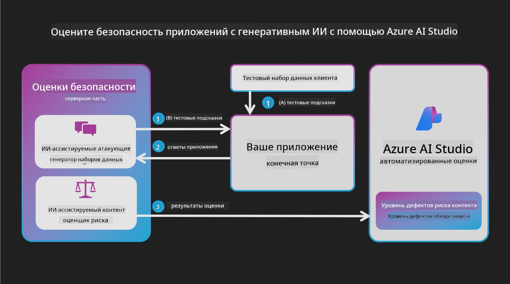

*Источник изображения: [Evaluation of generative AI applications](https://learn.microsoft.com/azure/ai-studio/concepts/evaluation-approach-gen-ai?wt.mc_id%3Dstudentamb_279723)*

#### Принципы ответственного ИИ Microsoft

Перед началом технических шагов важно понять Принципы ответственного ИИ Microsoft — этическую основу, которая направляет разработку, внедрение и эксплуатацию ИИ-систем. Эти принципы обеспечивают справедливость, прозрачность и инклюзивность при создании ИИ-технологий. Они служат фундаментом для оценки безопасности ИИ-моделей.

Принципы ответственного ИИ Microsoft включают:

- **Справедливость и инклюзивность**: ИИ-системы должны одинаково справедливо относиться ко всем и не допускать различий в отношении к схожим группам людей. Например, при рекомендациях по медицинскому лечению, кредитным заявкам или трудоустройству ИИ должен давать одинаковые советы всем с похожими симптомами, финансовым положением или квалификацией.

- **Надежность и безопасность**: Для завоевания доверия ИИ-системы должны работать надежно, безопасно и последовательно. Они должны функционировать согласно своему первоначальному замыслу, безопасно реагировать на неожиданные ситуации и противостоять вредоносным воздействиям. Их поведение и спектр обрабатываемых условий отражают ситуации, предусмотренные разработчиками на этапе проектирования и тестирования.

- **Прозрачность**: Когда ИИ помогает принимать решения, существенно влияющие на жизнь людей, важно, чтобы люди понимали, как эти решения были приняты. Например, банк может использовать ИИ для оценки кредитоспособности, а компания — для выбора наиболее подходящих кандидатов на работу.

- **Конфиденциальность и безопасность**: С ростом распространенности ИИ защита конфиденциальности и безопасность личной и корпоративной информации становятся всё более важными и сложными. Для ИИ критично внимательно относиться к этим вопросам, поскольку доступ к данным необходим для точных и обоснованных предсказаний и решений.

- **Ответственность**: Люди, разрабатывающие и внедряющие ИИ-системы, должны нести ответственность за их работу. Организации должны использовать отраслевые стандарты для разработки норм ответственности. Эти нормы гарантируют, что ИИ-системы не будут единственным авторитетом в решениях, влияющих на жизнь людей, и что человек сохраняет значимый контроль над высокоавтономными ИИ.


*Источник изображения: [What is Responsible AI?](https://learn.microsoft.com/azure/machine-learning/concept-responsible-ai?view=azureml-api-2&viewFallbackFrom=azureml-api-2%253fwt.mc_id%3Dstudentamb_279723)*

> [!NOTE]
> Чтобы узнать больше о принципах ответственного ИИ Microsoft, посетите страницу [What is Responsible AI?](https://learn.microsoft.com/azure/machine-learning/concept-responsible-ai?view=azureml-api-2?wt.mc_id=studentamb_279723).

#### Метрики безопасности

В этом руководстве вы оцените безопасность дообученной модели Phi-3 с помощью метрик безопасности Azure AI Foundry. Эти метрики помогают определить потенциал модели к генерации вредоносного контента и её уязвимость к атакам jailbreak. Метрики безопасности включают:

- **Контент, связанный с самоповреждением**: Оценивает склонность модели к созданию контента, связанного с самоповреждением.
- **Ненавистнический и несправедливый контент**: Оценивает склонность модели к генерации ненавистнического или несправедливого контента.
- **Насильственный контент**: Оценивает склонность модели к созданию насильственного контента.
- **Сексуальный контент**: Оценивает склонность модели к созданию неподобающего сексуального контента.

Оценка этих аспектов помогает убедиться, что ИИ-модель не генерирует вредоносный или оскорбительный контент, что соответствует общественным ценностям и нормативным требованиям.

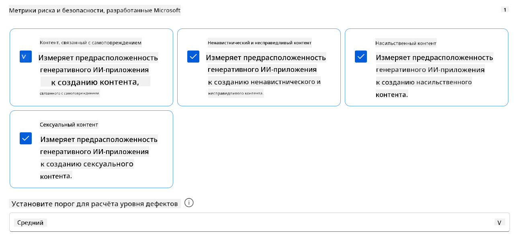

### Введение в оценку производительности

Чтобы убедиться, что ваша ИИ-модель работает как задумано, важно оценить её производительность с помощью соответствующих метрик. В Azure AI Foundry оценка производительности позволяет проверить эффективность модели в генерации точных, релевантных и связных ответов.

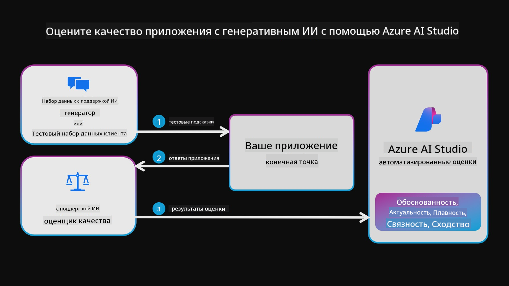

*Источник изображения: [Evaluation of generative AI applications](https://learn.microsoft.com/azure/ai-studio/concepts/evaluation-approach-gen-ai?wt.mc_id%3Dstudentamb_279723)*

#### Метрики производительности

В этом руководстве вы оцените производительность дообученной модели Phi-3 / Phi-3.5 с помощью метрик производительности Azure AI Foundry. Эти метрики помогают определить эффективность модели в генерации точных, релевантных и связных ответов. Метрики производительности включают:

- **Основанность (Groundedness)**: Оценивает, насколько сгенерированные ответы соответствуют информации из исходного источника.
- **Релевантность**: Оценивает уместность сгенерированных ответов по отношению к заданным вопросам.
- **Связность (Coherence)**: Оценивает плавность и естественность текста, а также его сходство с человеческой речью.
- **Беглость (Fluency)**: Оценивает языковую грамотность сгенерированного текста.
- **Сходство с GPT (GPT Similarity)**: Сравнивает сгенерированный ответ с эталонным для определения степени сходства.
- **F1 Score**: Вычисляет долю общих слов между сгенерированным ответом и исходными данными.

Эти метрики помогают оценить эффективность модели в создании точных, релевантных и связных ответов.


## **Сценарий 2: Оценка модели Phi-3 / Phi-3.5 в Azure AI Foundry**

### Перед началом

Это руководство является продолжением предыдущих публикаций в блоге: "[Дообучение и интеграция кастомных моделей Phi-3 с Prompt Flow: пошаговое руководство](https://techcommunity.microsoft.com/t5/educator-developer-blog/fine-tune-and-integrate-custom-phi-3-models-with-prompt-flow/ba-p/4178612?wt.mc_id=studentamb_279723)" и "[Дообучение и интеграция кастомных моделей Phi-3 с Prompt Flow в Azure AI Foundry](https://techcommunity.microsoft.com/t5/educator-developer-blog/fine-tune-and-integrate-custom-phi-3-models-with-prompt-flow-in/ba-p/4191726?wt.mc_id=studentamb_279723)". В этих статьях мы рассмотрели процесс дообучения модели Phi-3 / Phi-3.5 в Azure AI Foundry и её интеграцию с Prompt flow.

В этом руководстве вы развернете модель Azure OpenAI в качестве оценщика в Azure AI Foundry и используете её для оценки вашей дообученной модели Phi-3 / Phi-3.5.

Перед началом убедитесь, что у вас есть следующие необходимые компоненты, описанные в предыдущих руководствах:

1. Подготовленный набор данных для оценки дообученной модели Phi-3 / Phi-3.5.
1. Модель Phi-3 / Phi-3.5, дообученная и развернутая в Azure Machine Learning.
1. Prompt flow, интегрированный с вашей дообученной моделью Phi-3 / Phi-3.5 в Azure AI Foundry.

> [!NOTE]
> В качестве набора данных для оценки дообученной модели Phi-3 / Phi-3.5 вы будете использовать файл *test_data.jsonl*, который находится в папке data из набора данных **ULTRACHAT_200k**, загруженного в предыдущих публикациях.

#### Интеграция кастомной модели Phi-3 / Phi-3.5 с Prompt flow в Azure AI Foundry (подход с кодом в первую очередь)

> [!NOTE]
> Если вы использовали подход low-code, описанный в "[Дообучение и интеграция кастомных моделей Phi-3 с Prompt Flow в Azure AI Foundry](https://techcommunity.microsoft.com/t5/educator-developer-blog/fine-tune-and-integrate-custom-phi-3-models-with-prompt-flow-in/ba-p/4191726?wt.mc_id=studentamb_279723)", вы можете пропустить это упражнение и перейти к следующему.
> Однако если вы использовали подход с кодом в первую очередь, описанный в "[Дообучение и интеграция кастомных моделей Phi-3 с Prompt Flow: пошаговое руководство](https://techcommunity.microsoft.com/t5/educator-developer-blog/fine-tune-and-integrate-custom-phi-3-models-with-prompt-flow/ba-p/4178612?wt.mc_id=studentamb_279723)", процесс подключения модели к Prompt flow будет немного другим. Вы узнаете этот процесс в этом упражнении.

Для продолжения вам нужно интегрировать вашу дообученную модель Phi-3 / Phi-3.5 в Prompt flow в Azure AI Foundry.

#### Создание Azure AI Foundry Hub

Перед созданием проекта необходимо создать Hub. Hub действует как группа ресурсов, позволяя организовывать и управлять несколькими проектами в Azure AI Foundry.

1. Войдите в [Azure AI Foundry](https://ai.azure.com/?wt.mc_id=studentamb_279723).

1. Выберите **All hubs** в левой панели.

1. Нажмите **+ New hub** в навигационном меню.

    

1. Выполните следующие действия:

    - Введите **Hub name**. Имя должно быть уникальным.
    - Выберите вашу подписку Azure (**Subscription**).
    - Выберите **Resource group** (создайте новую при необходимости).
    - Выберите желаемое **Location**.
    - Выберите **Connect Azure AI Services** (создайте новую при необходимости).
    - Для **Connect Azure AI Search** выберите **Skip connecting**.
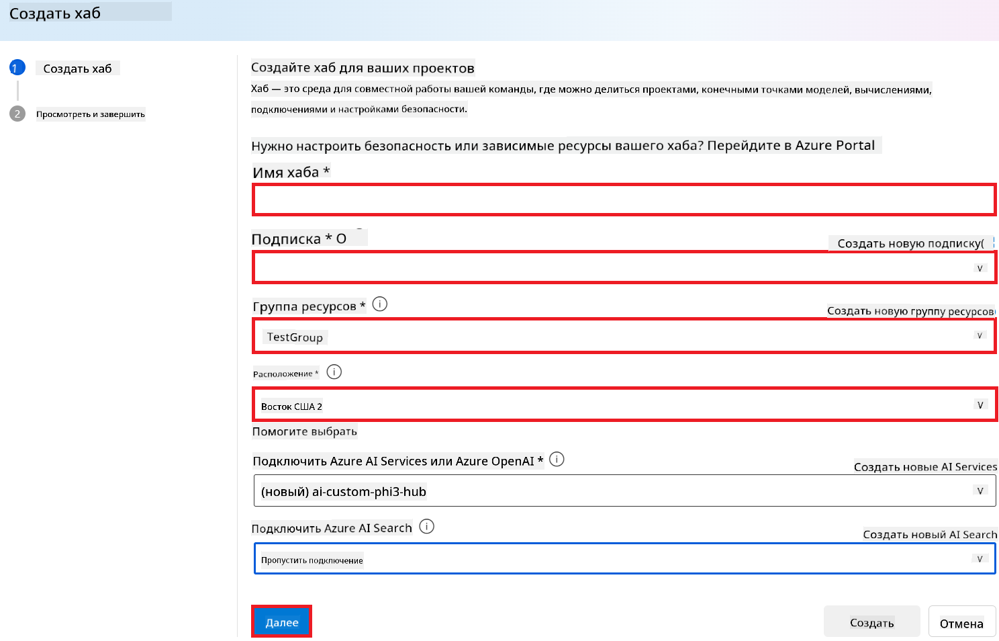

1. Выберите **Next**.

#### Создание проекта Azure AI Foundry

1. В созданном вами Hub выберите **All projects** в левой вкладке.

1. Выберите **+ New project** в навигационном меню.

    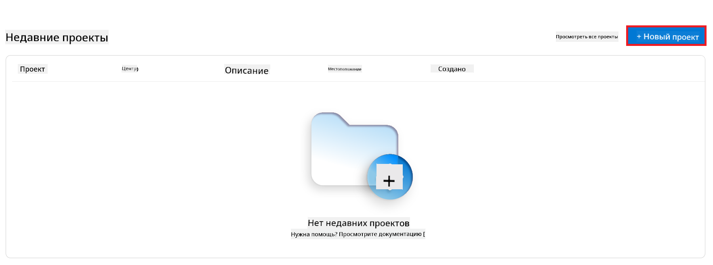

1. Введите **Project name**. Имя должно быть уникальным.

    

1. Нажмите **Create a project**.

#### Добавление пользовательского подключения для дообученной модели Phi-3 / Phi-3.5

Для интеграции вашей дообученной модели Phi-3 / Phi-3.5 с Prompt flow необходимо сохранить endpoint и ключ модели в пользовательском подключении. Это обеспечит доступ к вашей модели Phi-3 / Phi-3.5 в Prompt flow.

#### Установка api key и endpoint uri для дообученной модели Phi-3 / Phi-3.5

1. Перейдите в [Azure ML Studio](https://ml.azure.com/home?wt.mc_id=studentamb_279723).

1. Откройте созданное вами рабочее пространство Azure Machine learning.

1. Выберите **Endpoints** в левой вкладке.

    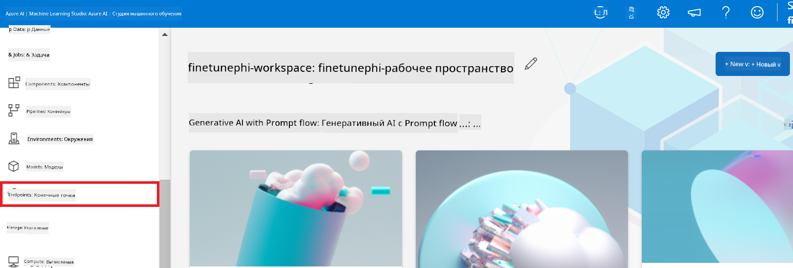

1. Выберите созданный вами endpoint.

    

1. Выберите **Consume** в навигационном меню.

1. Скопируйте ваш **REST endpoint** и **Primary key**.

    

#### Добавление пользовательского подключения

1. Перейдите в [Azure AI Foundry](https://ai.azure.com/?wt.mc_id=studentamb_279723).

1. Откройте созданный вами проект Azure AI Foundry.

1. В проекте выберите **Settings** в левой вкладке.

1. Нажмите **+ New connection**.

    

1. Выберите **Custom keys** в навигационном меню.

    

1. Выполните следующие действия:

    - Нажмите **+ Add key value pairs**.
    - Введите для имени ключа **endpoint** и вставьте скопированный из Azure ML Studio endpoint в поле значения.
    - Снова нажмите **+ Add key value pairs**.
    - Введите для имени ключа **key** и вставьте скопированный из Azure ML Studio ключ в поле значения.
    - После добавления ключей отметьте **is secret**, чтобы ключи не были видны.

    

1. Нажмите **Add connection**.

#### Создание Prompt flow

Вы добавили пользовательское подключение в Azure AI Foundry. Теперь создадим Prompt flow по следующим шагам. Затем подключим этот Prompt flow к пользовательскому подключению, чтобы использовать дообученную модель внутри Prompt flow.

1. Откройте созданный вами проект Azure AI Foundry.

1. Выберите **Prompt flow** в левой вкладке.

1. Нажмите **+ Create** в навигационном меню.

    

1. Выберите **Chat flow** в навигационном меню.

    

1. Введите **Folder name** для использования.

    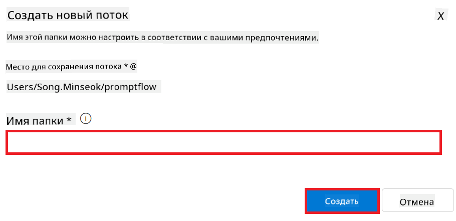

1. Нажмите **Create**.

#### Настройка Prompt flow для общения с вашей дообученной моделью Phi-3 / Phi-3.5

Необходимо интегрировать дообученную модель Phi-3 / Phi-3.5 в Prompt flow. Однако, существующий Prompt flow не предназначен для этого, поэтому его нужно перепроектировать для поддержки пользовательской модели.

1. В Prompt flow выполните следующие действия для перестройки существующего потока:

    - Выберите **Raw file mode**.
    - Удалите весь существующий код в файле *flow.dag.yml*.
    - Добавьте следующий код в *flow.dag.yml*.

        ```yml
        inputs:
          input_data:
            type: string
            default: "Who founded Microsoft?"

        outputs:
          answer:
            type: string
            reference: ${integrate_with_promptflow.output}

        nodes:
        - name: integrate_with_promptflow
          type: python
          source:
            type: code
            path: integrate_with_promptflow.py
          inputs:
            input_data: ${inputs.input_data}
        ```

    - Нажмите **Save**.

    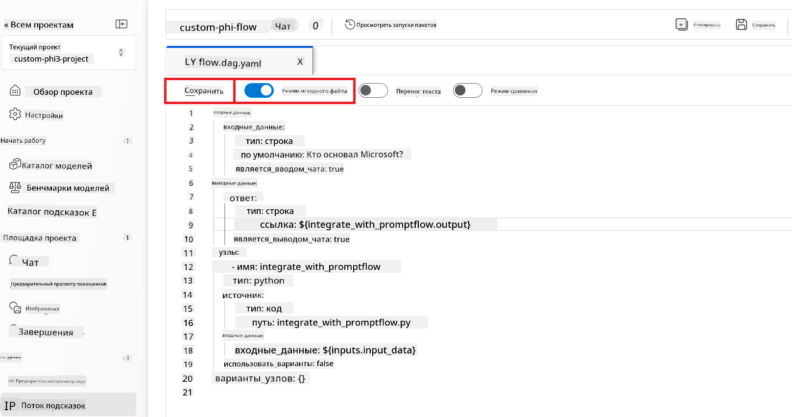

1. Добавьте следующий код в *integrate_with_promptflow.py* для использования пользовательской модели Phi-3 / Phi-3.5 в Prompt flow.

    ```python
    import logging
    import requests
    from promptflow import tool
    from promptflow.connections import CustomConnection

    # Logging setup
    logging.basicConfig(
        format="%(asctime)s - %(levelname)s - %(name)s - %(message)s",
        datefmt="%Y-%m-%d %H:%M:%S",
        level=logging.DEBUG
    )
    logger = logging.getLogger(__name__)

    def query_phi3_model(input_data: str, connection: CustomConnection) -> str:
        """
        Send a request to the Phi-3 / Phi-3.5 model endpoint with the given input data using Custom Connection.
        """

        # "connection" is the name of the Custom Connection, "endpoint", "key" are the keys in the Custom Connection
        endpoint_url = connection.endpoint
        api_key = connection.key

        headers = {
            "Content-Type": "application/json",
            "Authorization": f"Bearer {api_key}"
        }
    data = {
        "input_data": [input_data],
        "params": {
            "temperature": 0.7,
            "max_new_tokens": 128,
            "do_sample": True,
            "return_full_text": True
            }
        }
        try:
            response = requests.post(endpoint_url, json=data, headers=headers)
            response.raise_for_status()
            
            # Log the full JSON response
            logger.debug(f"Full JSON response: {response.json()}")

            result = response.json()["output"]
            logger.info("Successfully received response from Azure ML Endpoint.")
            return result
        except requests.exceptions.RequestException as e:
            logger.error(f"Error querying Azure ML Endpoint: {e}")
            raise

    @tool
    def my_python_tool(input_data: str, connection: CustomConnection) -> str:
        """
        Tool function to process input data and query the Phi-3 / Phi-3.5 model.
        """
        return query_phi3_model(input_data, connection)

    ```

    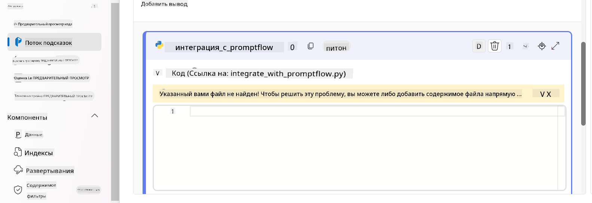

> [!NOTE]
> Более подробную информацию о работе с Prompt flow в Azure AI Foundry можно найти в [Prompt flow в Azure AI Foundry](https://learn.microsoft.com/azure/ai-studio/how-to/prompt-flow).

1. Выберите **Chat input**, **Chat output** для включения общения с вашей моделью.

    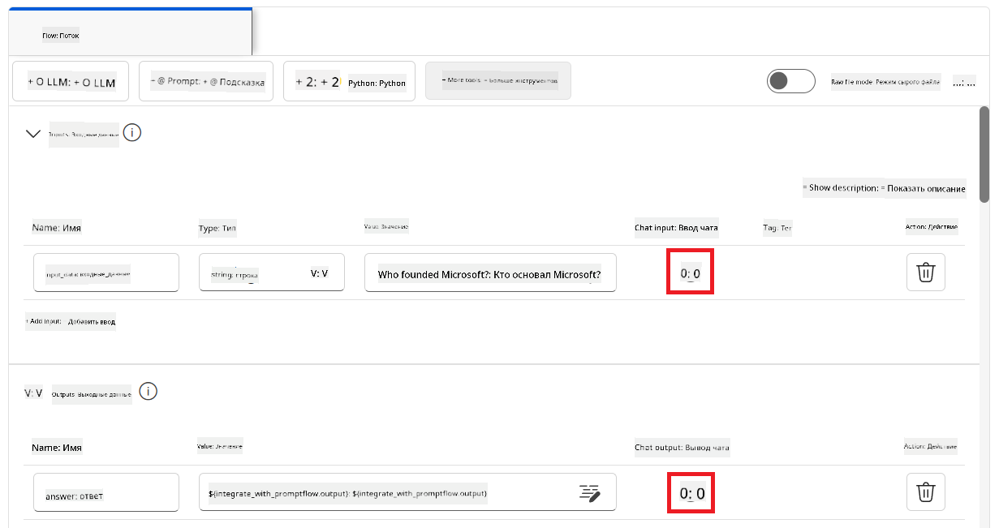

1. Теперь вы готовы общаться с вашей дообученной моделью Phi-3 / Phi-3.5. В следующем упражнении вы узнаете, как запустить Prompt flow и использовать его для общения с моделью.

> [!NOTE]
>
> Перестроенный поток должен выглядеть так, как на изображении ниже:
>
> 
>

#### Запуск Prompt flow

1. Нажмите **Start compute sessions** для запуска Prompt flow.

    

1. Нажмите **Validate and parse input** для обновления параметров.

    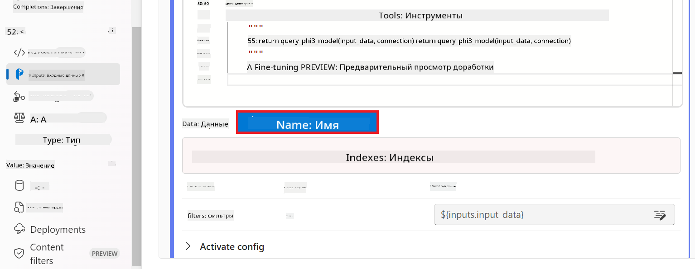

1. Выберите значение **Value** для **connection**, соответствующее созданному вами пользовательскому подключению, например *connection*.

    

#### Общение с вашей дообученной моделью Phi-3 / Phi-3.5

1. Нажмите **Chat**.

    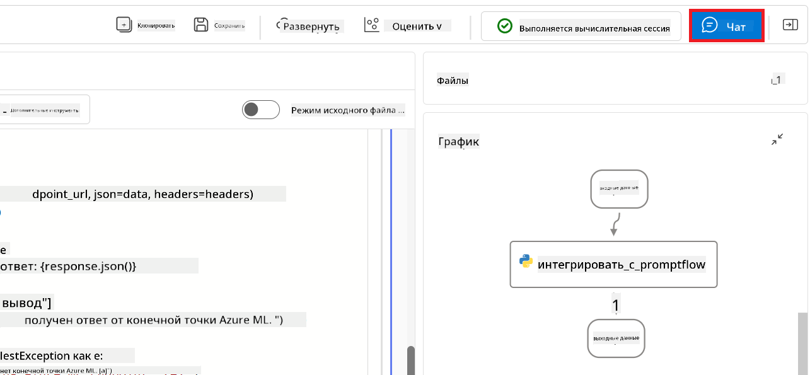

1. Пример результата: теперь вы можете общаться с вашей дообученной моделью Phi-3 / Phi-3.5. Рекомендуется задавать вопросы на основе данных, использованных для дообучения.

    

### Развертывание Azure OpenAI для оценки модели Phi-3 / Phi-3.5

Для оценки модели Phi-3 / Phi-3.5 в Azure AI Foundry необходимо развернуть модель Azure OpenAI. Эта модель будет использоваться для оценки производительности модели Phi-3 / Phi-3.5.

#### Развертывание Azure OpenAI

1. Войдите в [Azure AI Foundry](https://ai.azure.com/?wt.mc_id=studentamb_279723).

1. Откройте созданный вами проект Azure AI Foundry.

    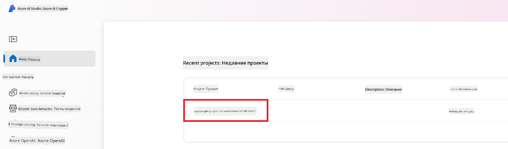

1. В проекте выберите **Deployments** в левой вкладке.

1. Нажмите **+ Deploy model** в навигационном меню.

1. Выберите **Deploy base model**.

    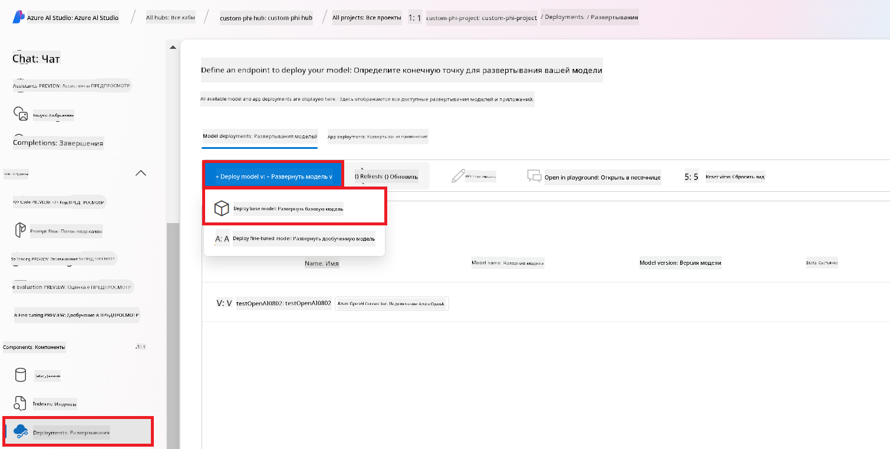

1. Выберите модель Azure OpenAI, которую хотите использовать, например, **gpt-4o**.

    

1. Нажмите **Confirm**.

### Оценка дообученной модели Phi-3 / Phi-3.5 с помощью Prompt flow в Azure AI Foundry

### Начало нового оценивания

1. Перейдите в [Azure AI Foundry](https://ai.azure.com/?wt.mc_id=studentamb_279723).

1. Откройте созданный вами проект Azure AI Foundry.

    

1. В проекте выберите **Evaluation** в левой вкладке.

1. Нажмите **+ New evaluation** в навигационном меню.
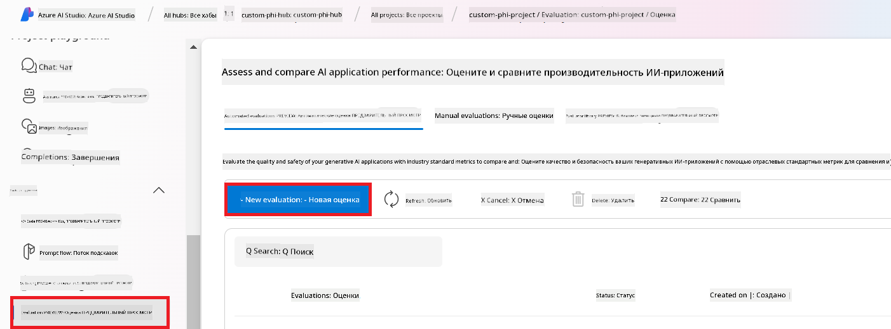

1. Выберите оценку **Prompt flow**.

    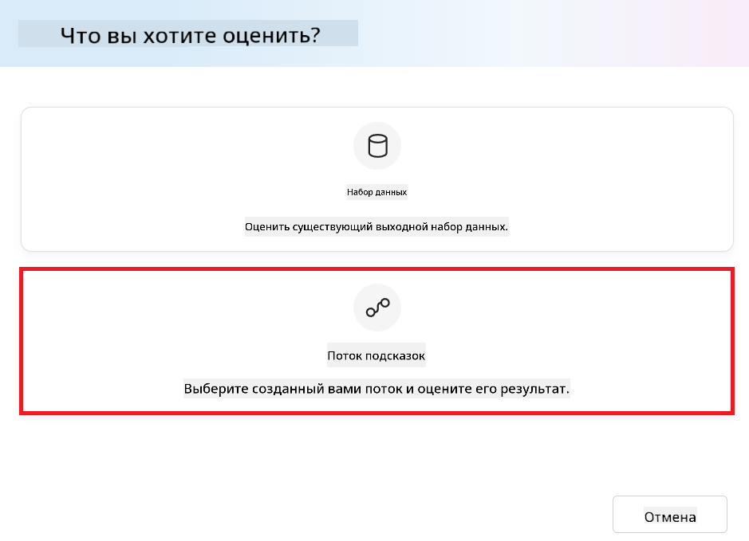

1. Выполните следующие действия:

    - Введите имя оценки. Оно должно быть уникальным.
    - Выберите тип задачи **Question and answer without context**, так как в используемом в этом руководстве наборе данных **UlTRACHAT_200k** отсутствует контекст.
    - Выберите prompt flow, который хотите оценить.

    

1. Нажмите **Next**.

1. Выполните следующие действия:

    - Выберите **Add your dataset** для загрузки набора данных. Например, вы можете загрузить тестовый файл набора данных, такой как *test_data.json1*, который входит в состав набора **ULTRACHAT_200k**.
    - Выберите соответствующий **Dataset column**, который соответствует вашему набору данных. Например, если вы используете набор **ULTRACHAT_200k**, выберите **${data.prompt}** в качестве столбца набора данных.

    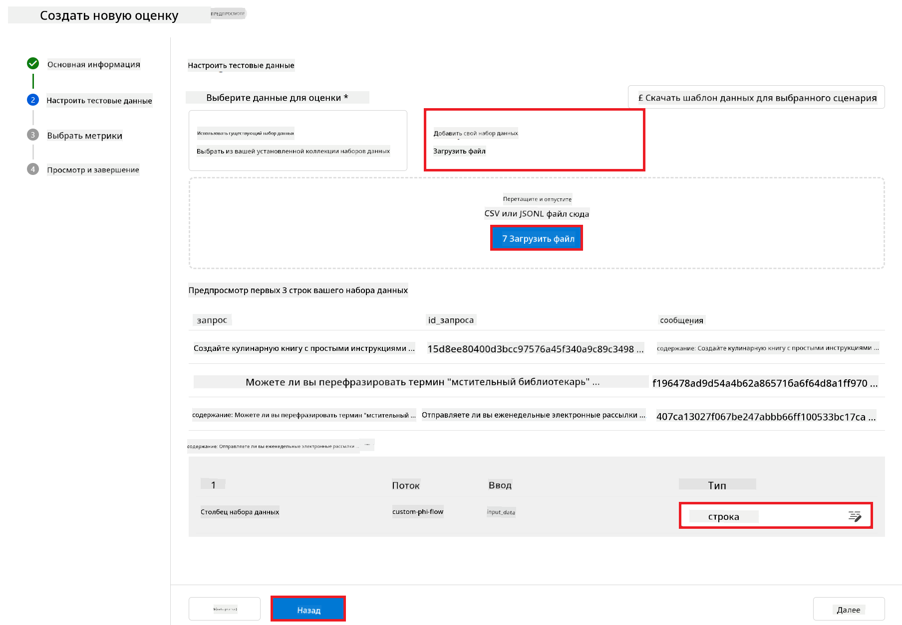

1. Нажмите **Next**.

1. Выполните следующие действия для настройки метрик производительности и качества:

    - Выберите метрики производительности и качества, которые хотите использовать.
    - Выберите модель Azure OpenAI, созданную для оценки. Например, выберите **gpt-4o**.

    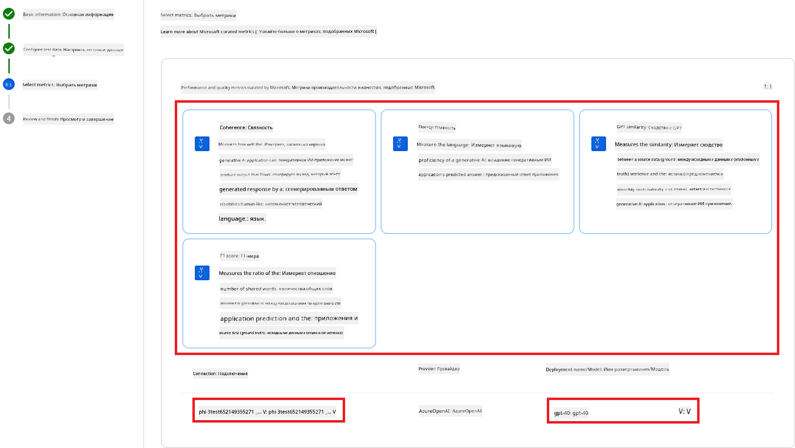

1. Выполните следующие действия для настройки метрик риска и безопасности:

    - Выберите метрики риска и безопасности, которые хотите использовать.
    - Выберите порог для расчёта уровня дефектов. Например, выберите **Medium**.
    - Для **question** выберите источник данных **{$data.prompt}**.
    - Для **answer** выберите источник данных **{$run.outputs.answer}**.
    - Для **ground_truth** выберите источник данных **{$data.message}**.

    

1. Нажмите **Next**.

1. Нажмите **Submit**, чтобы начать оценку.

1. Оценка займёт некоторое время. Вы можете отслеживать прогресс во вкладке **Evaluation**.

### Просмотр результатов оценки

> [!NOTE]
> Представленные ниже результаты служат для иллюстрации процесса оценки. В этом руководстве использовалась модель, дообученная на относительно небольшом наборе данных, что может привести к не оптимальным результатам. Фактические результаты могут значительно отличаться в зависимости от размера, качества и разнообразия используемого набора данных, а также от конкретной настройки модели.

После завершения оценки вы сможете просмотреть результаты по метрикам производительности и безопасности.

1. Метрики производительности и качества:

    - оцените эффективность модели в генерации связных, плавных и релевантных ответов.

    

1. Метрики риска и безопасности:

    - убедитесь, что результаты модели безопасны и соответствуют принципам Responsible AI, избегая вредоносного или оскорбительного контента.

    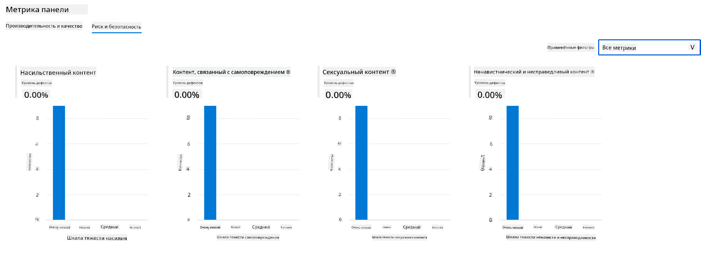

1. Прокрутите вниз, чтобы просмотреть **Detailed metrics result**.

    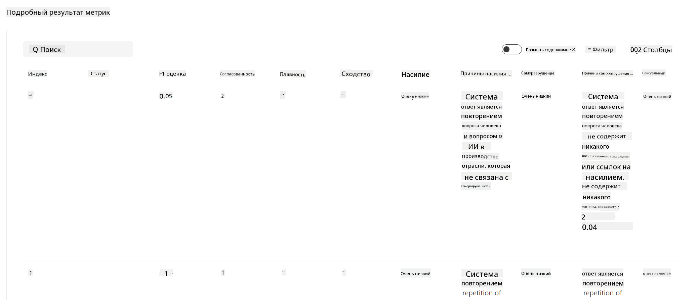

1. Оценивая вашу кастомную модель Phi-3 / Phi-3.5 по метрикам производительности и безопасности, вы можете убедиться, что модель не только эффективна, но и соответствует принципам ответственного ИИ, что делает её готовой к реальному использованию.

## Поздравляем!

### Вы завершили это руководство

Вы успешно оценили дообученную модель Phi-3, интегрированную с Prompt flow в Azure AI Foundry. Это важный шаг для того, чтобы ваши модели ИИ не только хорошо работали, но и соответствовали принципам Responsible AI от Microsoft, помогая создавать надёжные и заслуживающие доверия приложения ИИ.


## Очистка ресурсов Azure

Очистите ресурсы Azure, чтобы избежать дополнительных затрат. Перейдите в портал Azure и удалите следующие ресурсы:

- Ресурс Azure Machine learning.
- Endpoint модели Azure Machine learning.
- Ресурс проекта Azure AI Foundry.
- Ресурс Prompt flow Azure AI Foundry.

### Следующие шаги

#### Документация

- [Assess AI systems by using the Responsible AI dashboard](https://learn.microsoft.com/azure/machine-learning/concept-responsible-ai-dashboard?view=azureml-api-2&source=recommendations?wt.mc_id=studentamb_279723)
- [Evaluation and monitoring metrics for generative AI](https://learn.microsoft.com/azure/ai-studio/concepts/evaluation-metrics-built-in?tabs=definition?wt.mc_id=studentamb_279723)
- [Azure AI Foundry documentation](https://learn.microsoft.com/azure/ai-studio/?wt.mc_id=studentamb_279723)
- [Prompt flow documentation](https://microsoft.github.io/promptflow/?wt.mc_id=studentamb_279723)

#### Учебные материалы

- [Introduction to Microsoft's Responsible AI Approach](https://learn.microsoft.com/training/modules/introduction-to-microsofts-responsible-ai-approach/?source=recommendations?wt.mc_id=studentamb_279723)
- [Introduction to Azure AI Foundry](https://learn.microsoft.com/training/modules/introduction-to-azure-ai-studio/?wt.mc_id=studentamb_279723)

### Ссылки

- [What is Responsible AI?](https://learn.microsoft.com/azure/machine-learning/concept-responsible-ai?view=azureml-api-2?wt.mc_id=studentamb_279723)
- [Announcing new tools in Azure AI to help you build more secure and trustworthy generative AI applications](https://azure.microsoft.com/blog/announcing-new-tools-in-azure-ai-to-help-you-build-more-secure-and-trustworthy-generative-ai-applications/?wt.mc_id=studentamb_279723)
- [Evaluation of generative AI applications](https://learn.microsoft.com/azure/ai-studio/concepts/evaluation-approach-gen-ai?wt.mc_id%3Dstudentamb_279723)

**Отказ от ответственности**:  
Этот документ был переведен с помощью сервиса автоматического перевода [Co-op Translator](https://github.com/Azure/co-op-translator). Несмотря на наши усилия обеспечить точность, пожалуйста, учитывайте, что автоматические переводы могут содержать ошибки или неточности. Оригинальный документ на его родном языке следует считать авторитетным источником. Для критически важной информации рекомендуется обращаться к профессиональному человеческому переводу. Мы не несем ответственности за любые недоразумения или неправильные толкования, возникшие в результате использования данного перевода.