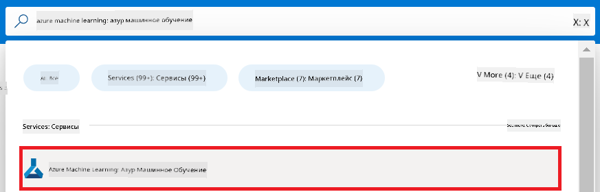
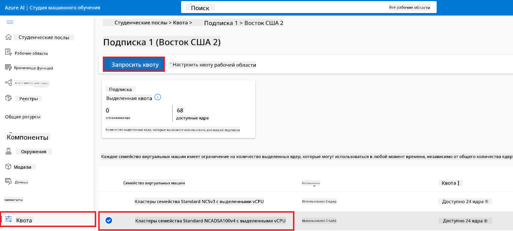
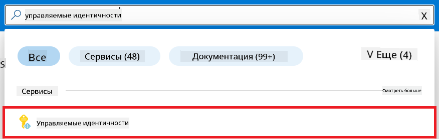
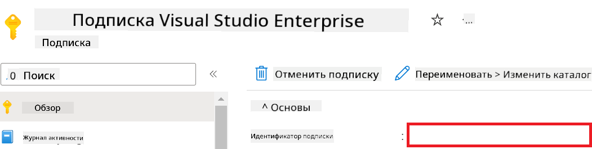
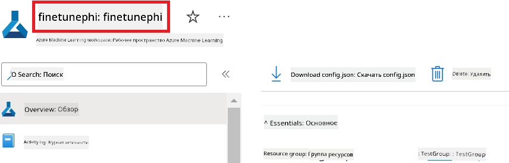
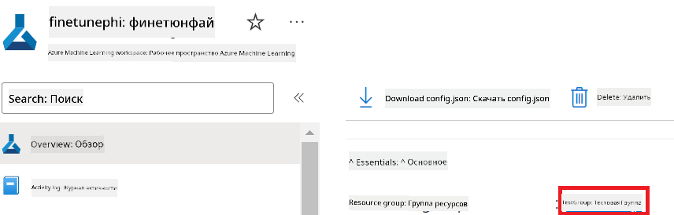
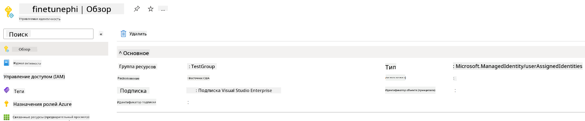
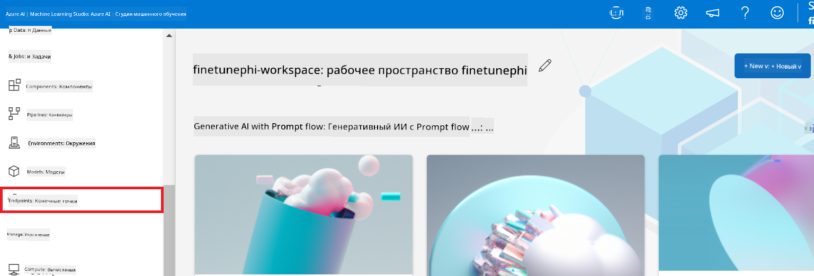
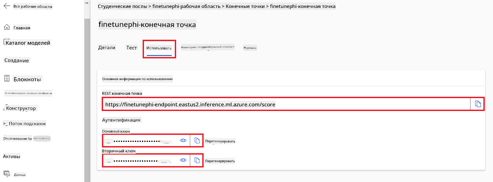
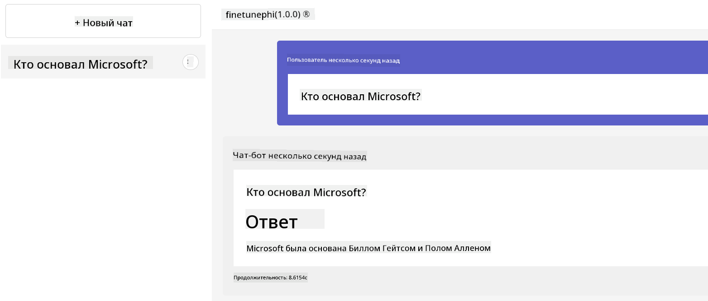

<!--
CO_OP_TRANSLATOR_METADATA:
{
  "original_hash": "7ca2c30fdb802664070e9cfbf92e24fe",
  "translation_date": "2026-01-04T07:00:15+00:00",
  "source_file": "md/02.Application/01.TextAndChat/Phi3/E2E_Phi-3-FineTuning_PromptFlow_Integration.md",
  "language_code": "ru"
}
-->
# Тонкая настройка и интеграция пользовательских моделей Phi-3 с Prompt flow

Этот образец «от начала до конца» (E2E) основан на руководстве "[Fine-Tune and Integrate Custom Phi-3 Models with Prompt Flow: Step-by-Step Guide](https://techcommunity.microsoft.com/t5/educator-developer-blog/fine-tune-and-integrate-custom-phi-3-models-with-prompt-flow/ba-p/4178612?WT.mc_id=aiml-137032-kinfeylo)" из Microsoft Tech Community. В нём описаны процессы тонкой настройки, развертывания и интеграции пользовательских моделей Phi-3 с Prompt flow.

## Обзор

В этом E2E примере вы узнаете, как выполнить тонкую настройку модели Phi-3 и интегрировать её с Prompt flow. С помощью Azure Machine Learning и Prompt flow вы настроите рабочий процесс для развертывания и использования пользовательских моделей ИИ. Этот E2E пример разделён на три сценария:

**Сценарий 1: Настройка ресурсов Azure и подготовка к тонкой настройке**

**Сценарий 2: Тонкая настройка модели Phi-3 и развертывание в Azure Machine Learning Studio**

**Сценарий 3: Интеграция с Prompt flow и общение с вашей пользовательской моделью**

Вот обзор этого E2E примера.


### Table of Contents

1. **[Scenario 1: Set up Azure resources and Prepare for fine-tuning](../../../../../../md/02.Application/01.TextAndChat/Phi3)**
    - [Create an Azure Machine Learning Workspace](../../../../../../md/02.Application/01.TextAndChat/Phi3)
    - [Request GPU quotas in Azure Subscription](../../../../../../md/02.Application/01.TextAndChat/Phi3)
    - [Add role assignment](../../../../../../md/02.Application/01.TextAndChat/Phi3)
    - [Set up project](../../../../../../md/02.Application/01.TextAndChat/Phi3)
    - [Prepare dataset for fine-tuning](../../../../../../md/02.Application/01.TextAndChat/Phi3)

1. **[Scenario 2: Fine-tune Phi-3 model and Deploy in Azure Machine Learning Studio](../../../../../../md/02.Application/01.TextAndChat/Phi3)**
    - [Set up Azure CLI](../../../../../../md/02.Application/01.TextAndChat/Phi3)
    - [Fine-tune the Phi-3 model](../../../../../../md/02.Application/01.TextAndChat/Phi3)
    - [Deploy the fine-tuned model](../../../../../../md/02.Application/01.TextAndChat/Phi3)

1. **[Scenario 3: Integrate with Prompt flow and Chat with your custom model](../../../../../../md/02.Application/01.TextAndChat/Phi3)**
    - [Integrate the custom Phi-3 model with Prompt flow](../../../../../../md/02.Application/01.TextAndChat/Phi3)
    - [Chat with your custom model](../../../../../../md/02.Application/01.TextAndChat/Phi3)

## Scenario 1: Set up Azure resources and Prepare for fine-tuning

### Create an Azure Machine Learning Workspace

1. Type *azure machine learning* in the **search bar** at the top of the portal page and select **Azure Machine Learning** from the options that appear.

    

1. Select **+ Create** from the navigation menu.

1. Select **New workspace** from the navigation menu.

    

1. Perform the following tasks:

    - Select your Azure **Subscription**.
    - Select the **Resource group** to use (create a new one if needed).
    - Enter **Workspace Name**. It must be a unique value.
    - Select the **Region** you'd like to use.
    - Select the **Storage account** to use (create a new one if needed).
    - Select the **Key vault** to use (create a new one if needed).
    - Select the **Application insights** to use (create a new one if needed).
    - Select the **Container registry** to use (create a new one if needed).

    

1. Select **Review + Create**.

1. Select **Create**.

### Request GPU quotas in Azure Subscription

In this E2E sample, you will use the *Standard_NC24ads_A100_v4 GPU* for fine-tuning, which requires a quota request, and the *Standard_E4s_v3* CPU for deployment, which does not require a quota request.

> [!NOTE]
>
> Only Pay-As-You-Go subscriptions (the standard subscription type) are eligible for GPU allocation; benefit subscriptions are not currently supported.
>
> For those using benefit subscriptions (such as Visual Studio Enterprise Subscription) or those looking to quickly test the fine-tuning and deployment process, this tutorial also provides guidance for fine-tuning with a minimal dataset using a CPU. However, it is important to note that fine-tuning results are significantly better when using a GPU with larger datasets.

1. Visit [Azure ML Studio](https://ml.azure.com/home?wt.mc_id=studentamb_279723).

1. Perform the following tasks to request *Standard NCADSA100v4 Family* quota:

    - Select **Quota** from the left side tab.
    - Select the **Virtual machine family** to use. For example, select **Standard NCADSA100v4 Family Cluster Dedicated vCPUs**, which includes the *Standard_NC24ads_A100_v4* GPU.
    - Select the **Request quota** from the navigation menu.

        

    - Inside the Request quota page, enter the **New cores limit** you'd like to use. For example, 24.
    - Inside the Request quota page, select **Submit** to request the GPU quota.

> [!NOTE]
> You can select the appropriate GPU or CPU for your needs by referring to [Sizes for Virtual Machines in Azure](https://learn.microsoft.com/azure/virtual-machines/sizes/overview?tabs=breakdownseries%2Cgeneralsizelist%2Ccomputesizelist%2Cmemorysizelist%2Cstoragesizelist%2Cgpusizelist%2Cfpgasizelist%2Chpcsizelist) document.

### Add role assignment

To fine-tune and deploy your models, you must first create a User Assigned Managed Identity (UAI) and assign it the appropriate permissions. This UAI will be used for authentication during deployment

#### Create User Assigned Managed Identity(UAI)

1. Type *managed identities* in the **search bar** at the top of the portal page and select **Managed Identities** from the options that appear.

    

1. Select **+ Create**.

    

1. Perform the following tasks:

    - Select your Azure **Subscription**.
    - Select the **Resource group** to use (create a new one if needed).
    - Select the **Region** you'd like to use.
    - Enter the **Name**. It must be a unique value.

1. Select **Review + create**.

1. Select **+ Create**.

#### Add Contributor role assignment to Managed Identity

1. Navigate to the Managed Identity resource that you created.

1. Select **Azure role assignments** from the left side tab.

1. Select **+Add role assignment** from the navigation menu.

1. Inside Add role assignment page, Perform the following tasks:
    - Select the **Scope** to **Resource group**.
    - Select your Azure **Subscription**.
    - Select the **Resource group** to use.
    - Select the **Role** to **Contributor**.

    

1. Select **Save**.

#### Add Storage Blob Data Reader role assignment to Managed Identity

1. Type *storage accounts* in the **search bar** at the top of the portal page and select **Storage accounts** from the options that appear.

    

1. Select the storage account that associated with the Azure Machine Learning workspace that you created. For example, *finetunephistorage*.

1. Perform the following tasks to navigate to Add role assignment page:

    - Navigate to the Azure Storage account that you created.
    - Select **Access Control (IAM)** from the left side tab.
    - Select **+ Add** from the navigation menu.
    - Select **Add role assignment** from the navigation menu.

    

1. Inside Add role assignment page, Perform the following tasks:

    - Inside the Role page, type *Storage Blob Data Reader* in the **search bar** and select **Storage Blob Data Reader** from the options that appear.
    - Inside the Role page, select **Next**.
    - Inside the Members page, select **Assign access to** **Managed identity**.
    - Inside the Members page, select **+ Select members**.
    - Inside Select managed identities page, select your Azure **Subscription**.
    - Inside Select managed identities page, select the **Managed identity** to **Manage Identity**.
    - Inside Select managed identities page, select the Manage Identity that you created. For example, *finetunephi-managedidentity*.
    - Inside Select managed identities page, select **Select**.

    

1. Select **Review + assign**.

#### Add AcrPull role assignment to Managed Identity

1. Type *container registries* in the **search bar** at the top of the portal page and select **Container registries** from the options that appear.

    

1. Select the container registry that associated with the Azure Machine Learning workspace. For example, *finetunephicontainerregistries*

1. Perform the following tasks to navigate to Add role assignment page:

    - Select **Access Control (IAM)** from the left side tab.
    - Select **+ Add** from the navigation menu.
    - Select **Add role assignment** from the navigation menu.

1. Inside Add role assignment page, Perform the following tasks:

    - Inside the Role page, Type *AcrPull* in the **search bar** and select **AcrPull** from the options that appear.
    - Inside the Role page, select **Next**.
    - Inside the Members page, select **Assign access to** **Managed identity**.
    - Inside the Members page, select **+ Select members**.
    - Inside Select managed identities page, select your Azure **Subscription**.
    - Inside Select managed identities page, select the **Managed identity** to **Manage Identity**.
    - Inside Select managed identities page, select the Manage Identity that you created. For example, *finetunephi-managedidentity*.
    - Inside Select managed identities page, select **Select**.
    - Select **Review + assign**.

### Set up project

Now, you will create a folder to work in and set up a virtual environment to develop a program that interacts with users and uses stored chat history from Azure Cosmos DB to inform its responses.

#### Create a folder to work inside it

1. Open a terminal window and type the following command to create a folder named *finetune-phi* in the default path.

    ```console
    mkdir finetune-phi
    ```

1. Type the following command inside your terminal to navigate to the *finetune-phi* folder you created.

    ```console
    cd finetune-phi
    ```

#### Create a virtual environment

1. Type the following command inside your terminal to create a virtual environment named *.venv*.

    ```console
    python -m venv .venv
    ```

1. Type the following command inside your terminal to activate the virtual environment.

    ```console
    .venv\Scripts\activate.bat
    ```

> [!NOTE]
>
> If it worked, you should see *(.venv)* before the command prompt.

#### Install the required packages

1. Type the following commands inside your terminal to install the required packages.

    ```console
    pip install datasets==2.19.1
    pip install transformers==4.41.1
    pip install azure-ai-ml==1.16.0
    pip install torch==2.3.1
    pip install trl==0.9.4
    pip install promptflow==1.12.0
    ```

#### Create project files
В этом упражнении вы создадите необходимые файлы для нашего проекта. Эти файлы включают сценарии для загрузки набора данных, настройки среды Azure Machine Learning, дообучения модели Phi-3 и развертывания дообученной модели. Вы также создадите файл *conda.yml* для настройки окружения для дообучения.

В этом упражнении вы:

- Создадите файл *download_dataset.py* для загрузки набора данных.
- Создадите файл *setup_ml.py* для настройки среды Azure Machine Learning.
- Создадите файл *fine_tune.py* в папке *finetuning_dir* для дообучения модели Phi-3 с использованием набора данных.
- Создадите файл *conda.yml* для настройки окружения дообучения.
- Создадите файл *deploy_model.py* для развертывания дообученной модели.
- Создадите файл *integrate_with_promptflow.py* для интеграции дообученной модели и выполнения модели с помощью Prompt flow.
- Создадите файл flow.dag.yml для настройки структуры рабочего процесса для Prompt flow.
- Создадите файл *config.py* для ввода информации Azure.

> [!NOTE]
>
> Полная структура папок:
>
> ```text
> └── YourUserName
> .    └── finetune-phi
> .        ├── finetuning_dir
> .        │      └── fine_tune.py
> .        ├── conda.yml
> .        ├── config.py
> .        ├── deploy_model.py
> .        ├── download_dataset.py
> .        ├── flow.dag.yml
> .        ├── integrate_with_promptflow.py
> .        └── setup_ml.py
> ```

1. Откройте **Visual Studio Code**.

1. Выберите **File** в строке меню.

1. Выберите **Open Folder**.

1. Выберите папку *finetune-phi*, которую вы создали, которая находится по пути *C:\Users\yourUserName\finetune-phi*.

    

1. В левой панели Visual Studio Code щелкните правой кнопкой мыши и выберите **New File**, чтобы создать новый файл с именем *download_dataset.py*.

1. В левой панели Visual Studio Code щелкните правой кнопкой мыши и выберите **New File**, чтобы создать новый файл с именем *setup_ml.py*.

1. В левой панели Visual Studio Code щелкните правой кнопкой мыши и выберите **New File**, чтобы создать новый файл с именем *deploy_model.py*.

    

1. В левой панели Visual Studio Code щелкните правой кнопкой мыши и выберите **New Folder**, чтобы создать новую папку с именем *finetuning_dir*.

1. В папке *finetuning_dir* создайте новый файл с именем *fine_tune.py*.

#### Create and Configure *conda.yml* file

1. В левой панели Visual Studio Code щелкните правой кнопкой мыши и выберите **New File**, чтобы создать новый файл с именем *conda.yml*.

1. Добавьте следующий код в файл *conda.yml*, чтобы настроить окружение для дообучения модели Phi-3.

    ```yml
    name: phi-3-training-env
    channels:
      - defaults
      - conda-forge
    dependencies:
      - python=3.10
      - pip
      - numpy<2.0
      - pip:
          - torch==2.4.0
          - torchvision==0.19.0
          - trl==0.8.6
          - transformers==4.41
          - datasets==2.21.0
          - azureml-core==1.57.0
          - azure-storage-blob==12.19.0
          - azure-ai-ml==1.16
          - azure-identity==1.17.1
          - accelerate==0.33.0
          - mlflow==2.15.1
          - azureml-mlflow==1.57.0
    ```

#### Create and Configure *config.py* file

1. В левой панели Visual Studio Code щелкните правой кнопкой мыши и выберите **New File**, чтобы создать новый файл с именем *config.py*.

1. Добавьте следующий код в файл *config.py*, чтобы включить вашу информацию Azure.

    ```python
    # Настройки Azure
    AZURE_SUBSCRIPTION_ID = "your_subscription_id"
    AZURE_RESOURCE_GROUP_NAME = "your_resource_group_name" # "TestGroup"

    # Настройки Azure Machine Learning
    AZURE_ML_WORKSPACE_NAME = "your_workspace_name" # "finetunephi-workspace"

    # Настройки управляемой идентичности Azure
    AZURE_MANAGED_IDENTITY_CLIENT_ID = "your_azure_managed_identity_client_id"
    AZURE_MANAGED_IDENTITY_NAME = "your_azure_managed_identity_name" # "finetunephi-mangedidentity"
    AZURE_MANAGED_IDENTITY_RESOURCE_ID = f"/subscriptions/{AZURE_SUBSCRIPTION_ID}/resourceGroups/{AZURE_RESOURCE_GROUP_NAME}/providers/Microsoft.ManagedIdentity/userAssignedIdentities/{AZURE_MANAGED_IDENTITY_NAME}"

    # Пути к файлам набора данных
    TRAIN_DATA_PATH = "data/train_data.jsonl"
    TEST_DATA_PATH = "data/test_data.jsonl"

    # Настройки дообученной модели
    AZURE_MODEL_NAME = "your_fine_tuned_model_name" # "finetune-phi-model"
    AZURE_ENDPOINT_NAME = "your_fine_tuned_model_endpoint_name" # "finetune-phi-endpoint"
    AZURE_DEPLOYMENT_NAME = "your_fine_tuned_model_deployment_name" # "finetune-phi-deployment"

    AZURE_ML_API_KEY = "your_fine_tuned_model_api_key"
    AZURE_ML_ENDPOINT = "your_fine_tuned_model_endpoint_uri" # "https://{your-endpoint-name}.{your-region}.inference.ml.azure.com/score"
    ```

#### Add Azure environment variables

1. Выполните следующие действия, чтобы добавить идентификатор подписки Azure:

    - Введите *subscriptions* в **search bar** в верхней части страницы портала и выберите **Subscriptions** из появившихся вариантов.
    - Выберите подписку Azure, которую вы в данный момент используете.
    - Скопируйте и вставьте ваш Subscription ID в файл *config.py*.

    

1. Выполните следующие действия, чтобы добавить имя рабочей области Azure:

    - Перейдите к ресурсу Azure Machine Learning, который вы создали.
    - Скопируйте и вставьте имя вашей учетной записи в файл *config.py*.

    

1. Выполните следующие действия, чтобы добавить имя группы ресурсов Azure:

    - Перейдите к ресурсу Azure Machine Learning, который вы создали.
    - Скопируйте и вставьте имя вашей группы ресурсов Azure в файл *config.py*.

    

2. Выполните следующие действия, чтобы добавить имя управляемой идентичности Azure:

    - Перейдите к ресурсу Managed Identities, который вы создали.
    - Скопируйте и вставьте имя вашей управляемой идентичности Azure в файл *config.py*.

    

### Подготовка набора данных для дообучения

В этом упражнении вы выполните файл *download_dataset.py*, чтобы загрузить наборы данных *ULTRACHAT_200k* в локальную среду. Затем вы используете эти наборы данных для дообучения модели Phi-3 в Azure Machine Learning.

#### Загрузка набора данных с помощью *download_dataset.py*

1. Откройте файл *download_dataset.py* в Visual Studio Code.

1. Добавьте следующий код в *download_dataset.py*.

    ```python
    import json
    import os
    from datasets import load_dataset
    from config import (
        TRAIN_DATA_PATH,
        TEST_DATA_PATH)

    def load_and_split_dataset(dataset_name, config_name, split_ratio):
        """
        Load and split a dataset.
        """
        # Загрузить набор данных с указанным именем, конфигурацией и соотношением разбиения
        dataset = load_dataset(dataset_name, config_name, split=split_ratio)
        print(f"Original dataset size: {len(dataset)}")
        
        # Разделить набор данных на обучающую и тестовую выборки (80% обучение, 20% тест)
        split_dataset = dataset.train_test_split(test_size=0.2)
        print(f"Train dataset size: {len(split_dataset['train'])}")
        print(f"Test dataset size: {len(split_dataset['test'])}")
        
        return split_dataset

    def save_dataset_to_jsonl(dataset, filepath):
        """
        Save a dataset to a JSONL file.
        """
        # Создать каталог, если он не существует
        os.makedirs(os.path.dirname(filepath), exist_ok=True)
        
        # Открыть файл в режиме записи
        with open(filepath, 'w', encoding='utf-8') as f:
            # Перебирать каждую запись в наборе данных
            for record in dataset:
                # Сериализовать запись в JSON-объект и записать его в файл
                json.dump(record, f)
                # Записать символ перевода строки для разделения записей
                f.write('\n')
        
        print(f"Dataset saved to {filepath}")

    def main():
        """
        Main function to load, split, and save the dataset.
        """
        # Загрузить и разделить набор данных ULTRACHAT_200k с определённой конфигурацией и соотношением разбиения
        dataset = load_and_split_dataset("HuggingFaceH4/ultrachat_200k", 'default', 'train_sft[:1%]')
        
        # Извлечь обучающий и тестовый наборы данных из разбиения
        train_dataset = dataset['train']
        test_dataset = dataset['test']

        # Сохранить обучающий набор данных в файл JSONL
        save_dataset_to_jsonl(train_dataset, TRAIN_DATA_PATH)
        
        # Сохранить тестовый набор данных в отдельный файл JSONL
        save_dataset_to_jsonl(test_dataset, TEST_DATA_PATH)

    if __name__ == "__main__":
        main()

    ```

> [!TIP]
>
> **Рекомендации по дообучению с минимальным набором данных на CPU**
>
> Если вы хотите использовать CPU для дообучения, этот подход идеально подходит для тех, у кого есть подписки с преимуществами (например, Visual Studio Enterprise Subscription), или чтобы быстро протестировать процесс дообучения и развертывания.
>
> Замените `dataset = load_and_split_dataset("HuggingFaceH4/ultrachat_200k", 'default', 'train_sft[:1%]')` на `dataset = load_and_split_dataset("HuggingFaceH4/ultrachat_200k", 'default', 'train_sft[:10]')`
>

1. Введите следующую команду в вашем терминале, чтобы запустить скрипт и загрузить набор данных в локальную среду.

    ```console
    python download_data.py
    ```

1. Убедитесь, что наборы данных успешно сохранены в вашей локальной директории *finetune-phi/data*.

> [!NOTE]
>
> **Размер набора данных и время дообучения**
>
> В этом E2E примере вы используете только 1% набора данных (`train_sft[:1%]`). Это значительно сокращает объем данных, ускоряя как загрузку, так и процессы дообучения. Вы можете изменить процент, чтобы найти оптимальный баланс между временем обучения и производительностью модели. Использование меньшего подмножества набора данных сокращает время, необходимое для дообучения, делая процесс более управляемым для E2E примера.

## Сценарий 2: Дообучение модели Phi-3 и развертывание в Azure Machine Learning Studio

### Настройка Azure CLI

Вам нужно настроить Azure CLI для аутентификации вашей среды. Azure CLI позволяет управлять ресурсами Azure прямо из командной строки и предоставляет учетные данные, необходимые для доступа Azure Machine Learning к этим ресурсам. Чтобы начать, установите [Azure CLI](https://learn.microsoft.com/cli/azure/install-azure-cli)

1. Откройте окно терминала и введите следующую команду, чтобы войти в свою учетную запись Azure.

    ```console
    az login
    ```

1. Выберите учетную запись Azure, которую вы хотите использовать.

1. Выберите подписку Azure, которую вы хотите использовать.

    

> [!TIP]
>
> Если у вас возникают проблемы с входом в Azure, попробуйте использовать код устройства. Откройте окно терминала и введите следующую команду, чтобы войти в свою учетную запись Azure:
>
> ```console
> az login --use-device-code
> ```
>

### Дообучение модели Phi-3

В этом упражнении вы дообучите модель Phi-3 с использованием предоставленного набора данных. Сначала вы определите процесс дообучения в файле *fine_tune.py*. Затем вы настроите среду Azure Machine Learning и запустите процесс дообучения, выполнив файл *setup_ml.py*. Этот скрипт гарантирует, что дообучение выполняется в среде Azure Machine Learning.

Выполнив *setup_ml.py*, вы запустите процесс дообучения в среде Azure Machine Learning.

#### Добавьте код в файл *fine_tune.py*

1. Перейдите в папку *finetuning_dir* и откройте файл *fine_tune.py* в Visual Studio Code.

1. Добавьте следующий код в *fine_tune.py*.

    ```python
    import argparse
    import sys
    import logging
    import os
    from datasets import load_dataset
    import torch
    import mlflow
    from transformers import AutoModelForCausalLM, AutoTokenizer, TrainingArguments
    from trl import SFTTrainer

    # Чтобы избежать ошибки INVALID_PARAMETER_VALUE в MLflow, отключите интеграцию с MLflow
    os.environ["DISABLE_MLFLOW_INTEGRATION"] = "True"

    # Настройка логирования
    logging.basicConfig(
        format="%(asctime)s - %(levelname)s - %(name)s - %(message)s",
        datefmt="%Y-%m-%d %H:%M:%S",
        handlers=[logging.StreamHandler(sys.stdout)],
        level=logging.WARNING
    )
    logger = logging.getLogger(__name__)

    def initialize_model_and_tokenizer(model_name, model_kwargs):
        """
        Initialize the model and tokenizer with the given pretrained model name and arguments.
        """
        model = AutoModelForCausalLM.from_pretrained(model_name, **model_kwargs)
        tokenizer = AutoTokenizer.from_pretrained(model_name)
        tokenizer.model_max_length = 2048
        tokenizer.pad_token = tokenizer.unk_token
        tokenizer.pad_token_id = tokenizer.convert_tokens_to_ids(tokenizer.pad_token)
        tokenizer.padding_side = 'right'
        return model, tokenizer

    def apply_chat_template(example, tokenizer):
        """
        Apply a chat template to tokenize messages in the example.
        """
        messages = example["messages"]
        if messages[0]["role"] != "system":
            messages.insert(0, {"role": "system", "content": ""})
        example["text"] = tokenizer.apply_chat_template(
            messages, tokenize=False, add_generation_prompt=False
        )
        return example

    def load_and_preprocess_data(train_filepath, test_filepath, tokenizer):
        """
        Load and preprocess the dataset.
        """
        train_dataset = load_dataset('json', data_files=train_filepath, split='train')
        test_dataset = load_dataset('json', data_files=test_filepath, split='train')
        column_names = list(train_dataset.features)

        train_dataset = train_dataset.map(
            apply_chat_template,
            fn_kwargs={"tokenizer": tokenizer},
            num_proc=10,
            remove_columns=column_names,
            desc="Applying chat template to train dataset",
        )

        test_dataset = test_dataset.map(
            apply_chat_template,
            fn_kwargs={"tokenizer": tokenizer},
            num_proc=10,
            remove_columns=column_names,
            desc="Applying chat template to test dataset",
        )

        return train_dataset, test_dataset

    def train_and_evaluate_model(train_dataset, test_dataset, model, tokenizer, output_dir):
        """
        Train and evaluate the model.
        """
        training_args = TrainingArguments(
            bf16=True,
            do_eval=True,
            output_dir=output_dir,
            eval_strategy="epoch",
            learning_rate=5.0e-06,
            logging_steps=20,
            lr_scheduler_type="cosine",
            num_train_epochs=3,
            overwrite_output_dir=True,
            per_device_eval_batch_size=4,
            per_device_train_batch_size=4,
            remove_unused_columns=True,
            save_steps=500,
            seed=0,
            gradient_checkpointing=True,
            gradient_accumulation_steps=1,
            warmup_ratio=0.2,
        )

        trainer = SFTTrainer(
            model=model,
            args=training_args,
            train_dataset=train_dataset,
            eval_dataset=test_dataset,
            max_seq_length=2048,
            dataset_text_field="text",
            tokenizer=tokenizer,
            packing=True
        )

        train_result = trainer.train()
        trainer.log_metrics("train", train_result.metrics)

        mlflow.transformers.log_model(
            transformers_model={"model": trainer.model, "tokenizer": tokenizer},
            artifact_path=output_dir,
        )

        tokenizer.padding_side = 'left'
        eval_metrics = trainer.evaluate()
        eval_metrics["eval_samples"] = len(test_dataset)
        trainer.log_metrics("eval", eval_metrics)

    def main(train_file, eval_file, model_output_dir):
        """
        Main function to fine-tune the model.
        """
        model_kwargs = {
            "use_cache": False,
            "trust_remote_code": True,
            "torch_dtype": torch.bfloat16,
            "device_map": None,
            "attn_implementation": "eager"
        }

        # pretrained_model_name = "microsoft/Phi-3-mini-4k-instruct"
        pretrained_model_name = "microsoft/Phi-3.5-mini-instruct"

        with mlflow.start_run():
            model, tokenizer = initialize_model_and_tokenizer(pretrained_model_name, model_kwargs)
            train_dataset, test_dataset = load_and_preprocess_data(train_file, eval_file, tokenizer)
            train_and_evaluate_model(train_dataset, test_dataset, model, tokenizer, model_output_dir)

    if __name__ == "__main__":
        parser = argparse.ArgumentParser()
        parser.add_argument("--train-file", type=str, required=True, help="Path to the training data")
        parser.add_argument("--eval-file", type=str, required=True, help="Path to the evaluation data")
        parser.add_argument("--model_output_dir", type=str, required=True, help="Directory to save the fine-tuned model")
        args = parser.parse_args()
        main(args.train_file, args.eval_file, args.model_output_dir)

    ```

1. Сохраните и закройте файл *fine_tune.py*.

> [!TIP]
> **Вы можете дообучить модель Phi-3.5**
>
> В файле *fine_tune.py* вы можете изменить значение `pretrained_model_name` с `"microsoft/Phi-3-mini-4k-instruct"` на любую модель, которую хотите дообучить. Например, если вы измените его на `"microsoft/Phi-3.5-mini-instruct"`, вы будете использовать модель Phi-3.5-mini-instruct для дообучения. Чтобы найти и использовать предпочитаемое имя модели, посетите [Hugging Face](https://huggingface.co/), найдите модель, которая вас интересует, и затем скопируйте и вставьте её имя в поле `pretrained_model_name` в вашем скрипте.
>
> <image type="content" src="../../../../imgs/02/FineTuning-PromptFlow/finetunephi3.5.png" alt-text="Тонкая настройка Phi-3.5.">
>

#### Добавьте код в файл *setup_ml.py*

1. Откройте файл *setup_ml.py* в Visual Studio Code.

1. Добавьте следующий код в *setup_ml.py*.

    ```python
    import logging
    from azure.ai.ml import MLClient, command, Input
    from azure.ai.ml.entities import Environment, AmlCompute
    from azure.identity import AzureCliCredential
    from config import (
        AZURE_SUBSCRIPTION_ID,
        AZURE_RESOURCE_GROUP_NAME,
        AZURE_ML_WORKSPACE_NAME,
        TRAIN_DATA_PATH,
        TEST_DATA_PATH
    )

    # Константы

    # Раскомментируйте следующие строки, чтобы использовать экземпляр CPU для обучения
    # COMPUTE_INSTANCE_TYPE = "Standard_E16s_v3" # для CPU
    # COMPUTE_NAME = "cpu-e16s-v3"
    # DOCKER_IMAGE_NAME = "mcr.microsoft.com/azureml/openmpi4.1.0-ubuntu20.04:latest"

    # Раскомментируйте следующие строки, чтобы использовать экземпляр GPU для обучения
    COMPUTE_INSTANCE_TYPE = "Standard_NC24ads_A100_v4"
    COMPUTE_NAME = "gpu-nc24s-a100-v4"
    DOCKER_IMAGE_NAME = "mcr.microsoft.com/azureml/curated/acft-hf-nlp-gpu:59"

    CONDA_FILE = "conda.yml"
    LOCATION = "eastus2" # Замените на местоположение вашего вычислительного кластера
    FINETUNING_DIR = "./finetuning_dir" # Путь к скрипту тонкой настройки
    TRAINING_ENV_NAME = "phi-3-training-environment" # Название окружения для обучения
    MODEL_OUTPUT_DIR = "./model_output" # Путь к директории вывода модели в Azure ML

    # Настройка логирования для отслеживания процесса
    logger = logging.getLogger(__name__)
    logging.basicConfig(
        format="%(asctime)s - %(levelname)s - %(name)s - %(message)s",
        datefmt="%Y-%m-%d %H:%M:%S",
        level=logging.WARNING
    )

    def get_ml_client():
        """
        Initialize the ML Client using Azure CLI credentials.
        """
        credential = AzureCliCredential()
        return MLClient(credential, AZURE_SUBSCRIPTION_ID, AZURE_RESOURCE_GROUP_NAME, AZURE_ML_WORKSPACE_NAME)

    def create_or_get_environment(ml_client):
        """
        Create or update the training environment in Azure ML.
        """
        env = Environment(
            image=DOCKER_IMAGE_NAME,  # Docker-образ для окружения
            conda_file=CONDA_FILE,  # Файл окружения Conda
            name=TRAINING_ENV_NAME,  # Имя окружения
        )
        return ml_client.environments.create_or_update(env)

    def create_or_get_compute_cluster(ml_client, compute_name, COMPUTE_INSTANCE_TYPE, location):
        """
        Create or update the compute cluster in Azure ML.
        """
        try:
            compute_cluster = ml_client.compute.get(compute_name)
            logger.info(f"Compute cluster '{compute_name}' already exists. Reusing it for the current run.")
        except Exception:
            logger.info(f"Compute cluster '{compute_name}' does not exist. Creating a new one with size {COMPUTE_INSTANCE_TYPE}.")
            compute_cluster = AmlCompute(
                name=compute_name,
                size=COMPUTE_INSTANCE_TYPE,
                location=location,
                tier="Dedicated",  # Уровень вычислительного кластера
                min_instances=0,  # Минимальное количество экземпляров
                max_instances=1  # Максимальное количество экземпляров
            )
            ml_client.compute.begin_create_or_update(compute_cluster).wait()  # Ожидать создания кластера
        return compute_cluster

    def create_fine_tuning_job(env, compute_name):
        """
        Set up the fine-tuning job in Azure ML.
        """
        return command(
            code=FINETUNING_DIR,  # Путь к fine_tune.py
            command=(
                "python fine_tune.py "
                "--train-file ${{inputs.train_file}} "
                "--eval-file ${{inputs.eval_file}} "
                "--model_output_dir ${{inputs.model_output}}"
            ),
            environment=env,  # Окружение для обучения
            compute=compute_name,  # Вычислительный кластер для использования
            inputs={
                "train_file": Input(type="uri_file", path=TRAIN_DATA_PATH),  # Путь к файлу с обучающими данными
                "eval_file": Input(type="uri_file", path=TEST_DATA_PATH),  # Путь к файлу с данными для оценки
                "model_output": MODEL_OUTPUT_DIR
            }
        )

    def main():
        """
        Main function to set up and run the fine-tuning job in Azure ML.
        """
        # Инициализация ML-клиента
        ml_client = get_ml_client()

        # Создать окружение
        env = create_or_get_environment(ml_client)
        
        # Создать или получить существующий вычислительный кластер
        create_or_get_compute_cluster(ml_client, COMPUTE_NAME, COMPUTE_INSTANCE_TYPE, LOCATION)

        # Создать и отправить задачу тонкой настройки
        job = create_fine_tuning_job(env, COMPUTE_NAME)
        returned_job = ml_client.jobs.create_or_update(job)  # Отправить задачу
        ml_client.jobs.stream(returned_job.name)  # Потоковая передача логов задачи
        
        # Получить имя задачи
        job_name = returned_job.name
        print(f"Job name: {job_name}")

    if __name__ == "__main__":
        main()

    ```

1. Замените `COMPUTE_INSTANCE_TYPE`, `COMPUTE_NAME`, и `LOCATION` на ваши конкретные данные.

    ```python
   # Раскомментируйте следующие строки, чтобы использовать GPU-экземпляр для обучения
    COMPUTE_INSTANCE_TYPE = "Standard_NC24ads_A100_v4"
    COMPUTE_NAME = "gpu-nc24s-a100-v4"
    ...
    LOCATION = "eastus2" # Замените на местоположение вашего вычислительного кластера
    ```

> [!TIP]
>
> **Рекомендации по дообучению с минимальным набором данных на CPU**
>
> Если вы хотите использовать CPU для дообучения, этот подход идеально подходит для тех, у кого есть подписки с преимуществами (например, Visual Studio Enterprise Subscription), или чтобы быстро протестировать процесс дообучения и развертывания.
>
> 1. Откройте файл *setup_ml*.
> 1. Замените `COMPUTE_INSTANCE_TYPE`, `COMPUTE_NAME`, и `DOCKER_IMAGE_NAME` следующими значениями. Если у вас нет доступа к *Standard_E16s_v3*, вы можете использовать эквивалентный CPU-инстанс или запросить новую квоту.
> 1. Замените `LOCATION` на ваши конкретные данные.
>
>    ```python
>    # Uncomment the following lines to use a CPU instance for training
>    COMPUTE_INSTANCE_TYPE = "Standard_E16s_v3" # cpu
>    COMPUTE_NAME = "cpu-e16s-v3"
>    DOCKER_IMAGE_NAME = "mcr.microsoft.com/azureml/openmpi4.1.0-ubuntu20.04:latest"
>    LOCATION = "eastus2" # Replace with the location of your compute cluster
>    ```
>

1. Введите следующую команду, чтобы запустить скрипт *setup_ml.py* и начать процесс дообучения в Azure Machine Learning.

    ```python
    python setup_ml.py
    ```

1. В этом упражнении вы успешно дообучили модель Phi-3 с использованием Azure Machine Learning. Запустив скрипт *setup_ml.py*, вы настроили окружение Azure Machine Learning и инициировали процесс дообучения, определённый в файле *fine_tune.py*. Обратите внимание, что процесс дообучения может занять значительное время. После выполнения команды `python setup_ml.py` вам нужно дождаться завершения процесса. Вы можете отслеживать статус задания по ссылке, указанной в терминале, в портале Azure Machine Learning.

    

### Развертывание дообученной модели

Чтобы интегрировать дообученную модель Phi-3 с Prompt Flow, необходимо развернуть модель, чтобы обеспечить доступ для выполнения вывода в реальном времени. Этот процесс включает регистрацию модели, создание онлайн-эндпойнта и развертывание модели.

#### Установите имя модели, имя эндпойнта и имя развертывания для развертывания

1. Откройте файл *config.py*.

1. Замените `AZURE_MODEL_NAME = "your_fine_tuned_model_name"` на желаемое имя для вашей модели.

1. Замените `AZURE_ENDPOINT_NAME = "your_fine_tuned_model_endpoint_name"` на желаемое имя для вашего эндпойнта.

1. Замените `AZURE_DEPLOYMENT_NAME = "your_fine_tuned_model_deployment_name"` на желаемое имя для вашего развертывания.

#### Добавьте код в файл *deploy_model.py*

Запуск файла *deploy_model.py* автоматизирует весь процесс развертывания. Он регистрирует модель, создаёт эндпойнт и выполняет развертывание на основе настроек, указанных в файле config.py, который включает имя модели, имя эндпойнта и имя развертывания.

1. Откройте файл *deploy_model.py* в Visual Studio Code.

1. Добавьте следующий код в *deploy_model.py*.

    ```python
    import logging
    from azure.identity import AzureCliCredential
    from azure.ai.ml import MLClient
    from azure.ai.ml.entities import Model, ProbeSettings, ManagedOnlineEndpoint, ManagedOnlineDeployment, IdentityConfiguration, ManagedIdentityConfiguration, OnlineRequestSettings
    from azure.ai.ml.constants import AssetTypes

    # Импорты конфигурации
    from config import (
        AZURE_SUBSCRIPTION_ID,
        AZURE_RESOURCE_GROUP_NAME,
        AZURE_ML_WORKSPACE_NAME,
        AZURE_MANAGED_IDENTITY_RESOURCE_ID,
        AZURE_MANAGED_IDENTITY_CLIENT_ID,
        AZURE_MODEL_NAME,
        AZURE_ENDPOINT_NAME,
        AZURE_DEPLOYMENT_NAME
    )

    # Константы
    JOB_NAME = "your-job-name"
    COMPUTE_INSTANCE_TYPE = "Standard_E4s_v3"

    deployment_env_vars = {
        "SUBSCRIPTION_ID": AZURE_SUBSCRIPTION_ID,
        "RESOURCE_GROUP_NAME": AZURE_RESOURCE_GROUP_NAME,
        "UAI_CLIENT_ID": AZURE_MANAGED_IDENTITY_CLIENT_ID,
    }

    # Настройка логирования
    logging.basicConfig(
        format="%(asctime)s - %(levelname)s - %(name)s - %(message)s",
        datefmt="%Y-%m-%d %H:%M:%S",
        level=logging.DEBUG
    )
    logger = logging.getLogger(__name__)

    def get_ml_client():
        """Initialize and return the ML Client."""
        credential = AzureCliCredential()
        return MLClient(credential, AZURE_SUBSCRIPTION_ID, AZURE_RESOURCE_GROUP_NAME, AZURE_ML_WORKSPACE_NAME)

    def register_model(ml_client, model_name, job_name):
        """Register a new model."""
        model_path = f"azureml://jobs/{job_name}/outputs/artifacts/paths/model_output"
        logger.info(f"Registering model {model_name} from job {job_name} at path {model_path}.")
        run_model = Model(
            path=model_path,
            name=model_name,
            description="Model created from run.",
            type=AssetTypes.MLFLOW_MODEL,
        )
        model = ml_client.models.create_or_update(run_model)
        logger.info(f"Registered model ID: {model.id}")
        return model

    def delete_existing_endpoint(ml_client, endpoint_name):
        """Delete existing endpoint if it exists."""
        try:
            endpoint_result = ml_client.online_endpoints.get(name=endpoint_name)
            logger.info(f"Deleting existing endpoint {endpoint_name}.")
            ml_client.online_endpoints.begin_delete(name=endpoint_name).result()
            logger.info(f"Deleted existing endpoint {endpoint_name}.")
        except Exception as e:
            logger.info(f"No existing endpoint {endpoint_name} found to delete: {e}")

    def create_or_update_endpoint(ml_client, endpoint_name, description=""):
        """Create or update an endpoint."""
        delete_existing_endpoint(ml_client, endpoint_name)
        logger.info(f"Creating new endpoint {endpoint_name}.")
        endpoint = ManagedOnlineEndpoint(
            name=endpoint_name,
            description=description,
            identity=IdentityConfiguration(
                type="user_assigned",
                user_assigned_identities=[ManagedIdentityConfiguration(resource_id=AZURE_MANAGED_IDENTITY_RESOURCE_ID)]
            )
        )
        endpoint_result = ml_client.online_endpoints.begin_create_or_update(endpoint).result()
        logger.info(f"Created new endpoint {endpoint_name}.")
        return endpoint_result

    def create_or_update_deployment(ml_client, endpoint_name, deployment_name, model):
        """Create or update a deployment."""

        logger.info(f"Creating deployment {deployment_name} for endpoint {endpoint_name}.")
        deployment = ManagedOnlineDeployment(
            name=deployment_name,
            endpoint_name=endpoint_name,
            model=model.id,
            instance_type=COMPUTE_INSTANCE_TYPE,
            instance_count=1,
            environment_variables=deployment_env_vars,
            request_settings=OnlineRequestSettings(
                max_concurrent_requests_per_instance=3,
                request_timeout_ms=180000,
                max_queue_wait_ms=120000
            ),
            liveness_probe=ProbeSettings(
                failure_threshold=30,
                success_threshold=1,
                period=100,
                initial_delay=500,
            ),
            readiness_probe=ProbeSettings(
                failure_threshold=30,
                success_threshold=1,
                period=100,
                initial_delay=500,
            ),
        )
        deployment_result = ml_client.online_deployments.begin_create_or_update(deployment).result()
        logger.info(f"Created deployment {deployment.name} for endpoint {endpoint_name}.")
        return deployment_result

    def set_traffic_to_deployment(ml_client, endpoint_name, deployment_name):
        """Set traffic to the specified deployment."""
        try:
            # Получить текущие сведения о конечной точке
            endpoint = ml_client.online_endpoints.get(name=endpoint_name)
            
            # Записать текущее распределение трафика в лог для отладки
            logger.info(f"Current traffic allocation: {endpoint.traffic}")
            
            # Установить распределение трафика для развертывания
            endpoint.traffic = {deployment_name: 100}
            
            # Обновить конечную точку с новым распределением трафика
            endpoint_poller = ml_client.online_endpoints.begin_create_or_update(endpoint)
            updated_endpoint = endpoint_poller.result()
            
            # Записать в лог обновлённое распределение трафика для отладки
            logger.info(f"Updated traffic allocation: {updated_endpoint.traffic}")
            logger.info(f"Set traffic to deployment {deployment_name} at endpoint {endpoint_name}.")
            return updated_endpoint
        except Exception as e:
            # Записать в лог любые ошибки, возникающие в процессе
            logger.error(f"Failed to set traffic to deployment: {e}")
            raise


    def main():
        ml_client = get_ml_client()

        registered_model = register_model(ml_client, AZURE_MODEL_NAME, JOB_NAME)
        logger.info(f"Registered model ID: {registered_model.id}")

        endpoint = create_or_update_endpoint(ml_client, AZURE_ENDPOINT_NAME, "Endpoint for finetuned Phi-3 model")
        logger.info(f"Endpoint {AZURE_ENDPOINT_NAME} is ready.")

        try:
            deployment = create_or_update_deployment(ml_client, AZURE_ENDPOINT_NAME, AZURE_DEPLOYMENT_NAME, registered_model)
            logger.info(f"Deployment {AZURE_DEPLOYMENT_NAME} is created for endpoint {AZURE_ENDPOINT_NAME}.")

            set_traffic_to_deployment(ml_client, AZURE_ENDPOINT_NAME, AZURE_DEPLOYMENT_NAME)
            logger.info(f"Traffic is set to deployment {AZURE_DEPLOYMENT_NAME} at endpoint {AZURE_ENDPOINT_NAME}.")
        except Exception as e:
            logger.error(f"Failed to create or update deployment: {e}")

    if __name__ == "__main__":
        main()

    ```

1. Выполните следующие действия, чтобы получить `JOB_NAME`:

    - Перейдите к ресурсу Azure Machine Learning, который вы создали.
    - Выберите **Studio web URL**, чтобы открыть рабочую область Azure Machine Learning.
    - Выберите **Jobs** в левой вкладке.
    - Выберите эксперимент для дообучения. Например, *finetunephi*.
    - Выберите созданное вами задание.
    - Скопируйте и вставьте имя вашей задачи в `JOB_NAME = "your-job-name"` в файле *deploy_model.py*.

1. Replace `COMPUTE_INSTANCE_TYPE` with your specific details.

1. Введите следующую команду, чтобы запустить скрипт *deploy_model.py* и запустить процесс развертывания в Azure Machine Learning.

    ```python
    python deploy_model.py
    ```

> [!WARNING]
> Чтобы избежать дополнительных списаний с вашей учетной записи, удалите созданный endpoint в рабочей области Azure Machine Learning.
>

#### Check deployment status in Azure Machine Learning Workspace

1. Посетите [Azure ML Studio](https://ml.azure.com/home?wt.mc_id=studentamb_279723).

1. Перейдите в рабочую область Azure Machine Learning, которую вы создали.

1. Выберите **Studio web URL**, чтобы открыть рабочую область Azure Machine Learning.

1. Выберите **Endpoints** на левой панели.

    

2. Выберите endpoint, который вы создали.

    

3. На этой странице вы можете управлять конечными точками, созданными в процессе развертывания.

## Scenario 3: Integrate with Prompt flow and Chat with your custom model

### Integrate the custom Phi-3 model with Prompt flow

После успешного развертывания вашей тонко настроенной модели вы можете интегрировать её с Prompt flow, чтобы использовать модель в приложениях в реальном времени, обеспечивая выполнение различных интерактивных задач с вашей пользовательской моделью Phi-3.

#### Set api key and endpoint uri of the fine-tuned Phi-3 model

1. Перейдите в рабочую область Azure Machine Learning, которую вы создали.
1. Выберите **Endpoints** на левой панели.
1. Выберите endpoint, который вы создали.
1. Выберите **Consume** в меню навигации.
1. Скопируйте и вставьте ваш **REST endpoint** в файл *config.py*, заменив `AZURE_ML_ENDPOINT = "your_fine_tuned_model_endpoint_uri"` на ваш **REST endpoint**.
1. Скопируйте и вставьте ваш **Primary key** в файл *config.py*, заменив `AZURE_ML_API_KEY = "your_fine_tuned_model_api_key"` на ваш **Primary key**.

    

#### Add code to the *flow.dag.yml* file

1. Откройте файл *flow.dag.yml* в Visual Studio Code.

1. Добавьте следующий код в *flow.dag.yml*.

    ```yml
    inputs:
      input_data:
        type: string
        default: "Who founded Microsoft?"

    outputs:
      answer:
        type: string
        reference: ${integrate_with_promptflow.output}

    nodes:
    - name: integrate_with_promptflow
      type: python
      source:
        type: code
        path: integrate_with_promptflow.py
      inputs:
        input_data: ${inputs.input_data}
    ```

#### Add code to the *integrate_with_promptflow.py* file

1. Откройте файл *integrate_with_promptflow.py* в Visual Studio Code.

1. Добавьте следующий код в *integrate_with_promptflow.py*.

    ```python
    import logging
    import requests
    from promptflow.core import tool
    import asyncio
    import platform
    from config import (
        AZURE_ML_ENDPOINT,
        AZURE_ML_API_KEY
    )

    # Настройка логирования
    logging.basicConfig(
        format="%(asctime)s - %(levelname)s - %(name)s - %(message)s",
        datefmt="%Y-%m-%d %H:%M:%S",
        level=logging.DEBUG
    )
    logger = logging.getLogger(__name__)

    def query_azml_endpoint(input_data: list, endpoint_url: str, api_key: str) -> str:
        """
        Send a request to the Azure ML endpoint with the given input data.
        """
        headers = {
            "Content-Type": "application/json",
            "Authorization": f"Bearer {api_key}"
        }
        data = {
            "input_data": [input_data],
            "params": {
                "temperature": 0.7,
                "max_new_tokens": 128,
                "do_sample": True,
                "return_full_text": True
            }
        }
        try:
            response = requests.post(endpoint_url, json=data, headers=headers)
            response.raise_for_status()
            result = response.json()[0]
            logger.info("Successfully received response from Azure ML Endpoint.")
            return result
        except requests.exceptions.RequestException as e:
            logger.error(f"Error querying Azure ML Endpoint: {e}")
            raise

    def setup_asyncio_policy():
        """
        Setup asyncio event loop policy for Windows.
        """
        if platform.system() == 'Windows':
            asyncio.set_event_loop_policy(asyncio.WindowsSelectorEventLoopPolicy())
            logger.info("Set Windows asyncio event loop policy.")

    @tool
    def my_python_tool(input_data: str) -> str:
        """
        Tool function to process input data and query the Azure ML endpoint.
        """
        setup_asyncio_policy()
        return query_azml_endpoint(input_data, AZURE_ML_ENDPOINT, AZURE_ML_API_KEY)

    ```

### Chat with your custom model

1. Введите следующую команду, чтобы запустить скрипт *deploy_model.py* и начать процесс развертывания в Azure Machine Learning.

    ```python
    pf flow serve --source ./ --port 8080 --host localhost
    ```

1. Вот пример результата: теперь вы можете общаться с вашей пользовательской моделью Phi-3. Рекомендуется задавать вопросы, основанные на данных, использованных для тонкой настройки.

    

---

<!-- CO-OP TRANSLATOR DISCLAIMER START -->
**Отказ от ответственности**:
Этот документ был переведён с помощью сервиса машинного перевода [Co-op Translator](https://github.com/Azure/co-op-translator). Хотя мы стремимся к точности, имейте в виду, что автоматические переводы могут содержать ошибки или неточности. Оригинальный документ на его исходном языке следует считать авторитетным источником. Для критически важной информации рекомендуется профессиональный перевод, выполненный человеком. Мы не несем ответственности за любые недоразумения или неверные толкования, возникшие в результате использования этого перевода.
<!-- CO-OP TRANSLATOR DISCLAIMER END -->