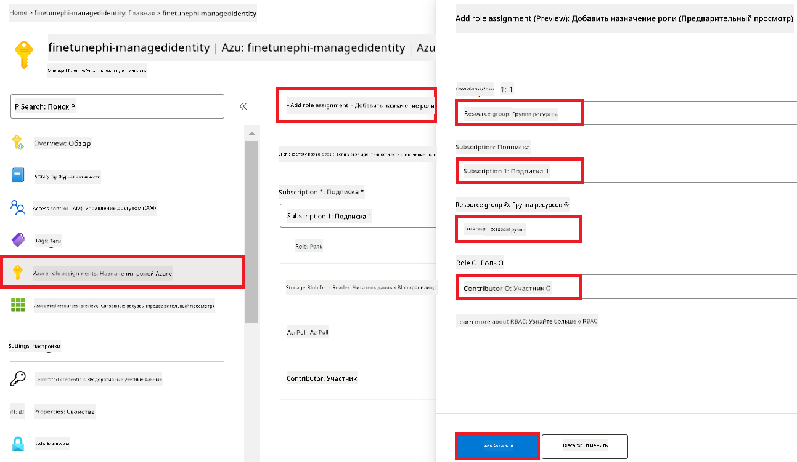
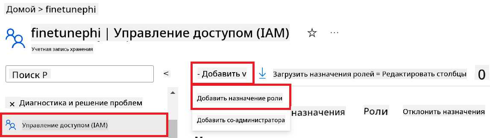
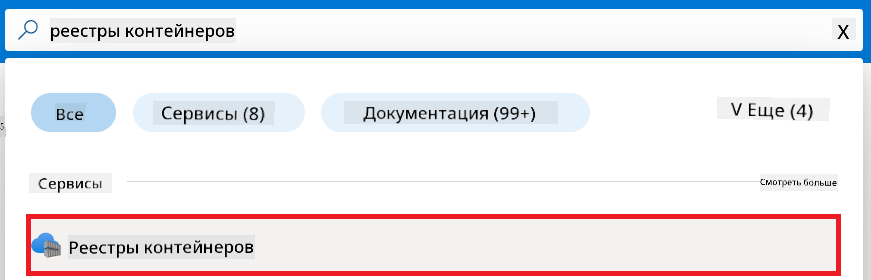

<!--
CO_OP_TRANSLATOR_METADATA:
{
  "original_hash": "455be2b7b9c3390d367d528f8fab2aa0",
  "translation_date": "2025-05-07T14:02:09+00:00",
  "source_file": "md/02.Application/01.TextAndChat/Phi3/E2E_Phi-3-FineTuning_PromptFlow_Integration.md",
  "language_code": "ru"
}
-->
# Тонкая настройка и интеграция кастомных моделей Phi-3 с Prompt flow

Этот пошаговый (E2E) пример основан на руководстве "[Fine-Tune and Integrate Custom Phi-3 Models with Prompt Flow: Step-by-Step Guide](https://techcommunity.microsoft.com/t5/educator-developer-blog/fine-tune-and-integrate-custom-phi-3-models-with-prompt-flow/ba-p/4178612?WT.mc_id=aiml-137032-kinfeylo)" из Microsoft Tech Community. В нем описываются процессы тонкой настройки, развертывания и интеграции кастомных моделей Phi-3 с Prompt flow.

## Обзор

В этом E2E примере вы научитесь тонко настраивать модель Phi-3 и интегрировать её с Prompt flow. Используя Azure Machine Learning и Prompt flow, вы создадите рабочий процесс для развертывания и использования кастомных AI-моделей. Этот пример разделен на три сценария:

**Сценарий 1: Настройка ресурсов Azure и подготовка к тонкой настройке**

**Сценарий 2: Тонкая настройка модели Phi-3 и развертывание в Azure Machine Learning Studio**

**Сценарий 3: Интеграция с Prompt flow и чат с вашей кастомной моделью**

Ниже представлена общая схема этого E2E примера.


### Содержание

1. **[Сценарий 1: Настройка ресурсов Azure и подготовка к тонкой настройке](../../../../../../md/02.Application/01.TextAndChat/Phi3)**
    - [Создание рабочего пространства Azure Machine Learning](../../../../../../md/02.Application/01.TextAndChat/Phi3)
    - [Запрос квот на GPU в подписке Azure](../../../../../../md/02.Application/01.TextAndChat/Phi3)
    - [Добавление назначения роли](../../../../../../md/02.Application/01.TextAndChat/Phi3)
    - [Настройка проекта](../../../../../../md/02.Application/01.TextAndChat/Phi3)
    - [Подготовка набора данных для тонкой настройки](../../../../../../md/02.Application/01.TextAndChat/Phi3)

1. **[Сценарий 2: Тонкая настройка модели Phi-3 и развертывание в Azure Machine Learning Studio](../../../../../../md/02.Application/01.TextAndChat/Phi3)**
    - [Настройка Azure CLI](../../../../../../md/02.Application/01.TextAndChat/Phi3)
    - [Тонкая настройка модели Phi-3](../../../../../../md/02.Application/01.TextAndChat/Phi3)
    - [Развертывание тонко настроенной модели](../../../../../../md/02.Application/01.TextAndChat/Phi3)

1. **[Сценарий 3: Интеграция с Prompt flow и чат с вашей кастомной моделью](../../../../../../md/02.Application/01.TextAndChat/Phi3)**
    - [Интеграция кастомной модели Phi-3 с Prompt flow](../../../../../../md/02.Application/01.TextAndChat/Phi3)
    - [Общение с вашей кастомной моделью](../../../../../../md/02.Application/01.TextAndChat/Phi3)

## Сценарий 1: Настройка ресурсов Azure и подготовка к тонкой настройке

### Создание рабочего пространства Azure Machine Learning

1. Введите *azure machine learning* в **строке поиска** в верхней части портала и выберите **Azure Machine Learning** из появившихся вариантов.

    

1. Выберите **+ Create** в навигационном меню.

1. Выберите **New workspace** в навигационном меню.

    

1. Выполните следующие действия:

    - Выберите вашу подписку Azure (**Subscription**).
    - Выберите **Resource group** для использования (создайте новую, если нужно).
    - Введите уникальное имя для **Workspace Name**.
    - Выберите регион (**Region**), который хотите использовать.
    - Выберите **Storage account** для использования (создайте новый, если нужно).
    - Выберите **Key vault** для использования (создайте новый, если нужно).
    - Выберите **Application insights** для использования (создайте новый, если нужно).
    - Выберите **Container registry** для использования (создайте новый, если нужно).

    

1. Нажмите **Review + Create**.

1. Нажмите **Create**.

### Запрос квот на GPU в подписке Azure

В этом примере для тонкой настройки используется GPU *Standard_NC24ads_A100_v4*, для которого необходимо запросить квоту, а для развертывания — CPU *Standard_E4s_v3*, квота для которого не требуется.

> [!NOTE]
>
> Квоты на GPU доступны только для подписок Pay-As-You-Go (стандартный тип подписки); подписки с бонусами (benefit subscriptions) пока не поддерживаются.
>
> Для пользователей с подписками с бонусами (например, Visual Studio Enterprise Subscription) или для тех, кто хочет быстро протестировать процесс тонкой настройки и развертывания, в этом руководстве также описан способ тонкой настройки с минимальным набором данных на CPU. Однако стоит учитывать, что результаты тонкой настройки значительно лучше при использовании GPU с большими наборами данных.

1. Перейдите на [Azure ML Studio](https://ml.azure.com/home?wt.mc_id=studentamb_279723).

1. Выполните следующие шаги для запроса квоты *Standard NCADSA100v4 Family*:

    - Выберите **Quota** в левой панели.
    - Выберите нужное семейство виртуальных машин. Например, выберите **Standard NCADSA100v4 Family Cluster Dedicated vCPUs**, которое включает GPU *Standard_NC24ads_A100_v4*.
    - Нажмите **Request quota** в навигационном меню.

        

    - На странице запроса квоты введите желаемый **New cores limit**, например, 24.
    - Нажмите **Submit** для отправки запроса на квоту GPU.

> [!NOTE]
> Вы можете выбрать подходящий GPU или CPU, ориентируясь на документ [Sizes for Virtual Machines in Azure](https://learn.microsoft.com/azure/virtual-machines/sizes/overview?tabs=breakdownseries%2Cgeneralsizelist%2Ccomputesizelist%2Cmemorysizelist%2Cstoragesizelist%2Cgpusizelist%2Cfpgasizelist%2Chpcsizelist).

### Добавление назначения роли

Для тонкой настройки и развертывания моделей необходимо создать User Assigned Managed Identity (UAI) и назначить ей соответствующие права. Эта UAI будет использоваться для аутентификации при развертывании.

#### Создание User Assigned Managed Identity (UAI)

1. Введите *managed identities* в **строке поиска** в верхней части портала и выберите **Managed Identities** из появившихся вариантов.

    

1. Нажмите **+ Create**.

    

1. Выполните следующие действия:

    - Выберите вашу подписку Azure (**Subscription**).
    - Выберите **Resource group** для использования (создайте новую, если нужно).
    - Выберите регион (**Region**), который хотите использовать.
    - Введите уникальное имя (**Name**).

1. Нажмите **Review + create**.

1. Нажмите **+ Create**.

#### Добавление роли Contributor для Managed Identity

1. Перейдите к созданному ресурсу Managed Identity.

1. В левой панели выберите **Azure role assignments**.

1. Нажмите **+ Add role assignment** в навигационном меню.

1. На странице добавления роли выполните следующие действия:
    - В поле **Scope** выберите **Resource group**.
    - Выберите вашу подписку Azure (**Subscription**).
    - Выберите **Resource group**.
    - В поле **Role** выберите **Contributor**.

    

1. Нажмите **Save**.

#### Добавление роли Storage Blob Data Reader для Managed Identity

1. Введите *storage accounts* в **строке поиска** в верхней части портала и выберите **Storage accounts** из появившихся вариантов.

    

1. Выберите аккаунт хранения, связанный с вашим рабочим пространством Azure Machine Learning. Например, *finetunephistorage*.

1. Выполните следующие шаги для перехода к странице назначения роли:

    - Перейдите к выбранному аккаунту хранения Azure.
    - Выберите **Access Control (IAM)** в левой панели.
    - Нажмите **+ Add** в навигационном меню.
    - Выберите **Add role assignment**.

    

1. На странице добавления роли выполните следующие действия:

    - В поле поиска ролей введите *Storage Blob Data Reader* и выберите эту роль из списка.
    - Нажмите **Next**.
    - На странице участников выберите **Assign access to** → **Managed identity**.
    - Нажмите **+ Select members**.
    - Выберите вашу подписку Azure (**Subscription**).
    - Выберите **Managed identity** → **Manage Identity**.
    - Выберите созданную вами Managed Identity, например, *finetunephi-managedidentity*.
    - Нажмите **Select**.

    

1. Нажмите **Review + assign**.

#### Добавление роли AcrPull для Managed Identity

1. Введите *container registries* в **строке поиска** в верхней части портала и выберите **Container registries** из появившихся вариантов.

    

1. Выберите реестр контейнеров, связанный с вашим рабочим пространством Azure Machine Learning. Например, *finetunephicontainerregistries*.

1. Выполните следующие шаги для перехода к странице назначения роли:

    - Выберите **Access Control (IAM)** в левой панели.
    - Нажмите **+ Add** в навигационном меню.
    - Выберите **Add role assignment**.

1. На странице добавления роли выполните следующие действия:

    - В поле поиска ролей введите *AcrPull* и выберите эту роль из списка.
    - Нажмите **Next**.
    - На странице участников выберите **Assign access to** → **Managed identity**.
    - Нажмите **+ Select members**.
    - Выберите вашу подписку Azure (**Subscription**).
    - Выберите **Managed identity** → **Manage Identity**.
    - Выберите созданную вами Managed Identity, например, *finetunephi-managedidentity*.
    - Нажмите **Select**.
    - Нажмите **Review + assign**.

### Настройка проекта

Теперь создадим папку для работы и настроим виртуальное окружение для разработки программы, которая будет взаимодействовать с пользователями и использовать сохранённую историю чатов из Azure Cosmos DB для формирования ответов.

#### Создание рабочей папки

1. Откройте терминал и выполните команду для создания папки с именем *finetune-phi* в стандартном пути.

    ```console
    mkdir finetune-phi
    ```

1. В терминале перейдите в созданную папку *finetune-phi*.

    ```console
    cd finetune-phi
    ```

#### Создание виртуального окружения

1. В терминале выполните команду для создания виртуального окружения с именем *.venv*.

    ```console
    python -m venv .venv
    ```

1. Активируйте виртуальное окружение командой:

    ```console
    .venv\Scripts\activate.bat
    ```

> [!NOTE]
>
> Если всё прошло успешно, перед приглашением командной строки появится *(.venv)*.

#### Установка необходимых пакетов

1. В терминале выполните команды для установки требуемых пакетов.

    ```console
    pip install datasets==2.19.1
    pip install transformers==4.41.1
    pip install azure-ai-ml==1.16.0
    pip install torch==2.3.1
    pip install trl==0.9.4
    pip install promptflow==1.12.0
    ```

#### Создание файлов проекта

В этом упражнении вы создадите основные файлы проекта. В них будут скрипты для загрузки набора данных, настройки среды Azure Machine Learning, тонкой настройки модели Phi-3 и развертывания тонко настроенной модели. Также создадите файл *conda.yml* для настройки среды тонкой настройки.

В ходе упражнения вы:

- Создадите файл *download_dataset.py* для загрузки набора данных.
- Создадите файл *setup_ml.py* для настройки среды Azure Machine Learning.
- Создадите файл *fine_tune.py* в папке *finetuning_dir* для тонкой настройки модели Phi-3 с использованием набора данных.
- Создадите файл *conda.yml* для настройки среды тонкой настройки.
- Создадите файл *deploy_model.py* для развертывания тонко настроенной модели.
- Создадите файл *integrate_with_promptflow.py* для интеграции тонко настроенной модели и её запуска через Prompt flow.
- Создадите файл flow.dag.yml для настройки структуры рабочего процесса в Prompt flow.
- Создадите файл *config.py* для ввода информации Azure.

> [!NOTE]
>
> Полная структура папок:
>
> ```text
> └── YourUserName
> .    └── finetune-phi
> .        ├── finetuning_dir
> .        │      └── fine_tune.py
> .        ├── conda.yml
> .        ├── config.py
> .        ├── deploy_model.py
> .        ├── download_dataset.py
> .        ├── flow.dag.yml
> .        ├── integrate_with_promptflow.py
> .        └── setup_ml.py
> ```

1. Откройте **Visual Studio Code**.

1. В меню выберите **File**.

1. Выберите **Open Folder**.

1. Выберите папку *finetune-phi*, которую вы создали, например, по пути *C:\Users\yourUserName\finetune-phi*.

    

1. В левой панели Visual Studio Code кликните правой кнопкой мыши и выберите **New File** для создания файла *download_dataset.py*.

1. Аналогично создайте файлы *setup_ml.py* и *deploy_model.py*.

    

1. В левой панели создайте новую папку *finetuning_dir*.

1. В папке *finetuning_dir* создайте файл *fine_tune.py*.

#### Создание и настройка файла *conda.yml*

1. В левой панели Visual Studio Code создайте новый файл *conda.yml*.

1. Добавьте следующий код в файл *conda.yml* для настройки среды тонкой настройки модели Phi-3.

    ```yml
    name: phi-3-training-env
    channels:
      - defaults
      - conda-forge
    dependencies:
      - python=3.10
      - pip
      - numpy<2.0
      - pip:
          - torch==2.4.0
          - torchvision==0.19.0
          - trl==0.8.6
          - transformers==4.41
          - datasets==2.21.0
          - azureml-core==1.57.0
          - azure-storage-blob==12.19.0
          - azure-ai-ml==1.16
          - azure-identity==1.17.1
          - accelerate==0.33.0
          - mlflow==2.15.1
          - azureml-mlflow==1.57.0
    ```

#### Создание и настройка файла *config.py*

1. В левой панели Visual Studio Code создайте новый файл *config.py*.

1. Добавьте следующий код в файл *config.py* для ввода информации Azure.

    ```python
    # Azure settings
    AZURE_SUBSCRIPTION_ID = "your_subscription_id"
    AZURE_RESOURCE_GROUP_NAME = "your_resource_group_name" # "TestGroup"

    # Azure Machine Learning settings
    AZURE_ML_WORKSPACE_NAME = "your_workspace_name" # "finetunephi-workspace"

    # Azure Managed Identity settings
    AZURE_MANAGED_IDENTITY_CLIENT_ID = "your_azure_managed_identity_client_id"
    AZURE_MANAGED_IDENTITY_NAME = "your_azure_managed_identity_name" # "finetunephi-mangedidentity"
    AZURE_MANAGED_IDENTITY_RESOURCE_ID = f"/subscriptions/{AZURE_SUBSCRIPTION_ID}/resourceGroups/{AZURE_RESOURCE_GROUP_NAME}/providers/Microsoft.ManagedIdentity/userAssignedIdentities/{AZURE_MANAGED_IDENTITY_NAME}"

    # Dataset file paths
    TRAIN_DATA_PATH = "data/train_data.jsonl"
    TEST_DATA_PATH = "data/test_data.jsonl"

    # Fine-tuned model settings
    AZURE_MODEL_NAME = "your_fine_tuned_model_name" # "finetune-phi-model"
    AZURE_ENDPOINT_NAME = "your_fine_tuned_model_endpoint_name" # "finetune-phi-endpoint"
    AZURE_DEPLOYMENT_NAME = "your_fine_tuned_model_deployment_name" # "finetune-phi-deployment"

    AZURE_ML_API_KEY = "your_fine_tuned_model_api_key"
    AZURE_ML_ENDPOINT = "your_fine_tuned_model_endpoint_uri" # "https://{your-endpoint-name}.{your-region}.inference.ml.azure.com/score"
    ```

#### Добавление переменных окружения Azure

1. Выполните следующие действия для добавления ID подписки Azure:

    - Введите *subscriptions* в **строке поиска** в верхней части портала и выберите **Subscriptions** из появившихся вариантов.
    - Выберите используемую подписку Azure.
    - Скопируйте и вставьте ID подписки в файл *config.py*.


1. Выполните следующие действия, чтобы добавить имя Azure Workspace:

    - Перейдите к созданному вами ресурсу Azure Machine Learning.
    - Скопируйте и вставьте имя вашей учетной записи в файл *config.py*.

    

1. Выполните следующие действия, чтобы добавить имя Azure Resource Group:

    - Перейдите к созданному вами ресурсу Azure Machine Learning.
    - Скопируйте и вставьте имя вашей группы ресурсов Azure в файл *config.py*.

    

2. Выполните следующие действия, чтобы добавить имя Azure Managed Identity

    - Перейдите к созданному вами ресурсу Managed Identities.
    - Скопируйте и вставьте имя вашей Azure Managed Identity в файл *config.py*.

    

### Подготовка набора данных для дообучения

В этом упражнении вы запустите файл *download_dataset.py*, чтобы скачать наборы данных *ULTRACHAT_200k* в вашу локальную среду. Затем вы используете эти данные для дообучения модели Phi-3 в Azure Machine Learning.

#### Скачайте набор данных с помощью *download_dataset.py*

1. Откройте файл *download_dataset.py* в Visual Studio Code.

1. Добавьте следующий код в *download_dataset.py*.

    ```python
    import json
    import os
    from datasets import load_dataset
    from config import (
        TRAIN_DATA_PATH,
        TEST_DATA_PATH)

    def load_and_split_dataset(dataset_name, config_name, split_ratio):
        """
        Load and split a dataset.
        """
        # Load the dataset with the specified name, configuration, and split ratio
        dataset = load_dataset(dataset_name, config_name, split=split_ratio)
        print(f"Original dataset size: {len(dataset)}")
        
        # Split the dataset into train and test sets (80% train, 20% test)
        split_dataset = dataset.train_test_split(test_size=0.2)
        print(f"Train dataset size: {len(split_dataset['train'])}")
        print(f"Test dataset size: {len(split_dataset['test'])}")
        
        return split_dataset

    def save_dataset_to_jsonl(dataset, filepath):
        """
        Save a dataset to a JSONL file.
        """
        # Create the directory if it does not exist
        os.makedirs(os.path.dirname(filepath), exist_ok=True)
        
        # Open the file in write mode
        with open(filepath, 'w', encoding='utf-8') as f:
            # Iterate over each record in the dataset
            for record in dataset:
                # Dump the record as a JSON object and write it to the file
                json.dump(record, f)
                # Write a newline character to separate records
                f.write('\n')
        
        print(f"Dataset saved to {filepath}")

    def main():
        """
        Main function to load, split, and save the dataset.
        """
        # Load and split the ULTRACHAT_200k dataset with a specific configuration and split ratio
        dataset = load_and_split_dataset("HuggingFaceH4/ultrachat_200k", 'default', 'train_sft[:1%]')
        
        # Extract the train and test datasets from the split
        train_dataset = dataset['train']
        test_dataset = dataset['test']

        # Save the train dataset to a JSONL file
        save_dataset_to_jsonl(train_dataset, TRAIN_DATA_PATH)
        
        # Save the test dataset to a separate JSONL file
        save_dataset_to_jsonl(test_dataset, TEST_DATA_PATH)

    if __name__ == "__main__":
        main()

    ```

> [!TIP]
>
> **Рекомендации по дообучению с минимальным набором данных на CPU**
>
> Если вы хотите использовать CPU для дообучения, этот способ отлично подходит для пользователей с подписками типа benefit (например, Visual Studio Enterprise Subscription) или для быстрого тестирования процесса дообучения и развертывания.
>
> Замените `dataset = load_and_split_dataset("HuggingFaceH4/ultrachat_200k", 'default', 'train_sft[:1%]')` with `dataset = load_and_split_dataset("HuggingFaceH4/ultrachat_200k", 'default', 'train_sft[:10]')`
>

1. В терминале введите следующую команду, чтобы запустить скрипт и скачать набор данных в локальную среду.

    ```console
    python download_data.py
    ```

1. Убедитесь, что наборы данных успешно сохранились в локальной папке *finetune-phi/data*.

> [!NOTE]
>
> **Размер набора данных и время дообучения**
>
> В этом полном примере используется только 1% набора данных (`train_sft[:1%]`). Это значительно уменьшает объем данных, ускоряя процесс загрузки и дообучения. Вы можете изменить процент, чтобы найти оптимальный баланс между временем обучения и качеством модели. Использование меньшей части данных сокращает время дообучения, делая процесс более удобным для полного примера.

## Сценарий 2: Дообучение модели Phi-3 и развертывание в Azure Machine Learning Studio

### Настройка Azure CLI

Для аутентификации среды необходимо настроить Azure CLI. Azure CLI позволяет управлять ресурсами Azure напрямую из командной строки и предоставляет необходимые учетные данные для доступа Azure Machine Learning к этим ресурсам. Для начала установите [Azure CLI](https://learn.microsoft.com/cli/azure/install-azure-cli)

1. Откройте терминал и введите следующую команду для входа в вашу учетную запись Azure.

    ```console
    az login
    ```

1. Выберите учетную запись Azure, которую хотите использовать.

1. Выберите подписку Azure, которую хотите использовать.

    

> [!TIP]
>
> Если у вас возникают проблемы с входом в Azure, попробуйте использовать код устройства. Откройте терминал и введите следующую команду для входа в вашу учетную запись Azure:
>
> ```console
> az login --use-device-code
> ```
>

### Дообучение модели Phi-3

В этом упражнении вы дообучите модель Phi-3 с использованием предоставленного набора данных. Сначала определите процесс дообучения в файле *fine_tune.py*. Затем настройте среду Azure Machine Learning и запустите процесс дообучения, выполнив файл *setup_ml.py*. Этот скрипт гарантирует, что дообучение произойдет в среде Azure Machine Learning.

Запуская *setup_ml.py*, вы запускаете процесс дообучения в среде Azure Machine Learning.

#### Добавьте код в файл *fine_tune.py*

1. Перейдите в папку *finetuning_dir* и откройте файл *fine_tune.py* в Visual Studio Code.

1. Добавьте следующий код в *fine_tune.py*.

    ```python
    import argparse
    import sys
    import logging
    import os
    from datasets import load_dataset
    import torch
    import mlflow
    from transformers import AutoModelForCausalLM, AutoTokenizer, TrainingArguments
    from trl import SFTTrainer

    # To avoid the INVALID_PARAMETER_VALUE error in MLflow, disable MLflow integration
    os.environ["DISABLE_MLFLOW_INTEGRATION"] = "True"

    # Logging setup
    logging.basicConfig(
        format="%(asctime)s - %(levelname)s - %(name)s - %(message)s",
        datefmt="%Y-%m-%d %H:%M:%S",
        handlers=[logging.StreamHandler(sys.stdout)],
        level=logging.WARNING
    )
    logger = logging.getLogger(__name__)

    def initialize_model_and_tokenizer(model_name, model_kwargs):
        """
        Initialize the model and tokenizer with the given pretrained model name and arguments.
        """
        model = AutoModelForCausalLM.from_pretrained(model_name, **model_kwargs)
        tokenizer = AutoTokenizer.from_pretrained(model_name)
        tokenizer.model_max_length = 2048
        tokenizer.pad_token = tokenizer.unk_token
        tokenizer.pad_token_id = tokenizer.convert_tokens_to_ids(tokenizer.pad_token)
        tokenizer.padding_side = 'right'
        return model, tokenizer

    def apply_chat_template(example, tokenizer):
        """
        Apply a chat template to tokenize messages in the example.
        """
        messages = example["messages"]
        if messages[0]["role"] != "system":
            messages.insert(0, {"role": "system", "content": ""})
        example["text"] = tokenizer.apply_chat_template(
            messages, tokenize=False, add_generation_prompt=False
        )
        return example

    def load_and_preprocess_data(train_filepath, test_filepath, tokenizer):
        """
        Load and preprocess the dataset.
        """
        train_dataset = load_dataset('json', data_files=train_filepath, split='train')
        test_dataset = load_dataset('json', data_files=test_filepath, split='train')
        column_names = list(train_dataset.features)

        train_dataset = train_dataset.map(
            apply_chat_template,
            fn_kwargs={"tokenizer": tokenizer},
            num_proc=10,
            remove_columns=column_names,
            desc="Applying chat template to train dataset",
        )

        test_dataset = test_dataset.map(
            apply_chat_template,
            fn_kwargs={"tokenizer": tokenizer},
            num_proc=10,
            remove_columns=column_names,
            desc="Applying chat template to test dataset",
        )

        return train_dataset, test_dataset

    def train_and_evaluate_model(train_dataset, test_dataset, model, tokenizer, output_dir):
        """
        Train and evaluate the model.
        """
        training_args = TrainingArguments(
            bf16=True,
            do_eval=True,
            output_dir=output_dir,
            eval_strategy="epoch",
            learning_rate=5.0e-06,
            logging_steps=20,
            lr_scheduler_type="cosine",
            num_train_epochs=3,
            overwrite_output_dir=True,
            per_device_eval_batch_size=4,
            per_device_train_batch_size=4,
            remove_unused_columns=True,
            save_steps=500,
            seed=0,
            gradient_checkpointing=True,
            gradient_accumulation_steps=1,
            warmup_ratio=0.2,
        )

        trainer = SFTTrainer(
            model=model,
            args=training_args,
            train_dataset=train_dataset,
            eval_dataset=test_dataset,
            max_seq_length=2048,
            dataset_text_field="text",
            tokenizer=tokenizer,
            packing=True
        )

        train_result = trainer.train()
        trainer.log_metrics("train", train_result.metrics)

        mlflow.transformers.log_model(
            transformers_model={"model": trainer.model, "tokenizer": tokenizer},
            artifact_path=output_dir,
        )

        tokenizer.padding_side = 'left'
        eval_metrics = trainer.evaluate()
        eval_metrics["eval_samples"] = len(test_dataset)
        trainer.log_metrics("eval", eval_metrics)

    def main(train_file, eval_file, model_output_dir):
        """
        Main function to fine-tune the model.
        """
        model_kwargs = {
            "use_cache": False,
            "trust_remote_code": True,
            "torch_dtype": torch.bfloat16,
            "device_map": None,
            "attn_implementation": "eager"
        }

        # pretrained_model_name = "microsoft/Phi-3-mini-4k-instruct"
        pretrained_model_name = "microsoft/Phi-3.5-mini-instruct"

        with mlflow.start_run():
            model, tokenizer = initialize_model_and_tokenizer(pretrained_model_name, model_kwargs)
            train_dataset, test_dataset = load_and_preprocess_data(train_file, eval_file, tokenizer)
            train_and_evaluate_model(train_dataset, test_dataset, model, tokenizer, model_output_dir)

    if __name__ == "__main__":
        parser = argparse.ArgumentParser()
        parser.add_argument("--train-file", type=str, required=True, help="Path to the training data")
        parser.add_argument("--eval-file", type=str, required=True, help="Path to the evaluation data")
        parser.add_argument("--model_output_dir", type=str, required=True, help="Directory to save the fine-tuned model")
        args = parser.parse_args()
        main(args.train_file, args.eval_file, args.model_output_dir)

    ```

1. Сохраните и закройте файл *fine_tune.py*.

> [!TIP]
> **Вы можете дообучить модель Phi-3.5**
>
> В файле *fine_tune.py* вы можете изменить поле `pretrained_model_name` from `"microsoft/Phi-3-mini-4k-instruct"` to any model you want to fine-tune. For example, if you change it to `"microsoft/Phi-3.5-mini-instruct"`, you'll be using the Phi-3.5-mini-instruct model for fine-tuning. To find and use the model name you prefer, visit [Hugging Face](https://huggingface.co/), search for the model you're interested in, and then copy and paste its name into the `pretrained_model_name` в вашем скрипте.
>
> :::image type="content" source="../../imgs/03/FineTuning-PromptFlow/finetunephi3.5.png" alt-text="Дообучение Phi-3.5.":::
>

#### Добавьте код в файл *setup_ml.py*

1. Откройте файл *setup_ml.py* в Visual Studio Code.

1. Добавьте следующий код в *setup_ml.py*.

    ```python
    import logging
    from azure.ai.ml import MLClient, command, Input
    from azure.ai.ml.entities import Environment, AmlCompute
    from azure.identity import AzureCliCredential
    from config import (
        AZURE_SUBSCRIPTION_ID,
        AZURE_RESOURCE_GROUP_NAME,
        AZURE_ML_WORKSPACE_NAME,
        TRAIN_DATA_PATH,
        TEST_DATA_PATH
    )

    # Constants

    # Uncomment the following lines to use a CPU instance for training
    # COMPUTE_INSTANCE_TYPE = "Standard_E16s_v3" # cpu
    # COMPUTE_NAME = "cpu-e16s-v3"
    # DOCKER_IMAGE_NAME = "mcr.microsoft.com/azureml/openmpi4.1.0-ubuntu20.04:latest"

    # Uncomment the following lines to use a GPU instance for training
    COMPUTE_INSTANCE_TYPE = "Standard_NC24ads_A100_v4"
    COMPUTE_NAME = "gpu-nc24s-a100-v4"
    DOCKER_IMAGE_NAME = "mcr.microsoft.com/azureml/curated/acft-hf-nlp-gpu:59"

    CONDA_FILE = "conda.yml"
    LOCATION = "eastus2" # Replace with the location of your compute cluster
    FINETUNING_DIR = "./finetuning_dir" # Path to the fine-tuning script
    TRAINING_ENV_NAME = "phi-3-training-environment" # Name of the training environment
    MODEL_OUTPUT_DIR = "./model_output" # Path to the model output directory in azure ml

    # Logging setup to track the process
    logger = logging.getLogger(__name__)
    logging.basicConfig(
        format="%(asctime)s - %(levelname)s - %(name)s - %(message)s",
        datefmt="%Y-%m-%d %H:%M:%S",
        level=logging.WARNING
    )

    def get_ml_client():
        """
        Initialize the ML Client using Azure CLI credentials.
        """
        credential = AzureCliCredential()
        return MLClient(credential, AZURE_SUBSCRIPTION_ID, AZURE_RESOURCE_GROUP_NAME, AZURE_ML_WORKSPACE_NAME)

    def create_or_get_environment(ml_client):
        """
        Create or update the training environment in Azure ML.
        """
        env = Environment(
            image=DOCKER_IMAGE_NAME,  # Docker image for the environment
            conda_file=CONDA_FILE,  # Conda environment file
            name=TRAINING_ENV_NAME,  # Name of the environment
        )
        return ml_client.environments.create_or_update(env)

    def create_or_get_compute_cluster(ml_client, compute_name, COMPUTE_INSTANCE_TYPE, location):
        """
        Create or update the compute cluster in Azure ML.
        """
        try:
            compute_cluster = ml_client.compute.get(compute_name)
            logger.info(f"Compute cluster '{compute_name}' already exists. Reusing it for the current run.")
        except Exception:
            logger.info(f"Compute cluster '{compute_name}' does not exist. Creating a new one with size {COMPUTE_INSTANCE_TYPE}.")
            compute_cluster = AmlCompute(
                name=compute_name,
                size=COMPUTE_INSTANCE_TYPE,
                location=location,
                tier="Dedicated",  # Tier of the compute cluster
                min_instances=0,  # Minimum number of instances
                max_instances=1  # Maximum number of instances
            )
            ml_client.compute.begin_create_or_update(compute_cluster).wait()  # Wait for the cluster to be created
        return compute_cluster

    def create_fine_tuning_job(env, compute_name):
        """
        Set up the fine-tuning job in Azure ML.
        """
        return command(
            code=FINETUNING_DIR,  # Path to fine_tune.py
            command=(
                "python fine_tune.py "
                "--train-file ${{inputs.train_file}} "
                "--eval-file ${{inputs.eval_file}} "
                "--model_output_dir ${{inputs.model_output}}"
            ),
            environment=env,  # Training environment
            compute=compute_name,  # Compute cluster to use
            inputs={
                "train_file": Input(type="uri_file", path=TRAIN_DATA_PATH),  # Path to the training data file
                "eval_file": Input(type="uri_file", path=TEST_DATA_PATH),  # Path to the evaluation data file
                "model_output": MODEL_OUTPUT_DIR
            }
        )

    def main():
        """
        Main function to set up and run the fine-tuning job in Azure ML.
        """
        # Initialize ML Client
        ml_client = get_ml_client()

        # Create Environment
        env = create_or_get_environment(ml_client)
        
        # Create or get existing compute cluster
        create_or_get_compute_cluster(ml_client, COMPUTE_NAME, COMPUTE_INSTANCE_TYPE, LOCATION)

        # Create and Submit Fine-Tuning Job
        job = create_fine_tuning_job(env, COMPUTE_NAME)
        returned_job = ml_client.jobs.create_or_update(job)  # Submit the job
        ml_client.jobs.stream(returned_job.name)  # Stream the job logs
        
        # Capture the job name
        job_name = returned_job.name
        print(f"Job name: {job_name}")

    if __name__ == "__main__":
        main()

    ```

1. Замените `COMPUTE_INSTANCE_TYPE`, `COMPUTE_NAME`, and `LOCATION` на ваши конкретные данные.

    ```python
   # Uncomment the following lines to use a GPU instance for training
    COMPUTE_INSTANCE_TYPE = "Standard_NC24ads_A100_v4"
    COMPUTE_NAME = "gpu-nc24s-a100-v4"
    ...
    LOCATION = "eastus2" # Replace with the location of your compute cluster
    ```

> [!TIP]
>
> **Рекомендации по дообучению с минимальным набором данных на CPU**
>
> Если вы хотите использовать CPU для дообучения, этот способ отлично подходит для пользователей с подписками типа benefit (например, Visual Studio Enterprise Subscription) или для быстрого тестирования процесса дообучения и развертывания.
>
> 1. Откройте файл *setup_ml*.
> 1. Замените `COMPUTE_INSTANCE_TYPE`, `COMPUTE_NAME`, and `DOCKER_IMAGE_NAME` with the following. If you do not have access to *Standard_E16s_v3*, you can use an equivalent CPU instance or request a new quota.
> 1. Replace `LOCATION` на ваши конкретные данные.
>
>    ```python
>    # Uncomment the following lines to use a CPU instance for training
>    COMPUTE_INSTANCE_TYPE = "Standard_E16s_v3" # cpu
>    COMPUTE_NAME = "cpu-e16s-v3"
>    DOCKER_IMAGE_NAME = "mcr.microsoft.com/azureml/openmpi4.1.0-ubuntu20.04:latest"
>    LOCATION = "eastus2" # Replace with the location of your compute cluster
>    ```
>

1. Введите следующую команду, чтобы запустить скрипт *setup_ml.py* и начать процесс дообучения в Azure Machine Learning.

    ```python
    python setup_ml.py
    ```

1. В этом упражнении вы успешно дообучили модель Phi-3 с помощью Azure Machine Learning. Запустив скрипт *setup_ml.py*, вы настроили среду Azure Machine Learning и инициировали процесс дообучения, определенный в файле *fine_tune.py*. Обратите внимание, что дообучение может занять значительное время. После запуска `python setup_ml.py` command, you need to wait for the process to complete. You can monitor the status of the fine-tuning job by following the link provided in the terminal to the Azure Machine Learning portal.

    

### Deploy the fine-tuned model

To integrate the fine-tuned Phi-3 model with Prompt Flow, you need to deploy the model to make it accessible for real-time inference. This process involves registering the model, creating an online endpoint, and deploying the model.

#### Set the model name, endpoint name, and deployment name for deployment

1. Open *config.py* file.

1. Replace `AZURE_MODEL_NAME = "your_fine_tuned_model_name"` with the desired name for your model.

1. Replace `AZURE_ENDPOINT_NAME = "your_fine_tuned_model_endpoint_name"` with the desired name for your endpoint.

1. Replace `AZURE_DEPLOYMENT_NAME = "your_fine_tuned_model_deployment_name"` укажите желаемое имя для вашего развертывания.

#### Добавьте код в файл *deploy_model.py*

Запуск файла *deploy_model.py* автоматизирует весь процесс развертывания. Он регистрирует модель, создает конечную точку и выполняет развертывание на основе настроек, указанных в файле config.py, включая имя модели, имя конечной точки и имя развертывания.

1. Откройте файл *deploy_model.py* в Visual Studio Code.

1. Добавьте следующий код в *deploy_model.py*.

    ```python
    import logging
    from azure.identity import AzureCliCredential
    from azure.ai.ml import MLClient
    from azure.ai.ml.entities import Model, ProbeSettings, ManagedOnlineEndpoint, ManagedOnlineDeployment, IdentityConfiguration, ManagedIdentityConfiguration, OnlineRequestSettings
    from azure.ai.ml.constants import AssetTypes

    # Configuration imports
    from config import (
        AZURE_SUBSCRIPTION_ID,
        AZURE_RESOURCE_GROUP_NAME,
        AZURE_ML_WORKSPACE_NAME,
        AZURE_MANAGED_IDENTITY_RESOURCE_ID,
        AZURE_MANAGED_IDENTITY_CLIENT_ID,
        AZURE_MODEL_NAME,
        AZURE_ENDPOINT_NAME,
        AZURE_DEPLOYMENT_NAME
    )

    # Constants
    JOB_NAME = "your-job-name"
    COMPUTE_INSTANCE_TYPE = "Standard_E4s_v3"

    deployment_env_vars = {
        "SUBSCRIPTION_ID": AZURE_SUBSCRIPTION_ID,
        "RESOURCE_GROUP_NAME": AZURE_RESOURCE_GROUP_NAME,
        "UAI_CLIENT_ID": AZURE_MANAGED_IDENTITY_CLIENT_ID,
    }

    # Logging setup
    logging.basicConfig(
        format="%(asctime)s - %(levelname)s - %(name)s - %(message)s",
        datefmt="%Y-%m-%d %H:%M:%S",
        level=logging.DEBUG
    )
    logger = logging.getLogger(__name__)

    def get_ml_client():
        """Initialize and return the ML Client."""
        credential = AzureCliCredential()
        return MLClient(credential, AZURE_SUBSCRIPTION_ID, AZURE_RESOURCE_GROUP_NAME, AZURE_ML_WORKSPACE_NAME)

    def register_model(ml_client, model_name, job_name):
        """Register a new model."""
        model_path = f"azureml://jobs/{job_name}/outputs/artifacts/paths/model_output"
        logger.info(f"Registering model {model_name} from job {job_name} at path {model_path}.")
        run_model = Model(
            path=model_path,
            name=model_name,
            description="Model created from run.",
            type=AssetTypes.MLFLOW_MODEL,
        )
        model = ml_client.models.create_or_update(run_model)
        logger.info(f"Registered model ID: {model.id}")
        return model

    def delete_existing_endpoint(ml_client, endpoint_name):
        """Delete existing endpoint if it exists."""
        try:
            endpoint_result = ml_client.online_endpoints.get(name=endpoint_name)
            logger.info(f"Deleting existing endpoint {endpoint_name}.")
            ml_client.online_endpoints.begin_delete(name=endpoint_name).result()
            logger.info(f"Deleted existing endpoint {endpoint_name}.")
        except Exception as e:
            logger.info(f"No existing endpoint {endpoint_name} found to delete: {e}")

    def create_or_update_endpoint(ml_client, endpoint_name, description=""):
        """Create or update an endpoint."""
        delete_existing_endpoint(ml_client, endpoint_name)
        logger.info(f"Creating new endpoint {endpoint_name}.")
        endpoint = ManagedOnlineEndpoint(
            name=endpoint_name,
            description=description,
            identity=IdentityConfiguration(
                type="user_assigned",
                user_assigned_identities=[ManagedIdentityConfiguration(resource_id=AZURE_MANAGED_IDENTITY_RESOURCE_ID)]
            )
        )
        endpoint_result = ml_client.online_endpoints.begin_create_or_update(endpoint).result()
        logger.info(f"Created new endpoint {endpoint_name}.")
        return endpoint_result

    def create_or_update_deployment(ml_client, endpoint_name, deployment_name, model):
        """Create or update a deployment."""

        logger.info(f"Creating deployment {deployment_name} for endpoint {endpoint_name}.")
        deployment = ManagedOnlineDeployment(
            name=deployment_name,
            endpoint_name=endpoint_name,
            model=model.id,
            instance_type=COMPUTE_INSTANCE_TYPE,
            instance_count=1,
            environment_variables=deployment_env_vars,
            request_settings=OnlineRequestSettings(
                max_concurrent_requests_per_instance=3,
                request_timeout_ms=180000,
                max_queue_wait_ms=120000
            ),
            liveness_probe=ProbeSettings(
                failure_threshold=30,
                success_threshold=1,
                period=100,
                initial_delay=500,
            ),
            readiness_probe=ProbeSettings(
                failure_threshold=30,
                success_threshold=1,
                period=100,
                initial_delay=500,
            ),
        )
        deployment_result = ml_client.online_deployments.begin_create_or_update(deployment).result()
        logger.info(f"Created deployment {deployment.name} for endpoint {endpoint_name}.")
        return deployment_result

    def set_traffic_to_deployment(ml_client, endpoint_name, deployment_name):
        """Set traffic to the specified deployment."""
        try:
            # Fetch the current endpoint details
            endpoint = ml_client.online_endpoints.get(name=endpoint_name)
            
            # Log the current traffic allocation for debugging
            logger.info(f"Current traffic allocation: {endpoint.traffic}")
            
            # Set the traffic allocation for the deployment
            endpoint.traffic = {deployment_name: 100}
            
            # Update the endpoint with the new traffic allocation
            endpoint_poller = ml_client.online_endpoints.begin_create_or_update(endpoint)
            updated_endpoint = endpoint_poller.result()
            
            # Log the updated traffic allocation for debugging
            logger.info(f"Updated traffic allocation: {updated_endpoint.traffic}")
            logger.info(f"Set traffic to deployment {deployment_name} at endpoint {endpoint_name}.")
            return updated_endpoint
        except Exception as e:
            # Log any errors that occur during the process
            logger.error(f"Failed to set traffic to deployment: {e}")
            raise


    def main():
        ml_client = get_ml_client()

        registered_model = register_model(ml_client, AZURE_MODEL_NAME, JOB_NAME)
        logger.info(f"Registered model ID: {registered_model.id}")

        endpoint = create_or_update_endpoint(ml_client, AZURE_ENDPOINT_NAME, "Endpoint for finetuned Phi-3 model")
        logger.info(f"Endpoint {AZURE_ENDPOINT_NAME} is ready.")

        try:
            deployment = create_or_update_deployment(ml_client, AZURE_ENDPOINT_NAME, AZURE_DEPLOYMENT_NAME, registered_model)
            logger.info(f"Deployment {AZURE_DEPLOYMENT_NAME} is created for endpoint {AZURE_ENDPOINT_NAME}.")

            set_traffic_to_deployment(ml_client, AZURE_ENDPOINT_NAME, AZURE_DEPLOYMENT_NAME)
            logger.info(f"Traffic is set to deployment {AZURE_DEPLOYMENT_NAME} at endpoint {AZURE_ENDPOINT_NAME}.")
        except Exception as e:
            logger.error(f"Failed to create or update deployment: {e}")

    if __name__ == "__main__":
        main()

    ```

1. Выполните следующие действия, чтобы получить `JOB_NAME`:

    - Navigate to Azure Machine Learning resource that you created.
    - Select **Studio web URL** to open the Azure Machine Learning workspace.
    - Select **Jobs** from the left side tab.
    - Select the experiment for fine-tuning. For example, *finetunephi*.
    - Select the job that you created.
    - Copy and paste your job Name into the `JOB_NAME = "your-job-name"` in *deploy_model.py* file.

1. Replace `COMPUTE_INSTANCE_TYPE` с вашими конкретными данными.

1. Введите следующую команду, чтобы запустить скрипт *deploy_model.py* и начать процесс развертывания в Azure Machine Learning.

    ```python
    python deploy_model.py
    ```

> [!WARNING]
> Чтобы избежать дополнительных затрат на ваш аккаунт, обязательно удалите созданную конечную точку в рабочей области Azure Machine Learning.
>

#### Проверьте статус развертывания в рабочей области Azure Machine Learning

1. Перейдите на [Azure ML Studio](https://ml.azure.com/home?wt.mc_id=studentamb_279723).

1. Перейдите в созданную вами рабочую область Azure Machine Learning.

1. Выберите **Studio web URL**, чтобы открыть рабочую область Azure Machine Learning.

1. Выберите **Endpoints** в левой панели.

    

2. Выберите конечную точку, которую вы создали.

    

3. На этой странице вы можете управлять конечными точками, созданными в процессе развертывания.

## Сценарий 3: Интеграция с Prompt flow и чат с вашей кастомной моделью

### Интеграция кастомной модели Phi-3 с Prompt flow

После успешного развертывания дообученной модели вы можете интегрировать её с Prompt flow для использования в приложениях в реальном времени, что открывает возможности для различных интерактивных задач с вашей кастомной моделью Phi-3.

#### Установите api ключ и URI конечной точки дообученной модели Phi-3

1. Перейдите в созданную вами рабочую область Azure Machine Learning.
1. Выберите **Endpoints** в левой панели.
1. Выберите конечную точку, которую вы создали.
1. Выберите **Consume** в навигационном меню.
1. Скопируйте и вставьте ваш **REST endpoint** в файл *config.py*, заменив `AZURE_ML_ENDPOINT = "your_fine_tuned_model_endpoint_uri"` with your **REST endpoint**.
1. Copy and paste your **Primary key** into the *config.py* file, replacing `AZURE_ML_API_KEY = "your_fine_tuned_model_api_key"` на ваши **Primary key**.

    

#### Добавьте код в файл *flow.dag.yml*

1. Откройте файл *flow.dag.yml* в Visual Studio Code.

1. Добавьте следующий код в *flow.dag.yml*.

    ```yml
    inputs:
      input_data:
        type: string
        default: "Who founded Microsoft?"

    outputs:
      answer:
        type: string
        reference: ${integrate_with_promptflow.output}

    nodes:
    - name: integrate_with_promptflow
      type: python
      source:
        type: code
        path: integrate_with_promptflow.py
      inputs:
        input_data: ${inputs.input_data}
    ```

#### Добавьте код в файл *integrate_with_promptflow.py*

1. Откройте файл *integrate_with_promptflow.py* в Visual Studio Code.

1. Добавьте следующий код в *integrate_with_promptflow.py*.

    ```python
    import logging
    import requests
    from promptflow.core import tool
    import asyncio
    import platform
    from config import (
        AZURE_ML_ENDPOINT,
        AZURE_ML_API_KEY
    )

    # Logging setup
    logging.basicConfig(
        format="%(asctime)s - %(levelname)s - %(name)s - %(message)s",
        datefmt="%Y-%m-%d %H:%M:%S",
        level=logging.DEBUG
    )
    logger = logging.getLogger(__name__)

    def query_azml_endpoint(input_data: list, endpoint_url: str, api_key: str) -> str:
        """
        Send a request to the Azure ML endpoint with the given input data.
        """
        headers = {
            "Content-Type": "application/json",
            "Authorization": f"Bearer {api_key}"
        }
        data = {
            "input_data": [input_data],
            "params": {
                "temperature": 0.7,
                "max_new_tokens": 128,
                "do_sample": True,
                "return_full_text": True
            }
        }
        try:
            response = requests.post(endpoint_url, json=data, headers=headers)
            response.raise_for_status()
            result = response.json()[0]
            logger.info("Successfully received response from Azure ML Endpoint.")
            return result
        except requests.exceptions.RequestException as e:
            logger.error(f"Error querying Azure ML Endpoint: {e}")
            raise

    def setup_asyncio_policy():
        """
        Setup asyncio event loop policy for Windows.
        """
        if platform.system() == 'Windows':
            asyncio.set_event_loop_policy(asyncio.WindowsSelectorEventLoopPolicy())
            logger.info("Set Windows asyncio event loop policy.")

    @tool
    def my_python_tool(input_data: str) -> str:
        """
        Tool function to process input data and query the Azure ML endpoint.
        """
        setup_asyncio_policy()
        return query_azml_endpoint(input_data, AZURE_ML_ENDPOINT, AZURE_ML_API_KEY)

    ```

### Общение с вашей кастомной моделью

1. Введите следующую команду, чтобы запустить скрипт *deploy_model.py* и начать процесс развертывания в Azure Machine Learning.

    ```python
    pf flow serve --source ./ --port 8080 --host localhost
    ```

1. Вот пример результата: теперь вы можете общаться с вашей кастомной моделью Phi-3. Рекомендуется задавать вопросы на основе данных, использованных для дообучения.

    

**Отказ от ответственности**:  
Этот документ был переведен с помощью сервиса автоматического перевода [Co-op Translator](https://github.com/Azure/co-op-translator). Несмотря на наши усилия по обеспечению точности, просим учитывать, что автоматический перевод может содержать ошибки или неточности. Оригинальный документ на его родном языке следует считать авторитетным источником. Для получения критически важной информации рекомендуется использовать профессиональный перевод, выполненный человеком. Мы не несем ответственности за любые недоразумения или неправильные толкования, возникшие в результате использования данного перевода.