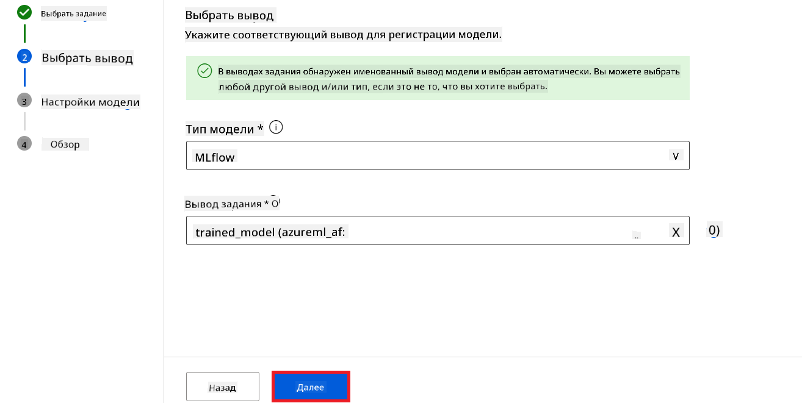
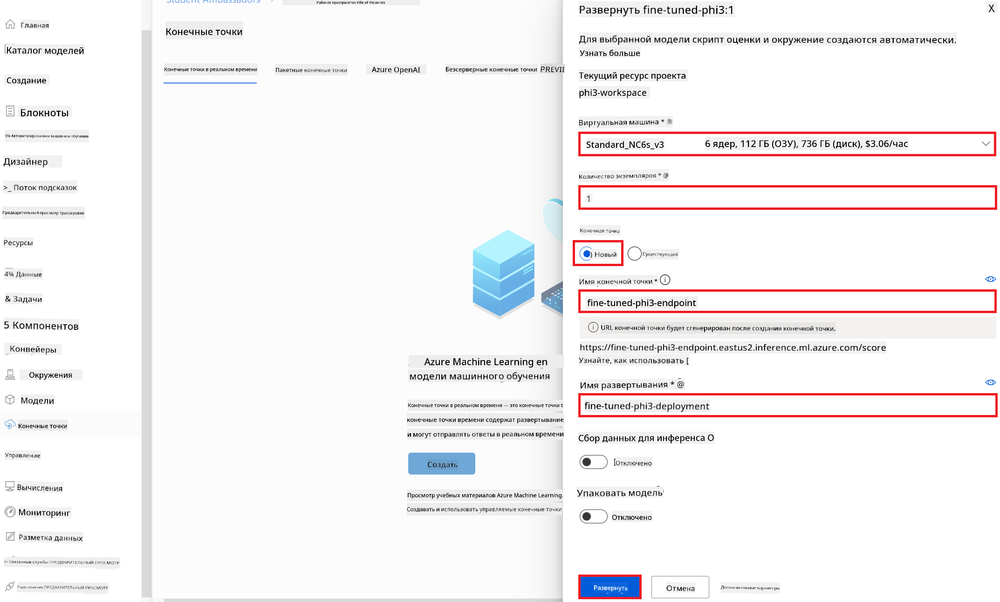

<!--
CO_OP_TRANSLATOR_METADATA:
{
  "original_hash": "0df910a227098303cc392b6ad204c271",
  "translation_date": "2026-01-06T04:08:39+00:00",
  "source_file": "md/02.Application/01.TextAndChat/Phi3/E2E_Phi-3-FineTuning_PromptFlow_Integration_AIFoundry.md",
  "language_code": "ru"
}
-->
# Тонкая настройка и интеграция пользовательских моделей Phi-3 с использованием Prompt flow в Azure AI Foundry

Этот полный пример (E2E) основан на руководстве "[Тонкая настройка и интеграция пользовательских моделей Phi-3 с Prompt Flow в Azure AI Foundry](https://techcommunity.microsoft.com/t5/educator-developer-blog/fine-tune-and-integrate-custom-phi-3-models-with-prompt-flow-in/ba-p/4191726?WT.mc_id=aiml-137032-kinfeylo)" из сообщества Microsoft Tech Community. В нем представлены процессы тонкой настройки, развертывания и интеграции пользовательских моделей Phi-3 с Prompt flow в Azure AI Foundry.
В отличие от примера E2E, "[Тонкая настройка и интеграция пользовательских моделей Phi-3 с Prompt Flow](./E2E_Phi-3-FineTuning_PromptFlow_Integration.md)", который предполагал запуск кода локально, этот учебник полностью сосредоточен на тонкой настройке и интеграции вашей модели в Azure AI / ML Studio.

## Обзор

В этом примере E2E вы научитесь тонко настраивать модель Phi-3 и интегрировать ее с Prompt flow в Azure AI Foundry. Используя Azure AI / ML Studio, вы создадите рабочий процесс для развертывания и использования пользовательских AI-моделей. Этот пример E2E разделен на три сценария:

**Сценарий 1: Настройка ресурсов Azure и подготовка к тонкой настройке**

**Сценарий 2: Тонкая настройка модели Phi-3 и развертывание в Azure Machine Learning Studio**

**Сценарий 3: Интеграция с Prompt flow и общение с вашей пользовательской моделью в Azure AI Foundry**

Вот обзор этого примера E2E.


### Содержание

1. **[Сценарий 1: Настройка ресурсов Azure и подготовка к тонкой настройке](../../../../../../md/02.Application/01.TextAndChat/Phi3)**
    - [Создание рабочей области Azure Machine Learning](../../../../../../md/02.Application/01.TextAndChat/Phi3)
    - [Запрос квот GPU в подписке Azure](../../../../../../md/02.Application/01.TextAndChat/Phi3)
    - [Добавление назначения роли](../../../../../../md/02.Application/01.TextAndChat/Phi3)
    - [Настройка проекта](../../../../../../md/02.Application/01.TextAndChat/Phi3)
    - [Подготовка набора данных для тонкой настройки](../../../../../../md/02.Application/01.TextAndChat/Phi3)

1. **[Сценарий 2: Тонкая настройка модели Phi-3 и развертывание в Azure Machine Learning Studio](../../../../../../md/02.Application/01.TextAndChat/Phi3)**
    - [Тонкая настройка модели Phi-3](../../../../../../md/02.Application/01.TextAndChat/Phi3)
    - [Развертывание тонко настроенной модели Phi-3](../../../../../../md/02.Application/01.TextAndChat/Phi3)

1. **[Сценарий 3: Интеграция с Prompt flow и общение с вашей пользовательской моделью в Azure AI Foundry](../../../../../../md/02.Application/01.TextAndChat/Phi3)**
    - [Интеграция пользовательской модели Phi-3 с Prompt flow](../../../../../../md/02.Application/01.TextAndChat/Phi3)
    - [Общение с вашей пользовательской моделью Phi-3](../../../../../../md/02.Application/01.TextAndChat/Phi3)

## Сценарий 1: Настройка ресурсов Azure и подготовка к тонкой настройке

### Создание рабочей области Azure Machine Learning

1. Введите *azure machine learning* в **строке поиска** в верхней части страницы портала и выберите **Azure Machine Learning** из появившихся вариантов.

    

2. Выберите **+ Создать** в навигационном меню.

3. Выберите **Новая рабочая область** в навигационном меню.

    

4. Выполните следующие действия:

    - Выберите вашу подписку Azure **Subscription**.
    - Выберите **Группу ресурсов** для использования (создайте новую при необходимости).
    - Введите название рабочей области **Workspace Name**. Оно должно быть уникальным.
    - Выберите регион **Region**, который вы хотите использовать.
    - Выберите **Учетную запись хранения** (Storage account) для использования (создайте новую при необходимости).
    - Выберите **Key vault** для использования (создайте новый при необходимости).
    - Выберите **Application insights** для использования (создайте новый при необходимости).
    - Выберите **Container registry** для использования (создайте новый при необходимости).

    

5. Выберите **Проверить + создать**.

6. Выберите **Создать**.

### Запрос квот GPU в подписке Azure

В этом учебнике вы научитесь тонко настраивать и разворачивать модель Phi-3 с использованием GPU. Для тонкой настройки вы будете использовать GPU *Standard_NC24ads_A100_v4*, для которого требуется запрос квоты. Для развертывания вы будете использовать GPU *Standard_NC6s_v3*, который также требует запроса квоты.

> [!NOTE]
>
> Только подписки Pay-As-You-Go (стандартный тип подписки) имеют право на выделение GPU; бенефитные подписки пока не поддерживаются.
>

1. Перейдите на [Azure ML Studio](https://ml.azure.com/home?wt.mc_id=studentamb_279723).

1. Выполните следующие действия, чтобы запросить квоту *Standard NCADSA100v4 Family*:

    - Выберите **Квоты (Quota)** в левой вкладке.
    - Выберите нужное семейство виртуальных машин. Например, выберите **Standard NCADSA100v4 Family Cluster Dedicated vCPUs**, включающее GPU *Standard_NC24ads_A100_v4*.
    - Выберите **Запросить квоту (Request quota)** в меню навигации.

        

    - На странице запроса квоты введите **Новый лимит ядер** (New cores limit), который вы хотите использовать. Например, 24.
    - На странице запроса квоты нажмите **Отправить (Submit)**, чтобы запросить квоту GPU.

1. Выполните следующие действия, чтобы запросить квоту *Standard NCSv3 Family*:

    - Выберите **Квоты (Quota)** в левой вкладке.
    - Выберите нужное семейство виртуальных машин. Например, выберите **Standard NCSv3 Family Cluster Dedicated vCPUs**, включающее GPU *Standard_NC6s_v3*.
    - Выберите **Запросить квоту (Request quota)** в меню навигации.
    - На странице запроса квоты укажите **Новый лимит ядер** (New cores limit). Например, 24.
    - Нажмите **Отправить (Submit)** для запроса квоты GPU.

### Добавление назначения роли

Для тонкой настройки и развертывания моделей вы должны сначала создать "Управляемую личность пользователя" (User Assigned Managed Identity, UAI) и назначить ей необходимые разрешения. Эта UAI будет использоваться для аутентификации во время развертывания.

#### Создание User Assigned Managed Identity (UAI)

1. Введите *управляемые идентичности* в **строке поиска** в верхней части портала и выберите **Managed Identities** из появившихся вариантов.

    

1. Выберите **+ Создать (Create)**.

    

1. Выполните следующие действия:

    - Выберите вашу подписку Azure **Subscription**.
    - Выберите **Группу ресурсов** для использования (создайте новую при необходимости).
    - Выберите регион **Region**, который хотите использовать.
    - Введите название **Name**. Оно должно быть уникальным.

    

1. Нажмите **Проверить + создать (Review + create)**.

1. Нажмите **+ Создать (Create)**.

#### Назначение роли "Contributor" для управляемой личности

1. Перейдите к ресурсу управляемой личности, который вы создали.

1. Выберите **Назначения ролей Azure (Azure role assignments)** в левой вкладке.

1. Выберите **+ Добавить назначение роли (+Add role assignment)** в меню навигации.

1. На странице добавления назначения роли выполните следующие действия:
    - Установите **Область (Scope)** на **Группа ресурсов (Resource group)**.
    - Выберите вашу подписку Azure **Subscription**.
    - Выберите **Группу ресурсов (Resource group)**.
    - Выберите роль **Contributor**.

    

2. Нажмите **Сохранить (Save)**.

#### Назначение роли Storage Blob Data Reader для управляемой личности

1. Введите *учетные записи хранения* в **строке поиска** в верхней части портала и выберите **Storage accounts** из появившихся вариантов.

    

1. Выберите учетную запись хранения, связанную с рабочей областью Azure Machine Learning, которую вы создали. Например, *finetunephistorage*.

1. Выполните следующие действия, чтобы перейти на страницу добавления назначения роли:

    - Перейдите к созданной учетной записи хранения Azure.
    - Выберите **Управление доступом (IAM)** в левой вкладке.
    - Нажмите **+ Добавить** в меню навигации.
    - Выберите **Добавить назначение роли (Add role assignment)**.

    

1. На странице добавления назначения роли выполните следующие действия:

    - Введите в поле поиска *Storage Blob Data Reader* и выберите **Storage Blob Data Reader** из появившихся вариантов.
    - Нажмите **Далее (Next)**.
    - В разделе "Участники" выберите **Назначить доступ для (Assign access to)** **Managed identity**.
    - Нажмите **+ Выбрать участников (+ Select members)**.
    - Выберите вашу подписку Azure **Subscription**.
    - Выберите управляемую личность **Managed identity**.
    - Выберите управляемую личность, которую вы создали, например, *finetunephi-managedidentity*.
    - Нажмите **Выбрать (Select)**.

    

1. Нажмите **Проверить + назначить (Review + assign)**.

#### Назначение роли AcrPull для управляемой личности

1. Введите *реестры контейнеров* в **строке поиска** в верхней части портала и выберите **Container registries** из появившихся вариантов.

    

1. Выберите реестр контейнеров, связанный с рабочей областью Azure Machine Learning. Например, *finetunephicontainerregistry*.

1. Выполните следующие действия, чтобы перейти на страницу добавления назначения роли:

    - Выберите **Управление доступом (IAM)** в левой вкладке.
    - Нажмите **+ Добавить** в меню навигации.
    - Выберите **Добавить назначение роли (Add role assignment)**.

1. На странице добавления назначения роли выполните следующие действия:

    - Введите в поле поиска *AcrPull* и выберите **AcrPull** из появившихся вариантов.
    - Нажмите **Далее (Next)**.
    - В разделе "Участники" выберите **Назначить доступ для (Assign access to)** **Managed identity**.
    - Нажмите **+ Выбрать участников (+ Select members)**.
    - Выберите вашу подписку Azure **Subscription**.
    - Выберите управляемую личность **Managed identity**.
    - Выберите управляемую личность, которую вы создали, например, *finetunephi-managedidentity*.
    - Нажмите **Выбрать (Select)**.
    - Нажмите **Проверить + назначить (Review + assign)**.

### Настройка проекта

Для загрузки наборов данных, необходимых для тонкой настройки, вы настроите локальную среду.

В этом упражнении вы

- Создадите папку для работы.
- Создадите виртуальное окружение.
- Установите необходимые пакеты.
- Создадите файл *download_dataset.py* для загрузки набора данных.

#### Создание папки для работы

1. Откройте окно терминала и введите следующую команду для создания папки с именем *finetune-phi* в пути по умолчанию.

    ```console
    mkdir finetune-phi
    ```

2. Введите следующую команду в вашем терминале, чтобы перейти в папку *finetune-phi*, которую вы создали.

    ```console
    cd finetune-phi
    ```

#### Создание виртуального окружения

1. Введите следующую команду в вашем терминале, чтобы создать виртуальное окружение с именем *.venv*.

    ```console
    python -m venv .venv
    ```

2. Введите следующую команду в вашем терминале, чтобы активировать виртуальное окружение.

    ```console
    .venv\Scripts\activate.bat
    ```

> [!NOTE]
> Если всё получилось, вы должны увидеть *(.venv)* перед приглашением командной строки.

#### Установка необходимых пакетов

1. Введите следующие команды в вашем терминале, чтобы установить необходимые пакеты.

    ```console
    pip install datasets==2.19.1
    ```

#### Создайте `donload_dataset.py`

> [!NOTE]
> Полная структура папок:
>
> ```text
> └── YourUserName
> .    └── finetune-phi
> .        └── download_dataset.py
> ```

1. Откройте **Visual Studio Code**.

1. Выберите **Файл** в строке меню.

1. Выберите **Открыть папку**.

1. Выберите папку *finetune-phi*, которую вы создали, расположенную по пути *C:\Users\yourUserName\finetune-phi*.

    

1. В левой панели Visual Studio Code щёлкните правой кнопкой мыши и выберите **Новый файл**, чтобы создать новый файл с именем *download_dataset.py*.

    

### Подготовка датасета для дообучения

В этом упражнении вы запустите файл *download_dataset.py*, чтобы скачать наборы данных *ultrachat_200k* в вашу локальную среду. Затем вы используете эти наборы данных для дообучения модели Phi-3 в Azure Machine Learning.

В этом упражнении вы:

- Добавите код в файл *download_dataset.py* для загрузки наборов данных.
- Запустите файл *download_dataset.py*, чтобы скачать наборы данных в вашу локальную среду.

#### Загрузка вашего набора данных с помощью *download_dataset.py*

1. Откройте файл *download_dataset.py* в Visual Studio Code.

1. Добавьте следующий код в файл *download_dataset.py*.

    ```python
    import json
    import os
    from datasets import load_dataset

    def load_and_split_dataset(dataset_name, config_name, split_ratio):
        """
        Load and split a dataset.
        """
        # Загрузить набор данных с указанным именем, конфигурацией и соотношением разбиения
        dataset = load_dataset(dataset_name, config_name, split=split_ratio)
        print(f"Original dataset size: {len(dataset)}")
        
        # Разделить набор данных на обучающую и тестовую выборки (80% обучение, 20% тест)
        split_dataset = dataset.train_test_split(test_size=0.2)
        print(f"Train dataset size: {len(split_dataset['train'])}")
        print(f"Test dataset size: {len(split_dataset['test'])}")
        
        return split_dataset

    def save_dataset_to_jsonl(dataset, filepath):
        """
        Save a dataset to a JSONL file.
        """
        # Создать каталог, если он не существует
        os.makedirs(os.path.dirname(filepath), exist_ok=True)
        
        # Открыть файл в режиме записи
        with open(filepath, 'w', encoding='utf-8') as f:
            # Итерироваться по каждой записи в наборе данных
            for record in dataset:
                # Записать запись в файл в виде JSON-объекта
                json.dump(record, f)
                # Записать символ новой строки для разделения записей
                f.write('\n')
        
        print(f"Dataset saved to {filepath}")

    def main():
        """
        Main function to load, split, and save the dataset.
        """
        # Загрузить и разделить набор данных ULTRACHAT_200k с определённой конфигурацией и соотношением разбиения
        dataset = load_and_split_dataset("HuggingFaceH4/ultrachat_200k", 'default', 'train_sft[:1%]')
        
        # Извлечь обучающий и тестовый наборы данных из разделения
        train_dataset = dataset['train']
        test_dataset = dataset['test']

        # Сохранить обучающий набор данных в файл JSONL
        save_dataset_to_jsonl(train_dataset, "data/train_data.jsonl")
        
        # Сохранить тестовый набор данных в отдельный файл JSONL
        save_dataset_to_jsonl(test_dataset, "data/test_data.jsonl")

    if __name__ == "__main__":
        main()

    ```

1. Введите следующую команду в вашем терминале, чтобы запустить скрипт и скачать набор данных в вашу локальную среду.

    ```console
    python download_dataset.py
    ```

1. Проверьте, что наборы данных успешно сохранились в вашей локальной директории *finetune-phi/data*.

> [!NOTE]
>
> #### Примечание о размере набора данных и времени дообучения
>
> В этом руководстве вы используете только 1% набора данных (`split='train[:1%]'`). Это значительно уменьшает объём данных, ускоряя как загрузку, так и процесс дообучения. Вы можете настроить процентное соотношение, чтобы найти оптимальный баланс между временем обучения и производительностью модели. Использование меньшей части набора данных сокращает время, необходимое для дообучения, делая процесс более удобным для обучения.

## Сценарий 2: Дообучение модели Phi-3 и развертывание в Azure Machine Learning Studio

### Дообучение модели Phi-3

В этом упражнении вы дообучите модель Phi-3 в Azure Machine Learning Studio.

В этом упражнении вы:

- Создадите кластер вычислительных ресурсов для дообучения.
- Дообучите модель Phi-3 в Azure Machine Learning Studio.

#### Создание кластера вычислительных ресурсов для дообучения

1. Перейдите на [Azure ML Studio](https://ml.azure.com/home?wt.mc_id=studentamb_279723).

1. Выберите **Compute** в левой боковой панели.

1. Выберите **Compute clusters** в навигационном меню.

1. Выберите **+ New**.

    

1. Выполните следующие задачи:

    - Выберите **Регион**, который хотите использовать.
    - Выберите **Уровень виртуальной машины** как **Dedicated**.
    - Выберите **Тип виртуальной машины** как **GPU**.
    - Выберите фильтр **Размер виртуальной машины** на **Выбрать из всех опций**.
    - Выберите размер виртуальной машины **Standard_NC24ads_A100_v4**.

    

1. Выберите **Next**.

1. Выполните следующие задачи:

    - Введите **Имя кластера**. Оно должно быть уникальным.
    - Установите **Минимальное количество узлов** в **0**.
    - Установите **Максимальное количество узлов** в **1**.
    - Установите **Время бездействия перед масштабированием вниз** в **120**.

    

1. Выберите **Create**.

#### Дообучение модели Phi-3

1. Перейдите на [Azure ML Studio](https://ml.azure.com/home?wt.mc_id=studentamb_279723).

1. Выберите рабочее пространство Azure Machine Learning, которое вы создали.

    

1. Выполните следующие задачи:

    - Выберите **Model catalog** в левой боковой панели.
    - Введите *phi-3-mini-4k* в **строку поиска** и выберите **Phi-3-mini-4k-instruct** из появившихся вариантов.

    

1. Выберите **Fine-tune** в навигационном меню.

    

1. Выполните следующие задачи:

    - Выберите **Select task type** как **Chat completion**.
    - Нажмите **+ Select data** для загрузки **тренировочных данных**.
    - Выберите тип загрузки валидационных данных как **Предоставить отдельные данные для валидации**.
    - Нажмите **+ Select data** для загрузки **валидационных данных**.

    

> [!TIP]
>
> Вы можете выбрать **Advanced settings** для настройки параметров, таких как **learning_rate** и **lr_scheduler_type**, чтобы оптимизировать процесс дообучения под ваши конкретные нужды.

1. Выберите **Finish**.

1. В этом упражнении вы успешно дообучили модель Phi-3 с помощью Azure Machine Learning. Обратите внимание, что процесс дообучения может занять значительное время. После запуска задания на дообучение следует дождаться его завершения. Вы можете отслеживать статус задания на вкладке Jobs в левой части вашего рабочего пространства Azure Machine Learning. В следующем разделе вы развернете дообученную модель и интегрируете её с Prompt flow.

    

### Развертывание дообученной модели Phi-3

Чтобы интегрировать дообученную модель Phi-3 с Prompt flow, нужно развернуть модель для обеспечения доступа к ней в режиме реального времени. Этот процесс включает регистрацию модели, создание онлайн-конечного узла и развертывание модели.

В этом упражнении вы:

- Зарегистрируете дообученную модель в рабочем пространстве Azure Machine Learning.
- Создадите онлайн-конечный узел.
- Развернете зарегистрированную дообученную модель Phi-3.

#### Регистрация дообученной модели

1. Перейдите на [Azure ML Studio](https://ml.azure.com/home?wt.mc_id=studentamb_279723).

1. Выберите рабочее пространство Azure Machine Learning, которое вы создали.

    

1. Выберите **Models** в левой боковой панели.
1. Выберите **+ Register**.
1. Выберите **From a job output**.

    

1. Выберите созданное вами задание.

    

1. Нажмите **Next**.

1. Выберите тип модели **MLflow**.

1. Убедитесь, что выбран параметр **Job output**; он должен быть выбран автоматически.

    

2. Нажмите **Next**.

3. Нажмите **Register**.

    

4. Вы можете просмотреть зарегистрированные модели, перейдя в меню **Models** в левой боковой панели.

    

#### Развертывание дообученной модели

1. Перейдите в рабочее пространство Azure Machine Learning, которое вы создали.

1. Выберите **Endpoints** в левой боковой панели.

1. Выберите **Real-time endpoints** в навигационном меню.

    

1. Нажмите **Create**.

1. Выберите зарегистрированную модель, которую вы создали.

    

1. Нажмите **Select**.

1. Выполните следующие задачи:

    - Выберите **Virtual machine** как *Standard_NC6s_v3*.
    - Выберите количество экземпляров **Instance count**, которое хотите использовать, например, *1*.
    - Выберите **Endpoint** как **New** для создания нового конечного узла.
    - Введите имя конечного узла **Endpoint name**. Оно должно быть уникальным.
    - Введите имя развертывания **Deployment name**. Оно должно быть уникальным.

    

1. Нажмите **Deploy**.

> [!WARNING]
> Чтобы избежать дополнительных затрат на ваш аккаунт, убедитесь, что удалили созданный конечный узел в рабочем пространстве Azure Machine Learning.
>

#### Проверка статуса развертывания в Azure Machine Learning Workspace

1. Перейдите в рабочее пространство Azure Machine Learning, которое вы создали.

1. Выберите **Endpoints** в левой боковой панели.

1. Выберите созданный вами конечный узел.

    

1. На этой странице вы можете управлять конечными узлами во время процесса развертывания.

> [!NOTE]
> После завершения развертывания убедитесь, что значение **Live traffic** установлено на **100%**. Если это не так, выберите **Update traffic** для корректировки настроек трафика. Обратите внимание, что тестировать модель нельзя, если трафик установлен в 0%.
>
> 
>

## Сценарий 3: Интеграция с Prompt flow и чат с вашей пользовательской моделью в Azure AI Foundry

### Интеграция пользовательской модели Phi-3 с Prompt flow

После успешного развертывания вашей дообученной модели, вы можете интегрировать её с Prompt Flow для использования модели в приложениях реального времени, что позволяет выполнять различные интерактивные задачи с вашей пользовательской моделью Phi-3.

В этом упражнении вы:

- Создадите Azure AI Foundry Hub.
- Создадите проект Azure AI Foundry.
- Создадите Prompt flow.
- Добавите пользовательское подключение для дообученной модели Phi-3.
- Настроите Prompt flow для общения с вашей пользовательской моделью Phi-3.

> [!NOTE]
> Вы также можете интегрировать с Promptflow, используя Azure ML Studio. Процесс интеграции такой же и для Azure ML Studio.

#### Создание Azure AI Foundry Hub

Перед созданием проекта нужно создать Hub. Hub действует как группа ресурсов, позволяя организовать и управлять несколькими проектами внутри Azure AI Foundry.

1. Перейдите на [Azure AI Foundry](https://ai.azure.com/?WT.mc_id=aiml-137032-kinfeylo).

1. Выберите **Все хабы (All hubs)** в левой боковой панели.

1. Выберите **+ Новый хаб (New hub)** в навигационном меню.
    

1. Выполните следующие действия:

    - Введите **Имя Hub**. Оно должно быть уникальным.
    - Выберите вашу подписку Azure (**Subscription**).
    - Выберите **Группу ресурсов** для использования (при необходимости создайте новую).
    - Выберите **Регион** для использования.
    - Выберите **Подключить Azure AI Services** для использования (при необходимости создайте новую).
    - Выберите **Подключить Azure AI Search** и выберите **Пропустить подключение**.

    

1. Выберите **Далее**.

#### Создание проекта Azure AI Foundry

1. В созданном Hub выберите **Все проекты** в левой вкладке.

1. Выберите **+ Новый проект** в навигационном меню.

    

1. Введите **Имя проекта**. Оно должно быть уникальным.

    

1. Выберите **Создать проект**.

#### Добавление пользовательского подключения для дообученной модели Phi-3

Для интеграции вашей пользовательской модели Phi-3 с Prompt flow необходимо сохранить конечную точку модели и ключ в пользовательском подключении. Эта настройка обеспечивает доступ к вашей пользовательской модели Phi-3 в Prompt flow.

#### Установка api-ключа и URI конечной точки дообученной модели Phi-3

1. Перейдите к [Azure ML Studio](https://ml.azure.com/home?WT.mc_id=aiml-137032-kinfeylo).

1. Перейдите в рабочую область Azure Machine Learning, которую вы создали.

1. Выберите **Конечные точки** в левой вкладке.

    

1. Выберите созданную конечную точку.

    

1. В навигационном меню выберите **Использовать**.

1. Скопируйте ваш **REST endpoint** и **Основной ключ**.

    

#### Добавление пользовательского подключения

1. Перейдите на [Azure AI Foundry](https://ai.azure.com/?WT.mc_id=aiml-137032-kinfeylo).

1. Перейдите в проект Azure AI Foundry, который вы создали.

1. В созданном проекте выберите **Настройки** в левой вкладке.

1. Выберите **+ Новое подключение**.

    

1. В навигационном меню выберите **Пользовательские ключи**.

    

1. Выполните следующие действия:

    - Выберите **+ Добавить пары ключ-значение**.
    - В поле имени ключа введите **endpoint** и вставьте скопированный из Azure ML Studio endpoint в поле значения.
    - Снова выберите **+ Добавить пары ключ-значение**.
    - Введите имя ключа **key** и вставьте скопированный из Azure ML Studio ключ в поле значения.
    - После добавления ключей выберите **is secret**, чтобы ключ не отображался.

    

1. Выберите **Добавить подключение**.

#### Создание Prompt flow

Вы добавили пользовательское подключение в Azure AI Foundry. Теперь создадим Prompt flow, выполнив следующие шаги. Затем вы подключите этот Prompt flow к пользовательскому подключению, чтобы использовать дообученную модель в Prompt flow.

1. Перейдите в проект Azure AI Foundry, который вы создали.

1. Выберите **Prompt flow** в левой вкладке.

1. Выберите **+ Создать** в навигационном меню.

    

1. В навигационном меню выберите **Чат-флоу**.

    

1. Введите **Имя папки** для использования.

    

2. Выберите **Создать**.

#### Настройка Prompt flow для чата с вашей пользовательской моделью Phi-3

Вам необходимо интегрировать дообученную модель Phi-3 в Prompt flow. Однако существующий предоставленный Prompt flow не предназначен для этой цели. Поэтому требуется перепроектировать Prompt flow для интеграции пользовательской модели.

1. В Prompt flow выполните следующие действия для перестройки существующего потока:

    - Выберите **Режим редактирования сырого файла**.
    - Удалите весь существующий код в файле *flow.dag.yml*.
    - Добавьте следующий код в файл *flow.dag.yml*.

        ```yml
        inputs:
          input_data:
            type: string
            default: "Who founded Microsoft?"

        outputs:
          answer:
            type: string
            reference: ${integrate_with_promptflow.output}

        nodes:
        - name: integrate_with_promptflow
          type: python
          source:
            type: code
            path: integrate_with_promptflow.py
          inputs:
            input_data: ${inputs.input_data}
        ```

    - Выберите **Сохранить**.

    

1. Добавьте следующий код в файл *integrate_with_promptflow.py* для использования пользовательской модели Phi-3 в Prompt flow.

    ```python
    import logging
    import requests
    from promptflow import tool
    from promptflow.connections import CustomConnection

    # Настройка логирования
    logging.basicConfig(
        format="%(asctime)s - %(levelname)s - %(name)s - %(message)s",
        datefmt="%Y-%m-%d %H:%M:%S",
        level=logging.DEBUG
    )
    logger = logging.getLogger(__name__)

    def query_phi3_model(input_data: str, connection: CustomConnection) -> str:
        """
        Send a request to the Phi-3 model endpoint with the given input data using Custom Connection.
        """

        # "connection" — это имя пользовательского подключения, "endpoint", "key" — это ключи в пользовательском подключении
        endpoint_url = connection.endpoint
        api_key = connection.key

        headers = {
            "Content-Type": "application/json",
            "Authorization": f"Bearer {api_key}"
        }
        data = {
            "input_data": {
                "input_string": [
                    {"role": "user", "content": input_data}
                ],
                "parameters": {
                    "temperature": 0.7,
                    "max_new_tokens": 128
                }
            }
        }
        try:
            response = requests.post(endpoint_url, json=data, headers=headers)
            response.raise_for_status()
            
            # Логировать полный JSON-ответ
            logger.debug(f"Full JSON response: {response.json()}")

            result = response.json()["output"]
            logger.info("Successfully received response from Azure ML Endpoint.")
            return result
        except requests.exceptions.RequestException as e:
            logger.error(f"Error querying Azure ML Endpoint: {e}")
            raise

    @tool
    def my_python_tool(input_data: str, connection: CustomConnection) -> str:
        """
        Tool function to process input data and query the Phi-3 model.
        """
        return query_phi3_model(input_data, connection)

    ```

    

> [!NOTE]
> Для более подробной информации по использованию Prompt flow в Azure AI Foundry вы можете обратиться к [Prompt flow в Azure AI Foundry](https://learn.microsoft.com/azure/ai-studio/how-to/prompt-flow).

1. Выберите **Ввод чата**, **Вывод чата**, чтобы включить чат с вашей моделью.

    

1. Теперь вы готовы начать чат с вашей пользовательской моделью Phi-3. В следующем упражнении вы узнаете, как запустить Prompt flow и использовать его для общения с вашей дообученной моделью Phi-3.

> [!NOTE]
>
> Перестроенный поток должен выглядеть, как на изображении ниже:
>
> 
>

### Общение с вашей пользовательской моделью Phi-3

Теперь, когда вы дообучили и интегрировали вашу пользовательскую модель Phi-3 с Prompt flow, вы готовы начать взаимодействие с ней. Это упражнение проведет вас через процесс настройки и запуска чата с вашей моделью с помощью Prompt flow. Следуя этим шагам, вы сможете полностью использовать возможности вашей дообученной модели Phi-3 для различных задач и разговоров.

- Общайтесь с вашей пользовательской моделью Phi-3, используя Prompt flow.

#### Запуск Prompt flow

1. Выберите **Запустить сеансы вычислений**, чтобы запустить Prompt flow.

    

1. Выберите **Проверить и проанализировать ввод**, чтобы обновить параметры.

    

1. Выберите **Значение** параметра **connection**, укажите созданное вами пользовательское подключение. Например, *connection*.

    

#### Общение с вашей пользовательской моделью

1. Выберите **Чат**.

    

1. Вот пример результатов: теперь вы можете общаться с вашей пользовательской моделью Phi-3. Рекомендуется задавать вопросы, основанные на данных, использованных для дообучения.

    

---

<!-- CO-OP TRANSLATOR DISCLAIMER START -->
**Отказ от ответственности**:  
Этот документ был переведен с помощью сервиса автоматического перевода [Co-op Translator](https://github.com/Azure/co-op-translator). Несмотря на наши усилия обеспечить точность, пожалуйста, имейте в виду, что автоматические переводы могут содержать ошибки или неточности. Оригинальный документ на родном языке следует считать авторитетным источником. Для получения критически важной информации рекомендуется обращаться к профессиональному переводу выполненному человеком. Мы не несем ответственности за любые недоразумения или неправильные толкования, возникшие в результате использования данного перевода.
<!-- CO-OP TRANSLATOR DISCLAIMER END -->