<!--
CO_OP_TRANSLATOR_METADATA:
{
  "original_hash": "ecbd9179a21edbaafaf114d47f09f3e3",
  "translation_date": "2025-07-17T00:59:45+00:00",
  "source_file": "md/02.Application/01.TextAndChat/Phi3/E2E_Phi-3-FineTuning_PromptFlow_Integration_AIFoundry.md",
  "language_code": "ru"
}
-->
# Тонкая настройка и интеграция кастомных моделей Phi-3 с Prompt flow в Azure AI Foundry

Этот сквозной (E2E) пример основан на руководстве "[Fine-Tune and Integrate Custom Phi-3 Models with Prompt Flow in Azure AI Foundry](https://techcommunity.microsoft.com/t5/educator-developer-blog/fine-tune-and-integrate-custom-phi-3-models-with-prompt-flow-in/ba-p/4191726?WT.mc_id=aiml-137032-kinfeylo)" из Microsoft Tech Community. В нем описываются процессы тонкой настройки, развертывания и интеграции кастомных моделей Phi-3 с Prompt flow в Azure AI Foundry. В отличие от E2E примера "[Fine-Tune and Integrate Custom Phi-3 Models with Prompt Flow](./E2E_Phi-3-FineTuning_PromptFlow_Integration.md)", где код запускался локально, этот туториал полностью сосредоточен на тонкой настройке и интеграции модели внутри Azure AI / ML Studio.

## Обзор

В этом E2E примере вы научитесь тонко настраивать модель Phi-3 и интегрировать её с Prompt flow в Azure AI Foundry. Используя Azure AI / ML Studio, вы создадите рабочий процесс для развертывания и использования кастомных AI моделей. Пример разделён на три сценария:

**Сценарий 1: Настройка ресурсов Azure и подготовка к тонкой настройке**

**Сценарий 2: Тонкая настройка модели Phi-3 и развертывание в Azure Machine Learning Studio**

**Сценарий 3: Интеграция с Prompt flow и общение с вашей кастомной моделью в Azure AI Foundry**

Ниже представлен обзор этого E2E примера.


### Содержание

1. **[Сценарий 1: Настройка ресурсов Azure и подготовка к тонкой настройке](../../../../../../md/02.Application/01.TextAndChat/Phi3)**
    - [Создание рабочего пространства Azure Machine Learning](../../../../../../md/02.Application/01.TextAndChat/Phi3)
    - [Запрос квот на GPU в подписке Azure](../../../../../../md/02.Application/01.TextAndChat/Phi3)
    - [Добавление назначения роли](../../../../../../md/02.Application/01.TextAndChat/Phi3)
    - [Настройка проекта](../../../../../../md/02.Application/01.TextAndChat/Phi3)
    - [Подготовка набора данных для тонкой настройки](../../../../../../md/02.Application/01.TextAndChat/Phi3)

1. **[Сценарий 2: Тонкая настройка модели Phi-3 и развертывание в Azure Machine Learning Studio](../../../../../../md/02.Application/01.TextAndChat/Phi3)**
    - [Тонкая настройка модели Phi-3](../../../../../../md/02.Application/01.TextAndChat/Phi3)
    - [Развертывание тонко настроенной модели Phi-3](../../../../../../md/02.Application/01.TextAndChat/Phi3)

1. **[Сценарий 3: Интеграция с Prompt flow и общение с вашей кастомной моделью в Azure AI Foundry](../../../../../../md/02.Application/01.TextAndChat/Phi3)**
    - [Интеграция кастомной модели Phi-3 с Prompt flow](../../../../../../md/02.Application/01.TextAndChat/Phi3)
    - [Общение с вашей кастомной моделью Phi-3](../../../../../../md/02.Application/01.TextAndChat/Phi3)

## Сценарий 1: Настройка ресурсов Azure и подготовка к тонкой настройке

### Создание рабочего пространства Azure Machine Learning

1. Введите *azure machine learning* в **строке поиска** в верхней части портала и выберите **Azure Machine Learning** из появившихся вариантов.

    

2. Выберите **+ Create** в навигационном меню.

3. Выберите **New workspace** в навигационном меню.

    

4. Выполните следующие действия:

    - Выберите вашу подписку Azure (**Subscription**).
    - Выберите **Resource group** для использования (создайте новую, если нужно).
    - Введите **Workspace Name**. Имя должно быть уникальным.
    - Выберите регион (**Region**), который хотите использовать.
    - Выберите **Storage account** для использования (создайте новый, если нужно).
    - Выберите **Key vault** для использования (создайте новый, если нужно).
    - Выберите **Application insights** для использования (создайте новый, если нужно).
    - Выберите **Container registry** для использования (создайте новый, если нужно).

    

5. Нажмите **Review + Create**.

6. Нажмите **Create**.

### Запрос квот на GPU в подписке Azure

В этом туториале вы научитесь тонко настраивать и развертывать модель Phi-3 с использованием GPU. Для тонкой настройки будет использоваться GPU *Standard_NC24ads_A100_v4*, для которого требуется запрос квоты. Для развертывания будет использоваться GPU *Standard_NC6s_v3*, для которого также необходим запрос квоты.

> [!NOTE]
>
> Квоты на GPU доступны только для подписок Pay-As-You-Go (стандартный тип подписки); подписки с льготами пока не поддерживаются.
>

1. Перейдите на [Azure ML Studio](https://ml.azure.com/home?wt.mc_id=studentamb_279723).

1. Выполните следующие действия для запроса квоты *Standard NCADSA100v4 Family*:

    - Выберите **Quota** в левой панели.
    - Выберите семейство виртуальных машин (**Virtual machine family**), например, **Standard NCADSA100v4 Family Cluster Dedicated vCPUs**, которое включает GPU *Standard_NC24ads_A100_v4*.
    - Выберите **Request quota** в навигационном меню.

        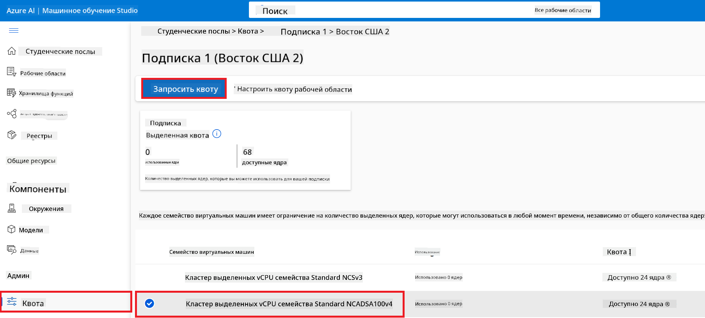

    - На странице запроса квоты введите желаемый **New cores limit**, например, 24.
    - Нажмите **Submit** для отправки запроса квоты на GPU.

1. Выполните следующие действия для запроса квоты *Standard NCSv3 Family*:

    - Выберите **Quota** в левой панели.
    - Выберите семейство виртуальных машин, например, **Standard NCSv3 Family Cluster Dedicated vCPUs**, которое включает GPU *Standard_NC6s_v3*.
    - Выберите **Request quota** в навигационном меню.
    - Введите желаемый **New cores limit**, например, 24.
    - Нажмите **Submit** для отправки запроса квоты на GPU.

### Добавление назначения роли

Для тонкой настройки и развертывания моделей необходимо сначала создать User Assigned Managed Identity (UAI) и назначить ей соответствующие разрешения. Эта UAI будет использоваться для аутентификации при развертывании.

#### Создание User Assigned Managed Identity (UAI)

1. Введите *managed identities* в **строке поиска** в верхней части портала и выберите **Managed Identities** из появившихся вариантов.

    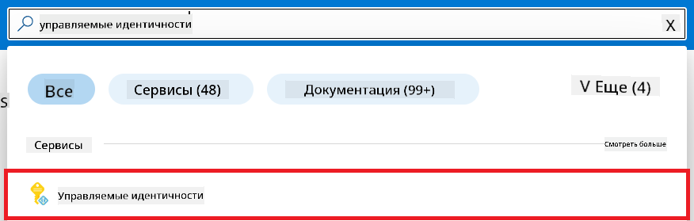

1. Нажмите **+ Create**.

    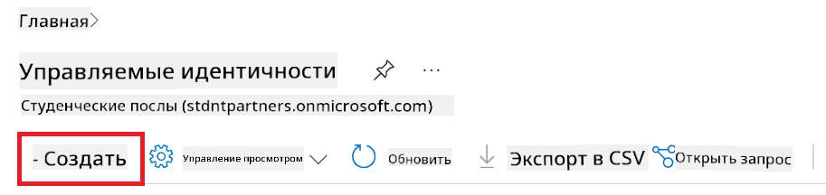

1. Выполните следующие действия:

    - Выберите вашу подписку Azure (**Subscription**).
    - Выберите **Resource group** для использования (создайте новую, если нужно).
    - Выберите регион (**Region**), который хотите использовать.
    - Введите имя (**Name**). Имя должно быть уникальным.

    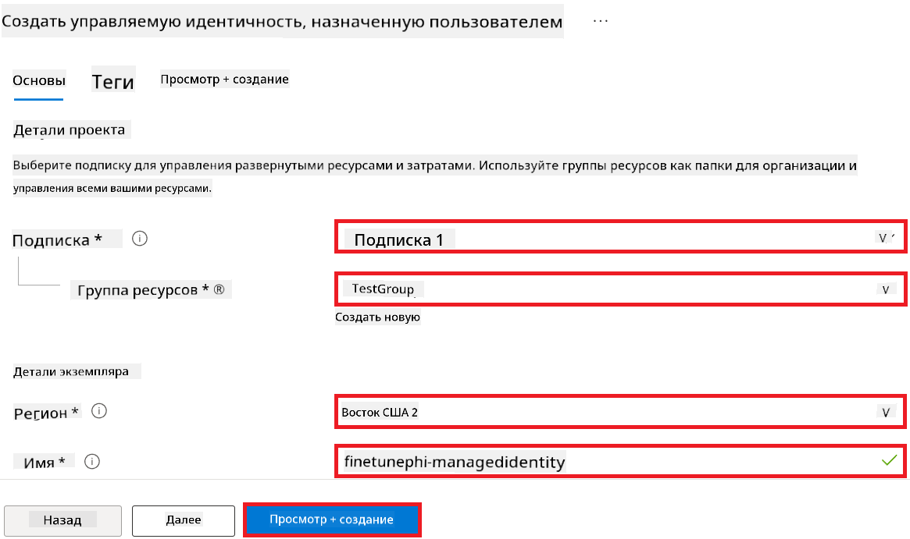

1. Нажмите **Review + create**.

1. Нажмите **+ Create**.

#### Назначение роли Contributor для Managed Identity

1. Перейдите к ресурсу Managed Identity, который вы создали.

1. Выберите **Azure role assignments** в левой панели.

1. Нажмите **+Add role assignment** в навигационном меню.

1. На странице добавления назначения роли выполните следующие действия:
    - В поле **Scope** выберите **Resource group**.
    - Выберите вашу подписку Azure (**Subscription**).
    - Выберите **Resource group** для использования.
    - В поле **Role** выберите **Contributor**.

    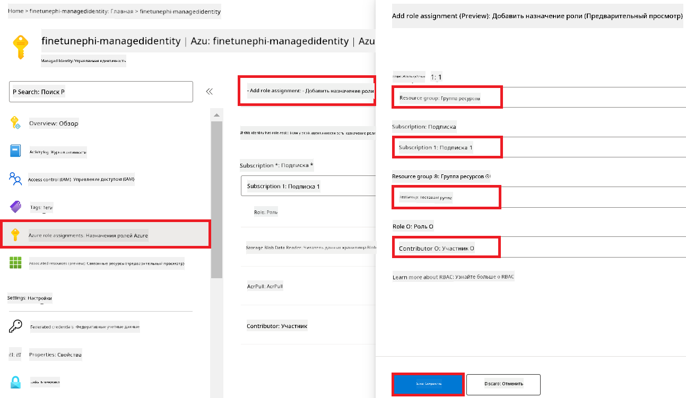

2. Нажмите **Save**.

#### Назначение роли Storage Blob Data Reader для Managed Identity

1. Введите *storage accounts* в **строке поиска** в верхней части портала и выберите **Storage accounts** из появившихся вариантов.

    

1. Выберите аккаунт хранения, связанный с вашим рабочим пространством Azure Machine Learning. Например, *finetunephistorage*.

1. Выполните следующие действия, чтобы перейти на страницу добавления назначения роли:

    - Перейдите в созданный аккаунт хранения Azure.
    - Выберите **Access Control (IAM)** в левой панели.
    - Нажмите **+ Add** в навигационном меню.
    - Выберите **Add role assignment**.

    

1. На странице добавления назначения роли выполните следующие действия:

    - В поле поиска ролей введите *Storage Blob Data Reader* и выберите **Storage Blob Data Reader** из списка.
    - Нажмите **Next**.
    - На странице участников выберите **Assign access to** — **Managed identity**.
    - Нажмите **+ Select members**.
    - Выберите вашу подписку Azure (**Subscription**).
    - Выберите **Managed identity**.
    - Выберите созданную Managed Identity, например, *finetunephi-managedidentity*.
    - Нажмите **Select**.

    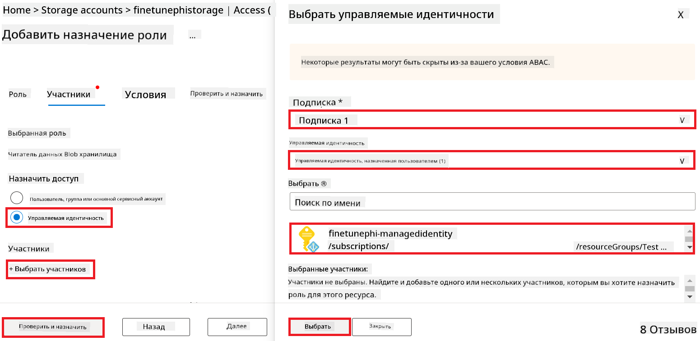

1. Нажмите **Review + assign**.

#### Назначение роли AcrPull для Managed Identity

1. Введите *container registries* в **строке поиска** в верхней части портала и выберите **Container registries** из появившихся вариантов.

    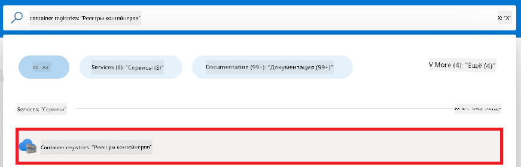

1. Выберите реестр контейнеров, связанный с вашим рабочим пространством Azure Machine Learning. Например, *finetunephicontainerregistry*.

1. Выполните следующие действия, чтобы перейти на страницу добавления назначения роли:

    - Выберите **Access Control (IAM)** в левой панели.
    - Нажмите **+ Add** в навигационном меню.
    - Выберите **Add role assignment**.

1. На странице добавления назначения роли выполните следующие действия:

    - В поле поиска ролей введите *AcrPull* и выберите **AcrPull** из списка.
    - Нажмите **Next**.
    - На странице участников выберите **Assign access to** — **Managed identity**.
    - Нажмите **+ Select members**.
    - Выберите вашу подписку Azure (**Subscription**).
    - Выберите **Managed identity**.
    - Выберите созданную Managed Identity, например, *finetunephi-managedidentity*.
    - Нажмите **Select**.
    - Нажмите **Review + assign**.

### Настройка проекта

Для загрузки наборов данных, необходимых для тонкой настройки, вы настроите локальное окружение.

В этом упражнении вы:

- Создадите папку для работы.
- Создадите виртуальное окружение.
- Установите необходимые пакеты.
- Создадите файл *download_dataset.py* для загрузки набора данных.

#### Создание папки для работы

1. Откройте терминал и выполните команду для создания папки с именем *finetune-phi* в стандартном пути.

    ```console
    mkdir finetune-phi
    ```

2. Введите следующую команду в терминале, чтобы перейти в созданную папку *finetune-phi*.
#### Создание виртуального окружения

1. Введите следующую команду в терминале, чтобы создать виртуальное окружение с именем *.venv*.

    ```console
    python -m venv .venv
    ```

2. Введите следующую команду в терминале, чтобы активировать виртуальное окружение.

    ```console
    .venv\Scripts\activate.bat
    ```


> [!NOTE]
> Если всё прошло успешно, перед приглашением командной строки вы увидите *(.venv)*.

#### Установка необходимых пакетов

1. Введите следующие команды в терминале для установки необходимых пакетов.

    ```console
    pip install datasets==2.19.1
    ```

#### Создание файла `download_dataset.py`

> [!NOTE]
> Полная структура папок:
>
> ```text
> └── YourUserName
> .    └── finetune-phi
> .        └── download_dataset.py
> ```

1. Откройте **Visual Studio Code**.

1. В меню выберите **File**.

1. Выберите **Open Folder**.

1. Выберите папку *finetune-phi*, которую вы создали, расположенную по пути *C:\Users\yourUserName\finetune-phi*.

    

1. В левой панели Visual Studio Code кликните правой кнопкой мыши и выберите **New File**, чтобы создать новый файл с именем *download_dataset.py*.

    

### Подготовка датасета для дообучения

В этом упражнении вы запустите файл *download_dataset.py*, чтобы скачать датасеты *ultrachat_200k* в локальное окружение. Затем вы используете эти датасеты для дообучения модели Phi-3 в Azure Machine Learning.

В этом упражнении вы:

- Добавите код в файл *download_dataset.py* для скачивания датасетов.
- Запустите файл *download_dataset.py* для загрузки датасетов в локальное окружение.

#### Скачивание датасета с помощью *download_dataset.py*

1. Откройте файл *download_dataset.py* в Visual Studio Code.

1. Добавьте следующий код в файл *download_dataset.py*.

    ```python
    import json
    import os
    from datasets import load_dataset

    def load_and_split_dataset(dataset_name, config_name, split_ratio):
        """
        Load and split a dataset.
        """
        # Load the dataset with the specified name, configuration, and split ratio
        dataset = load_dataset(dataset_name, config_name, split=split_ratio)
        print(f"Original dataset size: {len(dataset)}")
        
        # Split the dataset into train and test sets (80% train, 20% test)
        split_dataset = dataset.train_test_split(test_size=0.2)
        print(f"Train dataset size: {len(split_dataset['train'])}")
        print(f"Test dataset size: {len(split_dataset['test'])}")
        
        return split_dataset

    def save_dataset_to_jsonl(dataset, filepath):
        """
        Save a dataset to a JSONL file.
        """
        # Create the directory if it does not exist
        os.makedirs(os.path.dirname(filepath), exist_ok=True)
        
        # Open the file in write mode
        with open(filepath, 'w', encoding='utf-8') as f:
            # Iterate over each record in the dataset
            for record in dataset:
                # Dump the record as a JSON object and write it to the file
                json.dump(record, f)
                # Write a newline character to separate records
                f.write('\n')
        
        print(f"Dataset saved to {filepath}")

    def main():
        """
        Main function to load, split, and save the dataset.
        """
        # Load and split the ULTRACHAT_200k dataset with a specific configuration and split ratio
        dataset = load_and_split_dataset("HuggingFaceH4/ultrachat_200k", 'default', 'train_sft[:1%]')
        
        # Extract the train and test datasets from the split
        train_dataset = dataset['train']
        test_dataset = dataset['test']

        # Save the train dataset to a JSONL file
        save_dataset_to_jsonl(train_dataset, "data/train_data.jsonl")
        
        # Save the test dataset to a separate JSONL file
        save_dataset_to_jsonl(test_dataset, "data/test_data.jsonl")

    if __name__ == "__main__":
        main()

    ```

1. Введите следующую команду в терминале, чтобы запустить скрипт и скачать датасет в локальное окружение.

    ```console
    python download_dataset.py
    ```

1. Проверьте, что датасеты успешно сохранились в локальной папке *finetune-phi/data*.

> [!NOTE]
>
> #### Примечание о размере датасета и времени дообучения
>
> В этом руководстве используется только 1% датасета (`split='train[:1%]'`). Это значительно уменьшает объем данных, ускоряя загрузку и процесс дообучения. Вы можете изменить этот процент, чтобы найти оптимальный баланс между временем обучения и качеством модели. Использование меньшей части датасета сокращает время дообучения, что делает процесс более удобным для учебных целей.

## Сценарий 2: Дообучение модели Phi-3 и развертывание в Azure Machine Learning Studio

### Дообучение модели Phi-3

В этом упражнении вы дообучите модель Phi-3 в Azure Machine Learning Studio.

В этом упражнении вы:

- Создадите вычислительный кластер для дообучения.
- Дообучите модель Phi-3 в Azure Machine Learning Studio.

#### Создание вычислительного кластера для дообучения

1. Перейдите на [Azure ML Studio](https://ml.azure.com/home?wt.mc_id=studentamb_279723).

1. Выберите **Compute** в левой панели.

1. Выберите **Compute clusters** в навигационном меню.

1. Нажмите **+ New**.

    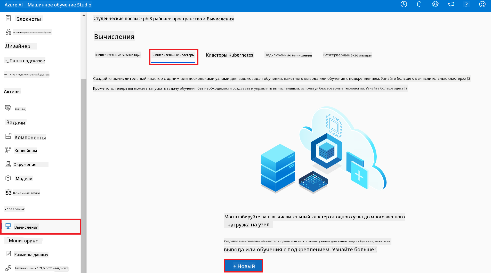

1. Выполните следующие действия:

    - Выберите **Region** (регион), который хотите использовать.
    - Выберите **Virtual machine tier** — **Dedicated**.
    - Выберите **Virtual machine type** — **GPU**.
    - В фильтре **Virtual machine size** выберите **Select from all options**.
    - Выберите размер виртуальной машины **Standard_NC24ads_A100_v4**.

    

1. Нажмите **Next**.

1. Выполните следующие действия:

    - Введите уникальное имя в поле **Compute name**.
    - Установите **Minimum number of nodes** в значение **0**.
    - Установите **Maximum number of nodes** в значение **1**.
    - Установите **Idle seconds before scale down** в **120**.

    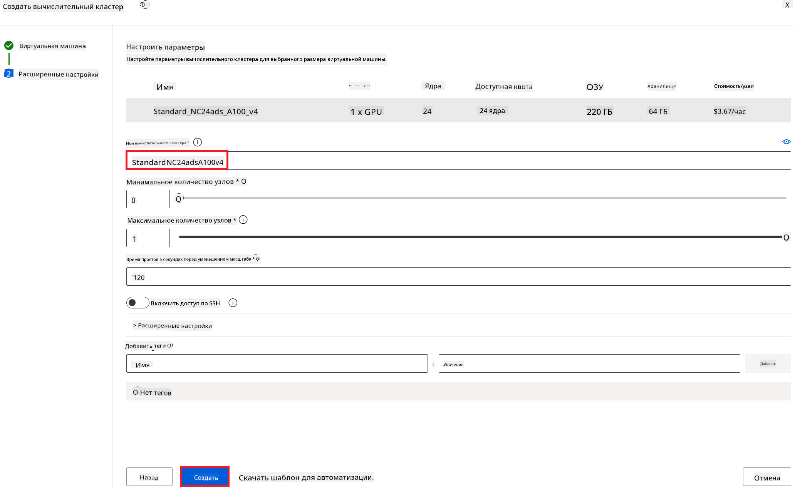

1. Нажмите **Create**.

#### Дообучение модели Phi-3

1. Перейдите на [Azure ML Studio](https://ml.azure.com/home?wt.mc_id=studentamb_279723).

1. Выберите созданное вами рабочее пространство Azure Machine Learning.

    

1. Выполните следующие действия:

    - Выберите **Model catalog** в левой панели.
    - Введите *phi-3-mini-4k* в строку поиска и выберите **Phi-3-mini-4k-instruct** из появившихся вариантов.

    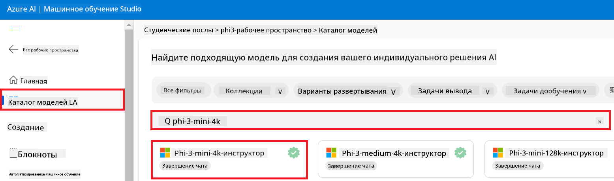

1. Выберите **Fine-tune** в навигационном меню.

    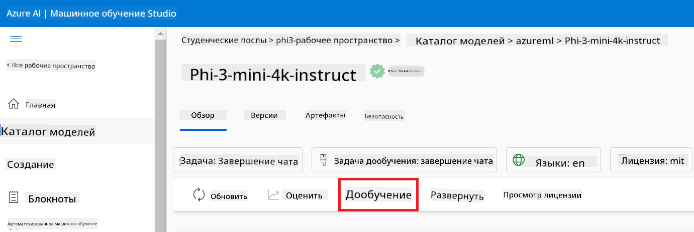

1. Выполните следующие действия:

    - Выберите **Select task type** — **Chat completion**.
    - Нажмите **+ Select data** для загрузки **Training data**.
    - Для загрузки валидационных данных выберите тип загрузки **Provide different validation data**.
    - Нажмите **+ Select data** для загрузки **Validation data**.

    

    > [!TIP]
    >
    > Вы можете выбрать **Advanced settings** для настройки параметров, таких как **learning_rate** и **lr_scheduler_type**, чтобы оптимизировать процесс дообучения под ваши задачи.

1. Нажмите **Finish**.

1. В этом упражнении вы успешно дообучили модель Phi-3 с помощью Azure Machine Learning. Обратите внимание, что процесс дообучения может занять значительное время. После запуска задачи дообучения необходимо дождаться её завершения. Статус задачи можно отслеживать во вкладке Jobs в левой панели вашего рабочего пространства Azure Machine Learning. В следующем разделе вы развернете дообученную модель и интегрируете её с Prompt flow.

    

### Развертывание дообученной модели Phi-3

Для интеграции дообученной модели Phi-3 с Prompt flow необходимо развернуть модель, чтобы обеспечить доступ к ней для инференса в реальном времени. Этот процесс включает регистрацию модели, создание онлайн-эндпоинта и развертывание модели.

В этом упражнении вы:

- Зарегистрируете дообученную модель в рабочем пространстве Azure Machine Learning.
- Создадите онлайн-эндпоинт.
- Развернете зарегистрированную дообученную модель Phi-3.

#### Регистрация дообученной модели

1. Перейдите на [Azure ML Studio](https://ml.azure.com/home?wt.mc_id=studentamb_279723).

1. Выберите созданное вами рабочее пространство Azure Machine Learning.

    

1. Выберите **Models** в левой панели.
1. Нажмите **+ Register**.
1. Выберите **From a job output**.

    

1. Выберите созданную вами задачу.

    

1. Нажмите **Next**.

1. Выберите **Model type** — **MLflow**.

1. Убедитесь, что выбран пункт **Job output**; он должен быть выбран автоматически.

    

2. Нажмите **Next**.

3. Нажмите **Register**.

    

4. Вы можете просмотреть зарегистрированную модель, перейдя в меню **Models** в левой панели.

    

#### Развертывание дообученной модели

1. Перейдите в созданное вами рабочее пространство Azure Machine Learning.

1. Выберите **Endpoints** в левой панели.

1. Выберите **Real-time endpoints** в навигационном меню.

    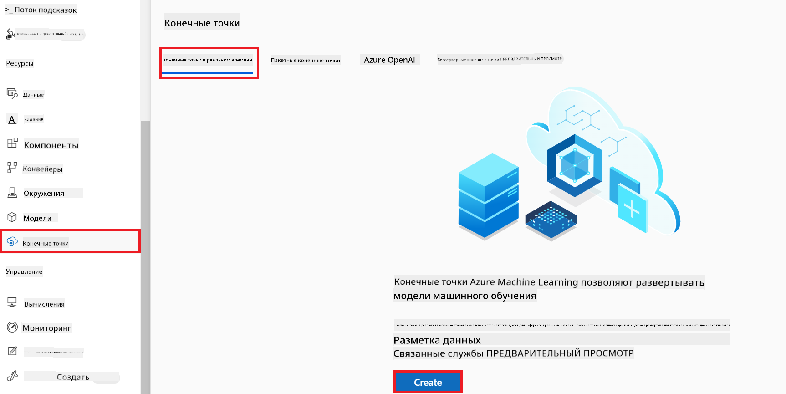

1. Нажмите **Create**.

1. Выберите зарегистрированную модель, которую вы создали.

    

1. Нажмите **Select**.

1. Выполните следующие действия:

    - Выберите **Virtual machine** — *Standard_NC6s_v3*.
    - Укажите желаемое количество экземпляров (**Instance count**), например, *1*.
    - Выберите **Endpoint** — **New** для создания нового эндпоинта.
    - Введите уникальное имя для **Endpoint name**.
    - Введите уникальное имя для **Deployment name**.

    

1. Нажмите **Deploy**.

> [!WARNING]
> Чтобы избежать дополнительных расходов, не забудьте удалить созданный эндпоинт в рабочем пространстве Azure Machine Learning.
>

#### Проверка статуса развертывания в Azure Machine Learning Workspace

1. Перейдите в созданное вами рабочее пространство Azure Machine Learning.

1. Выберите **Endpoints** в левой панели.

1. Выберите созданный вами эндпоинт.

    

1. На этой странице вы можете управлять эндпоинтами во время процесса развертывания.

> [!NOTE]
> После завершения развертывания убедитесь, что **Live traffic** установлен на **100%**. Если это не так, выберите **Update traffic** для корректировки настроек трафика. Обратите внимание, что тестировать модель нельзя, если трафик установлен в 0%.
>
> 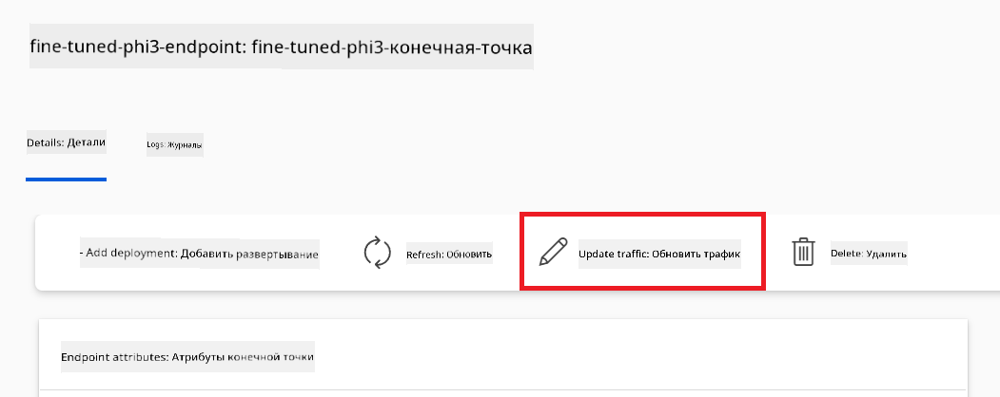
>

## Сценарий 3: Интеграция с Prompt flow и общение с вашей кастомной моделью в Azure AI Foundry

### Интеграция кастомной модели Phi-3 с Prompt flow

После успешного развертывания дообученной модели вы можете интегрировать её с Prompt Flow для использования в приложениях в реальном времени, что позволит выполнять различные интерактивные задачи с вашей кастомной моделью Phi-3.

В этом упражнении вы:

- Создадите Azure AI Foundry Hub.
- Создадите проект Azure AI Foundry.
- Создадите Prompt flow.
- Добавите кастомное подключение для дообученной модели Phi-3.
- Настроите Prompt flow для общения с вашей кастомной моделью Phi-3.
> [!NOTE]
> Вы также можете интегрироваться с Promptflow, используя Azure ML Studio. Тот же процесс интеграции применим и к Azure ML Studio.
#### Создание Azure AI Foundry Hub

Перед созданием проекта необходимо создать Hub. Hub действует как группа ресурсов, позволяя организовывать и управлять несколькими проектами в Azure AI Foundry.

1. Перейдите на [Azure AI Foundry](https://ai.azure.com/?WT.mc_id=aiml-137032-kinfeylo).

1. Выберите **All hubs** в левой панели.

1. Выберите **+ New hub** в навигационном меню.

    

1. Выполните следующие действия:

    - Введите **Hub name**. Значение должно быть уникальным.
    - Выберите вашу подписку Azure (**Subscription**).
    - Выберите **Resource group** для использования (создайте новую, если нужно).
    - Выберите **Location**, которую хотите использовать.
    - Выберите **Connect Azure AI Services** для подключения (создайте новое, если нужно).
    - Для **Connect Azure AI Search** выберите **Skip connecting**.

    

1. Нажмите **Next**.

#### Создание проекта Azure AI Foundry

1. В созданном Hub выберите **All projects** в левой панели.

1. Выберите **+ New project** в навигационном меню.

    

1. Введите **Project name**. Имя должно быть уникальным.

    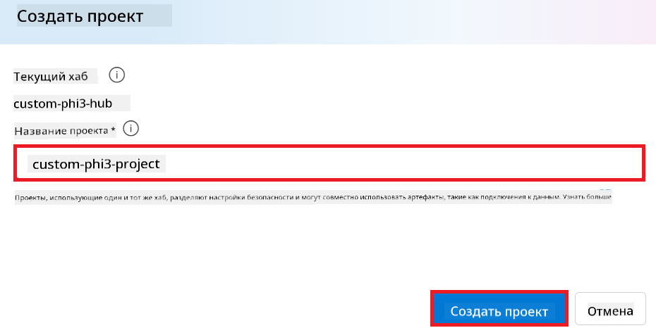

1. Нажмите **Create a project**.

#### Добавление пользовательского подключения для дообученной модели Phi-3

Чтобы интегрировать вашу дообученную модель Phi-3 с Prompt flow, необходимо сохранить endpoint и ключ модели в пользовательском подключении. Это обеспечит доступ к вашей модели Phi-3 в Prompt flow.

#### Установка api key и endpoint uri для дообученной модели Phi-3

1. Перейдите в [Azure ML Studio](https://ml.azure.com/home?WT.mc_id=aiml-137032-kinfeylo).

1. Откройте рабочее пространство Azure Machine learning, которое вы создали.

1. Выберите **Endpoints** в левой панели.

    

1. Выберите созданный вами endpoint.

    

1. В навигационном меню выберите **Consume**.

1. Скопируйте ваш **REST endpoint** и **Primary key**.

    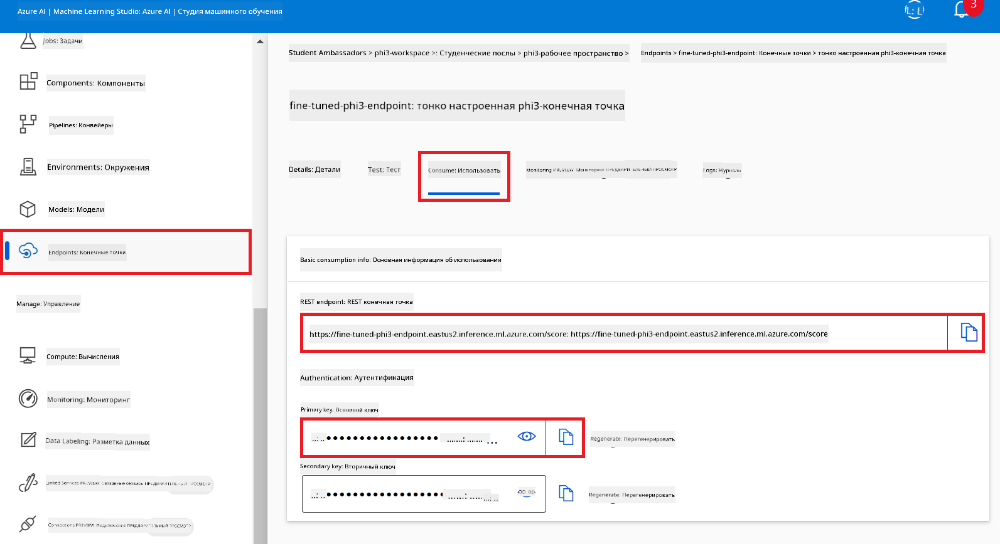

#### Добавление пользовательского подключения

1. Перейдите на [Azure AI Foundry](https://ai.azure.com/?WT.mc_id=aiml-137032-kinfeylo).

1. Откройте созданный вами проект Azure AI Foundry.

1. В проекте выберите **Settings** в левой панели.

1. Нажмите **+ New connection**.

    

1. В навигационном меню выберите **Custom keys**.

    

1. Выполните следующие действия:

    - Нажмите **+ Add key value pairs**.
    - В поле имени ключа введите **endpoint** и вставьте скопированный из Azure ML Studio endpoint в поле значения.
    - Снова нажмите **+ Add key value pairs**.
    - Введите имя ключа **key** и вставьте скопированный ключ из Azure ML Studio в поле значения.
    - После добавления ключей отметьте **is secret**, чтобы ключи не были видны.

    

1. Нажмите **Add connection**.

#### Создание Prompt flow

Вы добавили пользовательское подключение в Azure AI Foundry. Теперь создадим Prompt flow, используя следующие шаги. Затем вы подключите этот Prompt flow к пользовательскому подключению, чтобы использовать дообученную модель внутри Prompt flow.

1. Откройте созданный проект Azure AI Foundry.

1. Выберите **Prompt flow** в левой панели.

1. Нажмите **+ Create** в навигационном меню.

    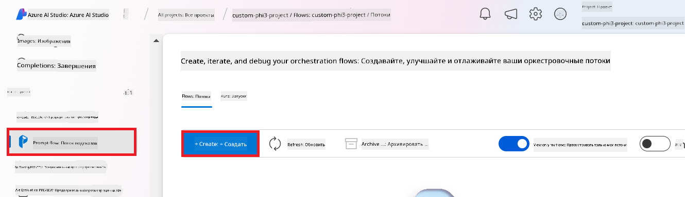

1. В навигационном меню выберите **Chat flow**.

    

1. Введите имя папки (**Folder name**).

    

2. Нажмите **Create**.

#### Настройка Prompt flow для общения с вашей дообученной моделью Phi-3

Необходимо интегрировать дообученную модель Phi-3 в Prompt flow. Однако существующий Prompt flow не предназначен для этого, поэтому его нужно переработать для поддержки пользовательской модели.

1. В Prompt flow выполните следующие действия для перестройки текущего потока:

    - Выберите **Raw file mode**.
    - Удалите весь существующий код в файле *flow.dag.yml*.
    - Добавьте следующий код в файл *flow.dag.yml*.

        ```yml
        inputs:
          input_data:
            type: string
            default: "Who founded Microsoft?"

        outputs:
          answer:
            type: string
            reference: ${integrate_with_promptflow.output}

        nodes:
        - name: integrate_with_promptflow
          type: python
          source:
            type: code
            path: integrate_with_promptflow.py
          inputs:
            input_data: ${inputs.input_data}
        ```

    - Нажмите **Save**.

    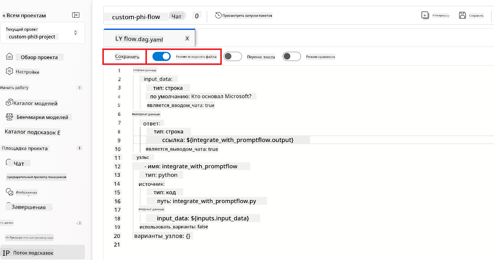

1. Добавьте следующий код в файл *integrate_with_promptflow.py* для использования пользовательской модели Phi-3 в Prompt flow.

    ```python
    import logging
    import requests
    from promptflow import tool
    from promptflow.connections import CustomConnection

    # Logging setup
    logging.basicConfig(
        format="%(asctime)s - %(levelname)s - %(name)s - %(message)s",
        datefmt="%Y-%m-%d %H:%M:%S",
        level=logging.DEBUG
    )
    logger = logging.getLogger(__name__)

    def query_phi3_model(input_data: str, connection: CustomConnection) -> str:
        """
        Send a request to the Phi-3 model endpoint with the given input data using Custom Connection.
        """

        # "connection" is the name of the Custom Connection, "endpoint", "key" are the keys in the Custom Connection
        endpoint_url = connection.endpoint
        api_key = connection.key

        headers = {
            "Content-Type": "application/json",
            "Authorization": f"Bearer {api_key}"
        }
        data = {
            "input_data": {
                "input_string": [
                    {"role": "user", "content": input_data}
                ],
                "parameters": {
                    "temperature": 0.7,
                    "max_new_tokens": 128
                }
            }
        }
        try:
            response = requests.post(endpoint_url, json=data, headers=headers)
            response.raise_for_status()
            
            # Log the full JSON response
            logger.debug(f"Full JSON response: {response.json()}")

            result = response.json()["output"]
            logger.info("Successfully received response from Azure ML Endpoint.")
            return result
        except requests.exceptions.RequestException as e:
            logger.error(f"Error querying Azure ML Endpoint: {e}")
            raise

    @tool
    def my_python_tool(input_data: str, connection: CustomConnection) -> str:
        """
        Tool function to process input data and query the Phi-3 model.
        """
        return query_phi3_model(input_data, connection)

    ```

    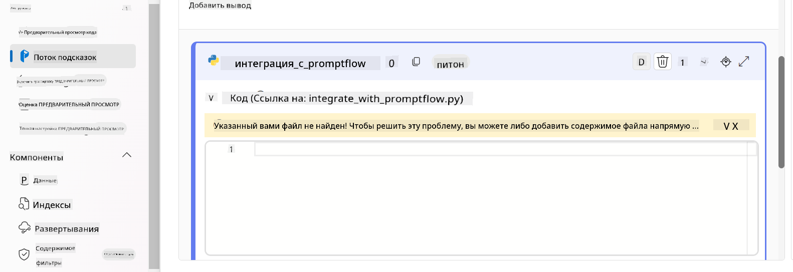

> [!NOTE]
> Для более подробной информации по использованию Prompt flow в Azure AI Foundry обратитесь к [Prompt flow в Azure AI Foundry](https://learn.microsoft.com/azure/ai-studio/how-to/prompt-flow).

1. Выберите **Chat input** и **Chat output**, чтобы включить чат с вашей моделью.

    

1. Теперь вы готовы общаться с вашей дообученной моделью Phi-3. В следующем упражнении вы узнаете, как запустить Prompt flow и использовать его для общения с вашей моделью.

> [!NOTE]
>
> Перестроенный поток должен выглядеть примерно так:
>
> 
>

### Общение с вашей дообученной моделью Phi-3

Теперь, когда вы дообучили и интегрировали вашу модель Phi-3 с Prompt flow, вы готовы начать взаимодействие с ней. В этом упражнении вы пройдёте процесс настройки и запуска чата с моделью через Prompt flow. Следуя этим шагам, вы сможете полноценно использовать возможности вашей дообученной модели Phi-3 для различных задач и диалогов.

- Общайтесь с вашей дообученной моделью Phi-3 через Prompt flow.

#### Запуск Prompt flow

1. Нажмите **Start compute sessions** для запуска Prompt flow.

    

1. Нажмите **Validate and parse input** для обновления параметров.

    

1. Выберите значение **Value** для **connection**, соответствующее созданному вами пользовательскому подключению, например *connection*.

    

#### Общение с вашей пользовательской моделью

1. Нажмите **Chat**.

    

1. Пример результата: теперь вы можете общаться с вашей дообученной моделью Phi-3. Рекомендуется задавать вопросы, основанные на данных, использованных для дообучения.

    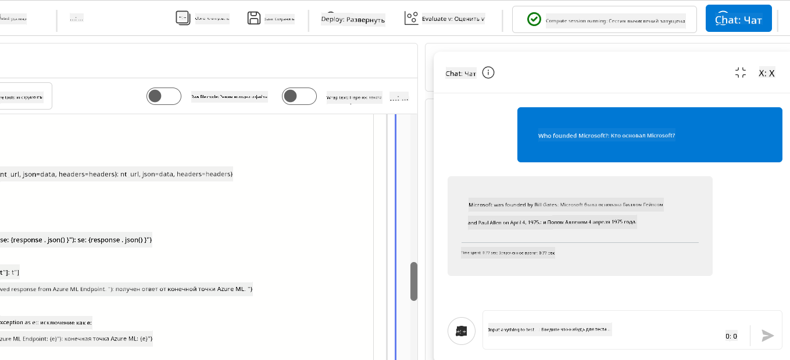

**Отказ от ответственности**:  
Этот документ был переведен с помощью сервиса автоматического перевода [Co-op Translator](https://github.com/Azure/co-op-translator). Несмотря на наши усилия по обеспечению точности, просим учитывать, что автоматический перевод может содержать ошибки или неточности. Оригинальный документ на его исходном языке следует считать авторитетным источником. Для получения критически важной информации рекомендуется обращаться к профессиональному человеческому переводу. Мы не несем ответственности за любые недоразумения или неправильные толкования, возникшие в результате использования данного перевода.