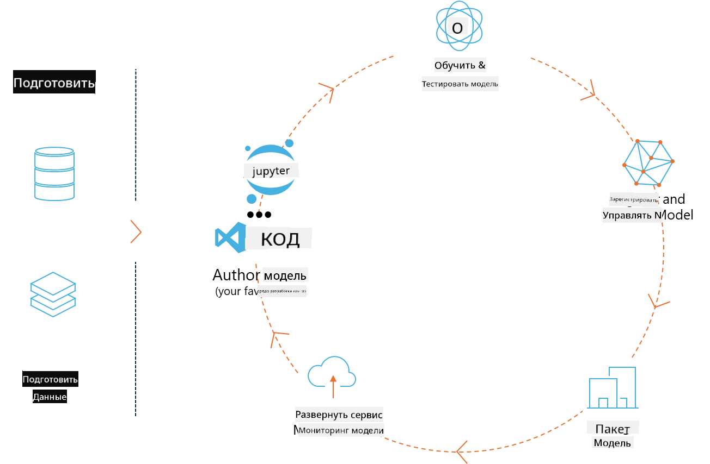
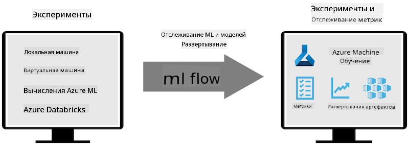
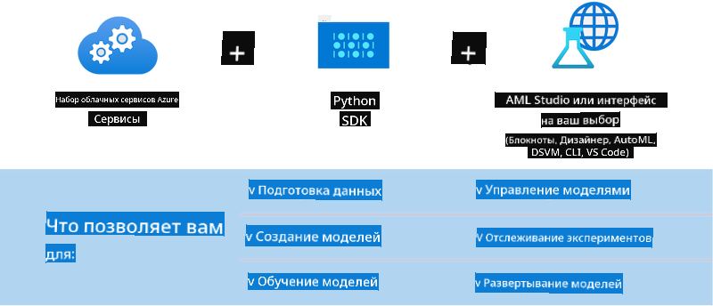

<!--
CO_OP_TRANSLATOR_METADATA:
{
  "original_hash": "f61c383bbf0c3dac97e43f833c258731",
  "translation_date": "2025-05-07T13:57:19+00:00",
  "source_file": "md/02.Application/01.TextAndChat/Phi3/E2E_Phi-3-MLflow.md",
  "language_code": "ru"
}
-->
# MLflow

[MLflow](https://mlflow.org/) — это платформа с открытым исходным кодом, предназначенная для управления полным жизненным циклом машинного обучения.



MLFlow используется для управления жизненным циклом ML, включая эксперименты, воспроизводимость, развертывание и центральный реестр моделей. В настоящее время MLflow предлагает четыре компонента.

- **MLflow Tracking:** Запись и запрос экспериментов, кода, конфигураций данных и результатов.
- **MLflow Projects:** Упаковка кода дата-сайенса в формате, позволяющем воспроизводить запуски на любой платформе.
- **Mlflow Models:** Развертывание моделей машинного обучения в различных средах обслуживания.
- **Model Registry:** Хранение, аннотирование и управление моделями в центральном репозитории.

Он включает возможности для отслеживания экспериментов, упаковки кода в воспроизводимые запуски, а также для обмена и развертывания моделей. MLFlow интегрирован в Databricks и поддерживает различные ML-библиотеки, что делает его независимым от конкретной библиотеки. Его можно использовать с любой библиотекой машинного обучения и на любом языке программирования, так как он предоставляет REST API и CLI для удобства.



Ключевые особенности MLFlow включают:

- **Отслеживание экспериментов:** Запись и сравнение параметров и результатов.
- **Управление моделями:** Развертывание моделей на различных платформах для обслуживания и инференса.
- **Model Registry:** Совместное управление жизненным циклом моделей MLflow, включая версионирование и аннотации.
- **Projects:** Упаковка ML-кода для обмена или использования в продакшене.

MLFlow также поддерживает цикл MLOps, который включает подготовку данных, регистрацию и управление моделями, упаковку моделей для выполнения, развертывание сервисов и мониторинг моделей. Цель — упростить переход от прототипа к производственному процессу, особенно в облачных и edge-средах.

## E2E Сценарий — Создание обертки и использование Phi-3 как модели MLFlow

В этом примере E2E мы продемонстрируем два разных подхода к созданию обертки вокруг небольшой языковой модели Phi-3 (SLM), а затем запуск её как модели MLFlow локально или в облаке, например, в Azure Machine Learning workspace.



| Проект | Описание | Расположение |
| ------------ | ----------- | -------- |
| Transformer Pipeline | Transformer Pipeline — самый простой вариант создания обертки, если вы хотите использовать модель HuggingFace с экспериментальной поддержкой трансформеров MLFlow. | [**TransformerPipeline.ipynb**](../../../../../../code/06.E2E/E2E_Phi-3-MLflow_TransformerPipeline.ipynb) |
| Custom Python Wrapper | На момент написания transformer pipeline не поддерживал генерацию оберток MLFlow для моделей HuggingFace в формате ONNX, даже с экспериментальным пакетом optimum Python. В таких случаях можно создать собственную обертку на Python для режима MLFlow. | [**CustomPythonWrapper.ipynb**](../../../../../../code/06.E2E/E2E_Phi-3-MLflow_CustomPythonWrapper.ipynb) |

## Проект: Transformer Pipeline

1. Вам потребуются соответствующие пакеты Python из MLFlow и HuggingFace:

    ``` Python
    import mlflow
    import transformers
    ```

2. Далее необходимо инициализировать transformer pipeline, указав целевую модель Phi-3 из реестра HuggingFace. Как видно из карточки модели _Phi-3-mini-4k-instruct_, её задача относится к типу «Генерация текста»:

    ``` Python
    pipeline = transformers.pipeline(
        task = "text-generation",
        model = "microsoft/Phi-3-mini-4k-instruct"
    )
    ```

3. Теперь вы можете сохранить transformer pipeline вашей модели Phi-3 в формате MLFlow и указать дополнительные параметры, такие как путь к артефактам, конкретные настройки модели и тип API для инференса:

    ``` Python
    model_info = mlflow.transformers.log_model(
        transformers_model = pipeline,
        artifact_path = "phi3-mlflow-model",
        model_config = model_config,
        task = "llm/v1/chat"
    )
    ```

## Проект: Custom Python Wrapper

1. Здесь мы можем использовать API generate() из [ONNX Runtime](https://github.com/microsoft/onnxruntime-genai) от Microsoft для инференса модели ONNX и кодирования/декодирования токенов. Для вашей целевой платформы нужно выбрать пакет _onnxruntime_genai_, в примере ниже — для CPU:

    ``` Python
    import mlflow
    from mlflow.models import infer_signature
    import onnxruntime_genai as og
    ```

1. Наш собственный класс реализует два метода: _load_context()_ для инициализации **ONNX модели** Phi-3 Mini 4K Instruct, **параметров генератора** и **токенизатора**; и _predict()_ для генерации выходных токенов по заданному запросу:

    ``` Python
    class Phi3Model(mlflow.pyfunc.PythonModel):
        def load_context(self, context):
            # Retrieving model from the artifacts
            model_path = context.artifacts["phi3-mini-onnx"]
            model_options = {
                 "max_length": 300,
                 "temperature": 0.2,         
            }
        
            # Defining the model
            self.phi3_model = og.Model(model_path)
            self.params = og.GeneratorParams(self.phi3_model)
            self.params.set_search_options(**model_options)
            
            # Defining the tokenizer
            self.tokenizer = og.Tokenizer(self.phi3_model)
    
        def predict(self, context, model_input):
            # Retrieving prompt from the input
            prompt = model_input["prompt"][0]
            self.params.input_ids = self.tokenizer.encode(prompt)
    
            # Generating the model's response
            response = self.phi3_model.generate(self.params)
    
            return self.tokenizer.decode(response[0][len(self.params.input_ids):])
    ```

1. Теперь можно использовать функцию _mlflow.pyfunc.log_model()_ для создания кастомной Python-обертки (в формате pickle) для модели Phi-3 вместе с оригинальной ONNX-моделью и необходимыми зависимостями:

    ``` Python
    model_info = mlflow.pyfunc.log_model(
        artifact_path = artifact_path,
        python_model = Phi3Model(),
        artifacts = {
            "phi3-mini-onnx": "cpu_and_mobile/cpu-int4-rtn-block-32-acc-level-4",
        },
        input_example = input_example,
        signature = infer_signature(input_example, ["Run"]),
        extra_pip_requirements = ["torch", "onnxruntime_genai", "numpy"],
    )
    ```

## Подписи сгенерированных моделей MLFlow

1. В шаге 3 проекта Transformer Pipeline выше мы задали задачу модели MLFlow как “_llm/v1/chat_”. Такая инструкция создаёт API-обертку модели, совместимую с OpenAI Chat API, как показано ниже:

    ``` Python
    {inputs: 
      ['messages': Array({content: string (required), name: string (optional), role: string (required)}) (required), 'temperature': double (optional), 'max_tokens': long (optional), 'stop': Array(string) (optional), 'n': long (optional), 'stream': boolean (optional)],
    outputs: 
      ['id': string (required), 'object': string (required), 'created': long (required), 'model': string (required), 'choices': Array({finish_reason: string (required), index: long (required), message: {content: string (required), name: string (optional), role: string (required)} (required)}) (required), 'usage': {completion_tokens: long (required), prompt_tokens: long (required), total_tokens: long (required)} (required)],
    params: 
      None}
    ```

1. В результате вы можете отправлять запрос в следующем формате:

    ``` Python
    messages = [{"role": "user", "content": "What is the capital of Spain?"}]
    ```

1. Затем используйте постобработку, совместимую с OpenAI API, например, _response[0][‘choices’][0][‘message’][‘content’]_, чтобы красиво оформить вывод примерно так:

    ``` JSON
    Question: What is the capital of Spain?
    
    Answer: The capital of Spain is Madrid. It is the largest city in Spain and serves as the political, economic, and cultural center of the country. Madrid is located in the center of the Iberian Peninsula and is known for its rich history, art, and architecture, including the Royal Palace, the Prado Museum, and the Plaza Mayor.
    
    Usage: {'prompt_tokens': 11, 'completion_tokens': 73, 'total_tokens': 84}
    ```

1. В шаге 3 проекта Custom Python Wrapper выше мы позволяем пакету MLFlow сгенерировать подпись модели на основе примера входных данных. Подпись нашей обертки MLFlow будет выглядеть так:

    ``` Python
    {inputs: 
      ['prompt': string (required)],
    outputs: 
      [string (required)],
    params: 
      None}
    ```

1. Следовательно, наш запрос должен содержать ключ словаря "prompt", примерно так:

    ``` Python
    {"prompt": "<|system|>You are a stand-up comedian.<|end|><|user|>Tell me a joke about atom<|end|><|assistant|>",}
    ```

1. Выход модели будет предоставлен в виде строки:

    ``` JSON
    Alright, here's a little atom-related joke for you!
    
    Why don't electrons ever play hide and seek with protons?
    
    Because good luck finding them when they're always "sharing" their electrons!
    
    Remember, this is all in good fun, and we're just having a little atomic-level humor!
    ```

**Отказ от ответственности**:  
Этот документ был переведен с помощью сервиса автоматического перевода [Co-op Translator](https://github.com/Azure/co-op-translator). Несмотря на наши усилия по обеспечению точности, пожалуйста, имейте в виду, что автоматический перевод может содержать ошибки или неточности. Оригинальный документ на исходном языке следует считать авторитетным источником. Для получения критически важной информации рекомендуется обратиться к профессиональному переводу, выполненному человеком. Мы не несем ответственности за любые недоразумения или неправильные толкования, возникшие в результате использования данного перевода.