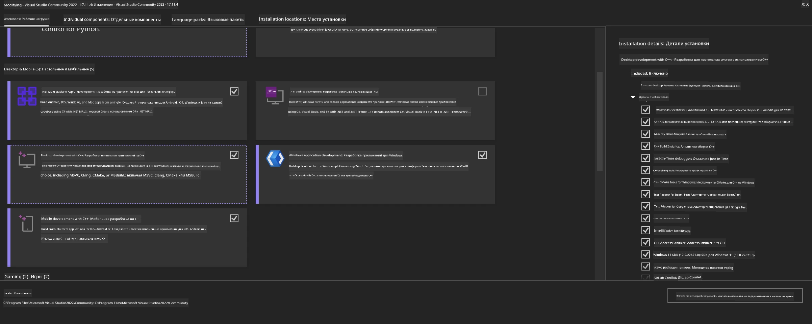

<!--
CO_OP_TRANSLATOR_METADATA:
{
  "original_hash": "b066fc29c1b2129df84e027cb75119ce",
  "translation_date": "2025-07-17T02:38:50+00:00",
  "source_file": "md/02.Application/01.TextAndChat/Phi3/ORTWindowGPUGuideline.md",
  "language_code": "ru"
}
-->
# **Руководство по OnnxRuntime GenAI для Windows GPU**

Это руководство описывает шаги по настройке и использованию ONNX Runtime (ORT) с GPU на Windows. Оно поможет вам использовать ускорение на GPU для ваших моделей, повышая производительность и эффективность.

В документе приведены рекомендации по:

- Настройке окружения: инструкции по установке необходимых зависимостей, таких как CUDA, cuDNN и ONNX Runtime.
- Конфигурации: как настроить окружение и ONNX Runtime для эффективного использования ресурсов GPU.
- Советы по оптимизации: рекомендации по тонкой настройке параметров GPU для достижения максимальной производительности.

### **1. Python 3.10.x /3.11.8**

   ***Примечание*** Рекомендуется использовать [miniforge](https://github.com/conda-forge/miniforge/releases/latest/download/Miniforge3-Windows-x86_64.exe) в качестве среды Python

   ```bash

   conda create -n pydev python==3.11.8

   conda activate pydev

   ```

   ***Напоминание*** Если у вас установлены какие-либо библиотеки ONNX для Python, пожалуйста, удалите их

### **2. Установка CMake с помощью winget**

   ```bash

   winget install -e --id Kitware.CMake

   ```

### **3. Установка Visual Studio 2022 - разработка для рабочего стола с C++**

   ***Примечание*** Если вы не планируете компилировать, этот шаг можно пропустить



### **4. Установка драйвера NVIDIA**

1. **Драйвер NVIDIA GPU**  [https://www.nvidia.com/en-us/drivers/](https://www.nvidia.com/en-us/drivers/)

2. **NVIDIA CUDA 12.4** [https://developer.nvidia.com/cuda-12-4-0-download-archive](https://developer.nvidia.com/cuda-12-4-0-download-archive)

3. **NVIDIA CUDNN 9.4**  [https://developer.nvidia.com/cudnn-downloads](https://developer.nvidia.com/cudnn-downloads)

***Напоминание*** Пожалуйста, используйте настройки по умолчанию при установке

### **5. Настройка окружения NVIDIA**

Скопируйте файлы из NVIDIA CUDNN 9.4 (lib, bin, include) в соответствующие папки NVIDIA CUDA 12.4

- скопируйте файлы из *'C:\Program Files\NVIDIA\CUDNN\v9.4\bin\12.6'* в  *'C:\Program Files\NVIDIA GPU Computing Toolkit\CUDA\v12.4\bin'*

- скопируйте файлы из *'C:\Program Files\NVIDIA\CUDNN\v9.4\include\12.6'* в  *'C:\Program Files\NVIDIA GPU Computing Toolkit\CUDA\v12.4\include'*

- скопируйте файлы из *'C:\Program Files\NVIDIA\CUDNN\v9.4\lib\12.6'* в  *'C:\Program Files\NVIDIA GPU Computing Toolkit\CUDA\v12.4\lib\x64'*

### **6. Загрузка Phi-3.5-mini-instruct-onnx**

   ```bash

   winget install -e --id Git.Git

   winget install -e --id GitHub.GitLFS

   git lfs install

   git clone https://huggingface.co/microsoft/Phi-3.5-mini-instruct-onnx

   ```

### **7. Запуск InferencePhi35Instruct.ipynb**

   Откройте [блокнот](../../../../../../code/09.UpdateSamples/Aug/ortgpu-phi35-instruct.ipynb) и выполните


### **8. Компиляция ORT GenAI GPU**

   ***Примечание*** 
   
   1. Сначала удалите все пакеты, связанные с onnx, onnxruntime и onnxruntime-genai

   ```bash

   pip list 
   
   ```

   Затем удалите все библиотеки onnxruntime, например:

   ```bash

   pip uninstall onnxruntime

   pip uninstall onnxruntime-genai

   pip uninstall onnxruntume-genai-cuda
   
   ```

   2. Проверьте поддержку расширения Visual Studio

   Убедитесь, что в папке C:\Program Files\NVIDIA GPU Computing Toolkit\CUDA\v12.4\extras присутствует каталог C:\Program Files\NVIDIA GPU Computing Toolkit\CUDA\v12.4\extras\visual_studio_integration. 
   
   Если его нет, проверьте другие папки с драйверами CUDA toolkit и скопируйте папку visual_studio_integration вместе с содержимым в C:\Program Files\NVIDIA GPU Computing Toolkit\CUDA\v12.4\extras\visual_studio_integration

   - Если вы не планируете компилировать, этот шаг можно пропустить

   ```bash

   git clone https://github.com/microsoft/onnxruntime-genai

   ```

   - Скачайте [https://github.com/microsoft/onnxruntime/releases/download/v1.19.2/onnxruntime-win-x64-gpu-1.19.2.zip](https://github.com/microsoft/onnxruntime/releases/download/v1.19.2/onnxruntime-win-x64-gpu-1.19.2.zip)

   - Распакуйте onnxruntime-win-x64-gpu-1.19.2.zip, переименуйте папку в **ort** и скопируйте её в onnxruntime-genai

   - В Windows Terminal откройте Developer Command Prompt для VS 2022 и перейдите в папку onnxruntime-genai


   - Скомпилируйте с использованием вашей среды Python

   ```bash

   cd onnxruntime-genai

   python build.py --use_cuda  --cuda_home "C:\Program Files\NVIDIA GPU Computing Toolkit\CUDA\v12.4" --config Release
 

   cd build/Windows/Release/Wheel

   pip install .whl

   ```

**Отказ от ответственности**:  
Этот документ был переведен с помощью сервиса автоматического перевода [Co-op Translator](https://github.com/Azure/co-op-translator). Несмотря на наши усилия по обеспечению точности, просим учитывать, что автоматический перевод может содержать ошибки или неточности. Оригинальный документ на его исходном языке следует считать авторитетным источником. Для получения критически важной информации рекомендуется обращаться к профессиональному переводу, выполненному человеком. Мы не несем ответственности за любые недоразумения или неправильные толкования, возникшие в результате использования данного перевода.