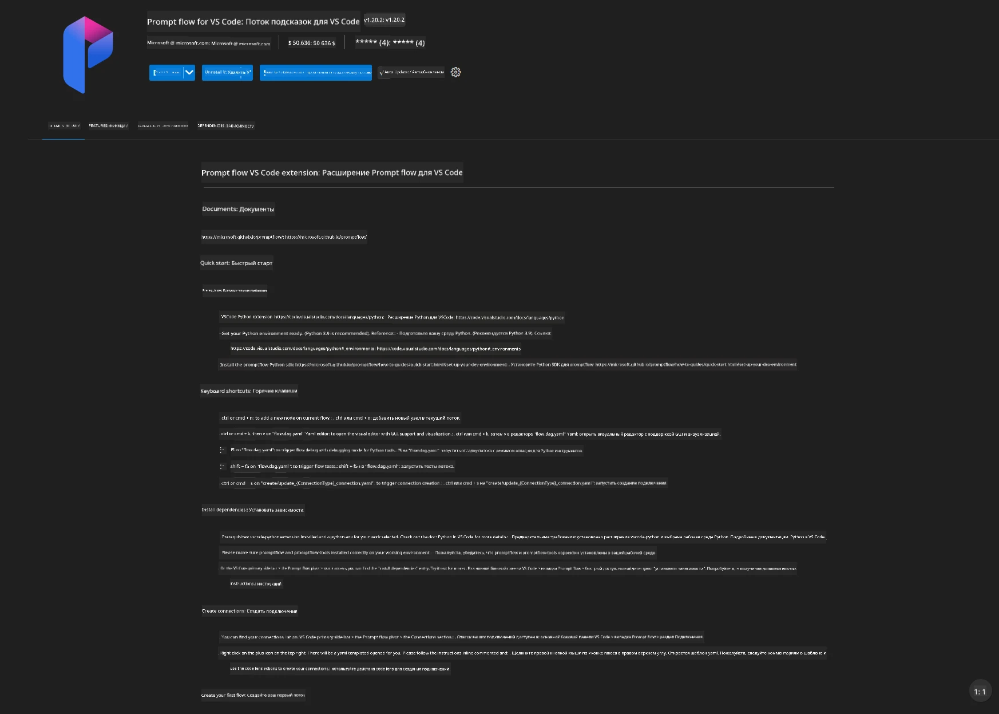
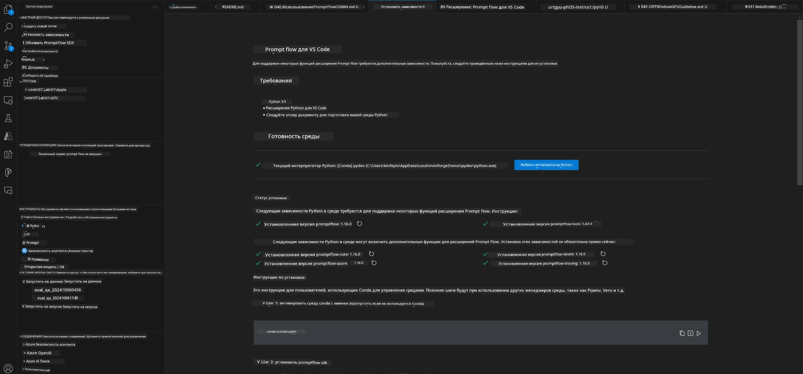
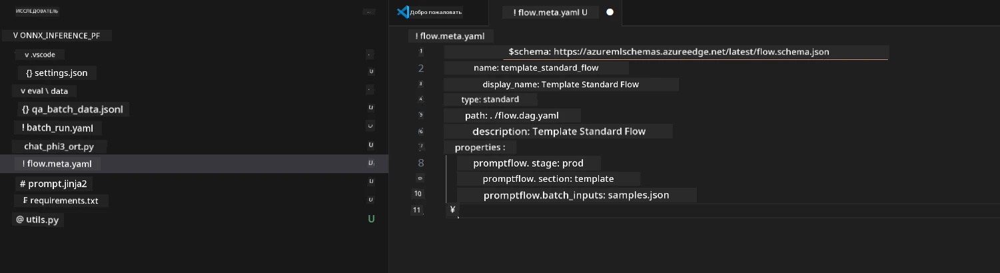
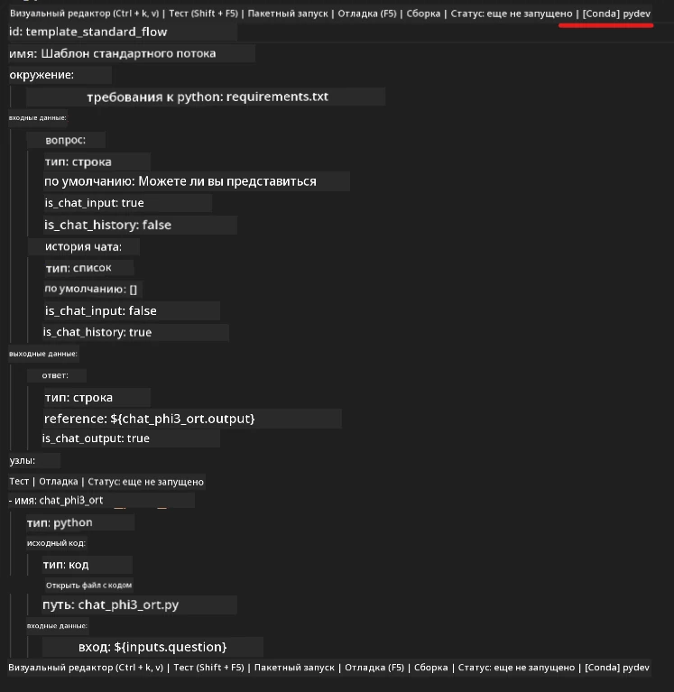
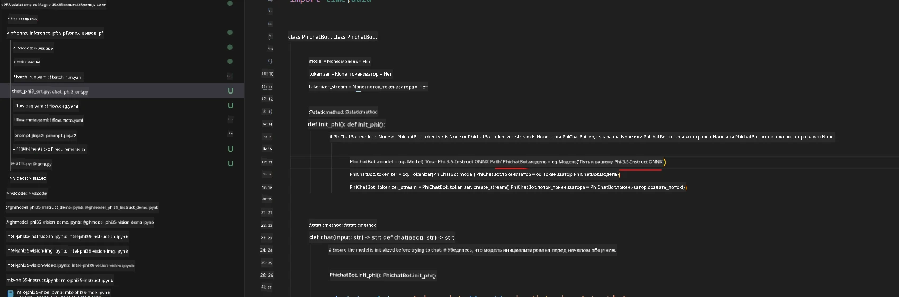
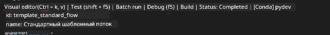
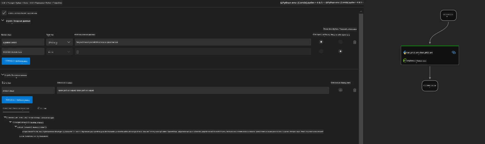
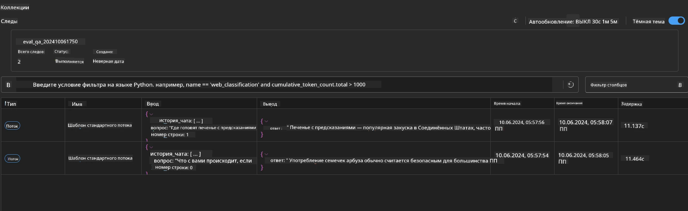

# Использование Windows GPU для создания решения Prompt flow с Phi-3.5-Instruct ONNX 

В следующем документе приведён пример использования PromptFlow с ONNX (Open Neural Network Exchange) для разработки AI-приложений на основе моделей Phi-3.

PromptFlow — это набор инструментов разработки, предназначенный для оптимизации полного цикла разработки AI-приложений на базе LLM (Large Language Model), от идеи и прототипирования до тестирования и оценки.

Интегрируя PromptFlow с ONNX, разработчики могут:

- Оптимизировать производительность модели: использовать ONNX для эффективного выполнения и развертывания моделей.
- Упростить разработку: применять PromptFlow для управления рабочим процессом и автоматизации повторяющихся задач.
- Улучшить сотрудничество: способствовать лучшему взаимодействию между членами команды, предоставляя единое окружение разработки.

**Prompt flow** — это набор инструментов разработки, предназначенный для оптимизации полного цикла разработки AI-приложений на базе LLM, начиная от идеи, прототипирования, тестирования, оценки и до развёртывания в production и мониторинга. Он упрощает разработку prompt-инженерии и позволяет создавать LLM-приложения с производственным качеством.

Prompt flow может подключаться к OpenAI, Azure OpenAI Service и настраиваемым моделям (Huggingface, локальные LLM/SLM). Мы планируем развернуть квантованную ONNX-модель Phi-3.5 в локальных приложениях. Prompt flow поможет нам лучше спланировать бизнес и завершить локальные решения на базе Phi-3.5. В этом примере мы объединим ONNX Runtime GenAI Library для создания решения Prompt flow на основе Windows GPU.

## **Установка**

### **ONNX Runtime GenAI для Windows GPU**

Прочитайте это руководство для настройки ONNX Runtime GenAI для Windows GPU  [click here](./ORTWindowGPUGuideline.md)

### **Настройка Prompt flow в VSCode**

1. Установите расширение Prompt flow для VS Code



2. После установки расширения Prompt flow в VS Code, нажмите на расширение и выберите **Installation dependencies**, следуя этому руководству, чтобы установить SDK Prompt flow в вашей среде



3. Скачайте [образец кода](../../../../../../code/09.UpdateSamples/Aug/pf/onnx_inference_pf) и откройте его с помощью VS Code



4. Откройте **flow.dag.yaml**, чтобы выбрать вашу Python-среду



   Откройте **chat_phi3_ort.py**, чтобы изменить расположение вашей ONNX модели Phi-3.5-instruct



5. Запустите ваш prompt flow для тестирования

Откройте **flow.dag.yaml** и нажмите визуальный редактор



затем нажмите на это и запустите для теста



1. Вы можете запустить пакетную обработку в терминале, чтобы проверить больше результатов


```bash

pf run create --file batch_run.yaml --stream --name 'Your eval qa name'    

```

Вы можете проверить результаты в вашем браузере по умолчанию




---

<!-- CO-OP TRANSLATOR DISCLAIMER START -->
**Отказ от ответственности**:
Этот документ был переведен с использованием сервиса машинного перевода [Co-op Translator](https://github.com/Azure/co-op-translator). Несмотря на наши усилия по обеспечению точности, имейте в виду, что автоматический перевод может содержать ошибки или неточности. Оригинальный документ на его исходном языке следует считать авторитетным источником. Для получения критически важной информации рекомендуется обратиться к профессиональному человеческому переводу. Мы не несем ответственности за любые недоразумения или неправильные толкования, возникшие в результате использования этого перевода.
<!-- CO-OP TRANSLATOR DISCLAIMER END -->